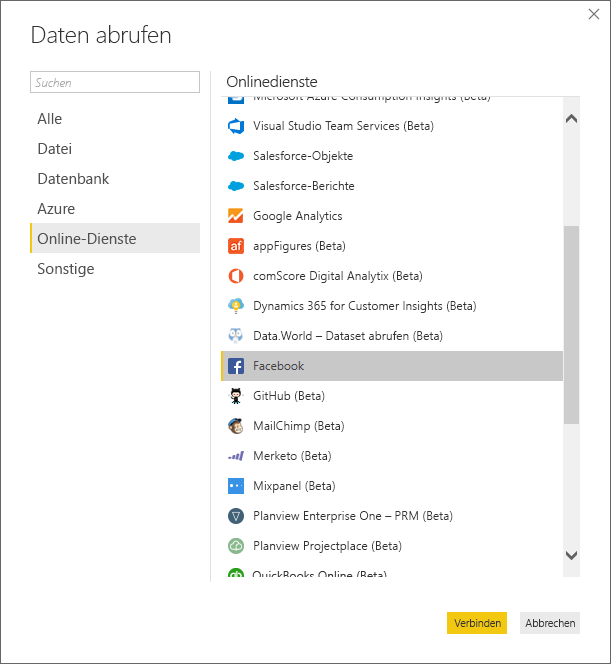
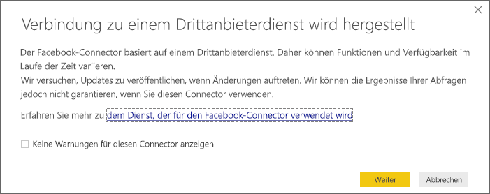
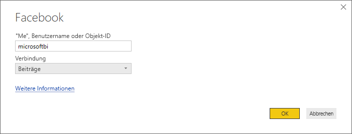
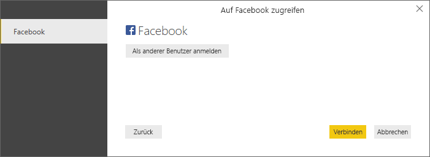
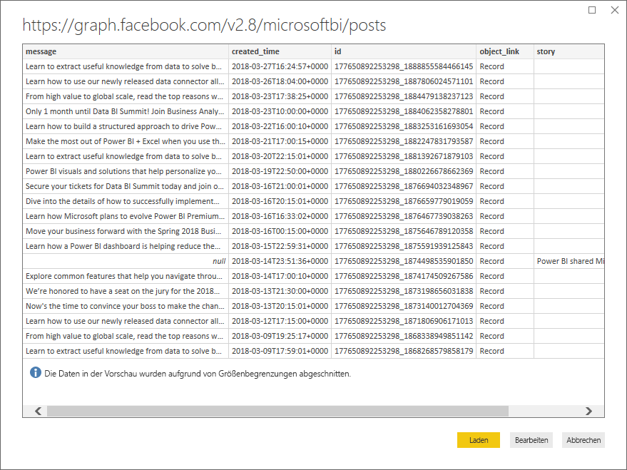
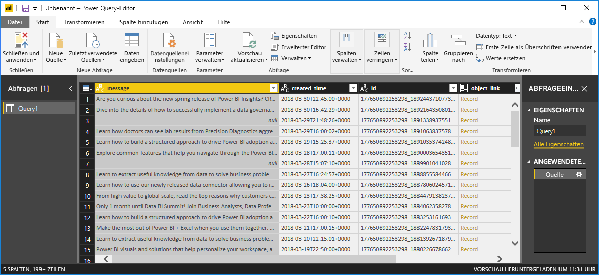
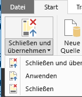
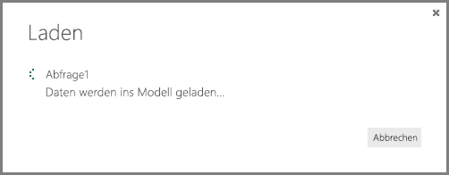
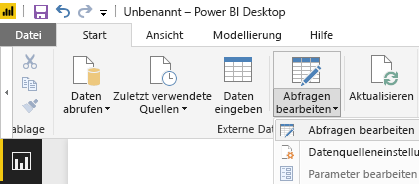

# Tutorial: Facebook-Analysen mit Power BI Desktop
In diesem Tutorial erfahren Sie, wie Sie Daten aus **Facebook**importieren und visualisieren. Während des Tutorials erfahren Sie, wie Sie eine Verbindung mit einer bestimmten Facebook-Seite (der Power BI-Seite) herstellen, Datentransformationsschritte anwenden und Visualisierungen erstellen.

Folgende Schritte werden ausgeführt:

* **Aufgabe 1** : Herstellen der Verbindung mit einer Facebook-Seite
* **Aufgabe 2**: Erstellen von Visualisierungen mithilfe der Berichtsansicht
  
  * **Schritt 1**: Erstellen einer Treemap-Visualisierung
* **Aufgabe 3**: Strukturieren von Daten in der Abfrageansicht
  
  * **Schritt 1**: Unterteilen der Spalte für Datum/Uhrzeit
  * **Schritt 2**: Hinzufügen ein Aggregatwerts aus einer verknüpften Tabelle
* **Aufgabe 4**: Erstellen weiterer Visualisierungen mithilfe der Berichtsansicht
  
  * **Schritt 1**: Laden der Abfrage in Ihren Bericht
  * **Schritt 2**: Erstellen eines Liniendiagramms und eines Balkendiagramms

## **Aufgabe 1: Herstellen der Verbindung mit einer Facebook-Seite**
In dieser Aufgabe importieren Sie Daten von der [Microsoft Power BI Facebook](https://www.facebook.com/microsoftbi)-Website (unter der URL: *https://www.facebook.com/microsoftbi)*.

Jeder kann eine Verbindung zu dieser Seite herstellen und diese Schritte ausführen, da keine besonderen Anmeldeinformationen (anders als für Ihr eigenes Facebook-Konto, das Sie in diesem Schritt verwenden) erforderlich sind.

1. Wählen Sie im Dialogfeld **Erste Schritte** oder auf der Registerkarte des Menübands **Start** die Option **Daten abrufen** aus.
2. Das Dialogfeld **Daten abrufen** wird geöffnet, in dem Sie alle Arten von Datenquellen auswählen können. Wählen Sie **Facebook** aus der Gruppe **Sonstige** aus.
   
   
   
   Wenn Sie **Verbinden**auswählen, wird ein Dialogfeld angezeigt, das Sie vor den Gefahren der Verwendung eines Drittanbieterdiensts warnt.
   
   
3. Wenn Sie „Weiter“ auswählen, wird das Dialogfeld **Facebook** angezeigt, in dem Sie den Namen (**microsoftbi**) in das Textfeld **Benutzername** einfügen können. Wählen Sie im Dropdownfeld **Verbindung** den Eintrag **Beiträge** aus.
   
   
4. Klicken Sie auf **OK**.
5. Wenn Sie zur Eingabe von Anmeldeinformationen aufgefordert werden, melden Sie sich mit Ihrem Facebook-Konto an, um Power BI den Zugriff über Ihr Konto zu gewähren.
   
   

Nach dem Herstellen einer Verbindung zu der Seite werden die in das Modell geladenen Daten angezeigt. 

Ab diesem Zeitpunkt werden die Daten im **Abfrage-Editor** angezeigt. Der **Abfrage-Editor** ist ein Teil von Power BI Desktop, er wird jedoch in einem separaten Fenster geladen und stellt den Ort dar, an dem Sie alle Transformationen für Ihre Datenverbindungen ausführen.

Wenn Ihre Daten in der gewünschten Form vorliegen, können Sie sie in Power BI Desktop laden. Wählen Sie auf dem Menüband **Start** den Befehl **Schließen & laden** aus.

Es wird ein Dialogfeld angezeigt, in dem Sie den Status des Ladens der Daten in das Datenmodell von Power BI Desktop verfolgen können.

Nach dem Laden gelangen Sie zur **Berichtsansicht** , in der die Spalten aus der Tabelle auf der rechten Seite in der **Feldliste** aufgeführt sind.

## **Aufgabe 2: Erstellen von Visualisierungen mithilfe der Berichtsansicht**
Nachdem Sie die Daten von der Seite abgerufen haben, können Sie mithilfe von Visualisierungen schnell und einfach Einblicke in Ihre Daten erhalten.

**Schritt 1:** Erstellen einer Treemap-Visualisierung

Das Erstellen einer Visualisierung gestaltet sich einfach. Es wird lediglich ein Feld aus der **Feldliste** gezogen und im **Berichtszeichenbereich** abgelegt.

Ziehen Sie das Feld **Typ** , und legen Sie es im **Berichtszeichenbereich** ab. Power BI Desktop erstellt darauf hin im **Berichtszeichenbereich**eine neue Visualisierung. Ziehen Sie als Nächstes **Typ** aus **Felder** (das gleiche Feld, das Sie soeben auf den **Berichtszeichenbereich** gezogen haben) auf den Bereich **Wert** , um eine **Balkenvisualisierung** zu erstellen.

Wir können einfach die Art der Visualisierung ändern, in dem wir im Bereich **Visualisierung** ein anderes Symbol auswählen. Ändern wir den Typ in eine **Treemap** , indem wir unter **Visualisierungen**deren Symbol auswählen, wie in der folgenden Abbildung dargestellt.

Fügen wir als Nächstes eine Legende hinzu und ändern wir dann die Farbe eines Datenpunkts. Wählen Sie das Symbol **Format** im Bereich **Visualisierungen** aus; das Symbol **Format** sieht aus wie ein Pinsel.

Wenn Sie den Pfeil nach unten neben **Legende**auswählen, wird der Abschnitt erweitert und zeigt dann an, wie Sie die Legende für die ausgewählte Visualisierung anpassen können. In diesem Fall treffen wir diese Auswahl:

* Wir verschieben den Schieberegler **Legende** auf **Ein**, d. h., es wird eine Legende angezeigt
* Wir wählen im Dropdownfeld **Legendenposition** die Option **Rechts** aus
* Wir haben auch den Schieberegler **Titel** auf **Ein** geschoben, sodass für die Legende ein Titel angezeigt wird
* Wir haben **Typ** als Titel der Legende eingegeben

In der folgenden Abbildung wurden diese Einstellungen bereits vorgenommen und sind in der Visualisierung dargestellt.

Ändern wir als Nächstes die Farbe eines der Datenpunkte. Der Datenpunktlink sollte blau sein, also liegt er farblich nahe an der allgemeinen Linkfarbe.

Wählen Sie den Pfeil neben **Datenpunktfarben** , um den Abschnitt zu erweitern. Die Datenpunkte werden mit Auswahlpfeilen neben jeder Farbe angezeigt, mit der die Auswahl einer anderen Farbe für jeden Datenpunkt möglich ist.

Wenn Sie auf den Abwärtspfeil des Farbfelds neben den einzelnen Datenpunkten klicken, wird ein Farbauswahl-Dialogfeld angezeigt, in dem Sie die gewünschte Farbe auswählen können. In diesem Fall wählen wir hellblau.

Das ist schon besser. In der folgenden Abbildung können Sie sehen, wie die Farbe auf den Datenpunkt in der Visualisierung angewendet und die Legende automatisch aktualisiert wird, genau wie die Farbe im Abschnitt **Datenpunktfarbe** .

## **Aufgabe 3: Strukturieren von Daten in der Tabelle**
Nachdem Sie die ausgewählte Tabelle importiert haben und mit der Visualisierung gestartet sind, haben Sie möglicherweise bemerkt, dass verschiedene Schritte zur Datenstrukturierung und Bereinigung ausgeführt werden müssen, damit Ihre Daten optimal dargestellt werden.

**Schritt 1:** Unterteilen der Spalte für Datum/Uhrzeit

In diesem Schritt unterteilen Sie die Spalte **created\_time**, um die Datums- und Uhrzeitwerte zu erhalten. Wenn Sie sich in Power BI Desktop befinden und eine vorhandene Abfrage ändern möchten, müssen Sie den **Abfrage-Editor**starten. Wählen Sie hierzu von der Registerkarte **Start** den Befehl **Abfragen bearbeiten** aus.

1. Scrollen Sie im Raster des **Abfrage-Editors** nach rechts bis zur Spalte **created\_time**.
2. Klicken Sie mit der rechten Maustaste auf eine Spaltenüberschrift im Raster der **Abfragevorschau**, und klicken Sie dann auf **Spalte teilen \> Nach Trennzeichen**, um die Spalten zu unterteilen. Wählen Sie in der Dropdownliste der Trennzeichen **Benutzerdefiniert** aus, und geben Sie **„T“** ein. Dieser Vorgang kann auch über die Registerkarte des Menübands **Start** in der Gruppe **Spalten verwalten** ausgeführt werden.
   
   
   
   
3. Benennen Sie die erstellten Spalten entsprechend in **created\_date** und **created\_time** um.
4. Wählen Sie die neue Spalte aus (**created\_time**), **** und navigieren Sie auf dem Menüband **Abfrageansicht** zur Registerkarte **Spalte hinzufügen**. Wählen Sie dort aus der Gruppe **Aus Datum & Uhrzeit** die Option **Uhrzeit\>Stunde** aus. Dadurch wird eine neue Spalte hinzugefügt, die nur die Stundenkomponente der Uhrzeit darstellt.
   
   
5. Ändern Sie den Typ der neuen Spalte **Stunde** in **Ganze Zahl**, indem Sie zur Registerkarte **Start** navigieren und die Dropdownliste **Datentyp** auswählen oder mit der rechten Maustaste auf die Spalte klicken und dann **Transformieren\>Ganze Zahl** auswählen.
   
   

**Schritt 2** : Hinzufügen ein Aggregatwerts aus einer verknüpften Tabelle

In diesem Schritt fügen Sie die Anzahl der Freigaben aus dem geschachtelten Wert hinzu, damit Sie sie für die Visualisierungen verwenden können.

1. Scrollen Sie weiter nach rechts, bis die Spalte **Freigaben** angezeigt wird. Der geschachtelte Wert gibt an, dass eine weitere Transformation erforderlich ist, um die tatsächlichen Werte zu erhalten.
2. Wählen Sie in der rechten oberen Ecke der Spaltenüberschrift das Symbol  aus, um den Generator **Erweitern/Aggregieren** zu öffnen. Wählen Sie die **Anzahl** aus, und klicken Sie auf **OK**. Dadurch wird die Anzahl der Freigaben zu jeder Zeile in der Tabelle hinzugefügt.
   
   
   
   Nachdem die Daten geladen wurden, benennen Sie die Spalte in **shares** um, indem Sie auf den Spaltennamen doppelklicken. Klicken Sie anschließend mit der rechten Maustaste auf die Spalte, oder wählen Sie auf dem Menüband **Abfrageansicht** die Option **Umbenennen** aus, die sich unter der Registerkarte **Transformieren** und der Gruppe **Beliebige Spalte** befindet.
3. Abschließend ändern Sie den Typ der neuen Spalte **Freigaben** in **Ganze Zahl**. Klicken Sie, während die Spalte markiert ist, mit der rechten Maustaste auf die Spalte, und wählen Sie **Transformieren\>Ganze Zahl** aus. **** Sie können auch zur Registerkarte **Start** navigieren und die Dropdownliste **Datentyp** auswählen, um den Typ zu ändern.

### Erstellte Abfrageschritte
Beim Ausführen von Transformationen in der Abfrageansicht werden Abfrageschritte erstellt und im Bereich **Abfrageeinstellungen** in der Liste **ANGEWENDETE SCHRITTE** aufgelistet. Jeder Abfrageschritt verfügt über eine entsprechende Abfrageformel, die auch als Sprache „M“ bezeichnet wird.

| Aufgabe | Abfrageschritt | Formel |
| --- | --- | --- |
| Herstellen der Verbindung mit einer Facebook-Quelle |Quelle |Facebook.Graph (&quot;https://graph.facebook.com/microsoftbi/posts&quot;) |
| **Spalte teilen** , um die erforderlichen Werte zu erhalten |Spalte nach Trennzeichen teilen |Table.SplitColumn (Source,&quot;created_time&quot;,Splitter.SplitTextByDelimiter(&quot;T&quot;),{&quot;created_time.1&quot;, &quot;created_time.2&quot;}) |
| **Typ ändern** für die neuen Spalten (automatischer Schritt) |Geänderter Typ |Table.TransformColumnTypes (#&quot;Spalte nach Trennzeichen teilen&quot;,{{&quot;created_time.1&quot;, type date}, {&quot;created_time.2&quot;, type time}}) |
| **Umbenennen **einer Spalte**** |Umbenannte Spalten |Table.RenameColumns (#&quot;Geänderter Typ&quot;,{{&quot;created_time.1&quot;, &quot;created_date&quot;}, {&quot;created_time.2&quot;, &quot;created_time&quot;}}) |
| **Einfügen **einer Spalte**** |Stunde eingefügt |Table.AddColumn (#&quot;Umbenannte Spalten&quot;, &quot;Hour&quot;, each Time.Hour([created_time]), type number) |
| **Ändern des Typs** |Geänderter Typ1 |Table.TransformColumnTypes (#&quot;Eingefügte Stunde&quot;,{{&quot;Hour&quot;, type text}}) |
| **Erweitern **der Werte in einer geschachtelten Tabelle**** |Freigaben erweitern |Table.ExpandRecordColumn (#&quot;Geänderter Typ1&quot;, &quot;shares&quot;, {&quot;count&quot;}, {&quot;shares.count&quot;}) |
| **Umbenennen **der Spalte**** |Umbenannte Spalten1 |Table.RenameColumns (#&quot; Freigaben erweitern&quot;,{{&quot;shares.count&quot;, &quot;shares&quot;}}) |
| **Typ ändern** |Geänderter Typ2 |Table.TransformColumnTypes (#&quot;Umbenannte Spalten1&quot;,{{&quot;shares&quot;, Int64.Type}}) |

## **Aufgabe 4: Erstellen weiterer Visualisierungen mithilfe der Berichtsansicht**
Nachdem die Daten in die für die restliche Analyse erforderliche Struktur konvertiert wurden, können wir die sich ergebende Tabelle in unseren Bericht laden und weitere Visualisierungen erstellen.

**Schritt 1:** Laden der Abfrage in Ihren Bericht

Um die Abfrageergebnisse in den Bericht zu laden, müssen wir im **Abfrage-Editor** den Befehl **Schließen & laden** auswählen. Dadurch werden unsere Änderungen in Power BI Desktop geladen und der **Abfrage-Editor**geschlossen.

In Power BI Desktop müssen wir darauf achten, dass wir uns in der **Berichtsansicht** befinden. Wählen Sie in der linken Leiste in Power BI Desktop das oberste Symbol aus.

**Schritt 2:** Erstellen eines Liniendiagramms und eines Balkendiagramms

Sie können Felder aus der **Feldliste** ziehen und diese im **Berichtszeichenbereich**ablegen, um eine Visualisierung zu erstellen.

1. Ziehen Sie das Feld **Freigaben** auf den **Berichtszeichenbereich** , wodurch ein Balkendiagramm erstellt wird. Ziehen Sie anschließend „create\_ddate“ auf das Diagramm, worauf Power BI Desktop die Visualisierung in ein **Liniendiagramm** ändert.
   
   
2. Ziehen Sie anschließend das Feld **Freigaben** , und legen Sie es im **Berichtszeichenbereich**ab. Ziehen Sie jetzt das Feld **Stunde** in den Abschnitt **Achse** , der sich unter der **Feldliste**befindet.
   
   
3. Wir können die Art der Visualisierung einfach ändern, in dem wir im Bereich **Visualisierung** ein anderes Symbol auswählen. Der Pfeil in der Abbildung unten zeigt auf das Symbol **Balkendiagramm** .
   
   
4. Ändern Sie den Visualisierungstyp des Diagramms in **Balkendiagramm**.
5. Das **Balkendiagramm** wird erstellt, aber die Achse entspricht nicht unseren Vorstellungen – wir möchten die Werte anders herum sortiert haben (von oben nach unten). Wählen Sie den Pfeil nach unten neben **Y-Achse** , um diesen Bereich zu erweitern. Wir müssen den Typ der Achse aus **Fortlaufend** in **Nach Kategorie**ändern, um die gewünschte Sortierung zu erhalten (das Bild unten zeigt die Achse, bevor wir die Auswahl treffen – auf dem nachfolgenden Bild können Sie sehen, wie wir uns die Darstellung wünschen).

Das ist schon besser. Wir haben jetzt drei Visualisierungen auf dieser Seite, deren Größe wir nach Belieben ändern können, um die Berichtsseite auszufüllen.

Wie Sie sehen können, ist das Anpassen von Visualisierungen in Berichten wirklich einfach, und so können Sie Ihre Daten in der gewünschten Weise präsentieren. Power BI Desktop bietet ein nahtloses End-to-End-Erlebnis, das vom Abrufen der Daten aus einer Vielzahl von Datenquellen über die Strukturierung der Daten für Analysezwecke bis zur Visualisierung dieser Daten auf umfassende und interaktive Weise reicht. Nachdem Ihr Bericht fertig ist, können Sie ihn [in Power BI hochladen](desktop-upload-desktop-files.md) und auf seiner Grundlage Dashboards erstellen, die Sie für andere Power BI-Benutzer freigeben können.

Sie können das Endergebnis dieses Tutorials [hier](http://download.microsoft.com/download/1/4/E/14EDED28-6C58-4055-A65C-23B4DA81C4DE/FacebookAnalytics.pbix) herunterladen

### Wo erhalte ich weitere Informationen?
* [Weitere Tutorials zu Power BI Desktop lesen](http://go.microsoft.com/fwlink/?LinkID=521937)
* [Videos zu Power BI Desktop ansehen](http://go.microsoft.com/fwlink/?LinkID=519322)
* [Power BI-Forum besuchen](http://go.microsoft.com/fwlink/?LinkID=519326)
* [Power BI-Blog lesen](http://go.microsoft.com/fwlink/?LinkID=519327)

