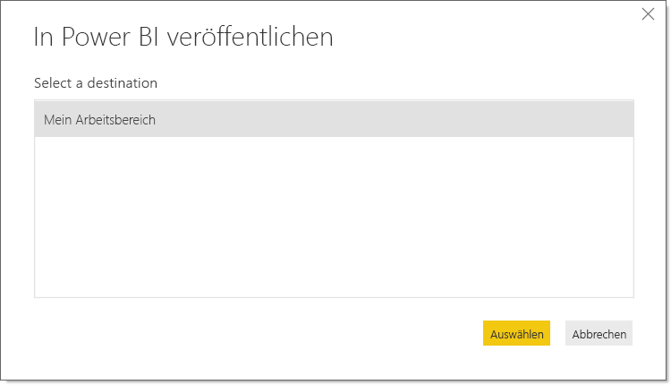

# Veröffentlichen aus Power BI Desktop
Wenn Sie eine **Power BI Desktop**-Datei für den **Power BI-Dienst** veröffentlichen, werden die Daten im Modell und alle Berichte, die Sie in der **Berichtsansicht** erstellt haben, in Ihrem Power BI-Arbeitsbereich veröffentlicht. Ein neues Dataset mit dem gleichen Namen und die jeweiligen Berichte werden im Navigationsbereich Ihres Arbeitsbereichs angezeigt.

Das Veröffentlichen aus **Power BI Desktop** hat die gleiche Auswirkung wie die Verwendung der Funktion **Abrufen von Daten** in Power BI, um eine Verbindung mit einer **Power BI Desktop**-Datei herzustellen und diese hochzuladen.

> [!NOTE]
> Alle von Ihnen an Power BI-Berichten vorgenommenen Änderungen, z.B. das Hinzufügen, Löschen oder Ändern von Visualisierungen in Berichten, werden nicht wieder in der ursprünglichen **Power BI Desktop**-Datei gespeichert.
> 
> 

## So veröffentlichen Sie ein Power BI Desktop-Dataset und die zugehörigen Berichte
1. In Power BI Desktop auf **Datei** \> **veröffentlichen** \> **in Power BI veröffentlichen** oder klicken Sie auf **veröffentlichen** auf der Bändchen.  

   

2. Melden Sie sich bei Power BI an.
3. Wählen Sie die Zieladresse aus.

   

Wenn Sie fertig sind, erhalten Sie einen Link zu Ihrem Bericht. Klicken Sie auf diesen Link, um den Bericht auf Ihrer Power BI-Website zu öffnen.

## Erneutes Veröffentlichen oder Ersetzen eines über Power BI Desktop veröffentlichten Datasets
Wenn Sie eine **Power BI Desktop**-Datei veröffentlichen, werden das Dataset und alle in **Power BI Desktop** erstellten Berichte auf Ihre Power BI-Website hochgeladen. Wenn Sie Ihre **Power BI Desktop**-Datei erneut veröffentlichen, wird das Dataset auf der Power BI-Website durch das aktualisierte Dataset aus der **Power BI Desktop**-Datei ersetzt.

Dies ist alles einfach, aber es gibt einige Dinge, die Sie kennen sollten:

* Das Veröffentlichen kann fehlschlagen, wenn Sie in Power BI bereits über zwei oder mehr Datasets verfügen, die den gleichen Namen wie die **Power BI Desktop**-Datei haben. Stellen Sie sicher, dass in Power BI nur ein Dataset mit dem gleichen Namen vorhanden ist. Sie können die Datei auch umbenennen und veröffentlichen, um ein neues Dataset mit dem gleichen Namen wie die Datei zu erstellen.
* Wenn Sie eine Spalte oder ein Measure umbenennen oder löschen, können Fehler für Visualisierungen auftreten, die in Power BI bereits mit diesem Feld vorhanden sind. 
* Power BI ignoriert einige Formatänderungen vorhandener Spalten. Beispiel: Sie ändern das Format einer Spalte von 0,25 in 25 %.
* Wenn Sie einen Aktualisierungszeitplan für Ihr vorhandenes Dataset in Power BI konfiguriert haben und Sie der Datei neue Datenquellen hinzufügen und dann erneut veröffentlichen müssen Sie hierfür unter *Datenquellen verwalten* vor der nächsten geplanten Aktualisierung eine Anmeldung durchführen.

