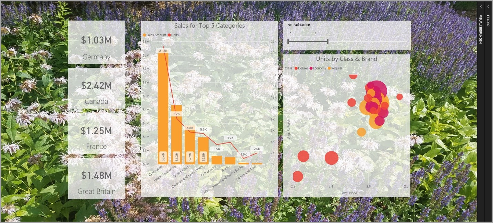
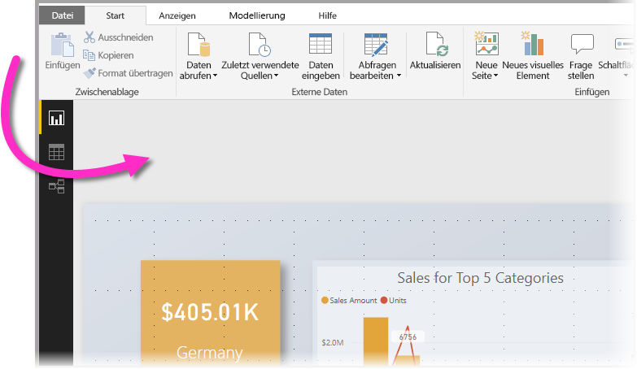
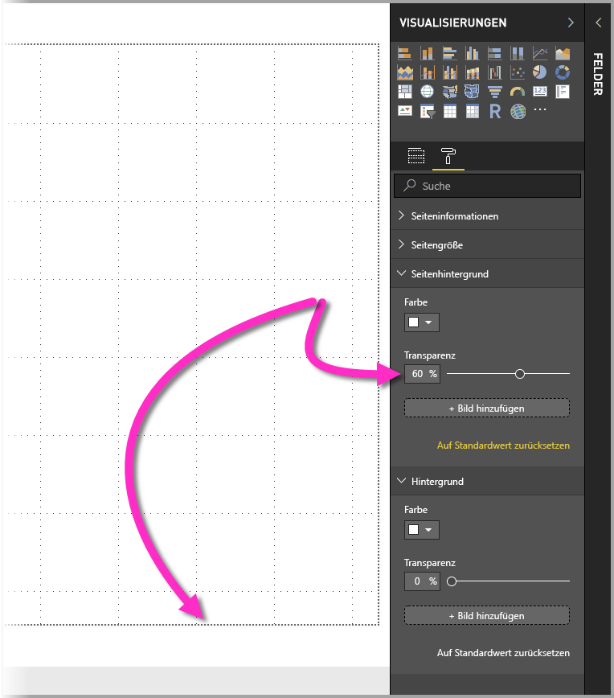
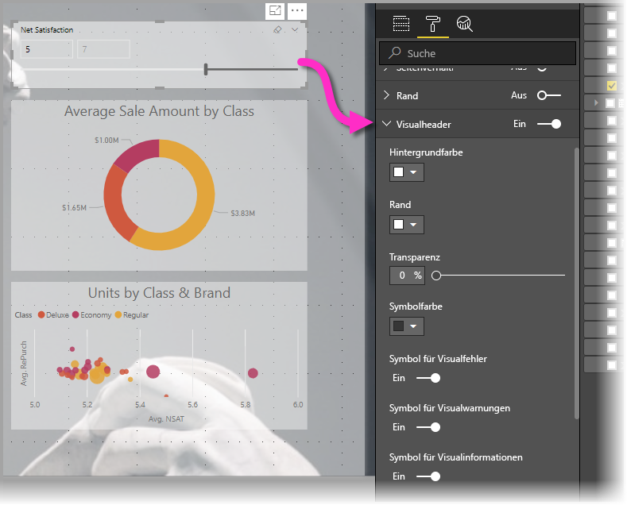
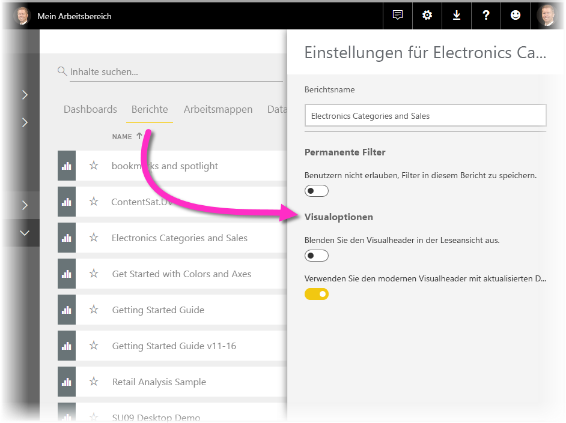
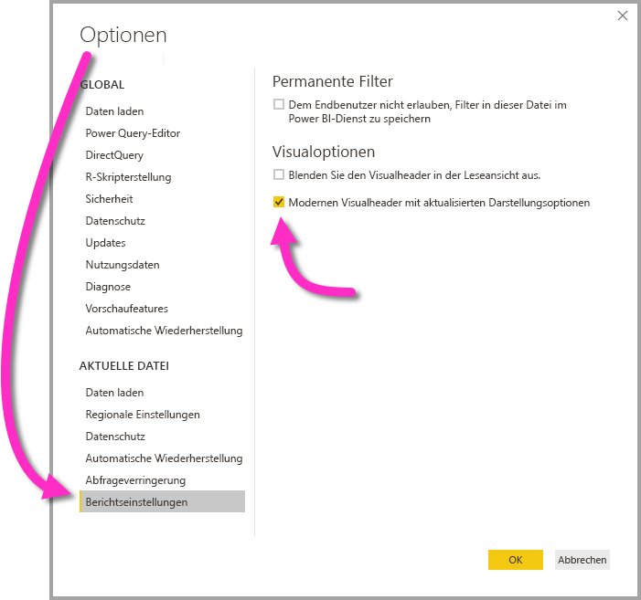

# Verbesserung von Power BI-Berichten anhand von Visualelementen

Mit **Power BI Desktop** können Sie Visualelemente wie Hintergründe und verbesserte Visualheader für Visualisierungen verwenden, um die Darstellung Ihrer Berichte zu verbessern.

Ab dem **Power BI Desktop**-Release von Juli 2018 können Verbesserungen in Berichten verwendet und Analysen und Berichte noch ansprechender gestaltet werden als zuvor. Zu den in diesem Artikel beschriebenen Verbesserungen zählen Folgende: 

* Anwendung von **Hintergründen** auf Berichte, damit der Hintergrund Elemente der Botschaft, die Sie mit Ihren Daten mitteilen möchten, verbessern und hervorheben kann
* Verwendung von verbesserten **Visualheadern** für einzelne Visualisierungen, um perfekt ausgerichtete Visuals im Berichtszeichenbereich zu erstellen 

In den folgenden Abschnitten wird beschrieben, wie Sie diese Erweiterungen verwenden und auf Ihre Berichte anwenden können.

## Verwendung von Hintergründen in Power BI-Berichten

Sie können den grauen Bereich außerhalb Ihrer Berichtsseite mithilfe von **Hintergründen** formatieren. In der folgenden Abbildung zeigt der Pfeil den Bereich, auf den der Hintergrundbereich angewendet wird. 

Sie können entweder Hintergründe pro Berichtseite oder den gleichen Hintergrund für jede Seite in Ihrem Bericht festlegen. Um Ihren Hintergrund festzulegen, tippen oder klicken Sie auf das Symbol **Formatierung**, wenn in Ihrem Bericht kein Visual ausgewählt ist und die Registerkarte **Hintergrund** im Bereich angezeigt wird.

Sie können durch Klicken auf die Dropdownliste **Farbe** eine Farbe auswählen, die als **Hintergrund** angewendet werden soll, oder auf die Schaltfläche **Bild hinzufügen** klicken, um ein als Hintergrund anzuwendendes Bild auszuwählen. Mit dem Schieberegler **Transparenz** können Sie zudem Transparenz auf Ihren Hintergrund anwenden, ganz gleich, ob es sich um eine Farbe oder ein Bild handelt.

Es ist hilfreich, sich die folgenden Definitionen in Bezug auf **Hintergründe** zu vergegenwärtigen:

* Der graue Bereich außerhalb Ihres Berichtsbereich ist der **Hintergrund**-Bereich.
* Der Bereich im Zeichenbereich, in dem Sie Visuals platzieren können, wird als **Berichtsseite** bezeichnet und kann im **Bereich „Formatierung“** mithilfe der Dropdownliste **Seitenhintergrund** bearbeitet werden.

Die **Berichtsseite** ist (im Vergleich zum Hintergrund) immer im Vordergrund, während der **Hintergrund** darunter gelagert ist und das unterste Element auf der Berichtsseite darstellt. Wenn Sie Transparenz auf die Seite anwenden, wird die Transparenz auch auf die Visuals im Bericht angewendet, sodass Ihr Hintergrund im Hintergrund über Ihren Visuals sichtbar ist.

Für alle neuen Berichte gelten die folgenden Standardeinstellungen:

* Die **Berichtsseite** ist auf **Weiß** und deren Transparenz auf **100 %** festgelegt.
* Der **Hintergrund** ist auf **Weiß** und dessen Transparenz auf **0 %** festgelegt.

Wenn Sie den Seitenhintergrund auf eine Transparenz von mehr als 50 % festlegen, wird beim Erstellen oder Bearbeiten des Berichts eine gepunktete Begrenzung angezeigt, die die Begrenzung des Berichtszeichenbereichs anzeigt. 

Es gilt unbedingt zu beachten, dass die gepunktete Begrenzung *nur* bei der Bearbeitung des Berichts und *nicht* Personen angezeigt wird, die Ihren veröffentlichten Bericht anzeigen, z.B. wenn dieser im **Power BI-Dienst** angezeigt wird.

> [!NOTE]
> Wenn Sie dunkle Farben für Ihre Hintergründe verwenden und die Textfarbe auf weiß oder sehr hell festlegen, sollten Sie darauf achten, dass das Feature **Exportieren in eine PDF-Datei** kein Hintergrundbild enthält, sodass alle Exporte mit weißen Schriftarten in der exportierten PDF-Datei so gut wie unsichtbar sind. Weitere Informationen zum **Exportieren in eine PDF-Datei** finden Sie unter [In PDF exportieren](desktop-export-to-pdf.md).

## Verwendung von verbesserten Visualheadern in Power BI-Berichten

Ab dem **Power BI Desktop**-Release von Juli 2018 wurden die Header für Visuals in Berichten erheblich verbessert. Im Rahmen der Verbesserungen wurden in erster Linie die Header vom Visual getrennt, damit ihre Position entsprechend Ihren Vorlieben bezüglich des Layouts und der Positionierung angepasst werden kann. Zudem wird der Header jetzt im Visual selbst angezeigt und schwebt nicht mehr über ihr. 

Standardmäßig werden die Header im Visual, ausgerichtet am Titel, angezeigt. In der folgenden Abbildung können Sie die Header (das Symbol zum Anheften, das Symbol zum Erweitern und das Auslassungspunktsymbol) im Visual sehen, und zwar ausgerichtet auf der rechten Seite an der gleichen horizontalen Position wie der des Titels des Visuals.

Wenn Ihr Visual keinen Titel aufweist, schwebt der Header oberhalb des Visuals, ausgerichtet auf der rechten Seite, wie in der folgenden Abbildung gezeigt wird. 

Wenn Ihr Visual im oberen Bereich Ihres Berichts positioniert ist, wird der Visualheader stattdessen am unteren Rand des Visuals ausgerichtet. 

Jedes Visual weist außerdem eine Registerkarte namens **Visualheader** im Abschnitt **Formatierung** des Bereichs **Visualisierungen** auf. Auf dieser Registerkarte können Sie alle Arten von Merkmalen zum Visualheader anpassen.

> [!NOTE]
> Die Sichtbarkeit der Schaltflächen zum Umschalten wirken sich nicht auf die Erstellung oder Bearbeitung Ihres Berichts aus. Sie müssen den Bericht veröffentlichen und im Lesemodus anzeigen, um den Effekt sehen zu können. Dadurch wird die Bedeutung der zahlreichen Optionen für die Bearbeitung hervorgehoben, die in Visualheadern zur Verfügung stehen, insbesondere Warnsymbole, die Sie bei der Bearbeitung über Probleme benachrichtigen.

Bei Berichten, die nur im **Power BI-Dienst** angezeigt werden, können Sie die Verwendung von Visualheadern anpassen, indem Sie zu **Mein Arbeitsbereich > Berichte** navigieren und dann auf das Symbol **Einstellungen** klicken. Daraufhin werden die Einstellungen für den Bericht angezeigt, für den Sie die **Einstellungen** ausgewählt haben, und Sie können die Einstellungen in diesem Bereich anpassen, wie in der folgenden Abbildung dargestellt wird.

### Aktivieren der verbesserten Visualheader für vorhandene Berichte

Die neuen Visualheader stellen das Standardverhalten für alle neuen Berichte dar. Bei vorhandenen Berichten müssen Sie dieses Verhalten in **Power BI Desktop** unter **Datei > Optionen und Einstellungen > Optionen** aktivieren und dann im Abschnitt **Berichtseinstellungen** das Kontrollkästchen **Modernen Visualheader mit aktualisierten Darstellungsoptionen verwenden** aktivieren.

## Nächste Schritte
Weitere Informationen zu **Power BI Desktop** und den ersten Schritten finden Sie in den folgenden Artikeln.

* [Was ist Power BI Desktop?](desktop-what-is-desktop.md)
* [Übersicht zu Abfragen mit Power BI Desktop](desktop-query-overview.md)
* [Datenquellen in Power BI Desktop](desktop-data-sources.md)
* [Verbinden mit Daten in Power BI Desktop](desktop-connect-to-data.md)
* [Strukturieren und Kombinieren von Daten mit Power BI Desktop](desktop-shape-and-combine-data.md)
* [Allgemeine Abfrageaufgaben in Power BI Desktop](desktop-common-query-tasks.md)   

