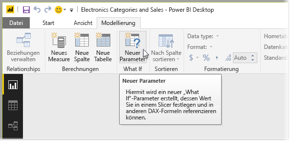
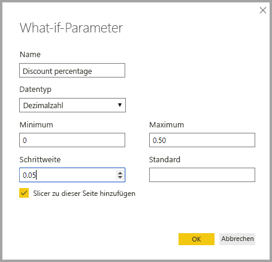
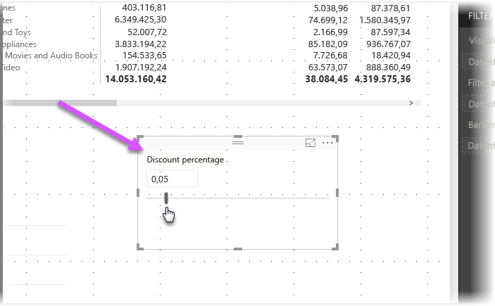
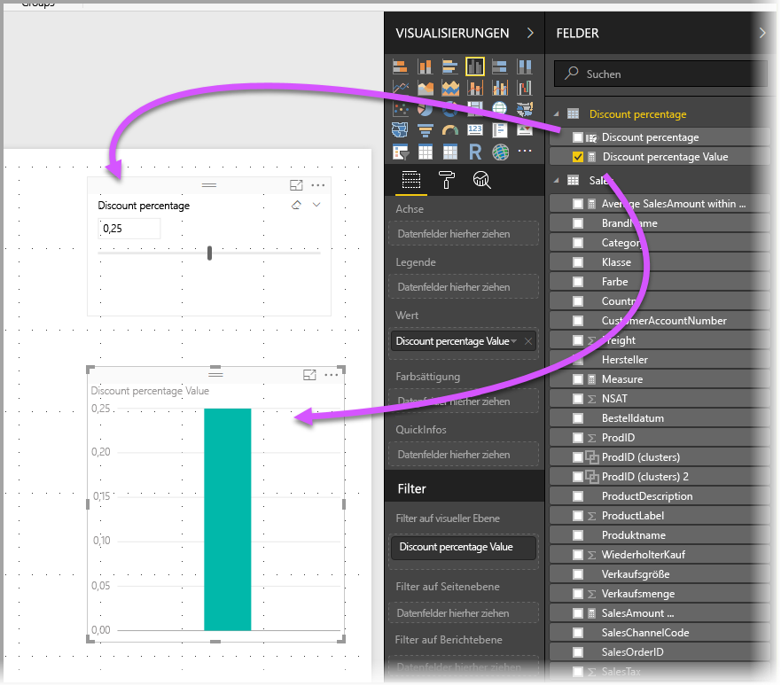
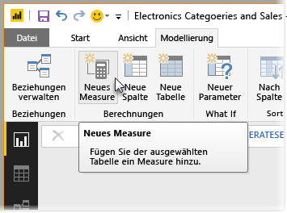
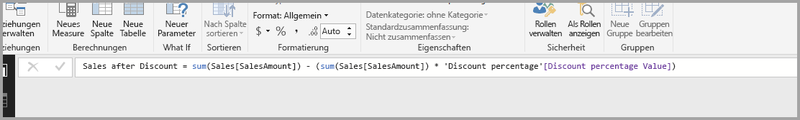
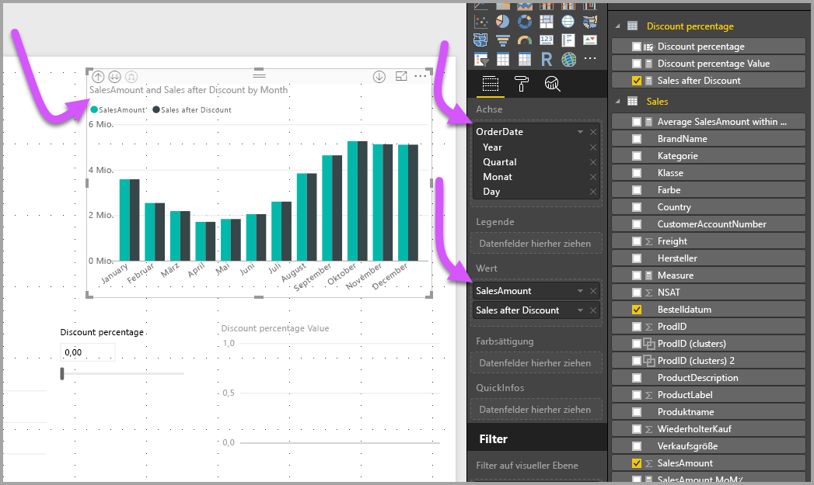
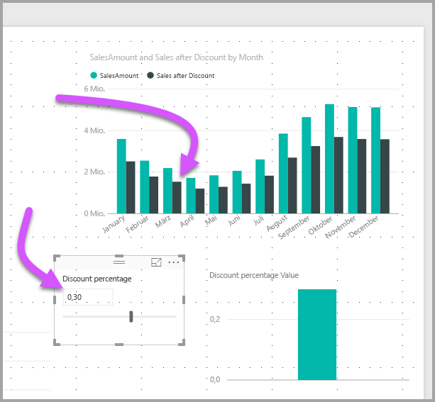

# Erstellen und Verwenden eines Was-wäre-wenn-Parameters zum Visualisieren von Variablen in Power BI Desktop
Ab der **Power BI Desktop**-Version von August 2017 können Sie **Was-wäre-wenn**-Variables für Ihre Berichte erstellen, mit der Variablen als Slicer interagieren und auf diese Weise unterschiedliche wichtige Werte in den Berichten visualisieren und quantifizieren.

Der Parameter **Was-wäre-wenn** befindet sich auf der Registerkarte **Modellierung** von **Power BI Desktop**. Wenn Sie diese Option auswählen, wird ein Dialogfeld angezeigt, in dem Sie den Parameter konfigurieren können.

## Erstellen eines Was-wäre-wenn-Parameters
Wählen Sie zum Erstellen eines **Was-wäre-wenn**-Parameters die Schaltfläche **Was-wäre-wenn** auf der Registerkarte **Modellierung** in **Power BI Desktop**. In der folgenden Abbildung wurde ein Parameter mit dem Namen *Discount percentage* (Rabattprozentsatz) erstellt und sein Datentyp auf *Dezimalzahl* festgelegt. Der Wert von *Minimum* ist 0, und der Wert von *Maximum* ist 0,50 (fünfzig Prozent). Außerdem wurde *Inkrement* auf 0,05 bzw. fünf Prozent festgelegt. Um diesen Betrag wird der Parameter angepasst, wenn in einem Bericht eine Interaktion mit ihm erfolgt.

> [!NOTE]
> Stellen Sie Dezimalzahlen eine 0 voran, also in diesem Feld 0,50 und nicht ,50. Andernfalls wird die Zahl nicht ausgewertet, und die Schaltfläche **OK** kann nicht ausgewählt werden.
> 
> 

Durch Aktivieren des Kontrollkästchens **Slicer zu dieser Seite hinzufügen** wird mit dem **Was-wäre-wenn**-Parameter automatisch ein Slicer auf der aktuellen Berichtsseite hinzugefügt.

Durch das Erstellen eines **Was-wäre-wenn**-Parameters wird auch ein Measure erstellt, mit dem Sie den aktuellen Wert des **Was-wäre-wenn**-Parameters visualisieren können.

Beachten Sie, dass nach dem Erstellen eines **Was-wäre-wenn**-Parameters sowohl der Parameter als auch das Measure Teil des Modells werden. Sie sind somit im gesamten Bericht verfügbar und können auf anderen Berichtsseiten verwendet werden. Und da sie Teil des Modells sind, können Sie den Slicer von der Berichtsseite löschen. Wenn er wieder auf ihr enthalten sein soll, ziehen Sie einfach den Parameter **Was-wäre-wenn** aus der Liste **Felder** in den Zeichenbereich (ändern Sie dann das Visual in einen Slicer), um den **Was-wäre-wenn**-Parameter einfach wieder dem Bericht hinzuzufügen.

## Verwenden eines Was-wäre-wenn-Parameters
Lassen Sie uns ein einfaches Beispiel für die Verwendung eines **Was-wäre-wenn**-Parameters erstellen. Im vorherigen Abschnitt haben wir den **Was-wäre-wenn**-Parameter erstellt. Jetzt werden wir ihn auch verwenden, indem wir ein neues Measure erstellen, dessen Wert mit dem Schieberegler angepasst wird. Zu diesem Zweck erstellen wir ein neues Measure.

Das neue Measure ist einfach der Gesamtumsatz, auf den der Rabatt angewendet wird. Sie können selbstverständlich komplexe und interessante Measures erstellen, mit denen die Benutzer Ihrer Berichte die Variable des **Was-wäre-wenn**-Parameters visualisieren können. Sie können z.B. einen Bericht erstellen, mit dem Vertriebsmitarbeiter die Vergütung, die sie beim Erreichen bestimmter Umsatzziele oder -prozentwerte erhalten, oder die Erhöhung von Rabatten aufgrund höherer Umsätze anzeigen können.

Sobald wir die Measureformel in der Bearbeitungsleiste eingegeben und sie mit **Sales after Discount** (Auftragsrabatt) benannt haben, wird das Ergebnis angezeigt:

Anschließend erstellen wir ein Säulendiagramm-Visual mit *OrderDate* auf der Achse und mit *SalesAmount* und dem gerade erstellten Measure *Sales after Discount* (Auftragsrabatt) als Werte.

Wenn wir dann den Schieberegler bewegen, stellen wir fest, dass die Spalte *Sales after Discount* (Auftragsrabatt) den ermäßigten Umsatzbetrag wiedergibt.

Das war schon alles. Sie können den **Was-wäre-wenn**-Parameter in allen möglichen Situationen verwenden, damit die Benutzer von Berichten mit unterschiedlichen Szenarien interagieren können, die Sie in Ihren Berichten erstellen.

