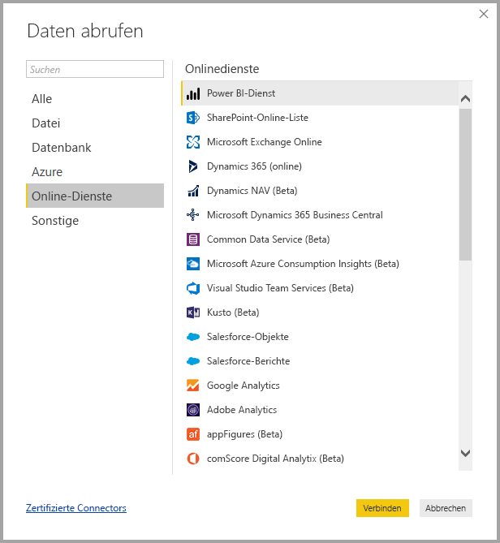
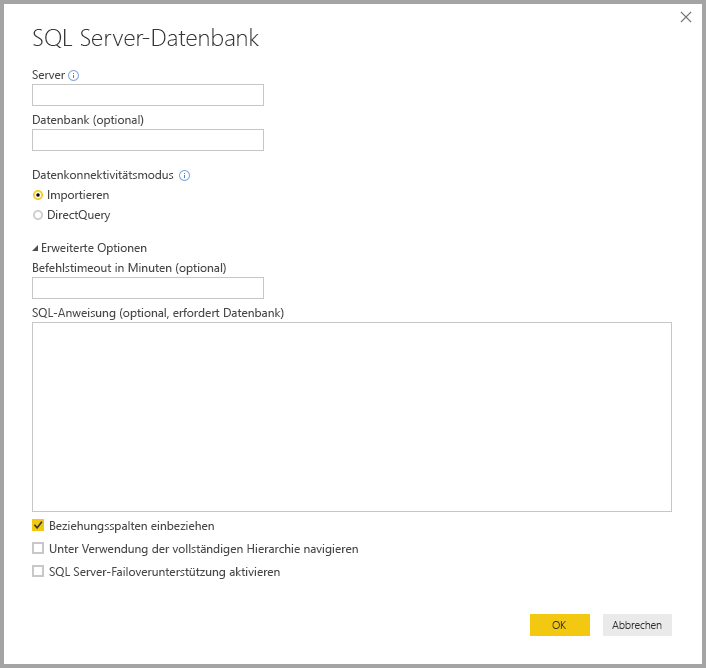
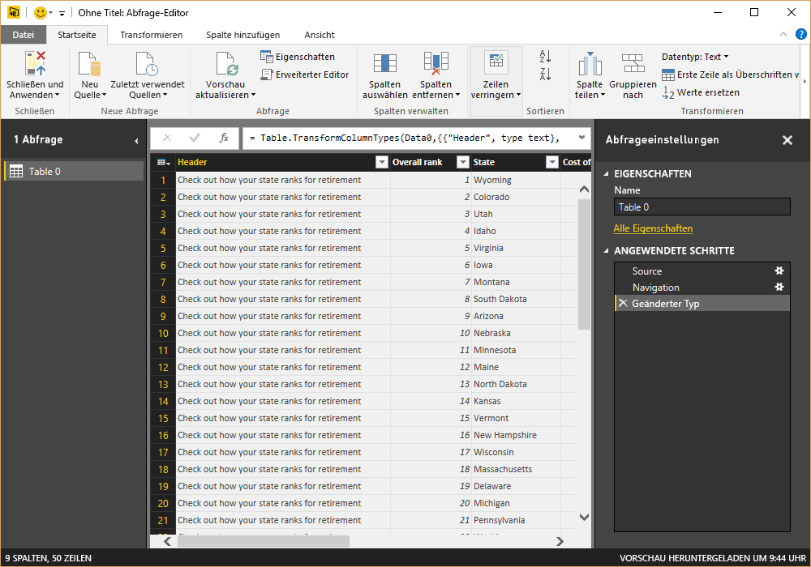
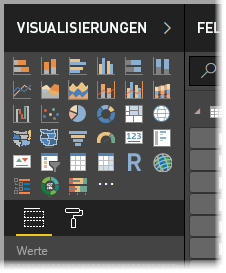
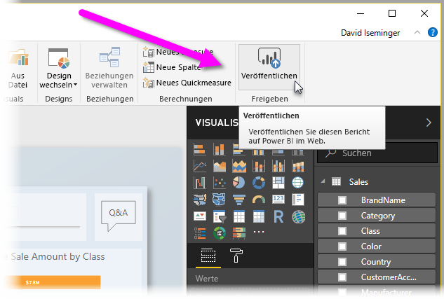

# Was ist Power BI Desktop?

**Power BI Desktop** ist eine kostenlose Anwendung, die Sie auf Ihrem lokalen Computer installieren können und die es Ihnen ermöglicht, eine Verbindung mit Ihren Daten herzustellen und diese zu transformieren und zu visualisieren. Mit **Power BI Desktop** können Sie eine Verbindung mit mehreren verschiedenen Datenquellen herstellen und diese in ein Datenmodell kombinieren (dies wird oft als Modellierung bezeichnet). Mit einem solchen Datenmodell können Sie Visuals und Sammlungen mit Visuals erstellen, die Sie als für andere Benutzer in Ihrer Organisation als Berichte freigeben können. Die meisten Benutzer, die an Business Intelligence-Projekten arbeiten, verwenden **Power BI Desktop** zum Erstellen von Berichten und nutzen dann den **Power BI-Dienst**, um ihre Berichte für andere Personen freizugeben.

Im Folgenden finden Sie die häufigsten Verwendungsmöglichkeiten für **Power BI Desktop**:

* Verbinden mit Daten
* Transformieren und Bereinigen von Daten zum Erstellen eines Datenmodells
* Erstellen von Visuals wie Diagrammen oder Graphen, die visuelle Darstellungen der Daten bieten
* Erstellen von Berichten, bei denen es sich um Sammlungen von Visuals handelt, auf einer oder mehreren Berichtsseiten
* Freigeben von Berichten für andere Personen über den **Power BI-Dienst**

Personen, die für solche Aufgaben zuständig sind, werden häufig als *Datenanalysten* (bzw. einfach *Analysten*) oder als Business Intelligence-Experten (oder *Berichtersteller*) bezeichnet. Allerdings arbeiten auch viele Menschen, die sich selbst nicht als Analysten oder Berichtersteller betrachten, mit **Power BI Desktop**, um überzeugende Berichts zu erstellen oder Daten aus verschiedenen Quellen abzurufen und Datenmodelle zu erstellen, die sie für Kollegen und Organisationen freigeben können.

Mit **Power BI Desktop** können Sie komplexe visuell aufbereitete Berichte erstellen und dabei Daten aus mehreren Quellen in einem Bericht zusammenstellen, den Sie dann für andere Personen in Ihrer Organisation freigeben. 

## Verbinden mit Daten
Der erste Schritt bei der Verwendung von **Power BI Desktop** besteht darin, eine Verbindung mit Daten herzustellen. Es gibt viele verschiedene Datenquelle, mit denen Sie über **Power BI Desktop** eine Verbindung herstellen können. Um eine solche Verbindung mit Daten herzustellen, wählen Sie das Menüband **Start** aus, und klicken Sie auf **Daten abrufen > Mehr**. Die folgende Abbildung zeigt das Fenster **Daten abrufen** mit den vielen Kategorien, mit denen Power BI Desktop eine Verbindung herstellen kann.

Wenn Sie einen Datentyp auswählen, werden Sie aufgefordert, Informationen einzugeben, wie z.B. URL und Anmeldeinformationen, die erforderlich sind, damit Power BI Desktop in Ihrem Namen eine Verbindung mit der Datenquelle herstellen kann.

Sobald Sie eine Verbindung mit mindestens einer Datenquelle hergestellt haben, können Sie die Daten so transformieren, dass sie für Sie von Nutzen sind.

## Transformieren und Bereinigen von Daten und Erstellen eines Modells

In Power BI Desktop können Sie Daten mit dem integrierten **Abfrage-Editor** bereinigen und transformieren. Mit dem Abfrage-Editor können Sie Änderungen an Ihren Daten vornehmen. Sie können z.B. einen Datentyp ändern, Spalten entfernen oder Daten aus mehreren Quellen kombinieren. Sie können sich den Vorgang in etwa wie das Formen einer Lehmskulptur vorstellen: Sie beginnen mit einem großen Block Lehm (bzw. Daten), nehmen dann an einigen Stellen Material weg und fügen an anderen Stellen welches hinzu, bis die Form bzw. Struktur der Daten Ihren Wünschen entspricht. 

Jeder Schritt, den Sie zum Transformieren der Daten durchführen (z.B. Umbenennen einer Tabelle, Transformieren eines Datentyps oder Löschen von Spalten), wird vom **Abfrage-Editor** aufgezeichnet. Jedes Mal, wenn diese Abfrage eine Verbindung mit der Datenquelle herstellt, werden diese Schritte ausgeführt, sodass die Daten stets in der gewünschten Art strukturiert sind.

Die folgende Abbildung zeigt den Bereich **Abfrageeinstellungen** für eine Abfrage, die strukturiert und in ein Modell umgewandelt wurde.

 

Sobald Ihre Daten in der von Ihnen gewünschten Form vorliegen, können Sie Visuals erstellen. 

## Erstellen von visuellen Elementen 

Sobald Sie über ein Datenmodell verfügen, können Sie *Felder* auf die Berichtscanvas ziehen, um *Visuals* zu erstellen. Ein *Visual* ist eine grafische Darstellung der Daten in Ihrem Modell. Das folgende Visual zeigt ein einfaches Säulendiagramm. 

In Power BI Desktop stehen viele verschiedene Arten von Visuals zur Auswahl bereit. Um ein Visual zu erstellen oder zu ändern, wählen Sie einfach im Bereich **Visualisierungen** das Symbol des Visuals aus. Wenn Sie auf der Berichtscanvas ein Visual ausgewählt haben, ändert sich dieses in den von Ihnen ausgewählten Typ. Wenn kein Visual ausgewählt ist, wird basierend auf Ihrer Auswahl ein neues Visual erstellt.

## Erstellen von Berichten

Vermutlich werden Sie häufig eine Sammlung von Visuals erstellen, die verschiedene Aspekte der Daten zeigen, mit denen Sie Ihr Modell in Power BI Desktop erstellt haben. Eine Sammlung von Visuals in einer einzigen Power BI Desktop-Datei wird als *Bericht* bezeichnet. Ein Bericht kann eine oder mehrere Seiten umfassen, ebenso wie eine Excel-Datei aus einem oder mehreren Arbeitsblättern bestehen kann. In der folgenden Abbildung sehen Sie die erste Seite eines Power BI Desktop-Berichts mit der Bezeichnung „Overview“ (der Name wird auf der Registerkarte im unteren Bereich des Bilds angezeigt). Dieser Bericht umfasst zehn Seiten.

## Freigeben von Berichten

Sobald ein Bericht für andere Personen freigegeben werden kann, **veröffentlichen** Sie den Bericht im **Power BI-Dienst** und stellen ihn so für alle Benutzer in Ihrer Organisation zur Verfügung, die eine Power BI-Lizenz besitzen. Um einen Power BI Desktop-Bericht zu veröffentlichen, klicken Sie auf dem Menüband **Start** in Power BI Desktop auf die Schaltfläche **Veröffentlichen**.

Sobald Sie auf**Veröffentlichen** geklickt haben, stellt Power BI Desktop über Ihr Power BI-Konto eine Verbindung mit dem **Power BI-Dienst** her und fordert Sie dann auf, auszuwählen, an welcher Stelle im Power BI-Dienst Sie Ihren Bericht freigeben möchten: in Ihrem Arbeitsbereich, einem Teamarbeitsbereich oder einem anderen Bereich im Power BI-Dienst. Sie müssen über eine Power BI-Lizenz verfügen, um Berichte im Power BI-Dienst freizugeben.

## Nächste Schritte

Um mit **Power BI Desktop** zu beginnen, müssen Sie die Anwendung zuerst herunterladen und installieren. Es gibt zwei Möglichkeiten, **Power BI Desktop** zu erhalten:

* [Herunterladen von Power BI Desktop aus dem Web](desktop-get-the-desktop.md)
* [Abrufen von Power BI Desktop aus dem Windows Store](http://aka.ms/pbidesktopstore)
