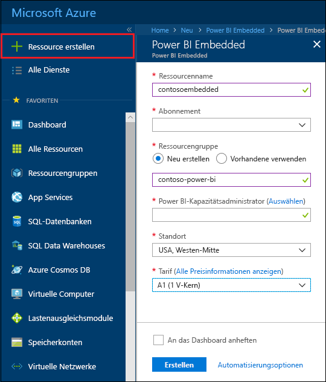
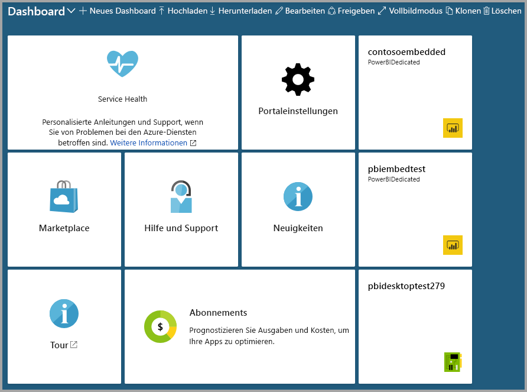

# Erstellen einer Power BI Embedded-Kapazität im Azure-Portal

In diesem Artikel erfahren Sie, wie Sie eine [Power BI Embedded-Kapazität](azure-pbie-what-is-power-bi-embedded.md) in Microsoft Azure erstellen. Power BI Embedded vereinfacht die Power BI-Funktionen, indem es Ihnen dabei hilft, Ihren Anwendungen schnell beeindruckende Visuals, Berichte und Dashboards hinzuzufügen.

Wenn Sie kein Azure-Abonnement haben, erstellen Sie ein [kostenloses Konto](https://azure.microsoft.com/free/), bevor Sie beginnen.

> [!VIDEO https://www.youtube.com/embed/aXrvFfg_iSk]

## Vorbereitung

Für diesen Schnellstart benötigen Sie Folgendes:

* **Azure-Abonnement:** Besuchen Sie die [Azure-Website](https://azure.microsoft.com/free/), um ein kostenloses Konto zu erstellen.
* **Azure Active Directory:** Ihr Abonnement muss einem Azure Active Directory-Mandanten (AAD) zugeordnet sein. Außerdem ***müssen Sie in Azure mit einem Konto in diesem Mandanten angemeldet sein***. Microsoft-Konten werden nicht unterstützt. Weitere Informationen finden Sie unter [Authentifizierung und Benutzerberechtigungen](https://docs.microsoft.com/azure/analysis-services/analysis-services-manage-users).
* **Power BI-Mandant:** Mindestens ein Konto in Ihrem AAD-Mandanten muss für Power BI registriert sein.
* **Ressourcengruppe:** Verwenden Sie eine bereits vorhandene Ressourcengruppe, oder [erstellen Sie eine neue](https://docs.microsoft.com/azure/azure-resource-manager/resource-group-overview).

## Erstellen einer Kapazität

1. Melden Sie sich beim [Azure-Portal](https://portal.azure.com/) an.

2. Geben Sie in das Suchfeld *Power BI Embedded* ein.

3. Wählen Sie in Power BI Embedded **Erstellen** aus.

4. Geben Sie die erforderlichen Informationen ein, und wählen Sie dann **Erstellen** aus.

    

    |Einstellung |Beschreibung |
    |---------|---------|
    |**Ressourcenname**|Ein Name zur Identifizierung der Kapazität. Der Ressourcenname wird im Power BI-Verwaltungsportal zusätzlich zum Azure-Portal angezeigt.|
    |**Abonnement**|Das Abonnement, für das Sie die Kapazität erstellen möchten.|
    |**Ressourcengruppe**|Die Ressourcengruppe, die die neue Kapazität enthält. Wählen Sie eine vorhandene Ressourcengruppe aus, oder erstellen Sie eine neue. Weitere Informationen finden Sie unter [Übersicht über Azure Resource Manager](https://docs.microsoft.com/azure/azure-resource-manager/resource-group-overview).|
    |**Power BI-Kapazitätsadministrator**|Power BI-Kapazitätsadministratoren können die Kapazität im Power BI-Verwaltungsportal ansehen und anderen Benutzern Zuweisungsberechtigungen erteilen. Standardmäßig ist der Kapazitätsadministrator Ihr Konto. Der Kapazitätsadministrator muss sich in Ihrem Power BI-Mandanten befinden.|
    |**Speicherort**|Der Speicherort, an dem Power BI für Ihren Mandanten gehostet wird. Der standardmäßige Standort ist Ihre Heimatregion, aber Sie können den Standort über die [Multi-Geo-Optionen](embedded-multi-geo.md) ändern.
    |**Tarif**|Wählen Sie die SKU aus (Anzahl von V-Kernen und Arbeitsspeichergröße), die Ihren Anforderungen entspricht.  Weitere Informationen finden Sie unter [Power BI Embedded – Preise](https://azure.microsoft.com/pricing/details/power-bi-embedded/).|

Sie können zu **Alle Dienste** > **Power BI Embedded** navigieren, um zu überprüfen, ob Ihre Kapazität einsatzbereit ist. Alternativ können Sie im Abschnitt „Benachrichtigungen“ oder auf dem Blatt auf **An Dashboard anheften** klicken, um zum Dashboard zu navigieren und die neue Kapazität anzuzeigen.

## Nächste Schritte

Wenn Sie Ihre neue Power BI Embedded-Kapazität verwenden möchten, öffnen Sie das Power BI-Verwaltungsportal, um Arbeitsbereiche zuzuweisen. Weitere Informationen finden Sie unter [Verwalten von Kapazitäten in Power BI Premium und Power BI Embedded](https://powerbi.microsoft.com/documentation/powerbi-admin-premium-manage/).

Wenn Sie eine Kapazität nicht benötigen, können Sie sie anhalten, damit sie nicht in Rechnung gestellt wird. Weitere Informationen finden Sie unter [Anhalten und Starten einer Power BI Embedded-Kapazität im Azure-Portal](azure-pbie-pause-start.md).

Weitere Informationen zum Einbetten von Power BI-Inhalten in Ihre Anwendung finden Sie unter [Einbetten von Power BI-Berichten, -Dashboards, oder -Kacheln](https://powerbi.microsoft.com/documentation/powerbi-developer-embedding-content/).

Weitere Fragen? [Stellen Sie Ihre Frage in der Power BI-Community.](http://community.powerbi.com/)