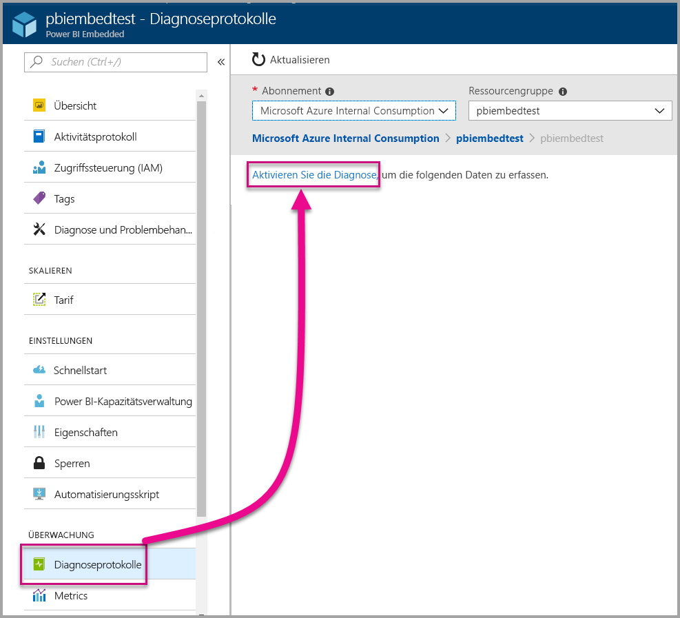
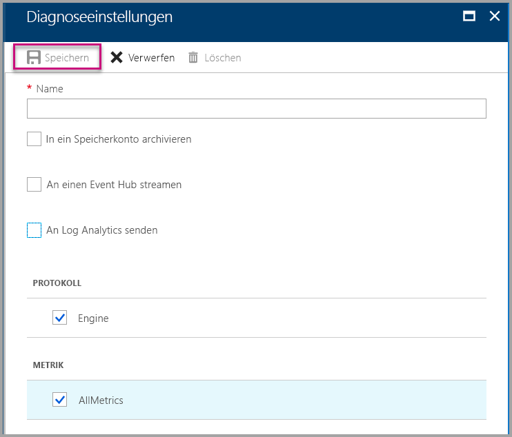
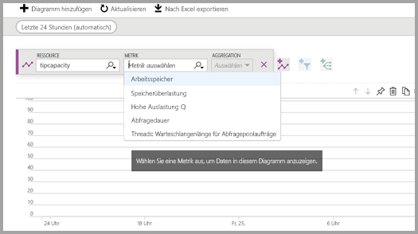
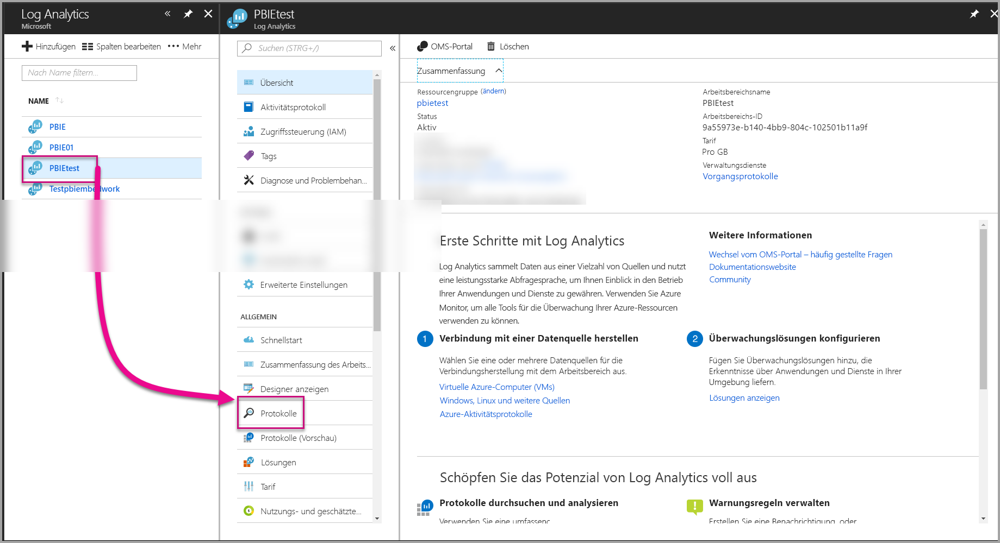
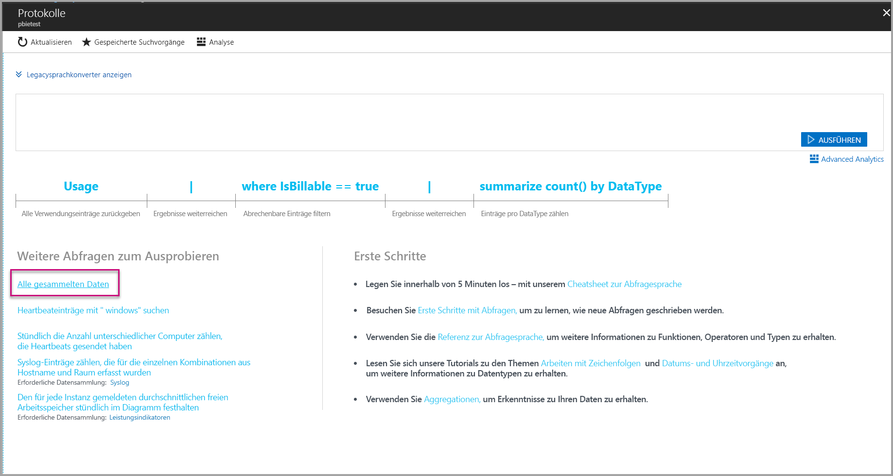
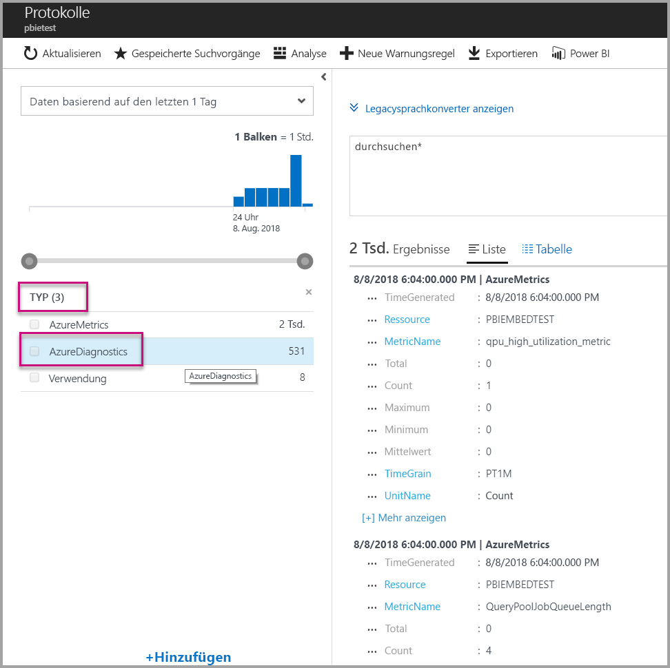
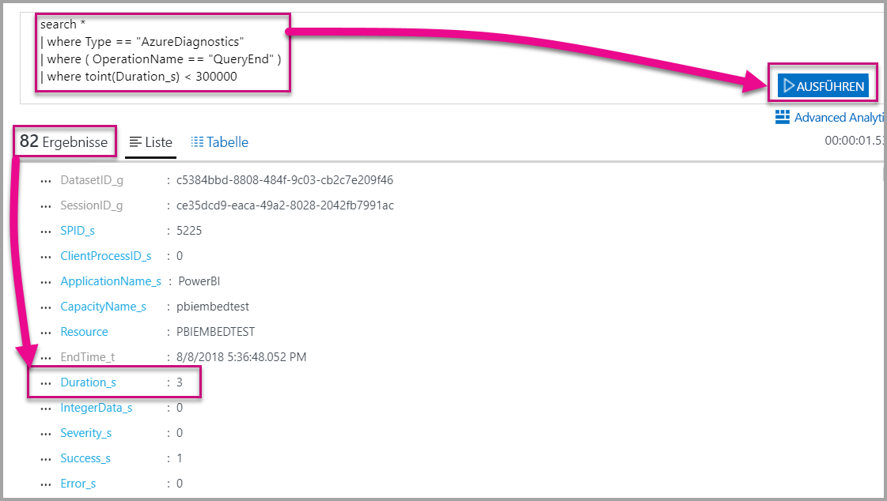
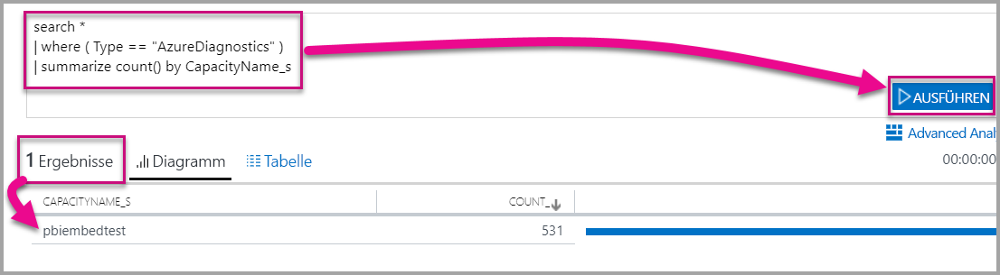

# <a name="diagnostic-logging-for-power-bi-embedded-in-azure"></a>Diagnoseprotokollierung für Power BI Embedded in Azure

Mit [Diagnoseprotokollen für Azure-Ressourcen](https://docs.microsoft.com/azure/monitoring-and-diagnostics/monitoring-overview-of-diagnostic-logs) können Sie eine Vielzahl von Ereignissen aus Ihrer Kapazität protokollieren, in ein Analysetool importieren und Einblicke in das Verhalten Ihrer Ressource gewinnen.

Die Diagnose ermöglicht einige Szenarien wie etwa Folgende:

* Erkennung von Abfragen mit langer Ausführungszeit oder problematische Abfragen
* Erkennung von Fehlern, wenn der Grenzwert der Kapazität erreicht wird
* Ableitung von [Kapazitätsmetriken](https://powerbi.microsoft.com/blog/power-bi-developer-community-april-update/)
* Nachverfolgen der Nutzung von bestimmten Datasets

## <a name="set-up-diagnostics-logging"></a>Einrichten der Diagnoseprotokollierung

### <a name="azure-portal"></a>Azure-Portal

1. Wählen Sie im [Azure-Portal](https://portal.azure.com) unter der Power BI Embedded-Ressource im linken Navigationsbereich **Diagnoseprotokolle** und dann **Diagnose aktivieren** aus.

    

2. Geben Sie in den **Diagnoseeinstellungen** die folgenden Optionen an:

    * **Name**: Geben Sie einen Namen für die zu erstellende Diagnoseeinstellung ein.

    * **In einem Speicherkonto archivieren**: Für diese Option müssen Sie eine Verbindung mit einem vorhandenen Speicherkonto herstellen. Lesen Sie [Erstellen eines Speicherkontos](https://docs.microsoft.com/azure/storage/common/storage-create-storage-account), und befolgen Sie die Anweisungen zum Erstellen eines Speicherkontos. Wählen Sie dann Ihr Speicherkonto aus, indem Sie zu dieser Seite im Portal zurückkehren. Es kann einige Minuten dauern, bis neu erstellte Speicherkonten im Dropdownmenü angezeigt werden. Die Speicherung von Protokolldateien erfolgt im JSON-Format.
    * **An einen Event Hub streamen**: Für diese Option müssen Sie eine Verbindung mit einem vorhandenen Event Hub-Namespace und Event Hub herstellen. Weitere Informationen finden Sie unter [Erstellen eines Event Hub-Namespace und eines Event Hubs mithilfe des Azure-Portals](https://docs.microsoft.com/azure/event-hubs/event-hubs-create).
    * **An Log Analytics senden**: Verwenden Sie für diese Option entweder einen vorhandenen Arbeitsbereich, oder erstellen Sie einen neuen Log Analytics-Arbeitsbereich, indem Sie die Schritte zum [Erstellen eines neuen Arbeitsbereichs](https://docs.microsoft.com/azure/log-analytics/log-analytics-quick-collect-azurevm#create-a-workspace) im Portal durchführen. Hierfür wird der Dienst [Azure Log Analytics](https://docs.microsoft.com/azure/log-analytics/log-analytics-overview) eingesetzt, der integrierte Analyse, Dashboards und Benachrichtigungsfunktionen bereitstellt. Mit Log Analytics können Sie eine größere Menge an Daten von anderen Ressourcen einbinden und erhalten einen zentralen, umfassenden Überblick über Daten zu sämtlichen Ressourcen Ihrer Anwendung. Mit nur einem Mausklick kann der Dienst zudem mit [Power BI](https://docs.microsoft.com/azure/log-analytics/log-analytics-powerbi) verbunden werden.
    Weitere Informationen zum Anzeigen Ihrer Protokolle in Log Analytics finden Sie unter [Anzeigen von Protokollen in Log Analytics](https://docs.microsoft.com/azure/log-analytics/log-analytics-activity).
    * **Engine**: Wählen Sie diese Option aus, um die Gruppe von [Engine-Ereignissen](#whats-logged), die unten aufgeführt werden, zu protokollieren.
    * **AllMetrics**: Wählen Sie diese Option zum Speichern von ausführlichen Daten unter [Metriken](https://docs.microsoft.com/azure/analysis-services/analysis-services-monitor#server-metrics) aus. Wenn Sie Daten in einem Speicherkonto archivieren, können Sie die Beibehaltungsdauer für die Diagnoseprotokolle auswählen. Protokolle werden nach Ablauf der Beibehaltungsdauer automatisch gelöscht.

3. Wählen Sie **Speichern**.

    Um die Art und Weise, wie Ihre Diagnoseprotokolle gespeichert werden, zu ändern, können Sie zum Ändern der Einstellungen zu dieser Seite zurückkehren.

    

### <a name="using-powershell-to-enable-diagnostics"></a>Aktivieren der Diagnose mithilfe von PowerShell

Um die Metrik- und Diagnoseprotokollierung mittels PowerShell zu aktivieren, verwenden Sie die folgenden Befehle:

* Um die Speicherung von Diagnoseprotokollen in einem Speicherkonto zu aktivieren, verwenden Sie den folgenden Befehl:

    ```powershell
    Set-AzureRmDiagnosticSetting -ResourceId [your resource id] -StorageAccountId [your storage account id] -Enabled $true
    ```
    Die Speicherkonto-ID ist die Ressourcen-ID für das Speicherkonto, an das die Protokolle gesendet werden sollen.

* Um das Streaming von Diagnoseprotokollen an einen Event Hub zu aktivieren, verwenden Sie den folgenden Befehl:

    ```powershell
    Set-AzureRmDiagnosticSetting -ResourceId [your resource id] -ServiceBusRuleId [your service bus rule id] -Enabled $true
    ```
* Die Azure Service Bus-Regel-ID ist eine Zeichenfolge mit dem folgenden Format:

    ```powershell
    {service bus resource ID}/authorizationrules/{key name}
    ```

* Verwenden Sie zum Senden von Diagnoseprotokollen an einen Log Analytics-Arbeitsbereich folgenden Befehl:

    ```powershell
        Set-AzureRmDiagnosticSetting -ResourceId [your resource id] -WorkspaceId [resource id of the log analytics workspace] -Enabled $true
    ```

* Sie können die Ressourcen-ID Ihres Log Analytics-Arbeitsbereichs mithilfe des folgenden Befehls abrufen:

    ```powershell
    (Get-AzureRmOperationalInsightsWorkspace).ResourceId
    ```

Sie können diese Parameter kombinieren, um mehrere Ausgabeoptionen zu aktivieren.

### <a name="rest-api"></a>REST-API

Erfahren Sie, wie [die Diagnoseeinstellungen mithilfe der Azure Monitor-REST-API geändert werden können](https://docs.microsoft.com/rest/api/monitor/). 

### <a name="resource-manager-template"></a>Resource Manager-Vorlage

Erfahren Sie, wie die [Diagnoseeinstellungen bei der Ressourcenerstellung mithilfe einer Resource Manager-Vorlage aktiviert werden können](https://docs.microsoft.com/azure/monitoring-and-diagnostics/monitoring-enable-diagnostic-logs-using-template).

## <a name="whats-logged"></a>Was wird protokolliert?

Sie können die Kategorien **Engine** und/oder **AllMetrics** auswählen.

### <a name="engine"></a>Engine

Die Kategorie „Engine“ weist die Ressource an, die folgenden Ereignisse zu protokollieren, und für jedes der Ereignisse stehen die folgenden Eigenschaften zur Verfügung:

|     Ereignisname     |     Ereignisbeschreibung     |
|----------------------------|----------------------------------------------------------------------------------|
|    Überwachung von Anmeldungsereignissen    |    Zeichnet alle neuen Verbindungen mit den Engine-Ereignissen seit Beginn der Ablaufverfolgung auf.    |
|    Sitzungsinitialisierung    |    Zeichnet alle Sitzungsinitialisierungsereignisse seit Beginn der Ablaufverfolgung auf.    |
|    Beginn der Vertipaq-Abfrage    |    Zeichnet alle VertiPaq SE-Abfragebeginnereignisse seit Beginn der Ablaufverfolgung auf.    |
|    Abfragebeginn    |    Zeichnet alle Abfragebeginnereignisse seit Beginn der Ablaufverfolgung auf.    |
|    Ende der Abfrage    |    Zeichnet alle Abfrageendereignisse seit Beginn der Ablaufverfolgung auf.    |
|    Ende der Vertipaq-Abfrage    |    Zeichnet alle VertiPaq SE-Abfrageendereignisse seit Beginn der Ablaufverfolgung auf.    |
|    Überwachung von Abmeldungsereignissen    |    Zeichnet alle Trennungen von den Engine-Ereignissen seit Beginn der Ablaufverfolgung auf.    |
|    Fehler (Error)    |    Zeichnet alle Engine-Fehlerereignisse seit Beginn der Ablaufverfolgung auf.    |

<br>
<br>

| Eigenschaftenname | Beispiel für das Ende der Vertipaq-Abfrage | Eigenschaftenbeschreibung |
|-------------------|---------------------------------------------------------------------------------------------------------------------------------------------------------------------------------------------------------|--------------------------------------------------------------------------------------------------------------------------|
| EventClass | XM_SEQUERY_END | Die Ereignisklasse wird zum Kategorisieren von Ereignissen verwendet. |
| EventSubclass | 0 | Die Ereignisunterklasse enthält weitere Informationen zu den einzelnen Ereignisklassen. (Zum Beispiel 0: VertiPaq-Überprüfung) |
| RootActivityId | ff217fd2-611d-43c0-9c12-19e202a94f70 | Stammaktivitäts-ID. |
| CurrentTime | 2018-04-06T18:30:11.9137358Z | Der Zeitpunkt, zu dem das Ereignis begonnen hat, falls verfügbar. |
| StartTime | 2018-04-06T18:30:11.9137358Z | Der Zeitpunkt, zu dem das Ereignis begonnen hat, falls verfügbar. |
| JobID | 0 | Auftrags-ID für den Status. |
| ObjectID | 464 | Objekt-ID |
| ObjectType | 802012 | ObjectType |
| ObjectName | SalesLT-Kunde | ObjectName |
| ObjectPath | 5eaa550e-06ac-4adf-aba9-dbf0e8fd1527.Model.SalesLT Customer | Objektpfad. Eine durch Trennzeichen getrennte Liste übergeordneter Elemente, beginnend mit dem übergeordneten Element des Objekts. |
| ObjectReference | <Object><Table>SalesLT-Kunde</Table><Model>Model</Model><Database>5eaa550e-06ac-4adf-aba9-dbf0e8fd1527</Database></Object> | Objektverweis. Für alle übergeordneten Elemente als XML kodiert, mit Tags zur Beschreibung des Objekts. |
| EndTime | 2018-04-06T18:30:11.9137358Z | Der Zeitpunkt, zu dem das Ereignis beendet wurde. |
| Dauer | 0 | Die für das Ereignis benötigte Zeit (in Millisekunden). |
| SessionType | Benutzer | Sitzungstyp (welche Entität hat den Vorgang verursacht). |
| ProgressTotal | 0 | Status gesamt. |
| IntegerData | 0 | Integer-Daten. |
| Severity | 0 | Schweregrad einer Ausnahme. |
| Vorgang erfolgreich | 1 | 1 = Erfolgreiche Ausführung 0 = Fehlerhafte Ausführung (z.B. gibt der Wert „1“ die erfolgreiche Ausführung einer Berechtigungsüberprüfung und „0“ einen Fehler bei dieser Überprüfung an). |
| Fehler (Error) | 0 | Fehlernummer eines bestimmten Ereignisses. |
| TextData | SET DC_KIND=\"AUTO\";  SELECT  [SalesLT Customer (464)].[rowguid (606)] AS [SalesLT Customer (464)$rowguid (606)]  FROM [SalesLT Customer (464)]; [Estimated size (volume marshalling bytes): 850 6800] | Dem Ereignis zugeordnete Textdaten. |
| ConnectionID | 3 | Eindeutige Verbindungs-ID. |
| DatasetID | 5eaa550e-06ac-4adf-aba9-dbf0e8fd1527 | ID des Datasets, in dem die Anweisung des Benutzers ausgeführt wird. |
| SessionID | 3D063F66-A111-48EE-B960-141DEBDA8951 | Sitzungs-GUID. |
| SPID | 180 | Serverprozess-ID. Hierdurch wird eine Benutzersitzung eindeutig identifiziert. Die ID entspricht unmittelbar der von XML/A verwendeten Sitzungs-GUID. |
| ClientProcessID | NULL | Die Prozess-ID der Clientanwendung. |
| ApplicationName | NULL | Der Name der Clientanwendung, die die Verbindung mit dem Server erstellt hat. |
| CapacityName | pbi641fb41260f84aa2b778a85891ae2d97 | Der Name der Power BI Embedded-Kapazitätsressource. |
| RequestParameters |  |  |
| RequestProperties |  |  |

### <a name="allmetrics"></a>AllMetrics

Durch Aktivieren der Option **AllMetrics** werden die Daten aller Metriken protokolliert, die Sie mit einer Power BI Embedded-Ressource verwenden können.

   

## <a name="manage-your-logs"></a>Verwalten von Protokollen

Protokolle sind in der Regel innerhalb von ein paar Stunden nach der Einrichtung der Protokollierung verfügbar. Bei der Verwaltung Ihrer Protokolle in Ihrem Speicherkonto sollten Sie Folgendes beachten:

* Verwenden Sie zum Schutz Ihrer Protokolle standardmäßige Azure-Zugriffssteuerungsmethoden, indem Sie den Zugriff auf diese auf bestimmte Benutzer beschränken.
* Löschen Sie Protokolle, die Sie nicht mehr in Ihrem Speicherkonto beibehalten möchten.
* Legen Sie einen Aufbewahrungszeitraum fest, sodass alte Protokolle aus Ihrem Speicherkonto gelöscht werden.

## <a name="view-logs-in-log-analytics"></a>Anzeigen von Protokollen in Log Analytics

Metriken und Serverereignisse werden in xEvents in Log Analytics zur parallelen Analyse integriert. Log Analytics kann zudem für den Empfang von Ereignissen aus anderen Azure-Diensten konfiguriert werden, die einen ganzheitlichen Überblick über die Diagnoseprotokollierungsdaten für Ihre gesamte Architektur vermitteln.

Um Ihre Diagnosedaten in Log Analytics anzuzeigen, öffnen Sie im Menü auf der linken Seite im Bereich „Verwaltung“ die Seite **Protokolle**, wie unten dargestellt wird.



Nachdem Sie nun die Datensammlung aktiviert haben, klicken Sie unter **Protokolle** auf **Alle gesammelten Daten**.



Klicken Sie unter **Typ** auf **AzureDiagnostics** und dann auf **Anwenden**. AzureDiagnostics umfasst-Engine-Ereignisse. Beachten Sie, dass Log Analytics-Abfragen dynamisch erstellt werden.



Wählen Sie **EventClass\_s** oder einen der Ereignisnamen aus. Log Analytics fährt daraufhin mit der Erstellung einer Abfrage fort. Speichern Sie Ihre Abfragen zur späteren Wiederverwendung.

Sehen sich unbedingt den Dienst [Log Analytics](https://docs.microsoft.com/azure/log-analytics/) an, der eine Website mit einer erweiterten Abfrage, Dashboards und Warnfunktionen für gesammelte Daten bietet.

### <a name="queries"></a>Abfragen

Es gibt Hunderte von Abfragen, die Sie verwenden können. Im Folgenden finden Sie einige Beispiele für den Einstieg: Weitere Informationen zur Verwendung der neuen Abfragesprache der Protokollsuche finden Sie unter [Grundlegendes zu Protokollsuchvorgängen in Log Analytics](https://docs.microsoft.com/azure/log-analytics/log-analytics-log-search).

* Die Abfragerückgabe, die weniger als fünf Minuten (300.000 Millisekunden) gedauert hat.

    ```
    search *
    | where Type == "AzureDiagnostics"
    | where ( OperationName == "QueryEnd" )
    | where toint(Duration_s) < 300000
    ```

    

* Ermitteln Sie die Kapazitätsnamen.

    ```
    search *
    | where ( Type == "AzureDiagnostics" )
    | summarize count() by CapacityName_s 
    ```

    

## <a name="next-steps"></a>Nächste Schritte

Erfahren Sie mehr über die Diagnoseprotokollierung für Azure-Ressourcen.

> [!div class="nextstepaction"]
> [Sammeln und Nutzen von Protokolldaten aus Azure-Ressourcen](https://docs.microsoft.com/azure/monitoring-and-diagnostics/monitoring-overview-of-diagnostic-logs)

> [!div class="nextstepaction"]
> [Set-AzureRmDiagnosticSetting](https://docs.microsoft.com/powershell/module/azurerm.insights/Set-AzureRmDiagnosticSetting)