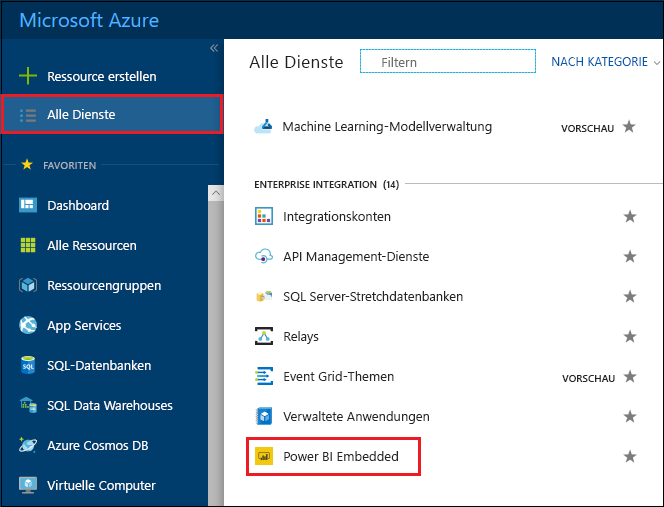
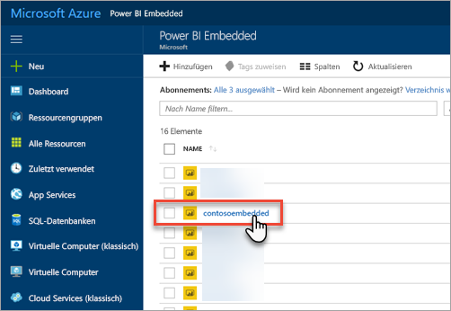
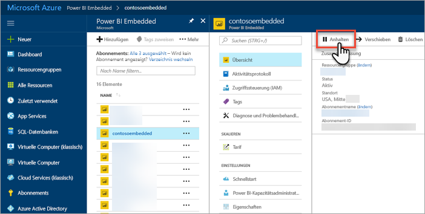
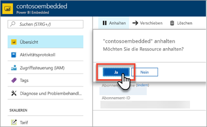
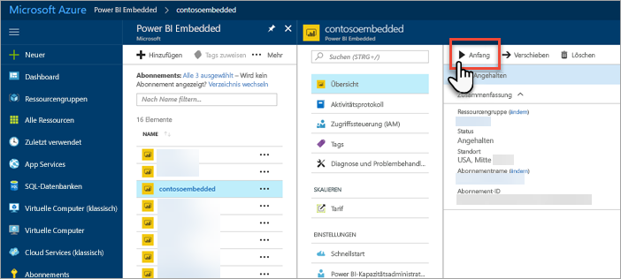
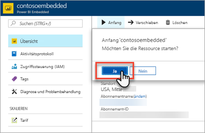

# Anhalten und Starten einer Power BI Embedded-Kapazität im Azure-Portal

In diesem Artikel erfahren Sie, wie Sie eine Power BI Embedded-Kapazität in Microsoft Azure anhalten und starten. Dies setzt voraus, dass Sie eine Power BI Embedded-Kapazität erstellt haben. Wenn das nicht der Fall ist, erfahren Sie mehr darüber unter [Erstellen einer Power BI Embedded-Kapazität im Azure-Portal](azure-pbie-create-capacity.md).

Wenn Sie kein Azure-Abonnement haben, erstellen Sie ein [kostenloses Konto](https://azure.microsoft.com/free/), bevor Sie beginnen.

## Anhalten einer Kapazität

Das Anhalten Ihrer Kapazität verhindert, dass sie berechnet wird. Diese Option ist sehr praktisch, wenn Sie eine Kapazität für eine bestimmte Zeitdauer nicht benötigen. Gehen Sie wie folgt vor, um Ihre Kapazität anzuhalten.

> [!NOTE]
> Wenn Sie eine Kapazität anhalten, sind Inhalte möglicherweise nicht in Power BI verfügbar. Heben Sie unbedingt die Zuweisung von Arbeitsbereichen vor dem Anhalten auf, um Unterbrechungen zu vermeiden.

1. Melden Sie sich beim [Azure-Portal](https://portal.azure.com/) an.

2. Wählen Sie **Alle Dienste** > **Power BI Embedded** aus, um Ihre Kapazitäten anzuzeigen.

    

3. Wählen Sie die Kapazität aus, die Sie anhalten möchten.

    

4. Wählen Sie in den Kapazitätsdetails **Anhalten** aus.

    

5. Wählen Sie **Ja** aus, um zu bestätigen, dass Sie die Kapazität anhalten möchten.

    

## Starten einer Kapazität

Setzen Sie die Nutzung fort, indem Sie Ihre Kapazität starten. Wenn Sie Ihre Kapazität starten, wird diese auch wieder berechnet.

1. Melden Sie sich beim [Azure-Portal](https://portal.azure.com/) an.

2. Wählen Sie **Alle Dienste** > **Power BI Embedded** aus, um Ihre Kapazitäten anzuzeigen.

    

3. Wählen Sie die Kapazität aus, die Sie starten möchten.

    

4. Wählen Sie in den Kapazitätsdetails **Starten** aus.

    

5. Wählen Sie **Ja** aus, um zu bestätigen, dass Sie die Kapazität starten möchten.

    

Ist dieser Kapazität Inhalte zugeordnet sind, stehen diese nach dem Start zur Verfügung.

## Nächste Schritte

Wie Sie eine Kapazität hoch- oder herunterskalieren, erfahren Sie in Artikel [Skalieren einer Power BI Embedded-Kapazität](azure-pbie-scale-capacity.md).

Weitere Informationen zum Einbetten von Power BI-Inhalten in Ihre Anwendung finden Sie unter [Einbetten von Power BI-Berichten, -Dashboards, oder -Kacheln](https://powerbi.microsoft.com/documentation/powerbi-developer-embedding-content/).

Weitere Fragen? [Stellen Sie Ihre Frage in der Power BI-Community.](http://community.powerbi.com/)