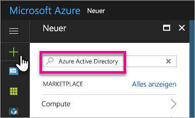
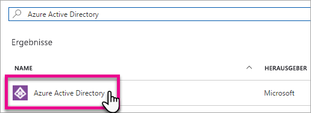
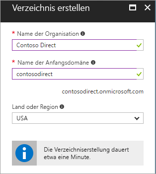
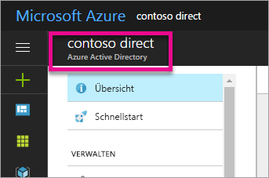
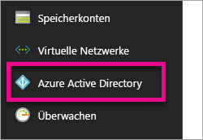
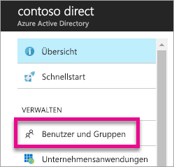
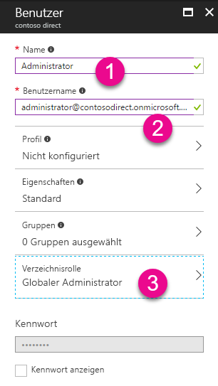
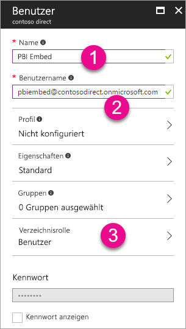
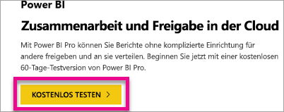

# Erstellen eines Azure Active Directory-Mandanten für Power BI

Erfahren Sie, wie Sie mithilfe der Power BI-REST-APIs einen neuen Azure Active Directory-Mandanten (Azure AD) für die Verwendung mit Ihrer benutzerdefinierten Anwendung erstellen können.

Ein Mandant ist ein Stellvertreter einer Organisation innerhalb von Azure Active Directory. Er stellt eine dedizierte Instanz des Azure AD-Diensts dar. Eine Organisation erhält und besitzt ihn, wenn sie sich für einen Microsoft-Clouddienst wie Azure, Microsoft Intune oder Office 365 registriert. Jeder Azure AD-Mandant ist eigenständig und von anderen Azure AD-Mandanten getrennt.

Wenn Sie sich im Besitz eines Azure AD-Mandanten befinden, können Sie eine Anwendung definieren und ihr Berechtigungen zuweisen, mit denen sie die Power BI-REST-APIs nutzen kann.

Möglicherweise verfügt Ihre Organisation bereits über einen Azure AD-Mandanten, den Sie für Ihre Anwendung nutzen können. Sie können diesen Mandanten für die Zwecke Ihrer Anwendung nutzen oder einen neuen Mandanten speziell für Ihre Anwendung erstellen. Dieser Artikel befasst sich mit dem Erstellen eines neuen Mandanten.

## Erstellen eines Azure Active Directory-Mandanten

Um Power BI in Ihre benutzerdefinierte Anwendung integrieren zu können, müssen Sie eine Anwendung innerhalb von Azure AD definieren. Zu diesem Zweck benötigen Sie ein Verzeichnis in Azure AD. Dies ist Ihr Mandant. Wenn Ihre Organisation noch keinen Mandanten besitzt, weil sie Power BI oder Office 365 nicht verwendet, [müssen Sie einen Mandanten erstellen](https://docs.microsoft.com/azure/active-directory/develop/active-directory-howto-tenant). Möglicherweise müssen Sie einen Mandanten auch dann erstellen, wenn Sie eine Vermischung Ihrer Anwendung mit dem Mandanten Ihrer Organisation verhindern möchten. Dadurch können Sie die Welten getrennt halten.

Es kann auch sinnvoll sein, einen Mandanten für Testzwecke zu erstellen.

Gehen Sie wie folgt vor, um einen neuen Azure AD-Mandanten zu erstellen.

1. Navigieren Sie zum [Azure-Portal](https://portal.azure.com), und melden Sie sich mit einem Konto an, das über ein Azure-Abonnement verfügt.

2. Wählen Sie das **Pluszeichen (+)** aus, und suchen Sie nach *Azure Active Directory*.

    

3. Wählen Sie in den Suchergebnissen **Azure Active Directory** aus.

    

4. Wählen Sie **Erstellen** aus.

5. Geben Sie einen **Namen für die Organisation** zusammen mit einem **anfänglichen Domänennamen** an. Wählen Sie dann **Erstellen** aus. Dadurch wird Ihr Verzeichnis erstellt.

    

   > [!NOTE]
   > Ihre anfängliche Domäne ist ein Teil von onmicrosoft.com. Sie können später weitere Domänennamen hinzufügen. Dem Verzeichnis eines Mandanten können mehrere Domänen zugeordnet sein.

6. Wählen Sie nach dem Abschluss der Erstellung Ihrer Domäne das Informationsfeld aus, um Ihr neues Verzeichnis zu verwalten.

Ihr Verzeichnis wurde nun erstellt. Im nächsten Schritt möchten wir dem Mandanten einen Benutzer hinzufügen.

## Erstellen einiger Benutzer im Azure Active Directory-Mandanten

Da wir jetzt über ein Verzeichnis verfügen, lassen Sie uns mindestens zwei Benutzer erstellen. Einen, der als globaler Administrator für den Mandanten fungiert, und einen weiteren, der Ihren Masterbenutzer beim Einbetten darstellt. Ihn können Sie sich als ein Dienstkonto vorstellen.

1. Stellen Sie im Azure-Portal sicher, dass Sie sich auf der Azure Active Directory-Seitenleiste befinden.

    

    Wenn dies nicht der Fall ist, wählen Sie in der linken Dienstleiste das Azure Active Directory-Symbol aus.

    
2. Wählen Sie unter **Verwalten** das Element **Benutzer und Gruppen** aus.

    
3. Wählen Sie **Alle Benutzer** und dann **+ Neuer Benutzer** aus.
4. Geben Sie einen Namen und einen Benutzernamen für diesen Benutzer ein. Er soll den globalen Administrator für den Mandaten darstellen. Entsprechend ist es sinnvoll, die **Verzeichnisrolle** in *Globaler Administrator* zu ändern. Darüber hinaus können Sie das temporäre Kennwort anzeigen. Wenn Sie fertig sind, wählen Sie **Erstellen** aus.

    

5. Sie sollten in Ihrem Mandanten noch einmal den gleichen Vorgang für einen normalen Benutzer ausführen. Er kann dann auch als Ihr Masterkonto beim Einbetten dienen. Belassen Sie die Einstellung für die **Verzeichnisrolle** diesmal auf *Benutzer*. Achten Sie darauf, das Kennwort zu notieren. Wählen Sie dann **Erstellen** aus.

    
6. Registrieren Sie sich für Power BI mit dem Benutzerkonto, das Sie in Schritt 5 erstellt haben. Dazu können Sie zu [powerbi.com](https://powerbi.microsoft.com/get-started/) navigieren und unter **Power BI – Zusammenarbeit und Freigabe in der Cloud** die Schaltfläche *Kostenlos testen* auswählen.

    

    Bei der Registrierung werden Sie aufgefordert, Power BI Pro 60 Tage lang kostenlos auszuprobieren. Sie können sich dafür entscheiden, um Benutzer der Pro-Edition zu werden. Jetzt können Sie auch mit der Entwicklung einer eingebetteten Lösung beginnen, wenn das Ihre Absicht ist.

   > [!NOTE]
   > Achten Sie darauf, sich mit der E-Mail-Adresse zu registrieren, die Sie für das Benutzerkonto angegeben haben.

## Nächste Schritte

Da Sie jetzt über einen Azure AD-Mandanten verfügen, können Sie diesen Mandanten verwenden, um Elemente innerhalb von Power BI zu testen und/oder einen Schritt weitergehen, um Power BI-Dashboards und -Berichte in Ihre Anwendung einzubetten. Weitere Informationen zum Einbetten von Elementen finden Sie unter [Einbetten von Power BI-Dashboards, Berichten und Kacheln](embedding-content.md).

[Was ist ein Azure AD-Verzeichnis?](https://docs.microsoft.com/azure/active-directory/active-directory-whatis)  
[Einrichten eines Azure Active Directory-Mandanten](https://docs.microsoft.com/azure/active-directory/develop/active-directory-howto-tenant)  

Weitere Fragen? [Stellen Sie Ihre Frage in der Power BI-Community.](http://community.powerbi.com/)
