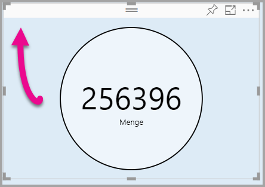

# <a name="tutorial-adding-formatting-options-to-a-power-bi-custom-visual"></a>Tutorial: Hinzufügen von Formatierungsoptionen zu einem benutzerdefinierten Power BI-Visual

Dieses Tutorial erläutert die genaue Vorgehensweise beim Hinzufügen allgemeiner Eigenschaften zu einem Visual.

In diesem Tutorial erhalten Sie Informationen zu den folgenden Vorgängen:
> [!div class="checklist"]
> * Hinzufügen von Visualeigenschaften
> * Verpacken von Visuals
> * Importieren des benutzerdefinierten Visuals in einen Power BI Desktop-Bericht

## <a name="adding-formatting-options"></a>Hinzufügen von Formatierungsoptionen

1. Wählen Sie in **Power BI** die **Seite zum Formatieren** aus.

    Daraufhin wird diese Meldung angezeigt: *Für diese Darstellung stehen keine Formatierungsoptionen zur Verfügung.*

    

2. Öffnen Sie in **Visual Studio Code** die Datei *capabilities.json*.

3. Fügen Sie vor dem Array **dataViewMappings** **objects** hinzu (nach Zeile 8).

    ```json
    "objects": {},
    ```
    

4. Speichern Sie die Datei **capabilities.json**.

5. Überprüfen Sie in **Power BI** die Formatierungsoptionen noch einmal.

    > [!Note]
    > Wenn die Formatierungsoptionen nicht geändert werden, wählen Sie **Benutzerdefiniertes Visual erneut laden** aus.

    

6. Legen Sie die Option **Titel** auf *Aus* fest. Das Visual zeigt den Measurenamen nicht mehr links oben an.

    

    

### <a name="adding-custom-formatting-options"></a>Hinzufügen von benutzerdefinierten Formatierungsoptionen

Sie können benutzerdefinierte Eigenschaften hinzufügen, um die Farbe des Kreises und auch die Rahmenbreite zu konfigurieren.

1. Beenden Sie das benutzerdefinierte Visual in PowerShell.

2. Fügen Sie in Visual Studio Code in der Datei **capabilities.json** das folgende JSON-Fragment in das Objekt mit der Bezeichnung **objects** ein.

    ```json
    "circle": {
     "displayName": "Circle",
     "properties": {
         "circleColor": {
             "displayName": "Color",
             "description": "The fill color of the circle.",
             "type": {
                 "fill": {
                     "solid": {
                         "color": true
                     }
                 }
             }
         },
         "circleThickness": {
             "displayName": "Thickness",
             "description": "The circle thickness.",
             "type": {
                 "numeric": true
                 }
             }
         }
     },
    ```

    Das JSON-Fragment beschreibt eine Gruppe namens „circle“ (Kreis), die aus zwei Optionen besteht: „circleColor“ und „circleThickness“.

   

3. Speichern Sie die Datei **capabilities.json**.

4. Wählen Sie im Bereich **Explorer** im Ordner **src** **settings.ts** aus. *Diese Datei enthält die Einstellungen für das erste Visual.*

5. Ersetzen Sie in der Datei **settings.ts** die beiden Klassen durch den folgenden Code.

    ```typescript
    export class CircleSettings {
     public circleColor: string = "white";
     public circleThickness: number = 2;
    }
    export class VisualSettings extends DataViewObjectsParser {
     public circle: CircleSettings = new CircleSettings();
    }
    ```

    

    Dieses Modul definiert die beiden Klassen. Die Klasse **CircleSettings** definiert zwei Eigenschaften mit Namen, die mit den in der Datei **capabilities.json** (**circleColor** und **circleThickness**) definierten Objekten übereinstimmen, und legt außerdem die Standardwerte fest. Die Klasse **VisualSettings** erbt die Klasse **DataViewObjectParser** und fügt eine Eigenschaft namens **circle** hinzu, die dem in der Datei *capabilities.json* definierten Objekt entspricht, und gibt eine Instanz von **CircleSettings** zurück.

6. Speichern Sie die Datei **settings.ts**.

7. Öffnen Sie die Datei **visual.ts**.

8. Fügen Sie in der Klasse **Visual** die folgende Eigenschaft hinzu.

    ```typescript
    private visualSettings: VisualSettings;
    ```
    Diese Eigenschaft speichert einen Verweis auf das Objekt **VisualSettings**, das die Einstellungen des Visuals beschreibt.

    

9. Fügen Sie in der Klasse **Visual** die folgende Methode vor der Methode **update** hinzu. Mit dieser Methode werden die Formatierungsoptionen aufgefüllt.

    ```typescript
    public enumerateObjectInstances(options: EnumerateVisualObjectInstancesOptions): VisualObjectInstanceEnumeration {
     const settings: VisualSettings = this.visualSettings ||
    VisualSettings.getDefault() as VisualSettings;
     return VisualSettings.enumerateObjectInstances(settings, options);
    }
    ```
    Mit dieser Methode werden die Formatierungsoptionen aufgefüllt.

    

10. Fügen Sie in der Methode **update** nach der Deklaration der Variablen **radius** den folgenden Code hinzu.

    ```typescript
    this.visualSettings = VisualSettings.parse<VisualSettings>(dataView);

    this.visualSettings.circle.circleThickness = Math.max(0, this.visualSettings.circle.circleThickness);

    this.visualSettings.circle.circleThickness = Math.min(10, this.visualSettings.circle.circleThickness);
    ```
    Dieser Code ruft die Formatierungsoptionen ab. Er passt jeden Wert an, der an die **circleThickness**-Eigenschaft übergeben wird, und wandelt ihn in „0“ um, wenn er negativ ist, bzw. in „10“, wenn er größer als 10 ist.

    

11. Ändern Sie für das **Kreiselement** den an das **Füllformat** übergebenen Wert in den folgenden Ausdruck.

    ```typescript
    this.visualSettings.circle.circleColor
    ```

    

12. Ändern Sie für das **Kreiselement** den an die **Strichstärke** übergebenen Wert in den folgenden Ausdruck.

    ```typescript
    this.visualSettings.circle.circleThickness
    ```

    

13. Speichern Sie die „visual.ts“-Datei.

14. Starten Sie das Visual in PowerShell.

    ```powershell
    pbiviz start
    ```

15. Wählen Sie in **Power BI** in der Symbolleiste über dem Visual **Automatisches erneutes Laden aktivieren/deaktivieren** aus.

16. Erweitern Sie in den Optionen für die **Visualformatierung** die Option **Kreis**.

    

    Ändern Sie die Optionen **Farbe** und **Stärke**.

    Ändern Sie die Option **Stärke** in einen Wert kleiner als 0 und einen Wert größer als 10. Daraufhin können Sie sehen, dass das Visual den Wert auf ein tolerierbares Minimum oder Maximum aktualisiert.

## <a name="packaging-the-custom-visual"></a>Verpacken des benutzerdefinierten Visuals

Geben Sie Eigenschaftswerte für das benutzerdefinierte Visual ein, aktualisieren Sie die Symboldatei, und verpacken Sie das benutzerdefinierte Visual.

1. Beenden Sie das benutzerdefinierte Visual in **PowerShell**.

2. Öffnen Sie die Datei **pbiviz.json** in **Visual Studio Code**.

3. Ändern Sie im Objekt **visual** die Eigenschaft **displayName** in *Circle Card*.

    Wenn Sie im Bereich **Visualisierungen** mit der Maus auf das Symbol zeigen, erscheint der Anzeigename.

    

4. Geben Sie für die Eigenschaft **description** den folgenden Text ein.

    *Zeigt einen formatierten Measurewert in einem Kreis an.*

5. Optional können Sie im Objekt **author** Ihre Angaben eingeben.

6. Speichern Sie die Datei **pbiviz.json**.

7. Achten Sie im Objekt **assets** darauf, dass das Dokument einen Pfad zu einem Symbol definiert. Das Symbol ist das Bild, das im Bereich **_Visualisierungen_** angezeigt wird. Es muss eine **PNG**-Datei mit den Maßen *20 Pixel x 20 Pixel* sein.

8. Kopieren Sie im Windows-Explorer die Datei „icon.png“, und fügen Sie sie ein, um die Standarddatei im Ordner „assets“ zu ersetzen.

9. Erweitern Sie in Visual Studio Code im Bereich „Explorer“ den Ordner „assets“, und wählen Sie dann die Datei „icon.png“ aus.

10. Überprüfen Sie das Symbol.

    

11. Überprüfen Sie in Visual Studio Code, ob alle Dateien gespeichert sind.

12. Geben Sie in PowerShell den folgenden Befehl ein, um das benutzerdefinierte Visual zu verpacken.

    ```powershell
    pbiviz package
    ```

    

Nun wird das Paket in den Projektordner **dist** ausgegeben. Das Paket erfüllt alle Voraussetzungen, damit das benutzerdefinierte Visual in den Power BI-Dienst oder in einen Power BI Desktop-Bericht importiert werden kann. Sie haben das benutzerdefinierte Visual verpackt, und nun kann es verwendet werden.

## <a name="importing-the-custom-visual"></a>Importieren des benutzerdefinierten Visuals

Jetzt können Sie den Power BI Desktop-Bericht öffnen und das benutzerdefinierte Visual „Circle Card“ importieren.

1. Öffnen Sie **Power BI Desktop**, und erstellen Sie einen neuen Bericht mit einem beliebigen *Beispieldataset*.

2. Wählen Sie im Bereich **_Visualisierungen_** die **Auslassungspunkte** und dann **Aus Datei importieren** aus.

    

3. Wählen Sie im **Importfenster** **Importieren** aus.

4. Navigieren Sie im Fenster „Öffnen“ zum Ordner **dist** in Ihrem Projektverzeichnis.

5. Wählen Sie die Datei **circleCard.pbiviz** und dann **Öffnen** aus.

6. Wenn das Visual erfolgreich importiert wurde, wählen Sie **OK** aus.

7. Überprüfen Sie, ob das Visual dem Bereich **_Visualisierungen_** hinzugefügt wurde.

    

8. Zeigen Sie mit der Maus auf das Symbol **Circle Card**. Dabei wir eine QuickInfo angezeigt.

## <a name="debugging"></a>Debuggen

Tipps zum Debuggen von benutzerdefinierten Visualisierungen finden Sie im [Debug-Handbuch](https://microsoft.github.io/PowerBI-visuals/docs/how-to-guide/how-to-debug/).

## <a name="next-steps"></a>Nächste Schritte

Sie können Ihr neu entwickeltes Visual auflisten, sodass andere Personen dieses verwenden können, indem Sie es zu **AppSource** übermitteln. Weitere Informationen zu diesem Vorgang finden Sie im Artikel zum [Veröffentlichen benutzerdefinierter Visuals in AppSource](office-store.md).