# <a name="tutorial-developing-a-power-bi-custom-visual"></a>Tutorial: Entwickeln eines benutzerdefinierten Visuals für Power BI

Wir machen es für Entwickler einfach, ihre benutzerdefinierten Visuals in Power BI hinzuzufügen, um diese in Dashboards und Berichten zu verwenden. Wir haben den Code für alle unsere Visualisierungen auf GitHub veröffentlicht, um Ihnen den Einstieg zu erleichtern.

Zusammen mit dem Visualisierungsframework haben wir unsere Testsammlung und Tools bereitgestellt, damit die Community qualitativ hochwertige benutzerdefinierte Visuals für Power BI erstellen kann.

In diesem Tutorial erfahren Sie, wie Sie ein benutzerdefiniertes Visual für Power BI mit der Bezeichnung „Circle Card“ entwickeln, um einen formatierten Kennzahlenwert in einem Kreis anzuzeigen. Das Visual „Circle Card“ unterstützt die Anpassung der Füllfarbe und der Stärke der Kontur.

Im Power BI Desktop-Bericht werden die Karten in Circle Cards umgewandelt.

  

In diesem Tutorial erhalten Sie Informationen zu den folgenden Vorgängen:
> [!div class="checklist"]
> * Erstellen eines benutzerdefinierten Visuals für Power BI.
> * Entwickeln eines benutzerdefinierten Visuals mit visuellen D3-Elementen.
> * Konfigurieren einer Datenbindung mit den visuellen Elementen.
> * Formatieren von Datenwerten.

## <a name="prerequisites"></a>Voraussetzungen

* Wenn Sie noch nicht bei **Power BI Pro** registriert sind, [registrieren Sie sich für eine kostenlose Testversion](https://powerbi.microsoft.com/pricing/), bevor Sie beginnen.
* Sie müssen [Visual Studio Code](https://www.visualstudio.com/) installieren.
* Die benötigen die [Windows PowerShell](https://docs.microsoft.com/powershell/scripting/setup/installing-windows-powershell?view=powershell-6)-Version 4 oder höher für Windows-Benutzer ODER das [Terminal](https://macpaw.com/how-to/use-terminal-on-mac) für OSX-Benutzer.

## <a name="setting-up-the-developer-environment"></a>Einrichten der Entwicklerumgebung

Zusätzlich zu den Voraussetzungen gibt es einige weitere Tools, die Sie installieren müssen.

### <a name="installing-nodejs"></a>Installieren von node.js

1. Zum Installieren von Node.js navigieren Sie in einem Webbrowser zu [Node.js](https://nodejs.org).

2. Laden Sie das aktuellste MSI-Installationsprogramm herunter.

3. Führen Sie das Installationsprogramm aus, und befolgen Sie dann die Installationsschritte. Stimmen Sie den Bedingungen des Lizenzvertrags zu und übernehmen Sie alle Standardwerte.

   

4. Starten Sie den Computer neu.

### <a name="installing-packages"></a>Installieren von Paketen

Jetzt müssen Sie das **pbiviz**-Paket installieren.

1. Öffnen Sie nach dem Neustart des Computers Windows PowerShell.

2. Geben Sie zum Installieren von pbiviz den folgenden Befehl ein.

    ```powershell
    npm i -g powerbi-visuals-tools
    ```

### <a name="creating-and-installing-a-certificate"></a>Erstellen und Installieren eines Zertifikats

#### <a name="windows"></a>Windows

1. Geben Sie zum Erstellen eines Zertifikats den folgenden Befehl ein.

    ```powershell
    pbiviz --create-cert
    ```

  Als Ergebnis wird eine *Passphrase* zurückgegeben. In diesem Fall lautet die *Passphrase* **_15105661266553327_**.

  

2. Jetzt müssen wir das Zertifikat installieren. Geben Sie zum Installieren des Zertifikats den folgenden Befehl ein.

    ```powershell
    pbiviz --install-cert
    ```

3. Überprüfen Sie im Assistenten für den Zertifikatsimport, ob der Speicherort auf „Aktueller Benutzer“ eingestellt ist. Wählen Sie dann *Weiter*aus.

      

4. Wählen Sie im Schritt **Zu importierende Datei** *Weiter* aus.

5. Fügen Sie im Schritt **Privater Schlüsselschutz** im Feld „Passwort“ die Passphrase ein, die Sie beim Erstellen des Zertifikats erhalten haben.  In diesem Fall wieder **_15105661266553327_**.

      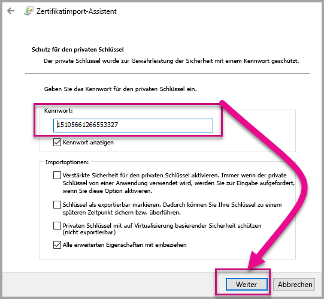

6. Wählen Sie im Schritt **Zertifikatspeicher** die Option **AAlle Zertifikate in folgendem Speicher speichern**. Wählen Sie anschließend *Durchsuchen*.

      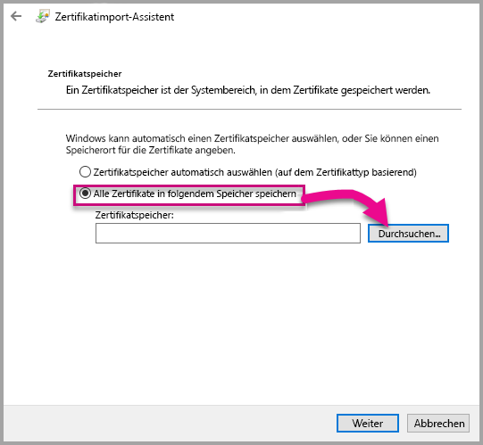

7. Wählen Sie im Fenster **Zertifikatspeicher auswählen** **Vertrauenswürdige Stammzertifizierungsstellen** und dann *OK* aus. Wählen Sie dann im Bildschirm *Zertifikatspeicher* **Weiter**.

      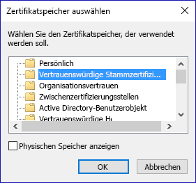

8. Um den Import abzuschließen, wählen Sie **Fertig stellen** aus.

9. Wenn eine Sicherheitswarnung angezeigt wird, wählen Sie **Ja** aus.

    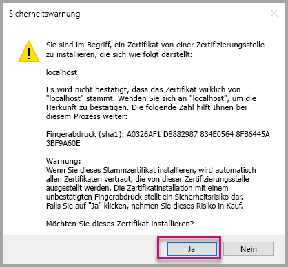

10. Wenn Sie benachrichtigt werden, dass der Import erfolgreich war, wählen Sie **OK** aus.

    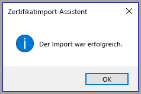

> [!Important]
> Schließen Sie die Windows PowerShell-Sitzung nicht.

#### <a name="osx"></a>OS X

1. Wenn das Schloss in der oberen linken Ecke verriegelt angezeigt wird, wählen sie es zum Entsperren aus. Suchen Sie nach *localhost*, und doppelklicken Sie auf das Zertifikat.

    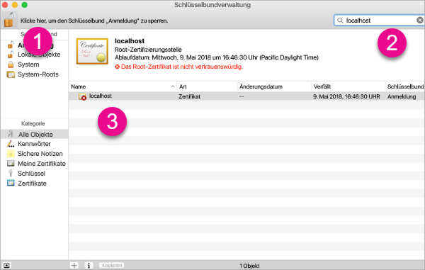

2. Wählen Sie **Immer vertrauen** aus, und schließen Sie das Fenster.

    

3. Geben Sie Ihren Benutzernamen und das Kennwort ein. Wählen Sie **Einstellungen aktualisieren** aus.

    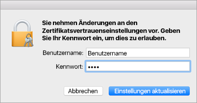

4. Schließen Sie alle geöffneten Browser.

> [!NOTE]
> Wenn das Zertifikat nicht erkannt wird, müssen Sie möglicherweise den Computer neu starten.

## <a name="creating-a-custom-visual"></a>Erstellen eines benutzerdefinierten Visuals

Nachdem Sie Ihre Umgebung eingerichtet haben, können wir nun Ihr benutzerdefiniertes Visual erstellen.

Sie können den vollständigen Quellcode für dieses Tutorial [herunterladen](https://github.com/Microsoft/PowerBI-visuals-circlecard).

1. Überprüfen Sie, ob das die Power BI-Tools-Paket für Visuals installiert wurde.

    ```powershell
    pbiviz
    ```
    Die Hilfeausgabe sollte angezeigt werden.

    <pre><code>
        +syyso+/
    oms/+osyhdhyso/
    ym/       /+oshddhys+/
    ym/              /+oyhddhyo+/
    ym/                     /osyhdho
    ym/                           sm+
    ym/               yddy        om+
    ym/         shho /mmmm/       om+
        /    oys/ +mmmm /mmmm/       om+
    oso  ommmh +mmmm /mmmm/       om+
    ymmmy smmmh +mmmm /mmmm/       om+
    ymmmy smmmh +mmmm /mmmm/       om+
    ymmmy smmmh +mmmm /mmmm/       om+
    +dmd+ smmmh +mmmm /mmmm/       om+
            /hmdo +mmmm /mmmm/ /so+//ym/
                /dmmh /mmmm/ /osyhhy/
                    //   dmmd
                        ++

        PowerBI Custom Visual Tool

    Usage: pbiviz [options] [command]

    Commands:

    new [name]        Create a new visual
    info              Display info about the current visual
    start             Start the current visual
    package           Package the current visual into a pbiviz file
    update [version]  Updates the api definitions and schemas in the current visual. Changes the version if specified
    help [cmd]        display help for [cmd]

    Options:

    -h, --help      output usage information
    -V, --version   output the version number
    --install-cert  Install localhost certificate
    </code></pre>

    <a name="ssl-setup"></a>

2. Überprüfen Sie die Ausgabe, einschließlich der Liste der unterstützten Befehle.

     

3. Geben Sie zum Erstellen eines benutzerdefiniertes Visualprojekts den folgenden Befehl ein. Der Name des Projekts ist **CircleCard**.

    ```PowerShell
    pbiviz new CircleCard
    ```
    

4. Navigieren Sie zum Projektordner.

    ```powershell
    cd CircleCard
    ```
5. Starten Sie das benutzerdefinierte Visual. Ihr CircleCard-Visual wird nun ausgeführt und wird auf Ihrem Computer gehostet.

    ```powershell
    pbiviz start
    ```

    

> [!Important]
> Schließen Sie die Windows PowerShell-Sitzung nicht.

### <a name="testing-the-custom-visual"></a>Testen des benutzerdefinierten Visuals

In diesem Abschnitt werden wir das benutzerdefinierte CircleCard-Visual testen, indem wir einen Power BI Desktop-Bericht hochladen und dann den Bericht bearbeiten, um das benutzerdefinierte Visual anzuzeigen.

1. Melden Sie sich auf [Powerbi.com](https://powerbi.microsoft.com/) an > wechseln Sie zum **Zahnradsymbol** >, und wählen Sie dann **Einstellungen**.

      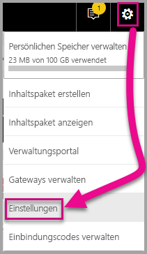

2. Wählen Sie **Entwickler** und aktivieren Sie das Kontrollkästchen **Visuelles Entwicklerelement zum Testen aktivieren** aus.

    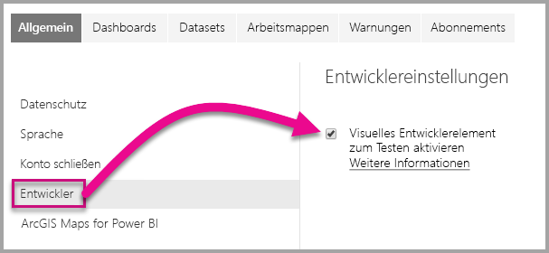

3. Laden Sie einen Power BI Desktop-Bericht hoch.  

    Daten abrufen > Dateien > Lokale Datei.

    Sie können einen Power BI Desktop-Beispielbericht [herunterladen](https://microsoft.github.io/PowerBI-visuals/docs/step-by-step-lab/images/US_Sales_Analysis.pbix), wenn Sie noch keinen erstellt haben.

    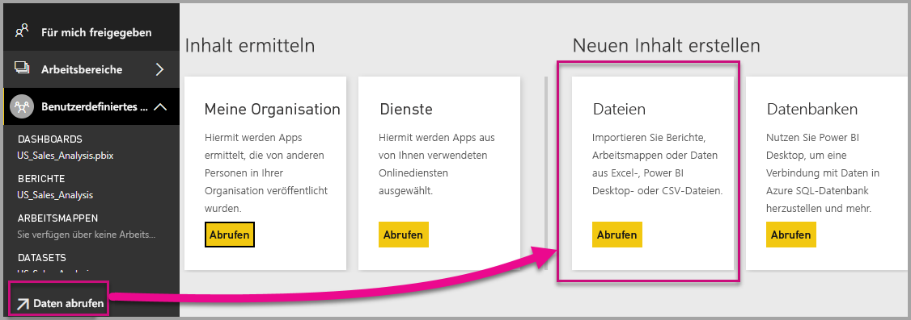 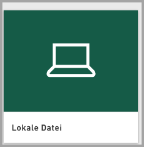

    Um den Bericht anzuzeigen, wählen Sie **US_Sales_Analysis** im Abschnitt **Bericht** im linken Navigationsbereich.

    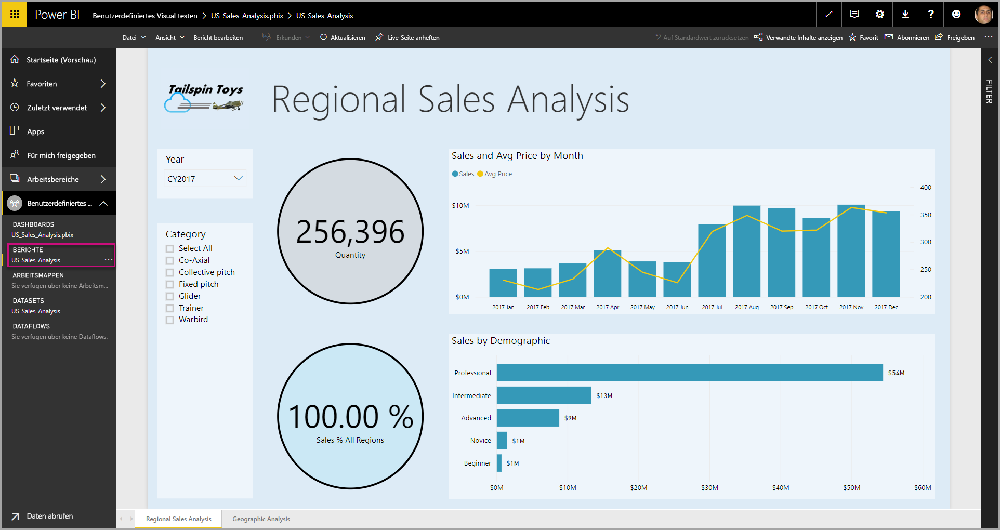

4. Jetzt müssen Sie den Bericht im Power BI-Dienst bearbeiten.

    Rufen Sie **Bericht bearbeiten** auf.

    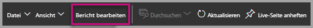

5. Wählen Sie **Visuelles Entwicklerelement** im Bereich **Visualisierung** aus.

    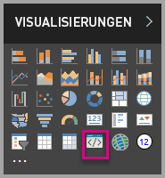

    > [!Note]
    > Diese Visualisierung stellt das benutzerdefinierte Visual dar, das Sie auf Ihrem Computer begonnen haben. Es ist nur verfügbar, wenn die Entwicklereinstellungen aktiviert wurden.

6. Beachten Sie, dass eine Visualisierung in der Berichtscanvas hinzugefügt wurde.

    

    > [!Note]
    > Dies ist ein sehr einfaches Visual, das anzeigt, wie oft seine Updatemethode aufgerufen wurde. In dieser Phase ruft das Visual noch keine Daten ab.

7. Wenn Sie das neue Visual im Bericht auswählen, navigieren Sie zum Bereich „Felder“ > erweitern Sie „Vertrieb“ > wählen Sie „Menge“.

    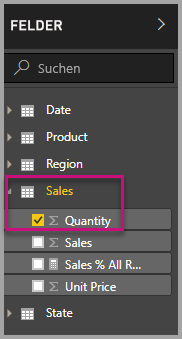

8. Um dann das neue Visual zu testen, ändern Sie die Größe des Visuals und beachten Sie die Erhöhungen des Aktualisierungswerts.

    

Um das benutzerdefinierte Visual in PowerShell anzuhalten, geben Sie Strg+C ein. Wenn Sie dazu aufgefordert werden, den Batchauftrag zu beenden, geben Sie „J“ ein, und drücken Sie die EINGABETASTE.

## <a name="adding-visual-elements"></a>Hinzufügen von visuellen Elementen

Jetzt müssen Sie die **D3-JavaScript-Bibliothek** installieren. D3 ist eine JavaScript-Bibliothek für die Erstellung dynamischer, interaktiver Datenvisualisierungen in Webbrowsern. Dabei werden die weitverbreiteten SVG HTML5- und CSS-Standards verwendet.

Jetzt können Sie das benutzerdefinierte Visual so entwickeln, dass ein Kreis mit Text angezeigt wird.

> [!Note]
> Viele Texteinträge in diesem Tutorial können [hier](https://github.com/uve/circlecard) kopiert werden.

1. Geben Sie zum Installieren der **D3-Bibliothek** in PowerShell den folgenden Befehl ein.

    ```powershell
    npm i d3@3.5.5 --save
    ```

    

2. Geben Sie zum Installieren von Typdefinitionen für die **D3-Bibiliothek** den folgenden Befehl ein.

    ```powershell
    npm i @types/d3@3.5
    ```

    

    Mit diesem Befehl werden TypeScript-Definitionen auf der Grundlage von JavaScript-Dateien installiert, sodass Sie das benutzerdefinierte Visual in TypeScript (das eine Obermenge von JavaScript ist) entwickeln können. Visual Studio Code ist die ideale IDE zum Entwickeln von TypeScript-Anwendungen.

3. Starten Sie [Visual Studio Code](https://code.visualstudio.com/).

    Mit dem folgenden Befehl können Sie **Visual Studio Code** über PowerShell starten.

    ```powershell
    code .
    ```

4. Erweitern Sie im **Explorerbereich** den Ordner **node_modules**, um zu überprüfen, ob die **D3-Bibliothek** installiert wurde.

    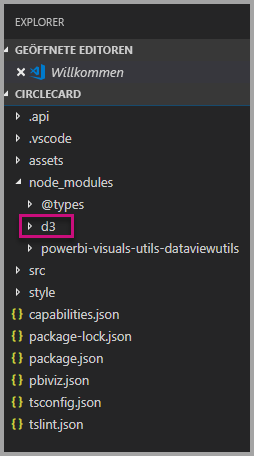

5. Beachten Sie die TypeScript-Datei, **index.d.ts**, indem Sie „node_modules“ > @types > D3 im **Explorerbereich** erweitern.

    

6. Wählen Sie die Datei **pbiviz.json** aus.

7. Geben Sie zum Registrieren der **D3-Bibliothek** den folgenden Dateiverweis in das externalJS-Array ein. Achten Sie darauf, dass Sie zwischen dem vorhandenen und dem neue Dateiverweis ein *Komma* einfügen.

    ```javascript
    "node_modules/d3/d3.min.js"
    ```
    

8. Speichern Sie die Änderungen an der Datei **pbiviz.json**.

### <a name="developing-the-visual-elements"></a>Entwickeln der visuellen Elemente

Jetzt können wir uns ansehen, wie wir das benutzerdefinierte Visual entwickeln können, um einen Kreis und Beispieltext anzuzeigen.

1. Erweitern Sie im **Explorerbereich** den Ordner **src**, und wählen Sie **visual.ts** aus.

    > [!Note]
    > Beachten Sie die Kommentare am oberen Rand der Datei **visual.ts**. Die Berechtigung zur Nutzung der Pakete für benutzerdefinierten Visuals in Power BI wird unter den Bedingungen der MIT-Lizenz kostenlos erteilt. Als Teil der Vereinbarung müssen Sie die Kommentare im oberen Bereich der Datei beibehalten.

2. Entfernen Sie die folgende Logik für das benutzerdefinierte Visual aus der Visual-Klasse.
    * Die vier privaten Variablendeklarationen auf Klassenebene.
    * Alle Codezeilen aus dem Konstruktor.
    * Alle Codezeilen aus der Updatemethode.
    * Alle verbleibenden Zeilen innerhalb des Moduls, einschließlich der parseSettings- und enumerateObjectInstances-Methoden.

    Stellen Sie sicher, dass der Modulcode wie folgt aussieht.

    ```typescript
    module powerbi.extensibility.visual {
    "use strict";
    export class Visual implements IVisual {

        constructor(options: VisualConstructorOptions) {

        }

        public update(options: VisualUpdateOptions) {

            }
        }
    }
    ```

3. Fügen Sie unter der *Visual*-Klassendeklaration die folgenden Eigenschaften auf Klassenebene ein.

    ```typescript
     private host: IVisualHost;
     private svg: d3.Selection<SVGElement>;
     private container: d3.Selection<SVGElement>;
     private circle: d3.Selection<SVGElement>;
     private textValue: d3.Selection<SVGElement>;
     private textLabel: d3.Selection<SVGElement>; 
    ```

    

4. Fügen Sie den folgenden Code zum *Konstruktor* hinzu.

    ```typescript
    this.svg = d3.select(options.element)
                 .append('svg')
                 .classed('circleCard', true);
    this.container = this.svg.append("g")
                         .classed('container', true);
    this.circle = this.container.append("circle")
                             .classed('circle', true);
    this.textValue = this.container.append("text")
                                 .classed("textValue", true);
    this.textLabel = this.container.append("text")
                                 .classed("textLabel", true);
    ```

    Dieser Code fügt eine SVG-Gruppe innerhalb des Visuals hinzu und fügt dann drei Formen hinzu: einen Kreis und zwei Textelemente.

    Um den Code im Dokument zu formatieren, wählen Sie mit der rechten Maustaste eine beliebige Stelle im **Visual Studio Code-Dokument**, und wählen Sie dann **Dokument formatieren**.

      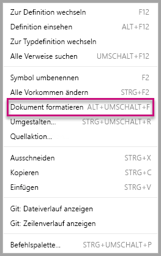

    Um die Lesbarkeit zu verbessern, wird empfohlen, dass Sie das Dokument jedes Mal formatieren, wenn Sie Codeausschnitte einfügen.

5. Fügen Sie den folgenden Code zur *Updatemethode* hinzu.

    ```typescript
    let width: number = options.viewport.width;
    let height: number = options.viewport.height;
    this.svg.attr({
     width: width,
     height: height
    });
    let radius: number = Math.min(width, height) / 2.2;
    this.circle
     .style("fill", "white")
     .style("fill-opacity", 0.5)
     .style("stroke", "black")
     .style("stroke-width", 2)
    .attr({
     r: radius,
     cx: width / 2,
     cy: height / 2
    });
    let fontSizeValue: number = Math.min(width, height) / 5;
    this.textValue
     .text("Value")
     .attr({
         x: "50%",
         y: "50%",
         dy: "0.35em",
         "text-anchor": "middle"
     }).style("font-size", fontSizeValue + "px");
    let fontSizeLabel: number = fontSizeValue / 4;
    this.textLabel
     .text("Label")
     .attr({
         x: "50%",
         y: height / 2,
         dy: fontSizeValue / 1.2,
         "text-anchor": "middle"
     })
     .style("font-size", fontSizeLabel + "px");
    ```

    *Dieser Code legt die Breite und Höhe des Visuals fest und initialisiert dann die Attribute und Stile der visuellen Elemente.*

6. Speichern Sie die Datei **visual.ts**.

7. Wählen Sie die Datei **capabilities.json** aus.

    Entfernen Sie in Zeile 14 das gesamte Objektelement (Zeilen 14-60).

8. Speichern Sie die Datei **capabilities.json**.

9. Starten Sie das benutzerdefinierte Visual in PowerShell.

    ```powershell
    pbiviz
    ```

### <a name="toggle-auto-reload"></a>Automatisches erneutes Laden aktivieren/deaktivieren

1. Navigieren Sie zurück zum Power BI-Bericht.
2. Wählen Sie in der Symbolleiste über dem visuellen Entwicklerelement **Automatisches erneutes Laden aktivieren/deaktivieren** aus.

    

    Diese Option stellt sicher, dass das Visual bei jedem Speichern von Projektänderungen automatisch neu geladen wird.

3. Ziehen Sie die Option **Menge** aus dem **Bereich „Felder“** in das visuelle Entwicklerelement.

4. Stellen Sie sicher, dass das Visual wie folgt aussieht.

    

5. Ändern Sie Größe des Visuals.

    Beachten Sie, dass sich der Kreis- und Textwert an die verfügbare Dimension des Visuals anpasst.

    Die Updatemethode wird kontinuierlich mit der Größenänderung des Visuals aufgerufen, und sie führt zur flüssigen Skalierung der visuellen Elemente.

    Sie haben nun die visuellen Elemente entwickelt.

6. Führen Sie das Visual weiter aus.

## <a name="configuring-data-binding"></a>Konfigurieren der Datenbindung

Definieren Sie die Datenrollen und Datenansichtsmappings, und ändern Sie dann die Logik des benutzerdefinierten Visuals, um den Wert und den Anzeigenamen einer Kennzahl anzuzeigen.

### <a name="configuring-the-capabilities"></a>Konfigurieren von Funktionen

Ändern Sie die Datei **capabilities.json**, um die Datenrollen- und Datenansichtsmappings zu definieren.

1. Entfernen Sie in Visual Studio Code in der Datei **capabilities.json** aus dem Array **dataRoles** alle Inhalte (Zeilen 3-12).

2. Fügen Sie im Array **dataRoles** den folgenden Code ein.

    ```json
    {
     "displayName": "Measure",
     "name": "measure",
     "kind": "Measure"
    }
    ```
    Das Array **dataRoles** definiert nun eine einzelne Rolle vom Typ **measure**, d.h. mit dem Namen **measure** und zeigt sie als **measure** an. Diese Datenrolle ermöglicht die Übergabe entweder eines Kennzahlfeldes oder eines zusammenfassenden Feldes.

3. Entfernen Sie im Array **dataViewMappings** alle Inhalte (Zeilen 10-31).

4. Fügen Sie im Array **dataViewMappings** den folgenden Inhalt ein.

    ```json
            {
            "conditions": [
                { "measure": { "max": 1 } }
            ],
            "single": {
                "role": "measure"
            }
           }
    ```
    Das Array **dataViewMappings** definiert jetzt ein Feld, das an die Datenrolle mit der Bezeichnung **measure** übergeben werden kann.

5. Speichern Sie die Datei **capabilities.json**.

6. Beachten Sie, dass das Visual jetzt in Power BI mit einer **Kennzahl** konfiguriert werden kann.

    

    > [!Note]
    > Das Visualprojekt enthält noch keine Datenbindungslogik.

### <a name="exploring-the-dataview"></a>Untersuchen der Datenansicht

1. Wählen Sie in der Symbolleiste über dem Visual **Datenansicht anzeigen**.

    

2. Erweitern Sie die Ansicht bis zum Wert **Einzeln**, und notieren Sie den Wert.

    

3. Expandieren Sie nach unten bis **metadata** und dann bis zum Array **columns**, und beachten Sie dabei insbesondere die Werte **format** und **displayName**.

    

4. Um zum Visual zurückzukehren, wählen Sie in der Symbolleiste über dem Visual **Datenansicht anzeigen**.

    

### <a name="configuring-data-binding"></a>Konfigurieren der Datenbindung

1. Fügen Sie in **Visual Studio Code** in der Datei **visual.ts** die folgende Anweisung als erste Anweisung der Updatemethode hinzu.

    ```typescript
    let dataView: DataView = options.dataViews[0];
    ```
    

    Diese Anweisung weist *dataView* einer Variablen für einen einfachen Zugriff zu und deklariert die Variable, um auf das Objekt *dataView* zu verweisen.

2. Ersetzen Sie „.text(“Value”)**“ in der **Updatemethode** durch folgenden Eingabe.

    ```typescript
    .text(dataView.single.value as string)
    ```
    

3. Ersetzen Sie **.text(“Label”)** in der **Updatemethode** durch folgenden Eingabe.

    ```typescript
    .text(dataView.metadata.columns[0].displayName)
    ```
    

4. Speichern Sie die Datei **visual.ts**.

5. Überprüfen Sie in **Power BI** das Visual, das nun den Wert und den Anzeigenamen anzeigt.

Sie haben nun die Datenrollen konfiguriert und das Visual an die Datenansicht gebunden.

Im nächsten Tutorial erfahren Sie, wie Sie dem benutzerdefinierten Visual Formatierungsoptionen hinzufügen können.

## <a name="debugging"></a>Debuggen

Tipps zum Debuggen von benutzerdefinierten Visualisierungen finden Sie im [Debug-Handbuch](https://microsoft.github.io/PowerBI-visuals/docs/how-to-guide/how-to-debug/).

## <a name="next-steps"></a>Nächste Schritte

> [!div class="nextstepaction"]
> [Hinzufügen von Formatierungsoptionen](custom-visual-develop-tutorial-format-options.md)