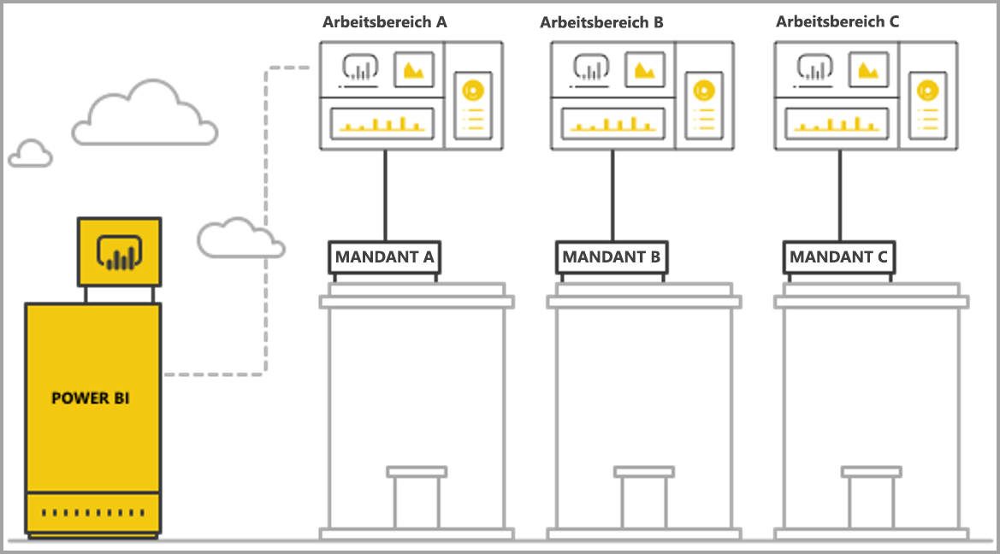
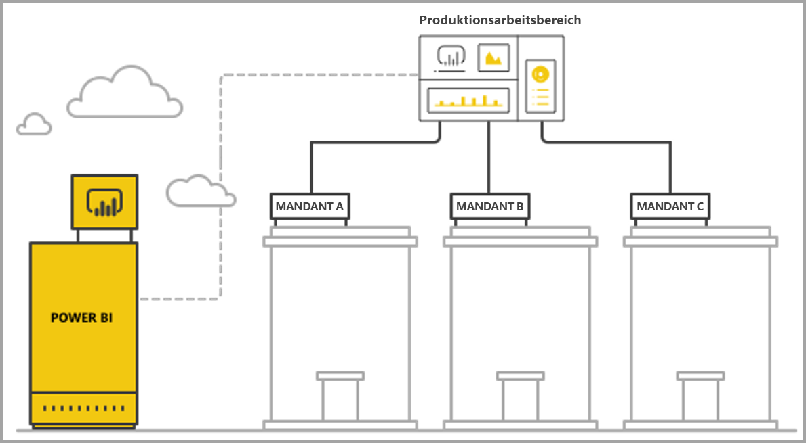

# Verwalten der Mehrinstanzenfähigkeit mit Power BI Embedded Analytics

Wenn Sie eine mehrinstanzenfähige SaaS-Anwendung entwerfen, müssen Sie sorgfältig das Mandantenmodell auswählen, das die Anforderungen Ihrer SaaS-Anwendung am besten erfüllt. Dieser Prozess gilt auch für Power BI als Embedded Analytics-Teil Ihrer SaaS-Anwendung. Ein Mandantenmodell legt fest, wie die Daten der einzelnen Mandanten innerhalb von Power BI und dem Speicherkonto zugeordnet und verwaltet werden. Ihr Mandantenmodell besitzt Auswirkungen auf den Entwurf und die Verwaltung von Anwendungen. Der spätere Wechsel zu einem anderen Modell kann teuer sein und zu Unterbrechungen führen.

Mit Power BI Embedded gibt es zwei grundlegende Hauptansätze zur Aufrechterhaltung der Trennung von Mandanten.

   1. **Isolation basierend auf dem Arbeitsbereich**: Pro Mandant wird ein separater Power BI-Arbeitsbereich erstellt.
   2. **Auf der Sicherheit auf Zeilenebene basierende Isolation**: Anhand der zugrunde liegenden Daten wird der Datenzugriff pro Benutzer oder Gruppe gesteuert und verwaltet.

In diesem Artikel werden die unterschiedlichen Ansätze beschrieben und anhand mehrerer Auswertungskriterien analysiert.

## Konzepte und Terminologie

**[AAD](https://docs.microsoft.com/azure/active-directory/fundamentals/active-directory-whatis)**: Azure Active Directory.

**AAD-Anwendung**: Eine Anwendungsidentität in AAD. Für die Authentifizierung ist eine AAD-Anwendung erforderlich.

**SaaS-Anwendung (Software-as-a-Service)**: Ein System, das von einem Unternehmen oder unabhängigen Softwarehersteller implementiert wird, in der Regel von einem Onlinedienst. Ebenso die zugehörigen Softwaresysteme zum Bedienen mehrerer Kundenmandanten (Organisationen). In diesem Artikel **verwendet die SaaS-Anwendung Power BI Embedded, um den verschiedenen Mandanten Analysefunktionen bereitzustellen**. Power BI Embedded kann auch für alle Arten von Anwendungen eingesetzt werden, wenn diese eine Onlineverbindung besitzen.

**Mandant**: Ein einzelner Kunde (Organisation), der die SaaS-Anwendung und alle Ressourcen oder Daten verwendet, die der Kunde in die SaaS-Anwendung einbringt.

**[Power BI](../power-bi-overview.md)**: Der Power BI-Clouddienst, der als Plattform für Power BI Embedded dient.

**Power BI-Mandant**: Ein Satz von Power BI-Ressourcen, die mit einem einzelnen AAD-Mandanten verknüpft sind.

**[Power BI-Arbeitsbereich](../service-create-workspaces.md)**: Ein Container für Inhalte in Power BI.

**Power BI-Artefakten**: Es gibt mehrere Power BI-Artefakte in Power BI-Arbeitsbereichen, z.B. Dashboards, Berichte, Datasets und Dataflows.

**[Power BI Embedded](azure-pbie-what-is-power-bi-embedded.md)** : Eine Reihe öffentlicher APIs, mit denen Entwickler Anwendungen zum Verwalten von Power BI-Inhalten und zum Einbetten von Power BI-Elementen erstellen können.

**[Sicherheit auf Zeilenebene (RLS)](embedded-row-level-security.md)**: Bietet die Möglichkeit, den Benutzerzugriff auf die Daten für einzelne Zeilen in einer Tabelle zu steuern. Sie können die Sicherheit auf Zeilenebene auf der Ebene der Datenquelle oder im Power BI-Semantikmodell implementieren.

**Masterbenutzer**: Die Identität, die die SaaS-Anwendung in Power BI darstellt und die von der SaaS-Anwendung beim Aufruf von Power BI-APIs verwendet wird. Hierbei muss es sich um einen AAD-Benutzer mit einer Power BI Pro-Lizenz handeln.

**AAD-Anwendungsbenutzer (Dienstprinzipal)**: Die Identität, die die SaaS-Anwendung in Power BI darstellt und die von der SaaS-Anwendung beim Aufruf von Power BI-APIs verwendet wird. Hierbei muss es sich um eine AAD-Webanwendung handeln. Kann die Verwendung eines *Masterbenutzers* zur Authentifizierung bei Power BI ersetzen.

**Kapazität**: Eine Reihe von Ressourcen, die ausschließlich zur Ausführung des Power BI-Diensts verwendet werden. [Power BI Premium-Kapazitäten](../service-premium.md): Für Unternehmen, die Power BI intern verwenden, während [Power BI Embedded-Kapazitäten](azure-pbie-create-capacity.md) für Anwendungsentwickler bestimmt sind, die SaaS-Anwendungen für Drittanbieter entwickeln möchten.

**[Power BI Pro-Lizenz](../service-admin-purchasing-power-bi-pro.md)**: Eine benutzerbasierte Lizenz, die Rechte zum Veröffentlichen von Inhalten in App-Arbeitsbereichen, zum Nutzen von Apps ohne Premium-Kapazität, zum Freigeben von Dashboards und zum Abonnieren von Dashboards und Berichten erteilt.

**[Datenkonnektivitätsmodi](../desktop-directquery-about.md)**: Die Verbindung zwischen Datenquellen und Power BI kann in verschiedenen Modi hergestellt werden:

   * Import: Dies ist die gängigste Methode zum Abrufen von Daten.
   * DirectQuery: Hiermit stellen Sie eine direkte Verbindung mit den Daten im zugehörigen Quellrepository her.
   * Live-Verbindung: Ein weiterer Modus, der eine direkte Verbindung mit Analysis Services-Daten (sowohl Azure als auch lokal) herstellt.

## Auswertungskriterien

Die optimale Wahl für das richtige Mandantenmodell für Ihre SaaS-Anwendung variiert je nach bestimmten geschäftlichen und technischen Anforderungen, Datenarchitektur und anderen Aspekten. Fundierte Kenntnisse dieser Anforderungen und der verfügbaren Mandantenmodelloptionen sowie der jeweiligen Vor- und Nachteile helfen Ihnen, eine zuverlässige, leistungsstarke, kostengünstige und skalierbare Architektur für Ihre SaaS-Anwendung zu definieren.

Im Folgenden sehen Sie eine Reihe von Bereichen, die bei der Auswahl zwischen den verschiedenen Mandantenmodellen zu berücksichtigen sind.

### Datenarchitektur

Normalerweise besitzen Entwickler, die Anwendungen mit Power BI Embedded erstellen, bereits eine Datenbank mit einem einzelnen oder mit mehreren Mandanten. Es ist einfacher, ein Mandantenmodell für Power BI Embedded zu verwenden, das dem Mandantenmodell der Datenbank ähnlich ist. Wenn das Mandantenmodell der Datenbank noch nicht definiert wurde, sollten Sie andere Aspekte berücksichtigen, bevor Sie sich für eine Datenarchitektur entscheiden.

### Datenisolation

Wie sensibel sind die zu speichernden Daten? Welche Isolationsebene benötigen Sie bei der Trennung verschiedener Kundenmandanten? Die Antwort kann für unterschiedliche Branchen oder bestimmte Kunden mit bestimmten Anforderungen variieren.

### Skalierbarkeit

Um die beste Lösung zu finden, definieren Sie die Skalierung, die Sie in absehbarer Zukunft erreichen werden. Denken Sie daran, dass eine Lösung, die zum jetzigen Zeitpunkt geeignet sein könnte, bei zentraler Hochskalierung von Nutzung und Daten möglicherweise nicht mehr ausreicht. Ziehen Sie bei der Analyse der Skalierbarkeit folgende Liste in Betracht:

   * Die Anzahl von Mandanten (Kunden).
   * Die Anzahl von Berichten, Dashboards und Datasets für die einzelnen Mandanten.
   * Die Größe der Daten in den einzelnen Datasets und die Häufigkeit der Aktualisierungen.
   * Die Anzahl von Benutzern.
   * Die Anzahl gleichzeitiger Benutzer in Spitzenzeiten.

Einige SaaS-Anwendungen weisen möglicherweise eine geringe Anzahl von Kunden und eine geringe Auslastung, aber große Mengen von Daten auf. Andere umfassen möglicherweise viele Kunden und eine hohe Auslastung, pro Kunde aber eine kleine Menge von Daten und Berichten. Hohe Zahlen in diesen Situationen können sich auf die zukünftigen Kosten und die Komplexität des Betriebs auswirken.

### Automatisierung und Komplexität des Betriebs

Identifizieren Sie häufig auftretende Prozesse, die automatisiert werden müssen.

   * Wie häufig werden neue Mandanten integriert? Welche Aktionen sind für ein vollständiges Onboarding jedes einzelnen erforderlich?
   * Welcher Releaserhythmus gilt für neue oder aktualisierte Power BI-Inhalte, die bereitgestellt werden müssen?
   * Wie viele Rollen der Sicherheit auf Zeilenebene sind für die einzelnen Mandanten definiert?  

Indem Sie diese Prozesse und Ihren Umgang damit identifizieren, können Sie verstehen, wie komplex die Verwaltung der einzelnen Modelle ausfällt.

### Anforderungen an die Data Residency und die Notwendigkeit zur Unterstützung mehrerer geografischer Regionen

Power BI Embedded unterstützt eine Bereitstellung in mehreren geografischen Regionen (Previewfunktion). Mit [Multi-Geo](embedded-multi-geo.md) können Power BI Embedded-Ressourcen in verschiedenen Regionen bereitgestellt werden, wobei bestimmte Inhalte zur Speicherung in bestimmten Regionen zugewiesen werden. Dieses Feature ist in allen Modellen einsetzbar, kann sich jedoch auf die Menge der zu verwaltenden Inhalte und auf die Kosten auswirken. Derzeit ist Multi-Geo darauf ausgelegt, Anforderungen an die Data Residency zu erfüllen. Es geht nicht darum, die Leistung zu verbessern, indem die Daten in die Nähe der Kunden verschoben werden.

### Cost

[Power BI Embedded](https://azure.microsoft.com/services/power-bi-embedded/) umfasst ein auf Ressourcen basierendes Tarifmodell wie z.B. **Power BI Premium**. Sie erwerben eine oder mehrere Kapazitäten mit feststehender Rechenleistung und Arbeitsspeicher. Diese Kapazität ist der wichtigste Kostenfaktor bei der Arbeit mit **Power BI Embedded**. Es gibt keine Beschränkung für die Anzahl der Benutzer, die die Kapazität verwenden. Die einzige Einschränkung ist die Leistung der Kapazität. Eine [Power BI Pro-Lizenz](../service-admin-licensing-organization.md) ist erforderlich für die einzelnen *Masterbenutzer* oder für bestimmte Benutzer, die auf das Power BI-Portal zugreifen müssen.

Wir empfehlen, die erwartete Auslastung der Kapazität zu testen und zu messen, indem Sie eine Liveumgebung und -nutzung simulieren und Auslastungstests für die Kapazität ausführen. Sie können die Auslastung und Leistung anhand der verschiedenen Metriken messen, die in der Azure-Kapazität oder in der App [Premium-Kapazitätsmetriken](../service-admin-premium-monitor-capacity.md) verfügbar sind.

### Anpassen und Erstellen von Inhalten

Es gibt zwei Ansätze für SaaS-Anwendungen, mit denen Benutzer die Möglichkeit erhalten, im Rahmen des Flows Berichte zu bearbeiten und zu erstellen oder Daten in den Dienst hochzuladen:

   * [Bearbeitungs-/Erstellungsmodus in einem eingebetteten iFrame](https://github.com/Microsoft/PowerBI-JavaScript/wiki/Create-Report-in-Embed-View): Der Benutzer erhält eine Ansicht des Berichts oder eine neue leere Canvas innerhalb der SaaS-Anwendung. Auf diese Weise kann er über die Power BI-Symbolleiste Inhalte erstellen, die auf einem Dataset im Arbeitsbereich basieren. Diese Option wird empfohlen, weil sie sich im Kontext des Benutzers in einer vertrauten Umgebung befindet. Der Einstieg in die Arbeit und Bearbeitung fällt leichter, und der Benutzer erstellt einen Bericht, der an ein vorhandenes Dataset angefügt wird.

   * Sie verwenden Power BI Desktop, um Inhalte zu erstellen und über die Benutzeroberfläche der SaaS-Anwendung in den Arbeitsbereich hochzuladen. Bei diesem Ansatz stehen den Benutzern mehr Tools für die Arbeit mit Power BI Desktop zur Verfügung. Dieser Ansatz wird allerdings nicht empfohlen, weil Benutzer mit einem weiteren Tool außerhalb des SaaS-Anwendungskontexts vertraut sein müssen. Das Hochladen einer PBIX-Datei bedeutet, dass der Benutzer ein zusätzliches Dataset hinzufügt, das möglicherweise ein Duplikat eines Datasets ist, das sich bereits im Arbeitsbereich befindet.

## Auf dem Power BI-Arbeitsbereich basierende Isolation

Mit der auf dem Power BI-Arbeitsbereich basierenden Isolation unterstützt die SaaS-Anwendung mehrere Mandanten von einem einzelnen Power BI-Mandanten aus. Die arbeitsbereichsbasierte Isolation enthält alle Power BI-Inhalte, die von verschiedenen Mandanten verwendet werden. Die Trennung der Mandanten erfolgt auf der Ebene des Power BI-Arbeitsbereichs durch die Erstellung mehrerer Arbeitsbereiche. Jeder Arbeitsbereich enthält die relevanten Datasets, Berichte und Dashboards für den jeweiligen Mandanten. Darüber hinaus ist jeder Arbeitsbereich nur mit den Daten des jeweiligen Mandanten verbunden. Wenn Sie eine zusätzliche Isolation benötigen, können Sie für jeden Arbeitsbereich und den zugehörigen Inhalt einen *Masterbenutzer* oder einen Dienstprinzipal erstellen.

### Datenarchitektur

Es gibt zwei Hauptansätze für die Verwaltung von Mandantendaten.

* Eine separate Datenbank pro Mandant
* Eine einzelne Datenbank mit mehreren Mandanten

Wenn der SaaS-Anwendungsspeicher eine separate Datenbank pro Mandant verwendet, fällt die natürliche Wahl auf die Verwendung von Datasets auf einzelnen Mandanten in Power BI, wobei die Verbindungszeichenfolge für jedes Dataset auf die entsprechende Datenbank verweist.

Wenn der SaaS-Anwendungsspeicher für alle Mandanten eine mehrinstanzenfähige Datenbank verwendet, können die Mandanten ganz einfach nach Arbeitsbereich getrennt werden. Sie können die Datenbankverbindung für das Power BI-Dataset mit einer parametrisierten Datenbankabfrage konfigurieren, die nur die Daten des entsprechenden Mandanten abruft. Sie können die Verbindung über [Power BI Desktop](../desktop-query-overview.md) oder mithilfe der [API](https://docs.microsoft.com/rest/api/power-bi/datasets/updatedatasourcesingroup) mit [Parametern](https://docs.microsoft.com/rest/api/power-bi/datasets/updateparametersingroup) für die Abfrage aktualisieren.

### Datenisolation

Daten in diesem Mandantenmodell werden auf Arbeitsbereichsebene getrennt. Eine einfache Zuordnung zwischen einem Arbeitsbereich und einem Mandanten verhindert, dass Benutzer aus einem Mandanten Inhalte aus einem anderen Mandanten anzeigen können. Bei Verwendung eines einzigen *Masterbenutzers* müssen Sie auf sämtliche Arbeitsbereiche zugreifen können. Die Konfiguration, die festlegt, welche Daten einem Endbenutzer angezeigt werden, erfolgt während der [Generierung des Einbettungstokens](https://docs.microsoft.com/rest/api/power-bi/embedtoken). Dies ist ein reiner Back-End-Prozess, der von Endbenutzern weder angezeigt noch geändert werden kann.

Um zusätzliche Isolation hinzuzufügen, kann ein Anwendungsentwickler einen *Masterbenutzer* oder eine Anwendung pro Arbeitsbereich definieren statt eines einzelnen *Masterbenutzers* oder einer einzelnen Anwendung mit Zugriff auf mehrere Arbeitsbereiche. Auf diese Weise können Sie sicherstellen, dass bei menschlichem Versagen oder kompromittierten Anmeldeinformationen nicht die Daten mehrerer Kunden verfügbar gemacht werden.

### Skalierbarkeit

Ein Vorteil dieses Modells ist, dass durch diese Trennung der Daten in mehrere Datasets für jeden Mandanten die [Größenbeschränkungen für ein einzelnes Dataset](https://docs.microsoft.com/power-bi/service-premium-large-datasets) (derzeit 10 GB in einer Kapazität) nicht mehr zum Tragen kommen. Wenn die Kapazität überladen ist, [können nicht verwendete Datasets entfernt werden](../service-premium-understand-how-it-works.md), um Arbeitsspeicher für aktive Datasets freizugeben. Diese Aufgabe ist mit einem großen Dataset nicht möglich. Durch die Verwendung mehrerer Datasets können Mandanten bei Bedarf auch in mehrere Power BI-Kapazitäten getrennt werden. [Erfahren Sie mehr über die Funktionsweise von Kapazitäten](../service-admin-premium-manage.md).

Trotz dieser Vorteile ist die Skalierung zu berücksichtigen, die die SaaS-Anwendung in der Zukunft erreichen kann. Beispielsweise stößt man möglicherweise auf Grenzen in Bezug auf die Anzahl der Artefakte, die verwaltet werden können. Weitere Details zu [Beschränkungen](#summary-comparison-of-the-different-approaches) bei der Bereitstellung finden Sie weiter unten in diesem Artikel. Durch die verwendete Kapazitäts-SKU wird eine Begrenzung für folgende Größen eingeführt: die Größe des Arbeitsspeichers, den die Datasets einnehmen dürfen, [die Anzahl von Aktualisierungen, die gleichzeitig ausgeführt werden können](../service-premium-understand-how-it-works.md), sowie die maximale Häufigkeit von Datenaktualisierungen. Wenn Hunderte oder Tausende von Datasets verwaltet werden, empfiehlt es sich, Tests durchzuführen. Es wird außerdem empfohlen, die durchschnittliche und die maximale Nutzungsmenge zu berücksichtigen sowie spezifische Mandanten mit großen Datasets oder unterschiedlichen Verwendungsmustern, die anders als andere Mandanten verwaltet werden.

### Automatisierung und Komplexität des Betriebs

Mit der auf Power BI-Arbeitsbereichen basierenden Isolation muss ein Anwendungsentwickler möglicherweise Hunderte oder Tausende von Artefakten verwalten. Es ist wichtig, die Prozesse zu definieren, die häufig in der Verwaltung des Anwendungslebenszyklus stattfinden, und sicherzustellen, dass Sie für die angemessene Durchführung dieser Vorgänge in diesem Mandantenmodell den richtigen Satz an Tools besitzen. Einige Beispielvorgänge:

   * Hinzufügen eines neuen Mandanten (Kunden)
   * Aktualisieren eines Berichts oder Dashboards für einige oder alle Mandanten
   * Aktualisieren des Datasetschemas für einige oder alle Mandanten
   * Ungeplante Anpassungen für bestimmten Mandanten
   * Häufigkeit von Datasetaktualisierungen

Beispielsweise ist die Erstellung eines Arbeitsbereichs für einen neuen Mandanten eine gängige Aufgabe, die automatisiert werden muss. Mit der [Power BI-REST-API](https://docs.microsoft.com/rest/api/power-bi/) erreichen Sie eine [vollständige Automatisierung beim Erstellen von Arbeitsbereichen](https://powerbi.microsoft.com/blog/duplicate-workspaces-using-the-power-bi-rest-apis-a-step-by-step-tutorial/).

### Multi-Geo-Anforderungen

Für Multi-Geo wird Kapazität in den gewünschten Regionen erworben und dieser Kapazität ein Arbeitsbereich zugewiesen. Wenn Sie verschiedene Mandanten in unterschiedlichen Regionen unterstützen möchten, müssen Sie den Arbeitsbereich des Mandanten einer Kapazität in der gewünschten Region zuweisen. Diese Aufgabe ist ein einfacher Vorgang, bei dem nicht mehr Kosten anfallen als für die Verwaltung aller Arbeitsbereiche in derselben Kapazität. Wenn Sie jedoch Mandanten besitzen, deren Daten in mehreren Regionen gespeichert werden müssen, müssen alle Artefakte im Arbeitsbereich in den einzelnen regionalen Kapazitäten dupliziert werden. Dies führt sowohl zu erhöhten Kosten als auch zu einer komplexeren Verwaltung.

### Cost

Anwendungsentwickler, die Power BI Embedded verwenden, müssen [für die Produktion Power BI Embedded-Kapazität erwerben](embed-sample-for-customers.md#move-to-production).  Die Auswirkungen des arbeitsbereichsbasierten Isolationsmodells und dessen Auswirkungen auf Kapazitäten sollten Ihnen unbedingt bekannt sein.

Das arbeitsbereichsbasierte Isolationsmodell ist aus den folgenden Gründen für Kapazitäten gut geeignet:

   * Das kleinste Objekt, das Sie unabhängig einer Kapazität zuweisen können, ist ein Arbeitsbereich, d.h. ein Bericht kann beispielsweise nicht zugewiesen werden. Durch die Trennung von Mandanten nach Arbeitsbereichen erhalten Sie daher vollständige Flexibilität bei der Verwaltung der einzelnen Mandanten und ihrer Leistungsanforderungen sowie bei der Optimierung der Kapazitätsauslastung durch Hoch-/Herunterskalieren. Große und wichtige Mandanten mit großem Volumen und hoher Fluktuation können z.B. in einer separaten Kapazität verwaltet werden, um einen konsistenten Servicelevel sicherzustellen, während kleinere Mandanten in einer anderen Kapazität gruppiert werden können, um die Kosten zu optimieren.

   * Das Trennen von Arbeitsbereichen umfasst auch das Trennen von Datasets zwischen Mandanten, sodass Datenmodelle in kleineren Blöcken statt in einem einzigen großen Dataset organisiert werden können. Mit dieser Aufgabe kann die Arbeitsspeichernutzung durch die Kapazität besser verwaltet werden: Kleine und nicht verwendete Datasets werden entfernt, wenn sie nicht erforderlich sind, und die Benutzer profitieren gleichzeitig von einer zufriedenstellenden Leistung.

Anwendungsentwickler müssen den Grenzwert für die Anzahl paralleler Aktualisierungen berücksichtigen, weil Aktualisierungsprozesse bei Verwendung mehrerer Datasets möglicherweise zusätzliche Kapazität benötigen.

### Anpassen und Erstellen von Inhalten

Für die primären Anwendungsfälle der Inhaltserstellung muss ein Anwendungsentwickler sorgfältig erwägen, welche Mandanten Bearbeitungsfunktionen aufweisen können und wie viele Benutzer in den einzelnen Mandanten diese nutzen können. Wenn Sie die Bearbeitung durch mehrere Benutzer in den einzelnen Mandanten zulassen, werden möglicherweise viele Inhalte generiert, sodass eine Dataseteinschränkung erreicht werden kann, z.B. die Anzahl von Berichten pro Dataset oder die Anzahl von Datasets in einem Arbeitsbereich. Wenn Sie Benutzern diese Funktion einräumen, empfiehlt es sich, die Inhaltsgenerierung genau zu überwachen und nach Bedarf hochzuskalieren. Aus denselben Gründen wird davon abgeraten, diese Funktion für die Personalisierung von Inhalten zu nutzen, bei der jeder Benutzer kleine Änderungen an einem Bericht vornehmen und zur eigenen Verwendung speichern kann. Wenn die SaaS-Anwendung die Personalisierung von Inhalten zulässt, sollten Sie für benutzerspezifische Inhalte Aufbewahrungsrichtlinien für den Arbeitsbereich einführen und kommunizieren, um den Flow zum Löschen von Inhalten zu unterstützen, wenn Endbenutzer zu einer neuen Position wechseln, das Unternehmen verlassen oder die Plattform nicht mehr verwenden.

## Auf Sicherheit auf Zeilenebene basierende Isolation

Mit auf Sicherheit auf Zeilenebene basierender Isolation verwendet die SaaS-Anwendung einen einzigen Arbeitsbereich zum Hosten mehrerer Mandanten. Das bedeutet, dass jeder Bericht, jedes Dashboard und jedes Dataset für Power BI-Artefakte einmal erstellt und von allen Mandanten genutzt wird. Die Trennung von Daten zwischen Mandanten erfolgt für das mehrinstanzenfähige Dataset über die [Sicherheit auf Zeilenebene](embedded-row-level-security.md). Wenn Endbenutzer sich bei der SaaS-Anwendung anmelden und Inhalte öffnen, wird für die Sitzung dieses Benutzers ein Einbettungstoken mit Rollen und Filtern generiert, die sicherstellen, dass dem Benutzer nur die Daten angezeigt werden, die er sehen darf. Wenn Benutzer aus demselben Mandanten nicht dieselben Daten anzeigen dürfen, muss der Anwendungsentwickler hierarchische Rollen sowohl zwischen Mandanten als auch innerhalb desselben Mandanten implementieren.

### Datenarchitektur

Die Implementierung der auf Sicherheit auf Zeilenebene basierenden Isolation ist besonders praktisch, wenn die Daten aller Mandanten in einem einzigen Data Warehouse gespeichert sind. In diesem Fall kann der Anwendungsentwickler nur die relevanten Daten aus dem Data Warehouse an das Power BI-Dataset übergeben, entweder über DirectQuery oder über Datenimport. Wenn Daten in der Datenbank nach Mandanten getrennt werden, müssen sie in einem einzelnen Dataset gruppiert werden. Dies kann zu einer Aufweichung der Trennung zwischen Mandanten führen, die in der Datenbank vorhanden waren.

### Datenisolation

Mit der auf Sicherheit auf Zeilenebene basierenden Isolation erfolgt die Trennung von Daten über die [Definitionen der Sicherheit auf Zeilenebene](embedded-row-level-security.md) für das Dataset. Dies bedeutet, dass alle Daten nebeneinander vorhanden sind. Diese Form der Datentrennung ist anfälliger für Datenlecks durch Entwicklerfehler. Auch wenn die Sicherheit auf Zeilenebene im Back-End implementiert und vor Endbenutzern abgesichert wird, sollten Sie bei extrem sensiblen Daten oder bei Kunden, die eine Datentrennung anfordern, eher die auf Arbeitsbereichen basierende Isolation verwenden.

### Skalierbarkeit

Bei der auf Sicherheit auf Zeilenebene basierenden Isolation müssen die Daten die Größenbeschränkung für Datasets einhalten, die zurzeit bei 10 GB liegt. Mit der Einführung der [inkrementellen Aktualisierung](../service-premium-incremental-refresh.md) und der bevorstehenden Veröffentlichung eines XMLA-Endpunkts für Power BI-Datasets wird sich die Größenbeschränkung deutlich erhöhen. Die Daten müssen aber dennoch in den Arbeitsspeicher der Kapazität passen, und es muss noch genügend Arbeitsspeicher für die Ausführung von Datenaktualisierungen übrig bleiben. Umfangreiche Bereitstellungen benötigen eine große Kapazität, damit die Benutzer keine Probleme feststellen, weil der Arbeitsspeicher die Grenzwerte der aktuellen Kapazität übersteigt. Als alternative Methoden zum Handhaben der Skalierung können Sie **[Aggregationen](../desktop-aggregations.md)** verwenden oder über DirectQuery oder eine Liveverbindung eine direkte Verbindung mit der Datenquelle herstellen, statt alle Daten in der Power BI-Kapazität zwischenzuspeichern.

### Automatisierung und Komplexität des Betriebs

Die Verwaltung von Artefakten ist bei der auf Sicherheit auf Zeilenebene basierenden Isolation wesentlich angenehmer als bei der auf Arbeitsbereichen basierenden Isolation, weil es für jede Umgebung (Entwicklung/Test/Produktion) nur eine einzige Version eines Artefakts statt je einer Version pro Mandant gibt. In großen Bereitstellungen müssen bei der Artefaktverwaltung dann nur Dutzende Artefakte verwaltet und aktualisiert werden und nicht Tausende bis Zehntausende.

Power BI umfasst noch keine API zum Ändern oder Erstellen von RLS-Rollen und -Regeln. Rollen können in Power BI Desktop nur manuell hinzugefügt oder geändert werden. Wenn eine RLS-Hierarchie angewendet werden muss, kann deren Verwaltung kompliziert und fehleranfällig sein, wenn Sie sie nicht sorgfältig planen.

Wenn der Anwendungsentwickler viele Rollen und Rollendefinitionen verwalten muss, die häufig erstellt oder aktualisiert werden müssen, ist die auf Sicherheit auf Zeilenebene basierende Isolation im Hinblick auf die Verwaltbarkeit nicht skalierbar.

Weitere operative Komplexität entsteht durch die genaue Überwachung der Speicherauslastung und die Erstellung eines stabilen Mechanismus aus Warnungen und Skalierungen, um für die Benutzer eine reibungslos funktionierende Umgebung sicherzustellen.  

### Multi-Geo-Anforderungen

Da alle Daten in einem einzelnen Dataset gespeichert werden, kann die Einhaltung von Data Residency-Anforderungen, die eine Bindung bestimmter Daten an bestimmte Standorte verlangen, zu einer Herausforderung werden. Dadurch können sich auch die Kosten für die Verwendung mehrerer Regionen deutlich erhöhen, weil alle Daten in jeder Region repliziert und gespeichert werden. Wenn nur eine begrenzte Anzahl von Mandanten verschiedene geografische Standorte benötigt, können Sie nur die Daten dieser Mandanten in einer anderen Region speichern, indem Sie das oben beschriebene arbeitsbereichsbasierte Isolationsmodell verwenden.

### Cost

Der primäre Kostenverursacher bei der auf Sicherheit auf Zeilenebene basierenden Isolation ist der Speicherbedarf des Datasets. Sie benötigen ausreichend Kapazität, um das Dataset zu speichern und zusätzlichen Speicherpuffer für eventuelle Spitzen im Speicherbedarf vorzuhalten. Eine Möglichkeit zum Entschärfen dieser Situation besteht darin, die Daten in einer SQL Server-Datenbank oder einem SQL Server Analysis Services-Cube zu speichern und DirectQuery oder eine Liveverbindung zu verwenden, um die Daten in Echtzeit aus der Datenquelle abzurufen. Dieser Ansatz erhöht die Kosten für die Datenquellen, verringert jedoch den Bedarf an hoher Kapazität aufgrund von Arbeitsspeicheranforderungen, sodass sich die Kosten für die Power BI-Kapazität reduzieren.

### Anpassen und Erstellen von Inhalten

Während Endbenutzer Berichte bearbeiten oder erstellen, können sie das mehrinstanzenfähige Dataset der Produktionsumgebung verwenden. Aus diesem Grund empfehlen wir die ausschließliche Verwendung der eingebetteten iFrame-Option für das Bearbeiten oder [Erstellen von Berichten](https://github.com/Microsoft/PowerBI-JavaScript/wiki/Create-Report-in-Embed-View), weil sie auf demselben Dataset mit angewendeter Sicherheit auf Zeilenebene beruht. Wenn Benutzer PBIX-Dateien mit zusätzlichen Datasets hochladen, kann dies bei der auf Sicherheit auf Zeilenebene basierenden Isolation teuer und schwierig zu verwalten sein. Wenn Benutzer neue Inhalte generieren, die sich in demselben Arbeitsbereich befinden, müssen Sie zudem sicherzustellen, dass der Produktionsarbeitsbereich nicht an seine Grenzwerte stößt. Dazu müssen Sie einen stabilen Mechanismus einrichten, um zu unterscheiden, welche Inhalte mit welchem Mandanten verbunden sind.

## Zusammenfassender Vergleich der verschiedenen Ansätze

> [!Important]
> Die folgende Analyse basiert auf dem aktuellen Status des Produkts. Da wir monatlich neue Features veröffentlichen, werden als Reaktion auf vorhandene Einschränkungen und Schwachstellen ständig neue Funktionen und Features bereitgestellt. Lesen Sie unbedingt unsere monatlichen Blogbeiträge, um sich über Neuerungen zu informieren. Kehren Sie dann zu diesem Artikel zurück, um zu prüfen, wie sich die neuen Features auf die Empfehlungen zum Mandantenmodell auswirken.

| Auswertungskriterien | Auf Arbeitsbereichen basierend   | Auf Sicherheit auf Zeilenebene basierend  |  |  |
|--------------------------------------|----------------------------------------------------------------------------------------------------------------------|---------------------------------------------------------------------------------------|---|---|
| Datenarchitektur  | Am einfachsten, wenn pro Mandant eine separate Datenbank vorliegt  | Am einfachsten, wenn alle Daten für alle Mandanten in einem einzigen Data Warehouse gespeichert sind   |  |  |
| Datenisolation  | Gut. Jeder Mandant verfügt über ein dediziertes Dataset.  | Mäßig. Alle Daten befinden sich in demselben freigegebenen Dataset, werden jedoch durch die Zugriffssteuerung verwaltet.  |  |  |
| Skalierbarkeit  | Mittel. Die Aufteilung der Daten in mehrere Datasets ermöglicht eine Optimierung.  | Gering. Durch Datasetbeschränkungen eingeschränkt.  |  |  |
| Multi-Geo-Anforderungen  | Gut geeignet, wenn sich die meisten Mandanten in nur einer Region befinden.  | Nicht empfehlenswert. Das gesamte Dataset muss in mehreren Regionen gespeichert werden.  |  |  |
| Automatisierung und Komplexität des Betriebs  | Gute Automatisierung für die einzelnen Mandanten.   Komplex bei der Verwaltung vieler Artefakte in großem Umfang.  | Einfache Verwaltung von Power BI-Artefakten, aber komplexe Verwaltung von RLS in umfangreichen Umgebungen.  |  |  |
| Cost  | Niedrig bis mittel. Die Auslastung kann optimiert werden, um die Kosten pro Mandanten zu reduzieren.  Steigen möglicherweise, wenn häufige Aktualisierungen erforderlich sind.  | Mittel bis hoch, wenn Sie den Importmodus verwenden.  Niedrig bis mittel, wenn Sie den DirectQuery-Modus verwenden.  |  |  |
| Anpassen und Erstellen von Inhalten  | Gut geeignet. Kann in großem Umfang auf Einschränkungen stoßen.  | Inhaltsgenerierung nur in eingebettetem iFrame  |  |  |

## Aspekte und Einschränkungen der Bereitstellung

**Grenzwerte für Power BI-Artefakte:**

* Die Anzahl von Arbeitsbereichen V1 (Gruppen), für die ein einzelner Benutzer/eine einzelne Anwendung als Mitglied/Administrator fungieren kann, beträgt 250.
* Die Anzahl von Arbeitsbereichen V2 (Ordner), für die ein einzelner Benutzer/eine einzelne Anwendung als Mitglied/Administrator fungieren kann, beträgt 1000.
* Die Anzahl von Datasets in einem einzelnen Arbeitsbereich beträgt 1000.
* Die Anzahl von Berichten/Dashboards, die mit einem einzelnen Dataset verbunden sein können, beträgt 1000.
* Die Größenbeschränkung für den Datasetarbeitsspeicher beim Hochladen einer *PBIX*-Datei beträgt 10 GB.

**Aspekte und Einschränkungen der Power BI-Kapazität:**

* Jede Kapazität kann nur den Speicher und die virtuellen Kerne verwenden, die gemäß der [erworbenen SKU](../service-premium.md) zugewiesen wurden.
* Informationen zur empfohlenen Datasetgröße für die einzelnen SKUs finden Sie unter [Unterstützung für große Datasets in Power BI Premium](../service-premium-large-datasets.md).
* Die maximale Datasetgröße in einer dedizierten Kapazität beträgt 10 GB.
* Die Anzahl der geplanten Aktualisierungen für ein Dataset im *Importmodus* beträgt 48 pro Tag.
* Der Zeitraum zwischen geplanten Aktualisierungen für ein Dataset im *Importmodus* beträgt 30 Minuten.
* Die Anzahl von Aktualisierungen, die für eine Kapazität gleichzeitig ausgeführt werden können, finden Sie unter [Verwaltung und Optimierung der Microsoft Power BI Premium-Kapazitätsressource](../service-premium-understand-how-it-works.md).
* Die Skalierung einer Kapazität dauert im Durchschnitt zwischen 1 und 2 Minuten. Während dieses Zeitraums ist die Kapazität nicht verfügbar. Es wird empfohlen, einen Ansatz für horizontales Skalieren zu verwenden, um [Downtime zu vermeiden](https://powerbi.microsoft.com/blog/power-bi-developer-community-november-update-2018/#scale-script).

## Nächste Schritte

* [Embedded Analytics mit Power BI](embedding.md)
* [Power BI Embedded](azure-pbie-what-is-power-bi-embedded.md)
* [Power BI Premium](../service-premium.md)
* [Sicherheit auf Zeilenebene](embedded-row-level-security.md)