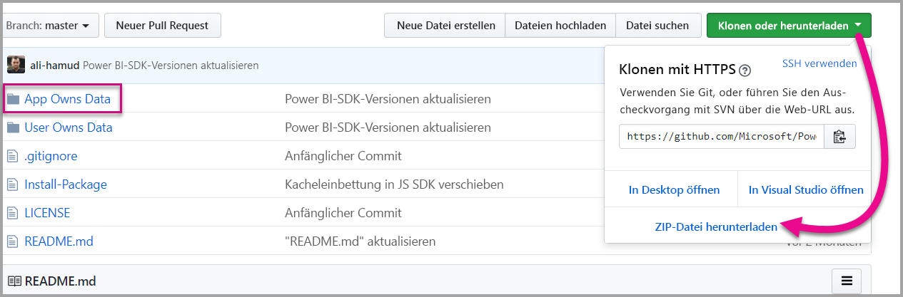

# <a name="tutorial-embed-a-power-bi-dashboard-tile-or-report-into-your-application-for-sovereign-clouds"></a>Tutorial: Einbetten eines Dashboards, einer Kachel oder eines Berichts von Power BI in eine Anwendung für Sovereign Clouds

Erfahren Sie, wie Sie analytische Inhalte in Ihre Geschäftsprozessanwendungen für die Sovereign Cloud einbetten. Sie können das Power BI .NET SDK mit der Power BI-JavaScript-API verwenden, um einen Bericht, ein Dashboard oder eine Kachel in eine Webanwendung einzubetten.

Sovereign (private) Clouds werden von Power BI ebenfalls unterstützt.

Zu den verschiedenen Sovereign Clouds gehören Folgende:

* U.S. Government Community Cloud (GCC)

* U. S. Military Contractors (DoDCON)

* U. S. Military (DoD)

* Power BI für Cloud Deutschland

* Power BI für Cloud China


Für diese exemplarische Vorgehensweise benötigen Sie ein **Power BI-Konto**. Wenn Sie kein Konto eingerichtet haben, können Sie sich je nach Art der Sovereign Cloud für ein [Power BI-Konto einer US-Behörde](../service-govus-signup.md), ein [Power BI-Konto für Cloud Deutschland](https://powerbi.microsoft.com/power-bi-germany/?ru=https%3A%2F%2Fapp.powerbi.de%2F%3FnoSignUpCheck%3D1) oder ein [Power BI-Konto für Cloud China](http://www.21vbluecloud.com/powerbi/) anmelden.

> [!NOTE]
> Möchten Sie stattdessen ein Dashboard für Ihre Organisation einbetten? Siehe [Integrieren eines Dashboards in eine App für Ihre Organisation](integrate-dashboard.md).

Zum Integrieren eines Dashboards in eine Web-App verwenden Sie die **Power BI**-API und ein **Zugriffstoken** für die Azure Active Directory (Azure AD)-Autorisierung, um ein Dashboard abzurufen. Anschließend laden Sie das Dashboard mit einem Einbettungstoken. Die **Power BI**-API bietet programmgesteuerten Zugriff auf bestimmte **Power BI**-Ressourcen. Weitere Informationen finden Sie in den Artikeln zu [Power BI-REST-API](https://docs.microsoft.com/rest/api/power-bi/), Power BI .NET SDK und [Power BI-JavaScript-API](https://github.com/Microsoft/PowerBI-JavaScript).

## <a name="download-the-sample"></a>Beispiel herunterladen

Diesem Artikel liegt der im [Beispiel zu Daten im App-Besitz](https://github.com/Microsoft/PowerBI-Developer-Samples) auf GitHub verwendete Code zugrunde. Laden Sie das Beispiel herunter, um die exemplarische Vorgehensweise nachvollziehen zu können.



* Government Community Cloud (GCC):
1. Überschreiben Sie die Cloud.config-Datei mit dem GCCCloud.config-Inhalt.

2. Aktualisieren Sie „applicationId“ („applicationId“ der nativen App), „workspaceId“, den Benutzer (Ihren master-Benutzer) und das Kennwort in der Datei „Web.config“.

3. Fügen Sie wie folgt die GCC-Parameter der web.config-Datei hinzu.

```xml
<add key="authorityUrl" value="https://login.windows.net/common/oauth2/authorize/" />
<add key="resourceUrl" value="https://analysis.usgovcloudapi.net/powerbi/api" />
<add key="apiUrl" value="https://api.powerbigov.us/" />
<add key="embedUrlBase" value="https://app.powerbigov.us" />
```

* Military Contractors (DoDCON):
1. Überschreiben Sie die Cloud.config-Datei mit dem TBCloud.config-Inhalt.

2. Aktualisieren Sie „applicationId“ („applicationId“ der nativen App), „workspaceId“, den Benutzer (Ihren master-Benutzer) und das Kennwort in der Datei „Web.config“.

3. Fügen Sie wie folgt die DoDCON-Parameter der web.config-Datei hinzu.

```xml
<add key="authorityUrl" value="https://login.windows.net/common/oauth2/authorize/" />
<add key="resourceUrl" value="https://high.analysis.usgovcloudapi.net/powerbi/api" />
<add key="apiUrl" value="https://api.high.powerbigov.us/" />
<add key="embedUrlBase" value="https://app.high.powerbigov.us" />
```

* Military (DoD):
1. Überschreiben Sie die Cloud.config-Datei mit dem PFCloud.config-Inhalt.

2. Aktualisieren Sie „applicationId“ („applicationId“ der nativen App), „workspaceId“, den Benutzer (Ihren master-Benutzer) und das Kennwort in der Datei „Web.config“.

3. Fügen Sie wie folgt die DoDCON-Parameter der web.config-Datei hinzu.

```xml
<add key="authorityUrl" value="https://login.windows.net/common/oauth2/authorize/" />
<add key="resourceUrl" value="https://mil.analysis.usgovcloudapi.net/powerbi/api" />
<add key="apiUrl" value="https://api.mil.powerbigov.us/" />
<add key="embedUrlBase" value="https://app.mil.powerbigov.us" />
```

* Parameter der Power BI für Cloud Deutschland
1. Überschreiben Sie die Cloud.config-Datei mit dem Inhalt von Power BI für Cloud Deutschland.

2. Aktualisieren Sie „applicationId“ („applicationId“ der nativen App), „workspaceId“, den Benutzer (Ihren master-Benutzer) und das Kennwort in der Datei „Web.config“.

3. Fügen Sie wie folgt die Parameter von Power BI für Cloud Deutschland der web.config-Datei hinzu.

```xml
<add key="authorityUrl" value=https://login.microsoftonline.de/common/oauth2/authorize/" />
<add key="resourceUrl" value="https://analysis.cloudapi.de/powerbi/api" />
<add key="apiUrl" value="https://api.powerbi.de/" />
<add key="embedUrlBase" value="https://app.powerbi.de" />
```

* Parameter von Power BI für Cloud China
1. Überschreiben Sie die Datei „Cloud.config“ mit dem Inhalt von [Power BI für Cloud Deutschland](https://github.com/Microsoft/PowerBI-Developer-Samples/blob/master/App%20Owns%20Data/PowerBIEmbedded_AppOwnsData/CloudConfigs/Power%20BI%20operated%20by%2021Vianet%20in%20China/Cloud.config).

2. Aktualisieren Sie „applicationId“ („applicationId“ der nativen App), „workspaceId“, den Benutzer (Ihren master-Benutzer) und das Kennwort in der Datei „Web.config“.

3. Fügen Sie wie folgt die Parameter von Power BI für Cloud China der Datei „Web.config“ hinzu.

```xml
<add key="authorityUrl" value=https://login.chinacloudapi.cn/common/oauth2/authorize/" />
<add key="resourceUrl" value="https://analysis.chinacloudapi.cn/powerbi/api" />
<add key="apiUrl" value="https://api.powerbi.cn/" />
<add key="embedUrlBase" value="https://app.powerbi.cn" />
```

## <a name="step-1---register-an-app-in-azure-ad"></a>Schritt 1 – Registrieren einer App in Azure AD

Registrieren Sie Ihre Anwendung bei Azure AD, um REST-API-Aufrufe ausführen zu können. Weitere Informationen finden Sie unter [Registrieren einer Azure AD-App zum Einbetten von Power BI-Inhalten](register-app.md). Aufgrund verschiedener Zugehörigkeiten für Sovereign Clouds gibt es unterschiedliche URLs, um Ihre Anwendung zu registrieren.

* Government Community Cloud (GCC) – https://app.powerbigov.us/apps 

* Military Contractors (DoDCON) – https://app.high.powerbigov.us/apps 

* Military (DoD) – https://app.mil.powerbigov.us/apps

* Power BI für Cloud Deutschland – https://app.powerbi.de/apps

* Power BI für Cloud China – https://app.powerbi.cn/apps

Wenn Sie das [Beispiel zum Einbetten für Ihre Kunden](https://github.com/Microsoft/PowerBI-Developer-Samples/tree/master/App%20Owns%20Data) heruntergeladen haben, verwenden Sie die erhaltene **applicationId**, damit das Beispiel in Azure AD authentifiziert werden kann. Ändern Sie zum Konfigurieren des Beispiels die **applicationId** in der Datei *web.config*.

## <a name="step-2---get-an-access-token-from-azure-ad"></a>Schritt 2: Abrufen eines Zugriffstokens aus Azure AD

In der Anwendung müssen Sie ein **Zugriffstoken** aus Azure AD abrufen, bevor Sie die Power BI-REST-API aufrufen können. Weitere Informationen finden Sie unter [Authentifizieren von Benutzern und Abrufen eines Azure AD-Zugriffstokens für die Power BI-App](get-azuread-access-token.md). Da verschiedene Zugehörigkeiten für Sovereign Clouds vorhanden sind, gibt es unterschiedliche URLs, um ein Zugriffstoken für Ihre Anwendung zu erhalten.

* Government Community Cloud (GCC) – https://login.microsoftonline.com

* Military Contractors (DoDCON) – http://login.microsoftonline.us

* Military (DoD) – https://login.microsoftonline.us

* Power BI für Cloud Deutschland – https://login.microsoftonline.de

* Power BI für Cloud China – https://login.chinacloudapi.cn

Beispiele für diese Zugriffstoken finden Sie in den Aufgaben für die einzelnen Inhaltselemente in der Datei **Controllers\HomeController.cs**.

## <a name="step-3---get-a-content-item"></a>Schritt 3: Abrufen eines Inhaltselements

Zum Einbetten von Power BI-Inhalten müssen Sie einige Schritte ausführen, um sicherzustellen, dass der Vorgang ordnungsgemäß ausgeführt wird. Alle diese Schritte können zwar direkt mit der REST-API ausgeführt werden. Die Beispielanwendung und die hier angeführten Beispiele verwenden jedoch das .NET SDK.

### <a name="create-the-power-bi-client-with-your-access-token"></a>Erstellen des Power BI-Clients mit dem Zugriffstoken

Mit dem Zugriffstoken erstellen Sie das Power BI-Clientobjekt, über das Sie mit den Power BI-APIs interagieren können. Sie erstellen Ihr Power BI-Clientobjekt durch Einschließen des Zugriffstokens in ein *Microsoft.Rest.TokenCredentials*-Objekt.

```csharp
using Microsoft.IdentityModel.Clients.ActiveDirectory;
using Microsoft.Rest;
using Microsoft.PowerBI.Api.V2;

var tokenCredentials = new TokenCredentials(authenticationResult.AccessToken, "Bearer");

// Create a Power BI Client object. This is used to call the Power BI APIs.
using (var client = new PowerBIClient(new Uri(ApiUrl), tokenCredentials))
{
    // Your code to embed items.
}
```

### <a name="get-the-content-item-you-want-to-embed"></a>Abrufen des einzubettenden Inhaltselements

Rufen Sie mit dem Power BI-Clientobjekt einen Verweis auf das Element ab, das eingebettet werden soll. Sie können Dashboards, Kacheln oder Berichte einbetten. Im folgenden Beispiel wird veranschaulicht, wie Sie das erste Dashboard, die erste Kachel oder den ersten Bericht aus einem vorgegebenen Arbeitsbereich abrufen.

Ein Beispiel finden Sie in **Controllers\HomeController.cs** im [Beispiel „App Owns Data“](https://github.com/Microsoft/PowerBI-Developer-Samples/tree/master/App%20Owns%20Data).

#### <a name="reports"></a>Berichte

```csharp
using Microsoft.PowerBI.Api.V2;
using Microsoft.PowerBI.Api.V2.Models;

// You need to provide the workspaceId where the dashboard resides.
ODataResponseListReport reports = client.Reports.GetReportsInGroupAsync(workspaceId);

// Get the first report in the group.
Report report = reports.Value.FirstOrDefault();
```

#### <a name="dashboards"></a>Dashboards

```csharp
using Microsoft.PowerBI.Api.V2;
using Microsoft.PowerBI.Api.V2.Models;

// You need to provide the workspaceId where the dashboard resides.
ODataResponseListDashboard dashboards = client.Dashboards.GetDashboardsInGroup(workspaceId);

// Get the first report in the group.
Dashboard dashboard = dashboards.Value.FirstOrDefault();
```

#### <a name="tiles"></a>Kacheln

```csharp
using Microsoft.PowerBI.Api.V2;
using Microsoft.PowerBI.Api.V2.Models;

// To retrieve the tile, you first need to retrieve the dashboard.

// You need to provide the workspaceId where the dashboard resides.
ODataResponseListDashboard dashboards = client.Dashboards.GetDashboardsInGroup(workspaceId);

// Get the first report in the group.
Dashboard dashboard = dashboards.Value.FirstOrDefault();

// Get a list of tiles from a specific dashboard
ODataResponseListTile tiles = client.Dashboards.GetTilesInGroup(workspaceId, dashboard.Id);

// Get the first tile in the group.
Tile tile = tiles.Value.FirstOrDefault();
```

### <a name="create-the-embed-token"></a>Erstellen des Einbettungstokens

Sie können mithilfe der JavaScript-API ein Einbettungstoken generieren. Das Einbettungstoken ist spezifisch für das Element, das Sie einbetten. Bei jedem Einbetten eines Power BI-Inhaltselements müssen Sie ein neues Einbettungstoken erstellen. Weitere Informationen hierzu, einschließlich dem erforderlichen **accessLevel**, finden Sie unter [Embed Token (Einbettungstoken)](https://docs.microsoft.com/rest/api/power-bi/embedtoken).

> [!IMPORTANT]
> Da Einbettungstoken nur für Entwicklertests vorgesehen sind, ist die Anzahl von Einbettungstoken, die ein Power BI-Masterkonto generieren kann, begrenzt. Es muss eine [Kapazität erworben werden](https://docs.microsoft.com/power-bi/developer/embedded-faq#technical), um Einbettungsszenarios für die Produktion verwenden zu können. Wenn eine Kapazität erworben wird, gibt es keine Einschränkungen bei der Generierung von Einbettungstokens.

Ein Beispiel finden Sie in **Controllers\HomeController.cs** im [Beispiel zum Einbetten für Ihre Organisation](https://github.com/Microsoft/PowerBI-Developer-Samples/tree/master/App%20Owns%20Data).

Dabei wird angenommen, dass eine Klasse für **EmbedConfig** und **TileEmbedConfig** erstellt wird. Ein Beispiel finden Sie in **Models\EmbedConfig.cs** und **Models\TileEmbedConfig.cs**.

#### <a name="reports"></a>Berichte

```csharp
using Microsoft.PowerBI.Api.V2;
using Microsoft.PowerBI.Api.V2.Models;

// Generate Embed Token.
var generateTokenRequestParameters = new GenerateTokenRequest(accessLevel: "view");
EmbedToken tokenResponse = client.Reports.GenerateTokenInGroup(workspaceId, report.Id, generateTokenRequestParameters);

// Generate Embed Configuration.
var embedConfig = new EmbedConfig()
{
    EmbedToken = tokenResponse,
    EmbedUrl = report.EmbedUrl,
    Id = report.Id
};
```

#### <a name="dashboards"></a>Dashboards

```csharp
using Microsoft.PowerBI.Api.V2;
using Microsoft.PowerBI.Api.V2.Models;

// Generate Embed Token.
var generateTokenRequestParameters = new GenerateTokenRequest(accessLevel: "view");
EmbedToken tokenResponse = client.Dashboards.GenerateTokenInGroup(workspaceId, dashboard.Id, generateTokenRequestParameters);

// Generate Embed Configuration.
var embedConfig = new EmbedConfig()
{
    EmbedToken = tokenResponse,
    EmbedUrl = dashboard.EmbedUrl,
    Id = dashboard.Id
};
```

#### <a name="tiles"></a>Kacheln

```csharp
using Microsoft.PowerBI.Api.V2;
using Microsoft.PowerBI.Api.V2.Models;

// Generate Embed Token for a tile.
var generateTokenRequestParameters = new GenerateTokenRequest(accessLevel: "view");
EmbedToken tokenResponse = client.Tiles.GenerateTokenInGroup(workspaceId, dashboard.Id, tile.Id, generateTokenRequestParameters);

// Generate Embed Configuration.
var embedConfig = new TileEmbedConfig()
{
    EmbedToken = tokenResponse,
    EmbedUrl = tile.EmbedUrl,
    Id = tile.Id,
    dashboardId = dashboard.Id
};
```

## <a name="step-4---load-an-item-using-javascript"></a>Schritt 4: Laden eines Elements mit JavaScript

Sie können mithilfe von JavaScript ein Dashboard in ein div-Element auf Ihrer Webseite laden. Im Beispiel wird ein Modell „EmbedConfig/TileEmbedConfig“ mit Ansichten für ein Dashboard, eine Kachel oder einen Bericht verwendet. Ein komplettes Beispiel für die Verwendung der JavaScript-API ist im [Beispiel zu Microsoft Power BI Embedded](https://microsoft.github.io/PowerBI-JavaScript/demo) verfügbar.

Ein Anwendungsbeispiel hierfür ist im [Beispiel zum Einbetten für Ihre Organisation](https://github.com/Microsoft/PowerBI-Developer-Samples/tree/master/App%20Owns%20Data) verfügbar.

### <a name="viewshomeembeddashboardcshtml"></a>Views\Home\EmbedDashboard.cshtml

```csharp
<script src="~/scripts/powerbi.js"></script>
<div id="dashboardContainer"></div>
<script>
    // Read embed application token from Model
    var accessToken = "@Model.EmbedToken.Token";

    // Read embed URL from Model
    var embedUrl = "@Html.Raw(Model.EmbedUrl)";

    // Read dashboard Id from Model
    var embedDashboardId = "@Model.Id";

    // Get models. models contains enums that can be used.
    var models = window['powerbi-client'].models;

    // Embed configuration used to describe the what and how to embed.
    // This object is used when calling powerbi.embed.
    // This also includes settings and options such as filters.
    // You can find more information at https://github.com/Microsoft/PowerBI-JavaScript/wiki/Embed-Configuration-Details.
    var config = {
        type: 'dashboard',
        tokenType: models.TokenType.Embed,
        accessToken: accessToken,
        embedUrl: embedUrl,
        id: embedDashboardId
    };

    // Get a reference to the embedded dashboard HTML element
    var dashboardContainer = $('#dashboardContainer')[0];

    // Embed the dashboard and display it within the div container.
    var dashboard = powerbi.embed(dashboardContainer, config);
</script>
```

### <a name="viewshomeembedtilecshtml"></a>Views\Home\EmbedTile.cshtml

```csharp
<script src="~/scripts/powerbi.js"></script>
<div id="tileContainer"></div>
<script>
    // Read embed application token from Model
    var accessToken = "@Model.EmbedToken.Token";

    // Read embed URL from Model
    var embedUrl = "@Html.Raw(Model.EmbedUrl)";

    // Read tile Id from Model
    var embedTileId = "@Model.Id";

    // Read dashboard Id from Model
    var embedDashboardeId = "@Model.dashboardId";

    // Get models. models contains enums that can be used.
    var models = window['powerbi-client'].models;

    // Embed configuration used to describe the what and how to embed.
    // This object is used when calling powerbi.embed.
    // This also includes settings and options such as filters.
    // You can find more information at https://github.com/Microsoft/PowerBI-JavaScript/wiki/Embed-Configuration-Details.
    var config = {
        type: 'tile',
        tokenType: models.TokenType.Embed,
        accessToken: accessToken,
        embedUrl: embedUrl,
        id: embedTileId,
        dashboardId: embedDashboardeId
    };

    // Get a reference to the embedded tile HTML element
    var tileContainer = $('#tileContainer')[0];

    // Embed the tile and display it within the div container.
    var tile = powerbi.embed(tileContainer, config);
</script>
```

### <a name="viewshomeembedreportcshtml"></a>Views\Home\EmbedReport.cshtml

```csharp
<script src="~/scripts/powerbi.js"></script>
<div id="reportContainer"></div>
<script>
    // Read embed application token from Model
    var accessToken = "@Model.EmbedToken.Token";

    // Read embed URL from Model
    var embedUrl = "@Html.Raw(Model.EmbedUrl)";

    // Read report Id from Model
    var embedReportId = "@Model.Id";

    // Get models. models contains enums that can be used.
    var models = window['powerbi-client'].models;

    // Embed configuration used to describe the what and how to embed.
    // This object is used when calling powerbi.embed.
    // This also includes settings and options such as filters.
    // You can find more information at https://github.com/Microsoft/PowerBI-JavaScript/wiki/Embed-Configuration-Details.
    var config = {
        type: 'report',
        tokenType: models.TokenType.Embed,
        accessToken: accessToken,
        embedUrl: embedUrl,
        id: embedReportId,
        permissions: models.Permissions.All,
        settings: {
            filterPaneEnabled: true,
            navContentPaneEnabled: true
        }
    };

    // Get a reference to the embedded report HTML element
    var reportContainer = $('#reportContainer')[0];

    // Embed the report and display it within the div container.
    var report = powerbi.embed(reportContainer, config);
</script>
```

## <a name="next-steps"></a>Nächste Schritte

* Eine Beispielanwendung können Sie auf GitHub einsehen. Die obigen Beispiele basieren auf diesem Beispiel. Weitere Informationen finden Sie im [Beispiel zum Einbetten für Ihre Organisation](https://github.com/Microsoft/PowerBI-Developer-Samples/tree/master/App%20Owns%20Data).

* Weitere Informationen zur JavaScript-API finden Sie unter [Power BI-JavaScript-API](https://github.com/Microsoft/PowerBI-JavaScript).

* Weitere Informationen zu Power BI für die Cloud Deutschland finden Sie unter [Häufig gestellte Fragen zu Power BI für Kunden der Microsoft Cloud Deutschland](https://docs.microsoft.com/power-bi/service-govde-faq).

* [Migrieren von Inhalten aus der Power BI-Arbeitsbereichssammlung zu Power BI](migrate-from-powerbi-embedded.md)

Einschränkungen und Überlegungen

* GCC-Konten unterstützen derzeit nur die P- und EM-Funktionen

Weitere Fragen? [Stellen Sie Ihre Frage in der Power BI-Community.](http://community.powerbi.com/)