# <a name="tutorial-embed-a-power-bi-report-dashboard-or-tile-into-an-application-for-your-customers"></a>Tutorial: Einbetten von Power BI-Berichten, -Dashboards oder -Kacheln in eine Anwendung für Ihre Kunden
Mit **Power BI Embedded in Azure** können Sie mit **App Owns Data** (App ist Besitzer der Daten) Berichte, Dashboards oder Kacheln in eine Anwendung einbetten. Bei **App Owns Data** verwendet eine Anwendung Power BI als eingebettete Analyseplattform. Dies ist normalerweise in einem Szenario mit einem **ISV-Entwickler** der Fall. **ISV-Entwickler** können Power BI-Inhalt erstellen, der vollständig integrierte und interaktive Berichte, Dashboards oder Kacheln in einer Anwendung anzeigt, ohne dass die Benutzer der Anwendung über eine Power BI-Lizenz verfügen oder wissen müssen, dass Power BI im Hintergrund ausgeführt wird. Dieses Tutorial veranschaulicht, wie Sie einen Bericht in eine Anwendung integrieren, indem Sie das **Power BI** .NET SDK sowie die **Power BI**-JavaScript-API verwenden, wenn Sie **Power BI Embedded in Azure** für Ihre Kunden mit **App Owns Data** nutzen.

In diesem Tutorial erhalten Sie Informationen zu den folgenden Vorgängen:
>[!div class="checklist"]
>* Registrieren einer Anwendung in Azure
>* Einbetten eines Power BI-Berichts in eine App

## <a name="prerequisites"></a>Voraussetzungen
Sie benötigen ein **Power BI Pro-Konto** (als **Hauptkonto**) und ein **Microsoft Azure**-Abonnement.

* Wenn Sie noch nicht bei **Power BI Pro** registriert sind, [registrieren Sie sich für eine kostenlose Testversion](https://powerbi.microsoft.com/en-us/pricing/), bevor Sie beginnen.
* Wenn Sie kein Azure-Abonnement besitzen, erstellen Sie ein [kostenloses Konto](https://azure.microsoft.com/free/?WT.mc_id=A261C142F), bevor Sie beginnen.
* Sie müssen einen eigenen [Azure Active Directory-Mandanten](create-an-azure-active-directory-tenant.md) eingerichtet haben.
* [Visual Studio](https://www.visualstudio.com/) muss installiert sein (Version 2013 oder höher).

## <a name="setup-your-embedded-analytics-development-environment"></a>Einrichten der Entwicklungsumgebung für eingebettete Analysen

Bevor Sie mit dem Einbetten von Dashboards, Berichten und Kacheln in Ihre Anwendung beginnen, müssen Sie sicherstellen, dass Ihre Umgebung für Einbettungsvorgänge eingerichtet ist. Im Rahmen der Einrichtung müssen Sie folgende Aktionen ausführen.

Sie können sich mit dem [Tool mit Onboardingfunktionen zur Einbettung](https://aka.ms/embedsetup/AppOwnsData) vertraut machen, damit Sie schnell beginnen und eine Beispielanwendung herunterladen können, die Ihnen beim Erstellen einer Umgebung und beim Einbetten eines Berichts helfen kann.

Wenn Sie jedoch die Umgebung manuell einrichten möchten, können Sie weiter unten fortfahren.
### <a name="register-an-application-in-azure-active-directory-azure-ad"></a>Registrieren einer Anwendung in Azure Active Directory (Azure AD)

Sie registrieren Ihre Anwendung in Azure Active Directory, damit die Anwendung auf die Power BI-REST-APIs zugreifen kann. Auf diese Weise können Sie eine Identität für Ihre Anwendung erstellen und Berechtigungen für Power BI-REST-Ressourcen angeben.

1. Akzeptieren Sie die [Nutzungsbedingungen für die Microsoft Power BI-API](https://powerbi.microsoft.com/api-terms).

2. Melden Sie sich beim [Azure-Portal](https://portal.azure.com) an.
 
    

3. Wählen Sie im Navigationsbereich auf der linken Seite **Alle Dienste**, dann **App-Registrierungen** und schließlich **Neue Anwendungsregistrierung** aus.
   
    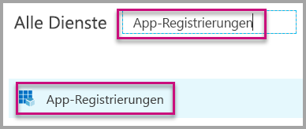</br>
    

4. Folgen Sie den Anweisungen, und erstellen Sie eine neue Anwendung . Für „App Owns Data“ müssen Sie **Nativ** als Anwendungstyp verwenden. Sie müssen auch einen **Umleitungs-URI** angeben, den **Azure AD** zur Rückgabe von Tokenantworten verwendet. Geben Sie einen für Ihre Anwendung spezifischen Wert ein, z.B. `http://localhost:13526/redirect`.

    

### <a name="apply-permissions-to-your-application-within-azure-active-directory"></a>Anwenden von Berechtigungen auf die Anwendung in Azure Active Directory

Sie müssen neben den Einstellungen auf der App-Registrierungsseite zusätzliche Berechtigungen für die Anwendung aktivieren. Sie müssen mit dem *Hauptkonto* angemeldet sein, das zum Einbetten verwendet wird und ein globales Administratorkonto sein muss.

### <a name="use-the-azure-active-directory-portal"></a>Verwenden des Azure Active Directory-Portals

1. Navigieren Sie zu [App-Registrierungen](https://portal.azure.com/#blade/Microsoft_AAD_IAM/ApplicationsListBlade) im Azure-Portal, und wählen Sie die App aus, die Sie für die Einbettung verwenden.
   
    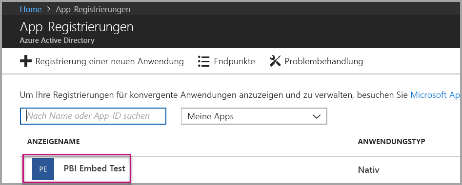

2. Wählen Sie **Einstellungen** und danach unter **API-Zugriff** die Option **Erforderliche Berechtigungen** aus.
   
    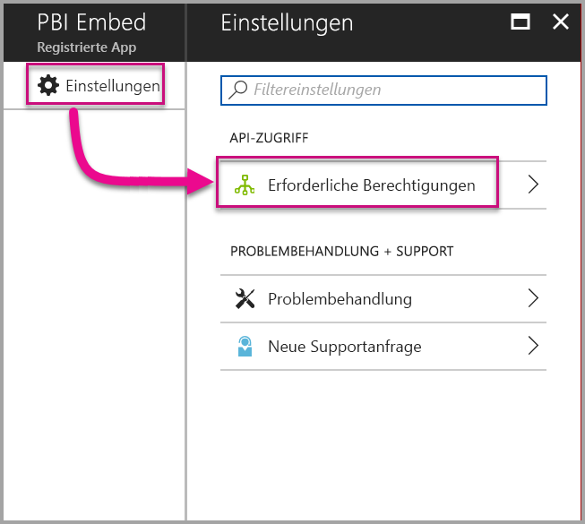

3. Wählen Sie **Windows Azure Active Directory** aus, und stellen Sie sicher, dass **Hiermit greifen Sie als angemeldeter Benutzer auf das Verzeichnis zu** ausgewählt ist. Wählen Sie **Speichern**.
   
    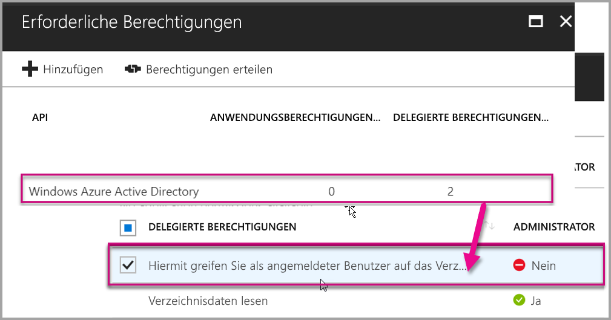

4. Wählen Sie **Hinzufügen**.

    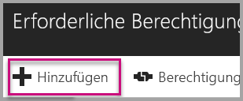

5. Klicken Sie auf **API auswählen**.

    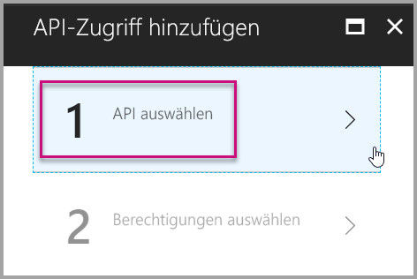

6. Klicken Sie auf **Power BI-Dienst** und dann auf **Auswählen**.

    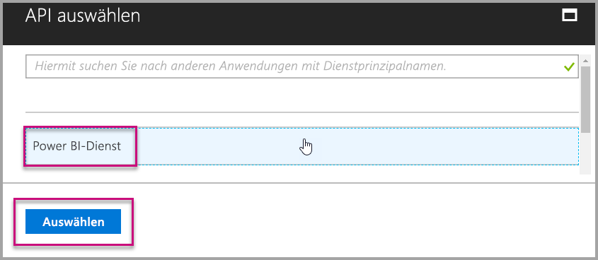

7. Wählen Sie alle Berechtigungen unter **Delegierte Berechtigungen** aus. Sie müssen sie einzeln auswählen, um die Auswahl zu speichern. Wählen Sie **Speichern** aus, wenn Sie fertig sind.
   
    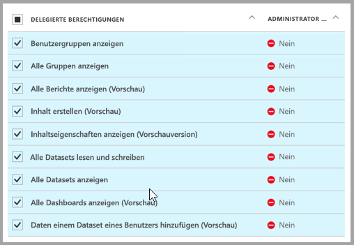

8. Wählen Sie unter **Erforderliche Berechtigungen** die Option **Berechtigungen erteilen** aus.
   
    Die Aktion **Berechtigungen erteilen** benötigt das *Hauptkonto*, damit keine Zustimmung von Azure AD abgefragt wird. Wenn es sich beim Konto, das diese Aktion ausführt, um das Konto eines globalen Administrators handelt, müssen Sie allen Benutzern in der Organisation Berechtigungen für diese Anwendung gewähren. Wenn das Konto, das diese Aktion ausführt, das *Masterkonto* und nicht das Konto des globalen Administrators ist, müssen Sie für diese Anwendung lediglich dem *Masterkonto* Berechtigungen gewähren.
   
    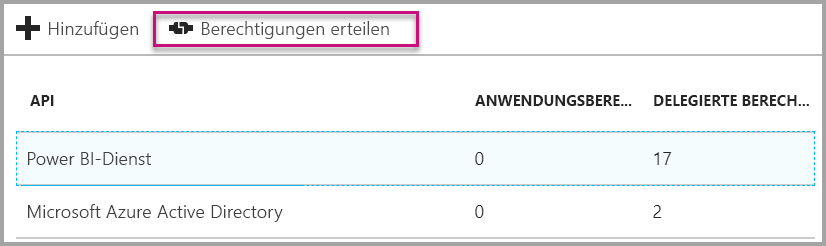

## <a name="setup-your-power-bi-environment"></a>Einrichten Ihrer Power BI-Umgebung

### <a name="create-an-app-workspace"></a>Erstellen eines App-Arbeitsbereichs

Wenn Sie Berichte, Dashboards oder Kacheln für Ihre Kunden einbetten, müssen Sie Ihre Inhalte in einem App-Arbeitsbereich platzieren. Das *Hauptkonto* muss Administrator des App-Arbeitsbereichs sein.

1. Erstellen Sie zunächst den Arbeitsbereich. Wählen Sie **Arbeitsbereiche** > **App-Arbeitsbereich erstellen** aus. Hier legen Sie die Inhalte ab, auf die Ihre Anwendung zugreifen muss.

    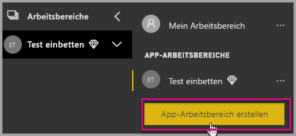

2. Benennen Sie den Arbeitsbereich. Wenn die entsprechende **Arbeitsbereichs-ID** nicht verfügbar ist, geben Sie eine eindeutige ID ein. Diese muss der Name der App sein.

    

3. Sie können einige Optionen festlegen. Wenn Sie **Öffentlich** auswählen, können die Inhalte des Arbeitsbereichs von jedem Benutzer in der Organisation angezeigt werden. **Privat** bedeutet hingegen, dass die Inhalte des Arbeitsbereichs nur von dessen Mitgliedern angezeigt werden können.

    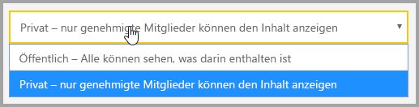

    Sie können die Einstellung „Öffentlich“ bzw. „Privat“ einer Gruppe nach deren Erstellung nicht mehr ändern.

4. Sie können auch auswählen, ob Mitglieder Inhalte **bearbeiten** können oder **schreibgeschützten** Zugriff haben.

    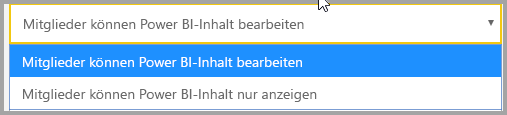

5. Fügen Sie E-Mail-Adressen von Personen hinzu, die Zugriff auf den Arbeitsbereich haben sollen, und wählen Sie **Hinzufügen** aus. Sie können keine Gruppenaliase, sondern nur einzelne Personen hinzufügen.

6. Legen Sie für jede Person fest, ob sie Mitglied oder Administrator ist. Administratoren können den Arbeitsbereich selbst bearbeiten und weitere Mitglieder hinzufügen. Mitglieder können den Inhalt des Arbeitsbereichs bearbeiten, es sei denn, sie haben schreibgeschützten Zugriff. Sowohl Administratoren als auch Mitglieder können die App veröffentlichen.

    Jetzt können Sie den neuen Arbeitsbereich anzeigen. Der Arbeitsbereich wird in Power BI erstellt und geöffnet. Er wird in der Liste der Arbeitsbereiche angezeigt, deren Mitglied Sie sind. Da Sie Administrator sind, können Sie die Auslassungspunkte (...) auswählen, um zurückzukehren, und Änderungen vornehmen, neue Mitglieder hinzufügen oder deren Berechtigungen ändern.

    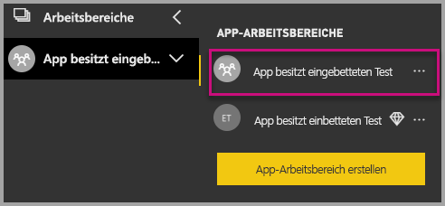

### <a name="create-and-publish-your-reports"></a>Erstellen und Veröffentlichen von Berichten

Sie können Ihre Berichte und Datasets mit Power BI Desktop erstellen und diese Berichte dann in einem App-Arbeitsbereich veröffentlichen. Der Benutzer, der die Berichte veröffentlicht, muss über eine Power BI Pro-Lizenz verfügen, damit er einen App-Arbeitsbereich veröffentlichen kann.

1. Laden Sie das Beispiel von GitHub herunter: [Blog-Demo](https://github.com/Microsoft/powerbi-desktop-samples).

    

2. Öffnen Sie den PBIX-Beispielbericht in **Power BI Desktop**.

   

3. Veröffentlichen Sie den Bericht im **App-Arbeitsbereich**.

   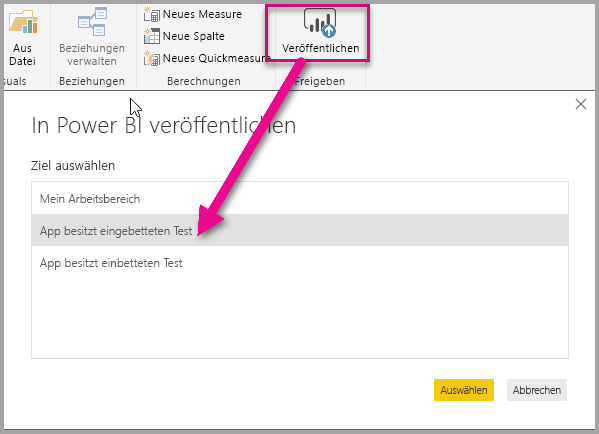

    Jetzt können Sie den Bericht online im Power BI-Dienst anzeigen.

   

## <a name="embed-your-content-using-the-sample-application"></a>Einbetten von Inhalt mit der Beispielanwendung

Führen Sie die folgenden Schritte durch, um Ihren Inhalt in eine Beispielanwendung zu implementieren.

1. Laden Sie das [App Owns Data](https://github.com/Microsoft/PowerBI-Developer-Samples)-Beispiel aus GitHub herunter, um zu beginnen.

    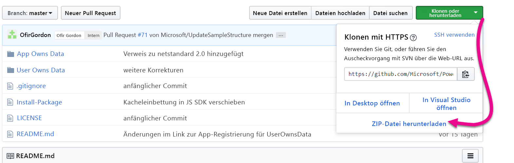

2. Öffnen Sie die Datei „Web.config“ in der Beispielanwendung. Damit die Anwendung erfolgreich ausgeführt werden kann, müssen Sie fünf Felder ausfüllen: die **clientID**, die **groupId**, die **reportId**, der **pbiUsername** und das **pbiPassword**.

    

    Geben Sie für **clientId** die **Anwendungs-ID** aus **Azure** an. Die Anwendung identifiziert sich mithilfe der **clientId** bei den Benutzern, von denen Sie Berechtigungen anfordern. Um die **clientId** abzurufen, führen Sie folgende Schritte aus:

    Melden Sie sich beim [Azure-Portal](https://portal.azure.com) an.

    

    Wählen Sie im Navigationsbereich auf der linken Seite **Alle Dienste** und dann **App-Registrierungen** aus.

    **Suche nach App-Registrierung** Wählen Sie die Anwendung aus, für die Sie die  abrufen möchten.

    

    Sie sollten eine **Anwendungs-ID** sehen, die als GUID aufgeführt ist. Verwenden Sie diese **Anwendungs-ID** als **clientId** für die Anwendung.

    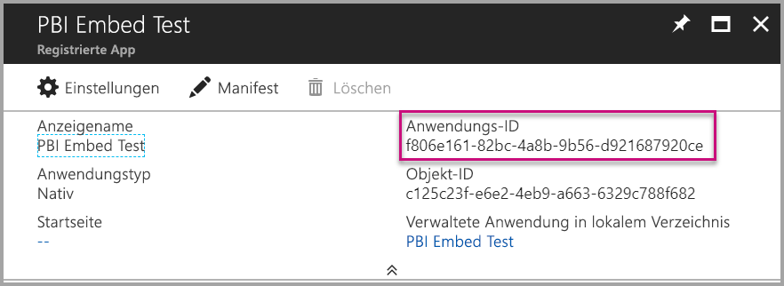

    Geben Sie als **groupId** die **App-Arbeitsbereichs-GUID** aus Power BI an.

    

    Geben Sie als **reportId** die **Berichts-GUID** aus Power BI an.

    

    * Geben Sie als **pbiUsername** das Power BI-Hauptbenutzerkonto an.
    * Geben Sie als **pbiPassword** das Kennwort für das Power BI-Hauptbenutzerkonto an.

3. Führen Sie die Anwendung aus!

    Wählen Sie zunächst in **Visual Studio** die Option **Ausführen** aus.

    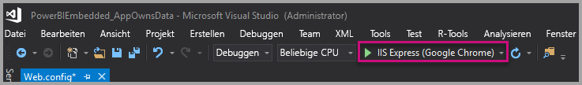

    Wählen Sie dann **Bericht einbetten** aus. Wählen Sie die gewünschte Option in der Anwendung aus, je nachdem, mit welchem Inhalt Sie testen möchten: Berichte, Dashboards oder Kacheln.

    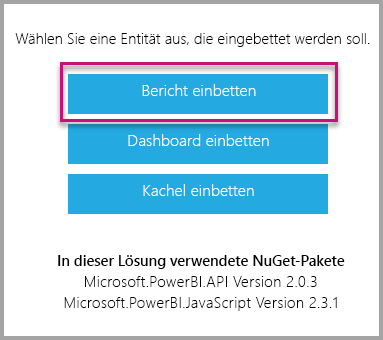

    Jetzt können Sie den Bericht in der Beispielanwendung anzeigen.

    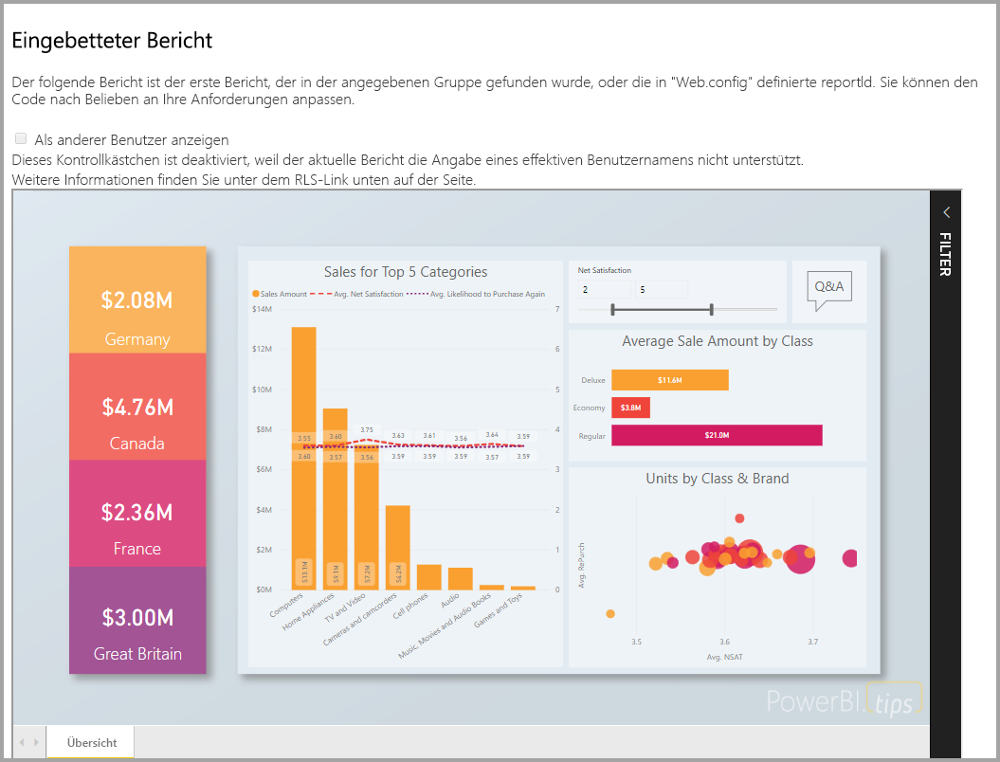

## <a name="embed-your-content-within-your-application"></a>Einbetten von Inhalt in Ihre Anwendung
Auch wenn die Schritte zum Einbetten des Inhalts mit den [Power BI-REST-APIs](https://docs.microsoft.com/rest/api/power-bi/) durchgeführt werden können, werden die in diesem Artikel beschriebenen Beispielcodes mit dem **.NET SDK** erstellt.

Damit Kunden Einbettungen in der Anwendung vornehmen können, müssen Sie ein **Zugriffstoken** für Ihr Hauptkonto von **Azure AD** besorgen. Es ist erforderlich, dass Sie zunächst über ein [Azure AD-Zugriffstoken](get-azuread-access-token.md#access-token-for-non-power-bi-users-app-owns-data) für Ihre Power BI-Anwendung mit **App Owns Data** verfügen, bevor Sie Aufrufe an die [Power BI-REST-APIs](https://docs.microsoft.com/rest/api/power-bi/) durchführen.

Sie sollten ein Power BI-Clientobjekt erstellen, durch das Sie mit den [Power BI-REST-APIs](https://docs.microsoft.com/rest/api/power-bi/) interagieren zu können, um den Power BI-Client mit Ihrem **Zugriffstoken** zu erstellen. Dies erfolgt durch Einschließen des **Zugriffstokens** in ein ***Microsoft.Rest.TokenCredentials***-Objekt.

```csharp
using Microsoft.IdentityModel.Clients.ActiveDirectory;
using Microsoft.Rest;
using Microsoft.PowerBI.Api.V2;

var tokenCredentials = new TokenCredentials(authenticationResult.AccessToken, "Bearer");

// Create a Power BI Client object. It is used to call Power BI APIs.
using (var client = new PowerBIClient(new Uri(ApiUrl), tokenCredentials))
{
    // Your code to embed items.
}
```

### <a name="get-the-content-item-you-want-to-embed"></a>Abrufen des einzubettenden Inhaltselements
Sie können mit dem Power BI-Clientobjekt einen Verweis auf das Element abrufen, das eingebettet werden soll.

Im folgenden Codebeispiel wird veranschaulicht, wie Sie den ersten Bericht aus einem bestimmten Arbeitsbereich abrufen.

*In der Datei „Controllers\HomeController.cs“ in der [Beispielanwendung](#embed-your-content-within-a-sample-application) finden Sie ein Beispiel zum Abrufen eines Inhaltselements (sei es ein Bericht, ein Dashboard oder eine Kachel), das Sie einbetten sollten.*

```csharp
using Microsoft.PowerBI.Api.V2;
using Microsoft.PowerBI.Api.V2.Models;

// You need to provide the GroupID where the dashboard resides.
ODataResponseListReport reports = client.Reports.GetReportsInGroupAsync(GroupId);

// Get the first report in the group.
Report report = reports.Value.FirstOrDefault();
```

### <a name="create-the-embed-token"></a>Erstellen des Einbettungstokens
Es muss ein Einbettungstoken generiert werden, das aus der JavaScript-API verwendet werden kann. Das Einbettungstoken ist spezifisch für das eingebettete Element. Das heißt, dass Sie bei jedem Einbetten eines Power BI-Inhaltselements dafür ein neues Einbettungstoken erstellen müssen. Weitere Informationen hierzu, u.a. zum erforderlichen **accessLevel**, finden Sie unter [GenerateToken-API](https://msdn.microsoft.com/library/mt784614.aspx).

Hier sehen Sie ein Beispiel für das Hinzufügen eines Einbettungstokens für einen Bericht zu Ihrer Anwendung.

*In der Datei „Controllers\HomeController.cs“ in der [Beispielanwendung](#embed-your-content-within-a-sample-application) finden Sie ein Beispiel zum Erstellen eines Einbettungstokens (sei es ein Bericht, ein Dashboard oder eine Kachel).*

```csharp
using Microsoft.PowerBI.Api.V2;
using Microsoft.PowerBI.Api.V2.Models;

// Generate Embed Token.
var generateTokenRequestParameters = new GenerateTokenRequest(accessLevel: "view");
EmbedToken tokenResponse = client.Reports.GenerateTokenInGroup(GroupId, report.Id, generateTokenRequestParameters);

// Generate Embed Configuration.
var embedConfig = new EmbedConfig()
{
    EmbedToken = tokenResponse,
    EmbedUrl = report.EmbedUrl,
    Id = report.Id
};
```

Dabei wird angenommen, dass eine Klasse für **EmbedConfig** und **TileEmbedConfig** erstellt wird. Ein Beispiel hierfür ist in der Datei **Models\EmbedConfig.cs** und der Datei **Models\TileEmbedConfig.cs** verfügbar.

### <a name="load-an-item-using-javascript"></a>Laden eines Elements mit JavaScript
Sie können mithilfe von JavaScript einen Bericht in ein div-Element auf Ihrer Webseite laden. 

Im Beispiel wird ein Modell **EmbedConfig** und ein Modell **TileEmbedConfig** mit Ansichten für einen Bericht verwendet.

*In den Dateien „Views\Home\EmbedReport.cshtml“, „Views\Home\EmbedDashboard.cshtml“ und „Views\Home\Embedtile.cshtml“ in der [Beispielanwendung](#embed-your-content-within-a-sample-application) finden Sie ein Beispiel für das Hinzufügen einer Ansicht zu einem Bericht, Dashboard oder einer Kachel.*

```javascript
<script src="~/scripts/powerbi.js"></script>
<div id="reportContainer"></div>
<script>
    // Read embed application token from Model
    var accessToken = "@Model.EmbedToken.Token";

    // Read embed URL from Model
    var embedUrl = "@Html.Raw(Model.EmbedUrl)";

    // Read report Id from Model
    var embedReportId = "@Model.Id";

    // Get models. models contains enums that can be used.
    var models = window['powerbi-client'].models;

    // Embed configuration used to describe the what and how to embed.
    // This object is used when calling powerbi.embed.
    // This also includes settings and options such as filters.
    // You can find more information at https://github.com/Microsoft/PowerBI-JavaScript/wiki/Embed-Configuration-Details.
    var config = {
        type: 'report',
        tokenType: models.TokenType.Embed,
        accessToken: accessToken,
        embedUrl: embedUrl,
        id: embedReportId,
        permissions: models.Permissions.All,
        settings: {
            filterPaneEnabled: true,
            navContentPaneEnabled: true
        }
    };

    // Get a reference to the embedded report HTML element
    var reportContainer = $('#reportContainer')[0];

    // Embed the report and display it within the div container.
    var report = powerbi.embed(reportContainer, config);
</script>
```

Ein komplettes Beispiel für die Verwendung der JavaScript-API ist im [Playground-Tool](https://microsoft.github.io/PowerBI-JavaScript/demo) verfügbar. Dies ist eine schnelle Möglichkeit, verschiedene Arten von Power BI Embedded-Beispielen auszuprobieren. Weitere Informationen zur JavaScript-API finden Sie auch auf der [Power BI-JavaScript-Wikiseite](https://github.com/Microsoft/powerbi-javascript/wiki).

## <a name="move-to-production"></a>In die Produktionsphase wechseln

Wenn Sie mit dem Entwickeln Ihrer Anwendung fertig sind, sollten Sie Ihren App-Arbeitsbereich durch dedizierte Kapazität absichern. Dedizierte Kapazität ist erforderlich, um in die Produktionsphase wechseln zu können.

### <a name="create-a-dedicated-capacity"></a>Erstellen einer dedizierten Kapazität
Wenn Sie eine dedizierte Kapazität erstellen, können Sie Ihrem Kunden eine dedizierte Ressource zuweisen. Arbeitsbereiche, die keiner dedizierten Kapazität zugeordnet sind, müssen in einer gemeinsam genutzten Kapazität ausgeführt werden. Sie können mit [der dedizierten Power BI Embedded-Kapazität](https://docs.microsoft.com/azure/power-bi-embedded/create-capacity) in Azure eine dedizierte Kapazität erstellen.

Da Einbettungstokens mit PRO-Lizenzen nur für Bereitstellungen und das Testen von Bereitstellungen vorgesehen sind, ist die Anzahl von Einbettungstokens limitiert, die ein Power BI-Hauptkonto generieren kann. Sie müssen eine dedizierte Kapazität erwerben, um Einbettungen in einer Produktionsumgebung vornehmen zu können. Sie können mit einer dedizierten Kapazität so viele eingebettete Token wie Sie möchten generieren. Verwenden Sie die Vorgänge zum Abrufen [verfügbarer Features](https://docs.microsoft.com/rest/api/power-bi/availablefeatures/getavailablefeatures), um den Auslastungswert zu überprüfen, der die derzeit eingebettete Auslastung in Prozent angibt. Der Verbrauchsbetrag errechnet sich pro Hauptkonto.

### <a name="assign-an-app-workspace-to-a-dedicated-capacity"></a>Zuweisen eines App-Arbeitsbereichs zu einer dedizierten Kapazität

Sobald Sie dedizierte Kapazität erstellt haben, weisen Sie der dedizierten Kapazität den App-Arbeitsbereich zu. Führen Sie die folgenden Schritte durch, um den Vorgang abzuschließen.

1. Erweitern Sie im **Power BI-Dienst** Arbeitsbereiche, und klicken Sie auf die Auslassungspunkte neben dem Arbeitsbereich, den Sie zur Einbettung von Inhalt verwenden. Klicken Sie dann auf **Arbeitsbereich bearbeiten**.

    

2. Erweitern Sie **Erweitert**, aktivieren Sie **Dedizierte Kapazität**, und wählen Sie die dedizierte Kapazität aus, die Sie erstellt haben. Klicken Sie auf **Speichern**.

    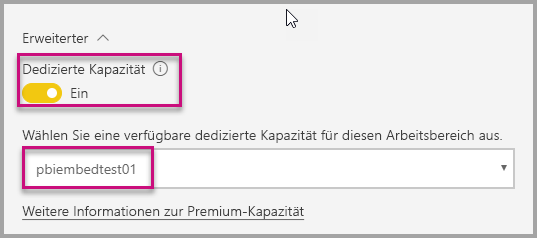

Wenn Sie weitere Fragen zu Power BI Embedded haben, besuchen Sie die Seite mit den [häufig gestellten Fragen](embedded-faq.md).  Wenn Probleme mit Power Bi Embedded in Ihrer Anwendung auftreten, besuchen Sie die Seite für die [Problembehandlung](embedded-troubleshoot.md).

Weitere Fragen? [Stellen Sie Ihre Frage in der Power BI-Community.](http://community.powerbi.com/)