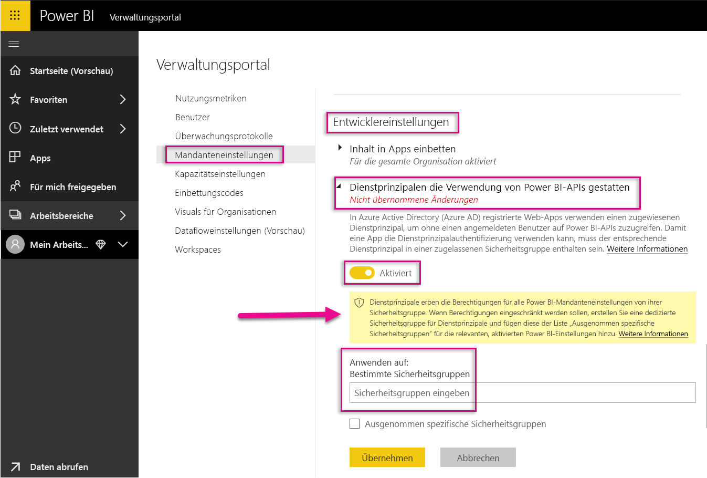
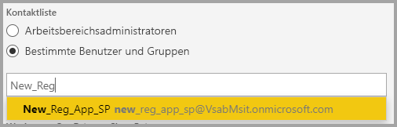
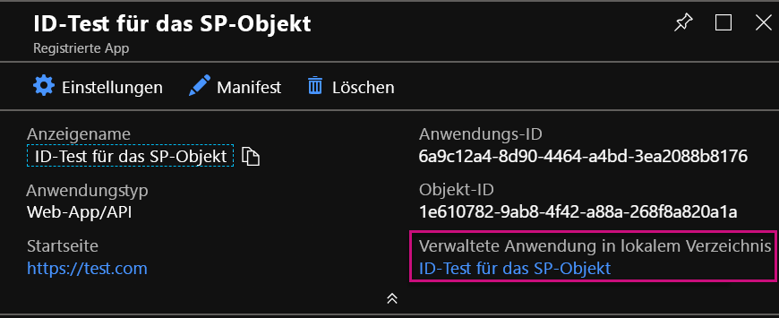
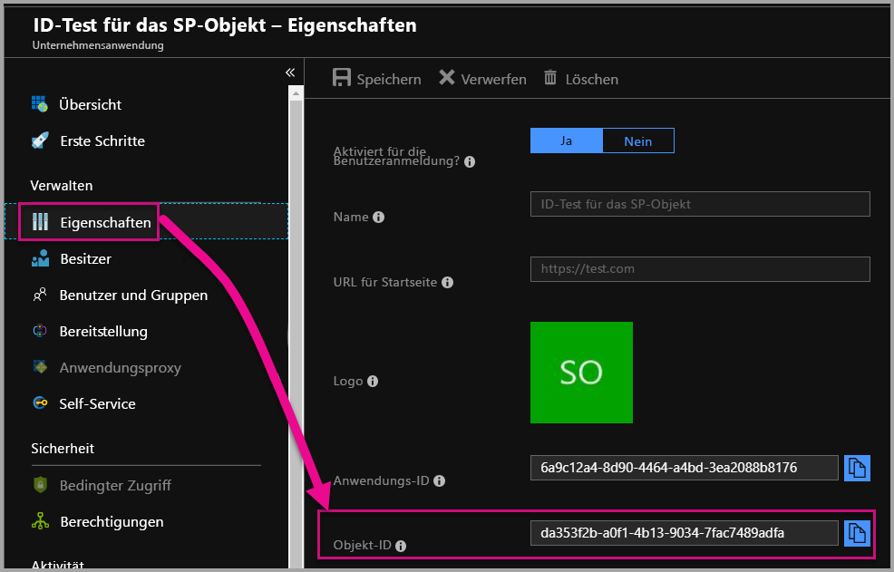

# <a name="service-principal-with-power-bi-preview"></a>Dienstprinzipal in Power BI (Vorschauversion)

Mit **Dienstprinzipalen** können Sie Power BI-Inhalt in eine Anwendung einbetten und über ein **Token nur für eine Anwendung** die Automatisierung in Power BI verwenden. Ein Dienstprinzipal ist hilfreich, wenn Sie **Power BI Embedded** verwenden oder **Aufgaben und Prozesse in Power BI automatisieren möchten**.

Wenn Sie mit Power BI Embedded arbeiten, gibt es Vorteile, wenn Sie einen Dienstprinzipal verwenden. Ein Hauptvorteil ist, dass Sie kein Hauptkonto (eine Power BI Pro-Lizenz, d. h. im Prinzip ein Benutzername und ein Kennwort für die Anmeldung) benötigen, um sich in Ihrer Anwendung zu authentifizieren. Dienstprinzipale verwenden die Anwendungs-ID und das Anwendungsgeheimnis, um die Anwendung zu authentifizieren.

Wenn Sie Aufgaben in Power BI automatisieren möchten, können Sie auch ein Skript darüber erstellen, wie zu skalierende Dienstprinzipale verarbeitet und verwaltet werden sollen.

## <a name="application-and-service-principal-relationship"></a>Beziehung zwischen Anwendung und Dienstprinzipal

Damit auf Ressourcen zugegriffen werden kann, die einen Azure AD-Mandanten schützen, stellt die Entität, die Zugriff benötigt, einen Dienstprinzipal dar. Diese Aktion gilt für Benutzer (Benutzerprinzipal) und Anwendungen (Dienstprinzipal).

Der Sicherheitsprinzipal bestimmt die Zugriffsrichtlinie und Berechtigungen für Benutzer und Anwendungen im Azure AD-Mandanten. Diese Zugriffsrichtlinie aktiviert Kernfeatures wie die Authentifizierung von Benutzern und Anwendungen bei der Anmeldung und die Autorisierung während des Zugriffs auf Ressourcen. Weitere Informationen finden Sie unter [Anwendungs- und Dienstprinzipalobjekte in Azure Active Directory (AAD)](https://docs.microsoft.com/azure/active-directory/develop/app-objects-and-service-principals).

Wenn Sie im Azure-Portal eine Azure AD-Anwendung registrieren, werden in Ihrem Azure AD-Mandanten zwei Objekte erstellt:

* Ein [Anwendungsobjekt](https://docs.microsoft.com/azure/active-directory/develop/app-objects-and-service-principals#application-object)
* Ein [Dienstprinzipalobjekt](https://docs.microsoft.com/azure/active-directory/develop/app-objects-and-service-principals#service-principal-object)

Stellen Sie sich das Anwendungsobjekt als *globale* Repräsentation Ihrer Anwendung vor, das mandantenübergreifend verwendet werden kann, und das Dienstprinzipalobjekt als *lokale* Repräsentation, das für einen bestimmten Mandanten verwendet wird.

Das Anwendungsobjekt dient als Vorlage, von der allgemeine und Standardeigenschaften *abgeleitet* werden, um dazu verwendet zu werden, entsprechende Dienstprinzipalobjekte zu erstellen.

Ein Dienstprinzipal ist pro Mandant erforderlich, in dem die Anwendung verwendet wird. So kann eine Identität für die Anmeldung und für den Zugriff auf Ressourcen erstellt werden, die vom Mandanten geschützt werden. Eine Anwendung mit einem Mandanten hat nur einen Dienstprinzipal (in ihrem Basismandanten). Dieser wird erstellt und genehmigt, um während der Registrierung der Anwendung verwendet zu werden.

## <a name="service-principal-with-power-bi-embedded"></a>Dienstprinzipal in Power BI Embedded

Über den Dienstprinzipal können Sie eine Maske für die Informationen des Hauptkontos in Ihrer Anwendung verwenden, indem Sie eine Anwendungs-ID und ein Anwendungsgeheimnis verwenden. Ein Hauptkonto in Ihrer Anwendung muss also für die Authentifizierung nicht mehr hartcodiert werden.

Da **Power BI-APIs** und das **Power BI .NET SDK** nun Aufrufe über einen Dienstprinzipal unterstützen, können Sie [Power BI REST-APIs](https://docs.microsoft.com/rest/api/power-bi/) mit einem Dienstprinzipal verwenden. Sie können Arbeitsbereiche beispielsweise erstellen oder sie ändern, indem Sie Benutzer Arbeitsbereichen hinzufügen oder sie daraus entfernen und Inhalt in Arbeitsbereiche importieren.

Sie können einen Dienstprinzipal nur verwenden, wenn Ihre Artefakte und Ressourcen von Power BI im [neuen Power BI-Arbeitsbereich](../service-create-the-new-workspaces.md) gespeichert sind.

## <a name="service-principal-vs-master-account"></a>Dienstprinzipal und Hauptkonto im Vergleich

Es bestehen Unterschiede, je nachdem, ob Sie für die Authentifizierung einen Dienstprinzipal oder ein standardmäßiges Hauptkonto (Power BI Pro-Lizenz) verwenden. In der untenstehenden Tabelle sehen Sie einige bedeutende Unterschiede:

| aufrufen | Hauptbenutzerkonto <br> (Power BI Pro-Lizenzen) | Dienstprinzipal <br> (Token nur für Anwendungen) |
|------------------------------------------------------|---------------------|-------------------|
| Anmeldung beim Power BI-Dienst möglich?  | Ja | Nein |
| Im Power BI-Verwaltungsportal aktiviert? | Nein | Ja |
| [Funktioniert mit Anwendungsarbeitsbereichen (v1)?](../service-create-workspaces.md) | Ja | Nein |
| [Funktioniert mit den neuen Anwendungsarbeitsbereichen (v2)?](../service-create-the-new-workspaces.md) | Ja | Ja |
| Arbeitsbereichsadministrator erforderlich bei Verwendung in Power BI Embedded? | Ja | Ja |
| Kann Power BI-REST-APIs verwenden? | Ja | Ja |
| Benötigt für die Erstellung einen globalen Administrator? | Ja | Nein |
| Kann ein lokales Datengateway installieren und verwalten? | Ja | Nein |

## <a name="get-started-with-a-service-principal"></a>Erste Schritte mit einem Dienstprinzipal

Im Gegensatz zur traditionellen Verwendung eines Hauptkontos müssen für die Verwendung eines Dienstprinzipals (Token nur für eine Anwendung) verschiedene Dinge eingerichtet werden. Wenn Sie direkt mit einem Dienstprinzipal (Token nur für Anwendungen) loslegen möchten, müssen Sie die dafür geeignete Umgebung einrichten.

1. [Registrieren Sie eine serverseitige Webanwendung](register-app.md) in Azure Active Directory (AAD), die mit Power BI verwendet werden soll. Nachdem eine Anwendung registriert wurde, können Sie eine Anwendungs-ID, ein Anwendungsgeheimnis und die Objekt-ID des Dienstprinzipalobjekts erfassen, um auf Ihren Power BI-Inhalt zugreifen zu können. Sie können einen Dienstprinzipal mit [PowerShell](https://docs.microsoft.com/powershell/azure/create-azure-service-principal-azureps?view=azps-1.1.0) erstellen.

    Unten finden Sie ein Beispielskript, um eine neue Azure Active Directory-Anwendung zu erstellen.

    ```powershell
    # The app id - $app.appid
    # The service principal object id - $sp.objectId
    # The app key - $key.value

    # Sign in as a user that is allowed to create an app.
    Connect-AzureAD

    # Create a new AAD web application
    $app = New-AzureADApplication -DisplayName "testApp1" -Homepage "https://localhost:44322" -ReplyUrls "https://localhost:44322"

    # Creates a service principal
    $sp = New-AzureADServicePrincipal -AppId $app.AppId

    # Get the service principal key.
    $key = New-AzureADServicePrincipalPasswordCredential -ObjectId $sp.ObjectId
    ```

   > [!Important]
   > Sobald Sie angeben, dass ein Dienstprinzipal mit Power BI verwendet werden soll, sind die AD-Berechtigungen der Anwendung nicht länger wirksam. Die Anwendungsberechtigungen werden dann über das Power BI-Verwaltungsportal verwaltet.

2. Erstellen Sie eine [Sicherheitsgruppe in Azure Active Directory (AAD)](https://docs.microsoft.com/azure/active-directory/fundamentals/active-directory-groups-create-azure-portal), und fügen Sie dieser Sicherheitsgruppe die von Ihnen erstellte Anwendung hinzu. Sie können eine AAD-Sicherheitsgruppe mit [PowerShell](https://docs.microsoft.com/powershell/azure/create-azure-service-principal-azureps?view=azps-1.1.0) erstellen.

    Unten finden Sie ein Beispielskript, wie eine neue Sicherheitsgruppe erstellt wird, und wie dieser Sicherheitsgruppe eine Anwendung hinzugefügt wird.

    ```powershell
    # Required to sign in as a tenant admin
    Connect-AzureAD

    # Create an AAD security group
    $group = New-AzureADGroup -DisplayName <Group display name> -SecurityEnabled $true -MailEnabled $false -MailNickName notSet

    # Add the service principal to the group
    Add-AzureADGroupMember -ObjectId $($group.ObjectId) -RefObjectId $($sp.ObjectId)
    ```

3. Als Power BI-Administrator müssen Sie Dienstprinzipale in den **Entwicklereinstellungen** im Power BI-Verwaltungsportal aktivieren. Fügen Sie die Sicherheitsgruppe, die Sie erstellt haben, dem Bereich **Sicherheitsgruppen angeben** in den **Entwicklereinstellungen** hinzu.

   > [!Important]
   > Dienstprinzipale haben Zugriff auf alle Mandanteneinstellungen, die für die gesamte Organisation oder für die Sicherheitsgruppen aktiviert sind, die als Teil der Gruppe Dienstprinzipale besitzen. Genehmigen Sie nur bestimmten Sicherheitsgruppen Zugriff, oder erstellen Sie eine dedizierte Sicherheitsgruppe für Dienstprinzipale, und schließen Sie sie aus, um den Zugriff von Dienstprinzipalen auf bestimmte Mandanteneinstellungen zu beschränken.

    

4. Richten Sie Ihre [Power BI-Umgebung](embed-sample-for-customers.md#set-up-your-power-bi-environment) ein.

5. Fügen Sie dem neuen Arbeitsbereich den Dienstprinzipal als **Administrator** hinzu. Sie können diese Aufgabe über die [APIs](https://docs.microsoft.com/rest/api/power-bi/groups/addgroupuser) oder den Power BI-Dienst verwalten.

    

6. Wählen Sie nun aus, dass Ihr Inhalt in eine Beispielanwendung oder Ihre eigene Anwendung eingebettet werden soll.

    * [Einbetten von Inhalt mit der Beispielanwendung](embed-sample-for-customers.md#embed-content-using-the-sample-application)
    * [Einbetten von Inhalt in Ihre Anwendung](embed-sample-for-customers.md#embed-content-within-your-application)

7. Nun sind Sie bereit, [mit der Produktion zu starten](embed-sample-for-customers.md#move-to-production).

## <a name="migrate-to-service-principal"></a>Migrieren zum Dienstprinzipal

Sie können eine Migration durchführen, um den Dienstprinzipal zu verwenden, wenn Sie momentan in Power BI oder in Power BI Embedded ein Hauptkonto verwenden.

Führen Sie die ersten drei Schritte im Abschnitt [Erste Schritte mit einem Dienstprinzipal](#get-started-with-a-service-principal) aus. Gehen Sie danach den untenstehenden Informationen gemäß vor.

Wenn Sie in Power BI bereits [neue Arbeitsbereiche](../service-create-the-new-workspaces.md) verwenden, fügen Sie als **Administrator** den Dienstprinzipal den Arbeitsbereichen mit Ihren Power BI-Artefakten hinzu. Wenn Sie jedoch die [traditionellen Arbeitsbereiche](../service-create-workspaces.md) verwenden, kopieren oder verschieben Sie Ihre Power BI-Artefakte und -Ressourcen in die neuen Arbeitsbereiche, und fügen Sie diesen Arbeitsbereichen den Dienstprinzipal als **Administrator** hinzu.

Es gibt ein UI-Feature, mit dem Sie Power BI-Artefakte und -Ressourcen von einem Arbeitsbereich in einen anderen verschieben können, Sie müssen für diese Aufgabe also [APIs](https://powerbi.microsoft.com/pt-br/blog/duplicate-workspaces-using-the-power-bi-rest-apis-a-step-by-step-tutorial/) verwenden. Wenn Sie die APIs mit einem Dienstprinzipal verwenden, benötigen Sie die Objekt-ID des Dienstprinzipals.

### <a name="how-to-get-the-service-principal-object-id"></a>So erhalten Sie die Dienstprinzipalobjekt-ID

Wenn Sie einem neuen Anwendungsarbeitsbereich einen Dienstprinzipal zuweisen möchten, verwenden Sie die [Power BI-REST-APIs](https://docs.microsoft.com/rest/api/power-bi/groups/addgroupuser). Wenn Sie für Vorgänge auf einen Dienstprinzipal verweisen oder Änderungen vornehmen möchten, z.B. einen Dienstprinzipal als Administrator auf einen Arbeitsbereich anwenden, verwenden Sie die **Objekt-ID des Dienstprinzipals**.

Unten finden Sie eine Anleitung, wie Sie die Objekt-ID des Dienstprinzipals aus dem Azure-Portal erhalten.

1. Erstellen Sie im Azure-Portal eine neue App-Registrierung.  

2. Wählen Sie dann unter **Verwaltete Anwendung in lokalem Verzeichnis** den Namen der Anwendung aus, die Sie erstellt haben.

   

    > [!Note]
    > Die Objekt-ID im Bild oben ist nicht diejenige, die für den Dienstprinzipal verwendet wird.

3. Klicken Sie auf **Eigenschaften**, damit die Objekt-ID angezeigt wird.

    

Unten sehen Sie ein Beispielskript, mit dem Sie die Objekt-ID des Dienstprinzipals in PowerShell abrufen können.

   ```powershell
   Get-AzureADServicePrincipal -Filter "DisplayName eq '<application name>'"
   ```

## <a name="considerations-and-limitations"></a>Überlegungen und Einschränkungen

* Dienstprinzipale sind nur für [neue Anwendungsarbeitsbereiche](../service-create-the-new-workspaces.md) geeignet.
* **Mein Arbeitsbereich** wird nicht unterstützt, wenn ein Dienstprinzipal verwendet wird.
* Dedizierte Kapazität ist erforderlich, um in die Produktionsphase wechseln zu können.
* Sie können sich über den Dienstprinzipal nicht im Power BI-Portal anmelden.
* Power BI-Administratorberechtigungen sind erforderlich, um Dienstprinzipale in den Entwicklereinstellungen im Power BI-Verwaltungsportal aktivieren zu können.
* Sie können ein lokales Datengateway über den Dienstprinzipal weder installieren noch verwalten.
* [Für Ihre Organisation eingebettete Anwendungen](embed-sample-for-your-organization.md) können Dienstprinzipale nicht verwenden.
* Die Verwaltung von [Datenflüssen](../service-dataflows-overview.md) wird nicht unterstützt.
* Der Dienstprinzipal unterstützt aktuell überhaupt keine Administrator-APIs.

## <a name="next-steps"></a>Nächste Schritte

* [Registrieren einer Azure AD-App zum Einbetten von Power BI-Inhalten](register-app.md)
* [Tutorial: Einbetten von Power BI-Berichten, -Dashboards oder -Kacheln in eine Anwendung für Ihre Kunden](embed-sample-for-customers.md)
* [Anwendungs- und Dienstprinzipalobjekte in Azure Active Directory](https://docs.microsoft.com/azure/active-directory/develop/app-objects-and-service-principals)
* [Sicherheit auf Zeilenebene bei Verwendung eines lokalen Datengateways mit Dienstprinzipal (Vorschau)](embedded-row-level-security.md#on-premises-data-gateway-with-service-principal-preview)
