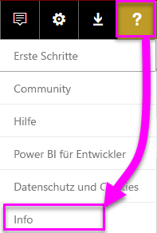
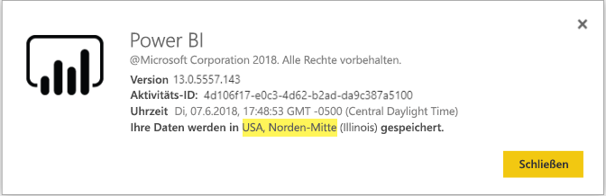

# <a name="frequently-asked-questions-about-power-bi-embedded"></a>Häufig gestellte Fragen zu Power BI Embedded

* Wenn Sie weitere Fragen haben, [stellen Sie sie in der Power BI-Community](http://community.powerbi.com/).
* Treten weiterhin Probleme auf? Besuchen Sie die [Supportseite für Power BI](https://powerbi.microsoft.com/support/).

## <a name="general"></a>Allgemein

### <a name="what-is-power-bi-embedded"></a>Was ist Power BI Embedded?

[Microsoft Power BI Embedded (PBIE)](azure-pbie-what-is-power-bi-embedded.md) können Anwendungsentwickler beeindruckende, hochgradig interaktive Berichte in ihre Anwendungen einbetten, ohne eigene datenvisualisierungen und Steuerelemente von Grund auf neu erstellen zu müssen.

### <a name="who-is-the-target-audience-for-power-bi-embedded"></a>Für wen ist Power BI Embedded gedacht?

Entwickler und Software-Unternehmen, auch bekannt als unabhängiger Softwarehersteller (ISVs), Schreiben von Anwendungen.

### <a name="how-is-power-bi-embedded-different-from-power-bi-the-service"></a>Worin unterscheidet sich Power BI Embedded vom Power BI-Dienst?

Power BI ist eine Software-as-a-Service-Analyselösung, die Organisationen eine zentrale Ansicht ihrer wichtigsten Geschäftsdaten bietet.

Microsoft entwickelt Power BI Embedded für unabhängige Softwarehersteller, betten Sie Visuals in ihren Anwendungen zur Unterstützung ihrer Kunden bei analytischen Entscheidungen zu treffen möchten. Dies erspart ISVs, eigene analyselösung selbst erstellen müssen. [Eingebettete Analysen](embedding.md) ermöglicht Geschäftskunden den Zugriff auf Geschäftsdaten und Ausführen von Abfragen für diese Einblicke innerhalb der Anwendung zu generieren.


### <a name="what-is-the-difference-between-power-bi-premium-and-power-bi-embedded"></a>Worin unterscheidet sich Power BI Premium von Power BI Embedded?

Power BI Premium ist die Kapazität, die Unternehmen, die eine umfassende BI-Lösung werden soll, die eine übersichtliche Darstellung der Organisation, Partnern, Kunden und Lieferanten bietet zugeschnitten. Power BI Premium unterstützt Ihr Unternehmen bei der Entscheidungsfindung. Power BI Premium ist ein SaaS-Produkt, das Benutzern ermöglicht, die Inhalte über mobile apps, die intern entwickelten apps oder mit dem Power BI-Portal zu verwenden.

Power BI Embedded ist für unabhängige Softwarehersteller, die Visualisierungen in ihre Anwendungen einbetten möchten. Power BI Embedded unterstützt Ihre Kunden bei der Entscheidungsfindung, und da Power BI Embedded auf Anwendungsentwickler ausgerichtet ist, können diese Kunden der Anwendung und beliebige Benutzer innerhalb und außerhalb der Organisation Inhalte verarbeiten, die in der Power BI Embedded-Kapazität gespeichert sind. Sie können nicht freigegeben, Power BI Embedded-Kapazität Inhalte über einen einfachen Mausklick im Web veröffentlichen oder One-Click-Veröffentlichung in SharePoint.

### <a name="what-is-the-microsoft-recommendation-for-when-a-customer-should-buy-power-bi-premium-vs-power-bi-embedded"></a>Welche Empfehlungen gibt Microsoft Kunden für die Entscheidung zwischen Power BI Premium und Power BI Embedded?

Microsoft empfiehlt, dass Unternehmen Power BI Premium, ein Unternehmen, die Self-service-Cloud-BI-Lösung kaufen. Es wird empfohlen, dass die ISVs, die für die Cloud-cloudgestützten eingebetteten Analysekomponenten Power BI Embedded erwerben. Ein Kunde hat jedoch keine Einschränkung für welches Produkt kaufen.

Möglicherweise gibt es einige Fälle, in dem ein ISV (in der Regel großen), zusätzlich zu app einbetten, die eine P-SKU zu verwenden, um den zusätzlichen Vorteilen des vorkonfigurierten Power BI-Dienst in ihrer Organisation erhalten möchte. Einige Unternehmen entscheiden sich möglicherweise nur für A-SKUs in Azure, weil sie Branchenanwendungen erstellen und Analysefunktionen in diese einbetten möchten und nicht daran interessiert sind, den vorkonfigurierten Power BI-Dienst zu nutzen.

### <a name="how-many-embed-tokens-can-i-create"></a>Wie viele Einbettungstokens kann ich erstellen?

Betten Sie Token mit PRO-Lizenz für Entwicklungstests vorgesehen sind, damit Power BI-Hauptkonto oder [Dienstprinzipal](embed-service-principal.md) kann nur eine begrenzte Anzahl von Token generieren. [Erwerben Sie eine Kapazität](#technical), um Einbettungen in einer Produktionsumgebung vornehmen zu können. Es gibt keine Beschränkung, wie viele generiert werden können einbettungstokens, wenn Sie eine Kapazität erwerben. Verwenden Sie die Vorgänge zum Abrufen [verfügbarer Features](https://docs.microsoft.com/rest/api/power-bi/availablefeatures), um den Auslastungswert zu überprüfen, der die derzeit eingebettete Auslastung in Prozent angibt.

## <a name="technical"></a>Technische Fragen

### <a name="what-is-the-difference-between-the-a-skus-in-azure-and-the-em-skus-in-office-365"></a>Worin unterscheiden sich die A-SKUs in Azure von den EM-SKUs in Office 365?

"Powerbi.com" ist ein Unternehmen Software as a Service (SaaS)-Lösung mit vielen Funktionen wie z. B. Zusammenarbeit im sozialen Netzwerk-e-Mail-Abonnement und anderen Funktionen. "Powerbi.com" hilft ISVs, verwalten ihre eingebettete analyselösung Inhalte und Einstellungen von Mandanten.

Power BI Embedded ist eine Plattform als Satz von a-Service (PaaS) von APIs Entwickler verwenden kann, um eine eingebettete analyselösung zu erstellen.

Hier ist eine unvollständige Liste der Funktionsunterschiede.

| Feature | Power BI Embedded | Power BI Premium-Kapazität | Power BI Premium-Kapazität |
|----------------------------------------------------------------------------------|-------------------|---------------------------|---------------------------|
|   | (A-SKUs) | (EM-SKUs) | (P-SKUs) |
| Einbetten von Artefakten aus dem Power BI-App-Arbeitsbereich | Azure-Kapazität | Office 365-Kapazität | Office 365-Kapazität |
| Power BI-Berichte in einer Embedded-Anwendung nutzen | Ja | Ja | Ja |
| Power BI-Berichte in SharePoint nutzen | Nein | Ja | Ja |
| Power BI-Berichte in Dynamics nutzen | Nein | Ja | Ja |
| Power BI-Berichte in Teams nutzen (keine mobile App) | Nein | Ja | Ja |
| Mit einer kostenlosen Power BI-Lizenz auf Inhalte unter Powerbi.com und Power BI Mobile zugreifen | Nein | Nein | Ja |
| Mit einer kostenlosen Power BI-Lizenz auf in Microsoft Office-Apps eingebettete Inhalte zugreifen | Nein | Ja | Ja |

### <a name="power-bi-now-offers-three-skus-for-embedding-a-skus-em-skus-and-p-skus-which-one-should-i-purchase-for-my-scenario"></a>Power BI bietet jetzt drei SKUs für die Einbettung: A-SKUs, EM-SKUs und P-SKUs. Welche SKU ist für mein Szenario optimal?

|  |A-SKU (Power BI Embedded)  |EM-SKU (Power BI Premium)  |P-SKU (Power BI Premium)  |
|---------|---------|---------|---------|
|Kauf  |Azure-Portal |Office |Office |
|Anwendungsfälle | Einbetten von Inhalten in Ihre eigene Anwendung | <li> Einbetten von Inhalten in Ihre eigene Anwendung <br><br><br> <li> Einbetten von Inhalten in MS Office-Anwendungen: <br> - [SharePoint](https://powerbi.microsoft.com/blog/integrate-power-bi-reports-in-sharepoint-online/) <br> - [Teams (keine mobile App)](https://powerbi.microsoft.com/blog/power-bi-teams-up-with-microsoft-teams/) <br> - [Dynamics 365](https://docs.microsoft.com/dynamics365/customer-engagement/basics/add-edit-power-bi-visualizations-dashboard) | <li> Einbetten von Inhalten in Ihre eigene Anwendung <br><br><br> <li> Einbetten von Inhalten in MS Office-Anwendungen: <br> - [SharePoint](https://powerbi.microsoft.com/blog/integrate-power-bi-reports-in-sharepoint-online/) <br> - [Teams (keine mobile App)](https://powerbi.microsoft.com/blog/power-bi-teams-up-with-microsoft-teams/) <br> - [Dynamics 365](https://docs.microsoft.com/dynamics365/customer-engagement/basics/add-edit-power-bi-visualizations-dashboard) <br><br><br> <li> Freigeben von Inhalten für Benutzer von Power BI über den [Power BI-Dienst](https://powerbi.microsoft.com/)  |
|Abrechnung |Stündlich |Monatlich |Monatlich |
|Vertragsbindung  |Keine Vertragsbindung |Jährlich  |Monatlich/jährlich |
|Differenzierung |Vollständige Elastizität: vertikale Skalierung, Anhalten/Fortsetzen von Ressourcen im Azure-Portal oder über die API  |Sie können zum Einbetten von Inhalten in SharePoint Online und Microsoft Teams (ausgenommen der mobilen app) verwenden |Kombination von Einbettung in Anwendungen und Verwendung des Power BI-Diensts mit der gleichen Kapazität |

### <a name="what-are-the-prerequisites-to-create-a-pbie-capacity-in-azure"></a>Was sind die Voraussetzungen zum Erstellen einer PBIE-Kapazität in Azure?

* Melden Sie sich bei Ihrem Organisationsverzeichnis (Microsoft-Konten unterstützt werden).
* Sie benötigen einen Power BI-Mandanten, also mindestens ein Benutzer in Ihrem Verzeichnis sich für Power BI registriert hat. 
* Sie müssen über ein Azure-Abonnement in Ihrem Organisationsverzeichnis verfügen.

### <a name="how-can-i-monitor-power-bi-embedded-capacity-consumption"></a>Überwachen der Kapazitätsnutzung von Power BI Embedded

* Verwenden Sie dazu das [Power BI Admin-Portal](../service-admin-portal.md#power-bi-embedded).

* Herunterladen der [Metrik-App](https://review.docs.microsoft.com/power-bi/service-admin-premium-monitor-capacity) in Power BI.

* Mithilfe von [Azure-Diagnoseprotokollierung](azure-pbie-diag-logs.md).

### <a name="can-my-capacity-scale-automatically-to-adjust-to-my-app-consumption"></a>Kann meine Kapazität automatisch werden skaliert, um auf Meine app-Nutzung anpassen?

Es gibt zwar keine automatische Skalierung unterstützt, sind alle APIs verfügbar, zu einem beliebigen Zeitpunkt zu skalieren.

### <a name="why-creatingscalingresuming-a-capacity-results-in-putting-the-capacity-into-a-suspended-state"></a>Weshalb führt das Erstellen/Skalieren/Fortsetzen einer Kapazität dazu, dass die Kapazität suspendiert wird?

Capacity-Bereitstellung (Skalieren/Resume/erstellen) schlägt möglicherweise fehl. Die API zum Abrufen des Details können Sie eine Kapazität der ProvisioningState überprüfen: [Kapazitäten: Abrufen von Details](https://docs.microsoft.com/rest/api/power-bi-embedded/capacities/getdetails).

### <a name="can-i-only-create-power-bi-embedded-capacities-in-a-specific-region"></a>Kann ich Power BI Embedded-Kapazitäten nur in einer bestimmten Region erstellen?

Mit dem Feature [Multi-Geo (Vorschau)](embedded-multi-geo.md) können Sie eine [Power BI Embedded-Kapazität](azure-pbie-create-capacity.md) in einer anderen Region als dem Standort Ihres Power BI-Basismandanten erwerben.

### <a name="how-can-i-find-my-pbi-tenant-region"></a>Wie finde ich meine Region der PBI-Mandanten?

Sie können das PBI-Portal verwenden, Ihre Region PBI-Mandanten gefunden.

Navigieren Sie zu https://app.powerbi.com/ > ? > Info




### <a name="what-does-the-cloud-solution-provider-csp-channel-support"></a>Was unterstützt der Kanal (Cloud Solution Provider, CSP)?

* Sie können die Power BI Embedded-Kapazität für Ihren Mandanten mit einem CSP-Abonnement erstellen.
* Partnerkonten können sich beim Kundenmandanten anmelden, Power BI Embedded für diesen erwerben und einen Kundenmandanten als Administrator der Power BI-Kapazität festlegen.

### <a name="why-do-i-get-an-unsupported-account-message"></a>Weshalb erhalte ich eine Meldung, die besagt, dass mein Konto nicht unterstützt wird?

Sie müssen sich in Power BI mit einem Unternehmenskonto anmelden. Versuch zum Registrieren für Power BI mit einem Microsoft-Konto wird nicht unterstützt.

### <a name="can-i-use-apis-to-create-and-manage-azure-capacities"></a>Kann ich verwenden APIs zum Erstellen und Verwalten von Azure-Kapazitäten?

Ja, es sind Powershell-Cmdlets und Azure Resource Manager-REST-APIs Sie verwenden können, um PBIE-Ressourcen erstellen und verwalten.

* [Rest-APIs](https://docs.microsoft.com/rest/api/power-bi-embedded/)
* [PowerShell-cmdlets](https://docs.microsoft.com/powershell/module/azurerm.powerbiembedded/)

### <a name="what-is-the-pbi-embedded-dedicated-capacity-role-in-a-pbi-embedded-solution"></a>Was ist die Power BI Embedded-Rolle „Dedizierte Kapazität“ in einer Power BI Embedded-Lösung?

Um [Bewerben Sie Ihre Lösung für die Produktion](embed-sample-for-customers.md#move-to-production), müssen Sie die Power BI-Inhalten (app-Arbeitsbereich), die Ihre Anwendung verwendet eine Power BI Embedded (ein SKU) Kapazität zuweisen.

### <a name="in-what-azure-regions-is-pbi-embedded-available"></a>In welchen Azure-Regionen PBI Embedded zur Verfügung steht?

[PAM](https://ecosystemmanager.azurewebsites.net/home) (EcoManager): Weitere Informationen im Manager zur Produktverfügbarkeit

Verfügbare Regionen (16, die gleichen Regionen wie Power BI)

* USA (6): USA, Osten; USA, Osten 2; USA, Norden-Mitte; USA, Süden-Mitte; USA, Westen; USA, Westen 2
* Europa (2): Europa, Norden; Europa, Westen
* Asien-Pazifik (2): Asien, Südosten; Asien, Osten
* Brasilien (1): Brasilien, Süden
* Japan (1): Japan, Osten
* Australien (1): Australien, Südosten
* Indien (1): Indien, Westen
* Kanada (1): Kanada, Mitte
* Vereinigtes Königreich (1): Vereinigtes Königreich, Süden

### <a name="what-is-power-bi-embeddeds-authentication-model"></a>Was ist Power BI Embedded-Authentifizierungsmodell?

Verwenden Sie Azure AD für die master-Benutzerauthentifizierung (ein angegebene Power BI Pro-Lizenz Benutzer), oder klicken Sie mit Power BI Embedded weiterhin [Dienstprinzipal](embed-service-principal.md) für die Authentifizierung der Anwendung in Power BI.  

 ISVS kann ihre eigenen Authentifizierung und Autorisierung für ihre Anwendungen implementieren.

Sie können Ihr vorhandene Verzeichnis verwenden, wenn Sie bereits Azure AD-Mandanten verfügen. Sie können auch ein neues erstellen Azure AD-Mandanten für die eingebetteten Inhalte anwendungssicherheit.

Sie eine der [Azure Active Directory-Authentifizierungsbibliotheken](https://docs.microsoft.com/azure/active-directory/develop/active-directory-authentication-libraries) verwenden, um ein AAD-Token abzurufen. Es sind Clientbibliotheken für mehrere Plattformen verfügbar.

### <a name="my-application-already-uses-aad-for-user-authentication-how-can-we-use-this-identity-when-authenticating-to-power-bi-in-a-user-owns-data-scenario"></a>Meine Anwendung verwendet bereits AAD für die Benutzerauthentifizierung Wie können wir diese Identität bei der Authentifizierung in Power BI in einem Szenario einsetzen, in dem der Benutzer die Daten besitzt?

Es ist standard OAuth-im-Auftrag-von-Fluss (<https://docs.microsoft.com/azure/active-directory/develop/web-api>). Sie müssen Ihre Anwendung so, dass Power BI-Dienst (mit den erforderlichen Bereiche) Berechtigungen zu konfigurieren. Nachdem Sie ein Benutzertoken zu Ihrer app haben, Sie einfach aufrufen, um ADAL-API-AcquireTokenAsync, die mit dem Benutzerzugriff token, und geben Sie die Power BI-Ressourcen-URL als die Ressourcen-ID:

```csharp
var context = new AD.AuthenticationContext(authorityUrl);
var userAssertion = new AD.UserAssertion(userAccessToken);
var clientAssertion = new AD.ClientAssertionCertificate(MyAppId, MyAppCertificate)
var authenticationResult = await context.AcquireTokenAsync(resourceId, clientAssertion, userAssertion);
```

### <a name="what-object-id-is-the-service-principal-object-id"></a>Welche Objekt, dass die ID der dienstprinzipalobjekt-ID ist?

Die *Objekt-ID* auf dem Hauptbildschirm der registrierten app ist die Objekt-ID für die app.

Die Objekt-ID gefunden wird, in der *verwaltete Anwendung in lokalem Verzeichnis > Eigenschaften* Abschnitt ist die dienstprinzipalobjekt-ID Sie verwenden müssen. Dieses ObjectID ist auf einen Dienstprinzipal für Vorgänge oder Änderungen an der dienstprinzipalobjekt-ID Z. B. das Anwenden eines dienstprinzipals als Administrator mit einem Arbeitsbereich an.

### <a name="how-is-power-bi-embedded-different-from-other-azure-services"></a>Worin unterscheidet sich Power BI Embedded von anderen Azure-Diensten?

Sie müssen ein Power BI-Konto verfügen, vor dem Erwerb von Power BI Embedded in Azure. Ihre Power BI Embedded bereitgestellten Region bestimmt Ihre Power BI-Konto. Verwalten Sie Ihre Power BI Embedded-Ressource in Azure:

* Vertikale Skalierung
* Hinzufügen von Kapazitätsadministratoren
* Dienst anhalten/fortsetzen

Verwenden Sie powerbi.com, um Ihrer Power BI Embedded-Kapazität Arbeitsbereiche zuzuweisen bzw. die Zuweisung aufzuheben.

### <a name="what-are-the-supported-deploy-regions"></a>Bereitstellen von gibt die unterstützten Regionen?

Australien, Südosten; Brasilien, Süden; Kanada, Mitte; USA, Osten 2; Indien, Westen; Japan, Osten; USA, Norden-Mitte; Europa, Norden; USA, Süden-Mitte; Asien, Südosten; Vereinigtes Königreich, Süden; Europa, Westen; USA, Westen; USA, Westen 2.

### <a name="what-content-pack-data-types-can-you-embed"></a>Welche Datentypen-Inhaltspaket können Sie einbetten?

Sie *kann nicht* einbetten **Dashboards** und **Kacheln** aus Inhaltspaket-Datasets erstellt. Aber Sie *können* einbetten **Berichte** aus einem Inhaltspaket-Dataset erstellt.

### <a name="what-is-the-difference-between-using-row-level-security-rls-vs-javascript-filters"></a>Was ist der Unterschied zwischen der Verwendung von Sicherheit auf Zeilenebene (RLS) im Vergleich. JavaScript-Filtern?

Es ist häufig Missverständnisse zu Wenn RLS im Vergleich zu JavaScript-Filter zu verwenden, da geht es um eine Methode steuern, was ein bestimmten Benutzer sehen kann, und die andere zum Optimieren der Sicht der Benutzer ist.

Bei RLS steuert der ISV-Entwickler die Datenfilterung im Rahmen der Modellerstellung und Generierung des Einbettungstokens. Der Endbenutzer sieht nur die Daten, deren Anzeige der ISV dem Benutzer gestattet. In diesem Fall kann der Benutzer zwar weniger Daten anzeigen als durch den Filter zulässig, aber er kann die RLS-Konfiguration nicht umgehen und mehr Daten anzeigen als erlaubt.

Für eine clientseitige Filterung (JavaScript) der ISV kann entscheiden, was der Endbenutzer auf die anfängliche Ansicht angezeigt wird, sie können nicht steuern, Änderungen, die der Endbenutzer für die Sicht selbst anwenden können. Da Benutzer Javascript-Clientcode datenfilterung im Back-End auslösen kann, kann nicht die als sicher angesehen.

Weitere Details finden Sie unter [Verwenden von RLS im Vergleich zu JavaScript-Filtern](embedded-row-level-security.md#using-rls-vs-javascript-filters).

### <a name="how-do-i-manage-permissions-for-service-principals-with-power-bi"></a>Wie verwalte ich Berechtigungen für Dienstprinzipale mit Power BI?

Nach der Aktivierung [Dienstprinzipal](embed-service-principal.md) zur Verwendung mit Power BI AD-Berechtigungen der Anwendung nicht wirksam, nicht mehr. Die Anwendungsberechtigungen werden dann über das Power BI-Verwaltungsportal verwaltet.

Dienstprinzipale erben die Berechtigungen für alle Power BI-Mandanteneinstellungen von ihrer Sicherheitsgruppe. Um Berechtigungen einzuschränken, eine dedizierten Sicherheitsgruppe für Dienstprinzipale erstellen, und fügen sie der **ausgenommen spezifische Sicherheitsgruppen** Liste für die relevanten, aktivierten Power BI-Einstellungen.

Dieser Schritt ist wichtig, wenn Sie den Dienstprinzipal als **Administrator** dem neuen Arbeitsbereich hinzufügen. Sie können diese Aufgabe über die [APIs](https://docs.microsoft.com/rest/api/power-bi/groups/addgroupuser) oder den Power BI-Dienst verwalten.

### <a name="when-to-use-an-application-id-vs-a-service-principal-object-id"></a>Wann wird eine Anwendungs-ID verwendet und wann eine Objekt-ID des DIenstprinzipals?

Die **[Anwendungs-ID](embed-sample-for-customers.md#application-id)** wird zum Erstellen des Zugriffstokens verwendet, wenn sie für die Authentifizierung übergeben wird.

Wenn Sie für Vorgänge auf einen Dienstprinzipal verweisen oder Änderungen vornehmen möchten, z.B. einen Dienstprinzipal als Administrator auf einen Arbeitsbereich anwenden, verwenden Sie die **[Objekt-ID des Dienstprinzipals](embed-service-principal.md#how-to-get-the-service-principal-object-id)** .

### <a name="can-you-manage-an-on-premises-data-gateway-with-service-principal"></a>Kann ich ein lokales Datengateway mit dem Dienstprinzipal verwalten?

Sie können ein lokales Datengateway (Datengateway) mit einem [Dienstprinzipal](embed-service-principal.md) nicht so wie mit einem Hauptkonto verwalten.

Mit einem Hauptkonto können Sie ein Datengateway installieren, Benutzer dem Gateway hinzufügen, eine Verbindung zu Datenquellen herstellen und weitere Verwaltungsaufgaben durchführen.

Mit einem Dienstprinzipal können Sie die [Sicherheit auf Zeilenebene (RLS)](embedded-row-level-security.md#on-premises-data-gateway-with-service-principal-preview) über eine lokale SSAS-Datenquelle (SQL Server Analysis Services) mit Liveverbindung konfigurieren. So können Sie bei der Integration in **Power BI Embedded** über einen Dienstprinzipal Benutzer und deren Zugriff auf Daten in SSAS verwalten.

### <a name="can-you-sign-into-the-power-bi-service-with-service-principal"></a>Kann ich mich über den Dienstprinzipal beim Power BI-Dienst anmelden?

Nein, Sie können sich über den Dienstprinzipal nicht in Power BI anmelden.

Sie können ebenso als Benutzer in externen Anwendungen (SaaS-Einbettung) keine Inhalte nutzen, es sei denn, Sie erstellen ein Einbettungstoken.

### <a name="what-are-the-best-practices-to-improve-performance"></a>Welche bewährten Methoden zur Verbesserung der Leistung gibt es?

[Leistung von Power BI Embedded](embedded-performance-best-practices.md)

## <a name="licensing"></a>Lizenzierung

### <a name="how-do-i-purchase-power-bi-embedded"></a>Wie erwerbe ich Power BI Embedded?

Power BI Embedded ist über Azure erhältlich.

### <a name="what-happens-if-i-already-purchased-power-bi-premium-and-now-i-want-some-power-bi-embedded-in-azure-benefits"></a>Was geschieht, wenn ich mit dem Power BI Premium bereits erworben und jetzt ich einige Power BI Embedded in Azure-Vorteile möchte?

Kunden Zahlen für alle vorhandenen Power BI Premium-Einkäufe bis zum Ende der Laufzeit ihrer aktuellen Vereinbarung weiterhin, und wechseln Sie dann zu diesem Zeitpunkt können ihre Power BI Premium-Lizenzen nach Bedarf.

### <a name="do-i-still-have-to-buy-power-bi-premium-to-get-access-to-power-bi-embedded"></a>Muss ich Power BI Premium trotzdem erwerben, um auf Power BI Embedded zugreifen zu können?

Nein, Power BI Embedded umfasst die auf Azure basierende Kapazität, die Sie zum Bereitstellen und Verteilen Ihrer Lösung für Kunden benötigen.

### <a name="whats-the-purchase-commitment-for-power-bi-embedded"></a>Welche Verpflichtung ist mit dem Kauf von Power BI Embedded verbunden?

Kunden können ihre Nutzung auf Stundenbasis anpassen. Es gibt keine monatliche oder jährliche Verpflichtung für den Power BI Embedded-Dienst.

### <a name="how-does-the-usage-of-power-bi-embedded-show-up-on-my-bill"></a>Wie wird die Nutzung von Power BI Embedded auf meiner Rechnung aufgeführt?

Power BI Embedded wird nach einem feststehenden Stundensatz abgerechnet, der vom Typ der bereitgestellten Knoten abhängt. Die Abrechnung erfolgt so lange die Ressource aktiv ist, auch wenn Sie nicht nutzen. Sie müssen Ihre Ressource zum Beenden der Abrechnung zu unterbrechen.

### <a name="who-needs-a-power-bi-pro-license-for-power-bi-embedded-and-why"></a>Wer benötigt aus welchen Gründen eine Power BI Pro-Lizenz für Power BI Embedded?

Sie benötigen eine Power BI Pro-Lizenz oder [Dienstprinzipal](embed-service-principal.md) REST-APIs verwenden. Um Berichte zu einem Power BI-Arbeitsbereich hinzufügen möchten, benötigt ein Analyst entweder eine Power BI Pro-Lizenz oder des Diensts Prinzipal. Zum Verwalten von Power BI-Mandanten und Kapazität ein Administrator muss über eine Power BI Pro-Lizenz verfügen.

Da Power BI Embedded mit Power BI-Portal verwenden für die Verwaltung, und überprüfen eingebetteter Inhalte zulässt, ist die Power BI Pro-Lizenz erforderlich, zum Authentifizieren der app in "powerbi.com", um Zugriff auf die Berichte in den richtigen Repositorys zu erhalten.

Allerdings benötigt der Endbenutzer keine Pro-Lizenz, um in seiner eigenen Anwendung [eingebettete Berichte erstellen oder bearbeiten](https://github.com/Microsoft/PowerBI-JavaScript/wiki/Create-Report-in-Embed-View) zu können, da er kein Power BI-Benutzer sein muss.

### <a name="can-i-get-started-for-free"></a>Ist ein kostenloser Einstieg möglich?

Ja, Sie können eine [Azure-Gutschrift](https://azure.microsoft.com/free/) für Power BI Embedded verwenden.

### <a name="can-i-get-a-trial-experience-for-power-bi-embedded-in-azure"></a>Ist eine Testversion von Power BI Embedded in Azure erhältlich?

Da Power BI Embedded Teil von Azure ist, ist es möglich, den Dienst mit der [200 US-Dollar erhalten bei der Registrierung für Azure](https://azure.microsoft.com/free/).

### <a name="is-power-bi-embedded-available-for-national-clouds-us-government-germany-china"></a>Ist Power BI Embedded für nationale Clouds (US-Behörden, Deutschland, China) verfügbar?

Power BI Embedded steht zudem für [nationalen Clouds](embed-sample-for-customers-national-clouds.md).

### <a name="is-power-bi-embedded-available-for-non-profits-and-educational"></a>Ist Power BI Embedded für Non-Profit-Organisationen und Bildungseinrichtungen erhältlich?

Es gibt keine spezielle Azure-Preismodell für gemeinnützige Organisationen und Bildungseinrichtungen.

## <a name="power-bi-workspace-collection"></a>Power BI-Arbeitsbereichssammlung

### <a name="what-is-power-bi-workspace-collection"></a>Was ist eine Power BI-Arbeitsbereichssammlung?

**Power BI-Arbeitsbereichssammlung** (**Power BI Embedded** Version 1) ist eine Lösung basierend auf den **Power BI-Arbeitsbereichssammlung** Azure-Ressource. Mit dieser Lösung können Sie **Power BI Embedded**-Anwendungen für Ihre Kunden erstellen. Dabei verwenden Sie Power BI-Inhalte in der Lösung **Power BI-Arbeitsbereichssammlung**, dedizierte APIs und Schlüssel für die Arbeitsbereichssammlung, um die Anwendung bei Power BI zu authentifizieren.

### <a name="can-i-migrate-from-power-bi-workspace-collection-to-power-bi-embedded"></a>Kann ich eine Power BI-Arbeitsbereichssammlung zu Power BI Embedded migrieren?

1. Sie können das Migrationstool verwenden, um Inhalte einer **Power BI-Arbeitsbereichssammlung** in Power BI zu klonen: https://docs.microsoft.com/power-bi/developer/migrate-from-powerbi-embedded#content-migration.

2. Beginnen Sie mit dem Anwendungs-PoC für **Power BI Embedded**, der Power BI-Inhalte verwendet.

3. Wenn Sie bereits sind für den Produktionsbetrieb, erwerben Sie eine dedizierte **Power BI Embedded**-Kapazität und weisen Sie dieser Ihre Power BI-Inhalte (Arbeitsbereich) zu.

    > [!Note]
    > Sie können die **Power BI-Arbeitsbereichssammlung** weiter nutzen, während Sie parallel eine **Power BI Embedded**-Lösung für die Entwicklung verwenden. Sobald Sie bereit sind, können Sie Ihren Kunden zur neuen **Power BI Embedded**-Lösung verlagern und die **Power BI-Arbeitsbereichssammlung** außer Betrieb nehmen.

Weitere Informationen dazu finden Sie unter [Migrieren von Inhalten aus der Power BI-Arbeitsbereichssammlung zu Power BI Embedded](https://docs.microsoft.com/power-bi/developer/migrate-from-powerbi-embedded).

### <a name="is-power-bi-workspace-collection-on-a-deprecation-path"></a>Ist Power BI-Arbeitsbereichssammlung auf einem Pfad als veraltet?

Ja, Kunden, die bereits die **Power BI-Arbeitsbereichssammlung** Lösung können Sie weiterhin bis Veraltung nutzen. Kunden können auch neue Arbeitsbereichssammlungen sowie **Power BI Embedded**-Anwendungen erstellen, die weiterhin die Lösung **Power BI-Arbeitsbereichssammlung** verwenden.

Aber dies bedeutet auch, dass eine neue Features hinzugefügt werden nicht **Power BI-Arbeitsbereichssammlung** Lösungen. Wir empfehlen Kunden, Planen Sie ihre Migration zum neuen **Power BI Embedded** Lösung.

### <a name="when-is-power-bi-workspace-collection-support-discontinued"></a>Wann wird der Support für die Power BI-Arbeitsbereichssammlung eingestellt?

Kunden, die die Lösung **Power BI-Arbeitsbereichssammlungen** bereits nutzen, können diese bis Ende Juni 2018 oder bis zum Ende ihrer Supportvereinbarung weiterhin verwenden.

### <a name="in-what-regions-can-i-create-a-pbi-workspace-collection"></a>In welchen Regionen kann ich eine Auflistung der PBI-Arbeitsbereich erstellen?

Folgende Regionen sind verfügbar: Australien, Südosten; Brasilien, Süden; Kanada, Mitte; USA, Osten 2; Japan, Osten; USA, Norden-Mitte; Europa, Norden; USA, Süden-Mitte; Asien, Südosten; Vereinigtes Königreich, Süden; Europa, Westen; Indien, Westen und USA, Westen.

### <a name="why-should-i-migrate-from-pbi-workspace-collection-to-power-bi-embedded"></a>Warum sollte ich eine Power BI-Arbeitsbereichssammlung zu Power BI Embedded migrieren?

Es gibt einige neue **Power BI Embedded** Lösungsfeatures und Funktionen, die mit nicht möglich **Power BI-Arbeitsbereichssammlung**.

Dies sind einige dieser Features:
* Die PBI-Datenquellen werden unterstützt. Nur zwei **Power BI-Arbeitsbereichssammlung** -Datenquellen werden unterstützt. 
* Neue Features wie Q&A, Aktualisieren, Lesezeichen, Einbetten von Dashboards und Kacheln, benutzerdefinierte Menüs usw. werden nur in der Lösung **Power BI Embedded** unterstützt.
* Kapazitätsbasiertes Abrechnungsmodell.

## <a name="embedding-setup-tool"></a>Einbettungssetuptool

### <a name="what-is-the-embedding-setup-tool"></a>Was ist das Einbettungssetuptool?

Mit dem [Einbettungssetuptool](https://aka.ms/embedsetup) können Sie schnell einsteigen und eine Beispielanwendung herunterladen, um mit dem Einbetten mit Power BI zu beginnen.

### <a name="which-solution-should-i-choose"></a>Welche Lösung soll ich verwenden?

* Das [Einbetten für Ihre Kunden](embedding.md#embedding-for-your-customers) bietet die Möglichkeit, Dashboards und Berichte für Benutzer einzubetten, die nicht über ein Konto für Power BI verfügen. Führen Sie die Lösung [Einbetten für Ihre Kunden](https://aka.ms/embedsetup/AppOwnsData) aus.
* Das [Einbetten für Ihre Organisation](embedding.md#embedding-for-your-organization) ermöglicht Ihnen das Erweitern des Power BI-Diensts. Führen Sie die Lösung [Einbetten für Ihre Organisation](https://aka.ms/embedsetup/UserOwnsData) aus.

### <a name="ive-downloaded-the-sample-app-which-solution-do-i-choose"></a>Ich habe die Beispiel-App heruntergeladen. Welche Lösung soll ich verwenden?

Wenn Sie mit dem Szenario **Einbetten für Ihre Kunden arbeiten**, speichern und entzippen Sie die Datei *PowerBI-Developer-Samples.zip*. Öffnen Sie anschließend den Ordner *PowerBI-Developer-Samples-master\App Owns Data*, und führen Sie die Datei *PowerBIEmbedded_AppOwnsData.sln* aus.

Wenn Sie mit dem Szenario **Einbetten für Ihre Organisation arbeiten**, speichern und entzippen Sie die Datei *PowerBI-Developer-Samples.zip*. Öffnen Sie dann den Ordner *PowerBI-Developer-Samples-master\User Owns Data\integrate-report-web-app*, und führen Sie die Datei *pbi-saas-embed-report.sln* aus.

### <a name="how-can-i-edit-my-registered-application"></a>Wie kann ich meine registrierte Anwendung bearbeiten?

Wie Sie mit Azure AD-registrierte Anwendungen bearbeiten können, erfahren Sie unter [Schnellstart: Aktualisieren einer Anwendung in Azure Active Directory](https://docs.microsoft.com/azure/active-directory/develop/quickstart-v1-update-azure-ad-app).

### <a name="how-can-i-edit-my-power-bi-user-profile-or-data"></a>Wie kann ich mein Power BI-Benutzerprofil bzw. meine Power BI-Benutzerdaten bearbeiten?

[Hier](https://docs.microsoft.com/power-bi/service-basic-concepts) erfahren Sie, wie Sie Ihre Power BI-Daten bearbeiten.

Weitere Informationen finden Sie unter [Problembehandlung bei Embedded-Anwendungen](embedded-troubleshoot.md).

Weitere Fragen? [Wenden Sie sich an die Power BI-Community](http://community.powerbi.com/)
