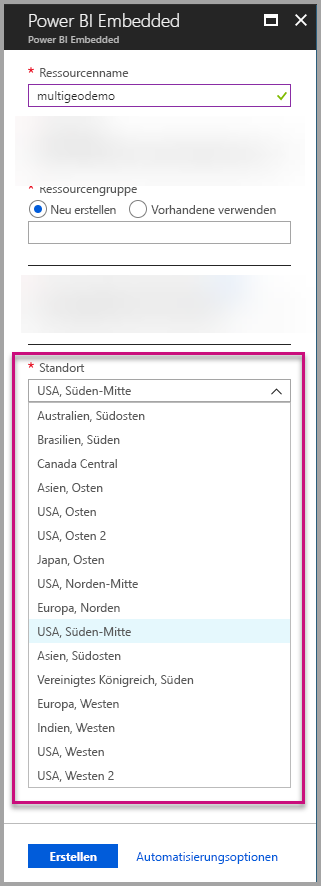
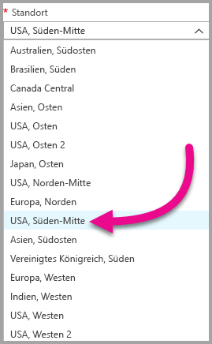
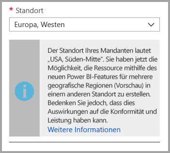
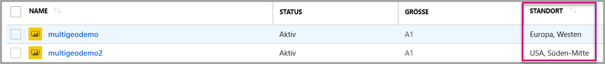
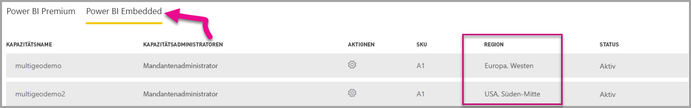

# Multi-Geo-Unterstützung für Power BI Embedded (Vorschau)

Die **Multi-Geo-Unterstützung für Power BI Embedded (Vorschau)** bewirkt, dass unabhängige Softwarehersteller (ISVs) und Organisationen, die Anwendungen mit Power BI Embedded entwickeln, um eine Analyse in ihre Apps zu integrieren, ihre Daten jetzt in unterschiedlichen Regionen auf der ganzen Welt bereitstellen können.

Kunden, die **Power BI Embedded** verwenden, können ab sofort eine **A-Kapazität** mit **Multi-Geo**-Optionen einrichten, basierend auf den gleichen Features und Einschränkungen, die für [Power BI Premium mit Verwendung von Multi-Geo](../service-admin-premium-Multi-Geo.md) gelten.

## Erstellen einer neuen Power BI Embedded-Kapazitätsressource mit Multi-Geo

Sie müssen im Bildschirm **Ressource erstellen** den Standort Ihrer Kapazität auswählen. Bisher war dieser auf den Standort Ihres Power BI-Mandanten beschränkt, deshalb war nur ein Standort verfügbar. Mit Multi-Geo können Sie aus unterschiedlichen Regionen für die Bereitstellung Ihrer Kapazität auswählen.

Beachten Sie, dass beim Öffnen des Dropdownmenüs für den Standort standardmäßig Ihr Startmandant ausgewählt ist.
  

Wenn Sie einen anderen Standort auswählen, werden Sie in einer Meldung aufgefordert, Ihre Auswahl zu bestätigen.

## Anzeigen des Kapazitätsstandorts

Sie können den Standort Ihrer Kapazitäten problemlos anzeigen, wenn Sie zur Hauptseite der Power BI Embedded-Verwaltung im Azure-Portal wechseln.

Der Standort ist auch im Verwaltungsportal unter powerbi.com verfügbar. Klicken Sie im Verwaltungsportal auf „Kapazitätseinstellungen“, und wechseln Sie dann zur Registerkarte „Power BI Embedded“.

[Weitere Informationen zum Erstellen von Kapazitäten mit Power BI Embedded](azure-pbie-create-capacity.md)

## Verwalten des Standorts vorhandener Kapazitäten

Sie können den Standort einer Power BI Embedded-Ressource nicht mehr ändern, nachdem Sie diese erstellt haben.

Um Ihren Power BI-Inhalt in eine andere Region zu verschieben, führen Sie die folgenden Schritte aus:

1. [Erstellen Sie eine neue Kapazität](azure-pbie-create-capacity.md) in einer anderen Region.
2. Weisen Sie alle Arbeitsbereiche der vorhandenen Kapazität der neuen Kapazität zu.
3. Löschen Sie die alte Kapazität, oder halten Sie sie an.

Wichtig: Wenn Sie sich entscheiden, eine Kapazität zu löschen, ohne ihren Inhalt neu zuzuweisen, wird der gesamte Inhalt dieser Kapazität in eine freigegebene Kapazität verschoben – Ihre Heimatregion.

## API-Unterstützung für Multi-Geo

Um die Verwaltung von Kapazitäten mit Multi-Geo per API zu unterstützen, wurden einige Änderungen an vorhandenen APIs durchgeführt:

1. **[Kapazitäten abrufen](https://docs.microsoft.com/rest/api/power-bi/capacities/getcapacities)**: Die API gibt eine Liste der Kapazitäten zurück, auf die der Benutzer zugreifen kann. Die Antwort enthält ab sofort eine zusätzliche Eigenschaft namens „region“, die den Standort der Kapazität angibt.
2. **[Zu Kapazität zuweisen](https://docs.microsoft.com/rest/api/power-bi/capacities)**: Die API ermöglicht das Zuweisen eines vorhandenen Arbeitsbereichs zu einer Kapazität. Dieser Vorgang ermöglicht es Ihnen nicht, Arbeitsbereiche an eine Kapazität außerhalb Ihrer Heimatregion zuzuweisen oder Arbeitsbereiche zwischen Kapazitäten in unterschiedlichen Regionen zu verschieben. Um diesen Vorgang auszuführen, benötigt der Benutzer weiterhin Administratorberechtigungen für den Arbeitsbereich sowie Administrator- oder Zuweisungsberechtigungen für die Zielkapazität.
3. **[Azure Resource Manager-API](https://docs.microsoft.com/rest/api/power-bi-embedded/capacities)**: Alle Azure Resource Manager-API-Vorgänge, *Erstellen* und *Löschen* eingeschlossen, unterstützen Multi-Geo.

## Einschränkungen und Überlegungen

* Vergewissern Sie sich, dass Sie bei Verschiebungen zwischen Regionen alle unternehmensspezifischen und gesetzlichen Complianceanforderungen erfüllen, bevor Sie eine Datenübertragung initiieren.

* Eine zwischengespeicherte Abfrage, die sich in einer weit entfernten Region befindet, verbleibt in dieser Region im Ruhezustand. Allerdings werden andere in Übertragung begriffene Daten möglicherweise zwischen verschiedenen geografischen Regionen verschoben.

* Beim regionsübergreifenden Verschieben von Daten in einer Multi-Geo-Umgebung können die Quelldaten bis zu 30 Tage lang in der Region verbleiben, von der aus die Daten verschoben wurden. In diesem Zeitraum haben Benutzer keinen Zugriff auf die Daten. Nach Ablauf der 30 Tage werden sie aus dieser Region entfernt und gelöscht.

* Multi-Geo führt in der Regel nicht zur Leistungssteigerung. Für das Laden von Berichten und Dashboards sind weiterhin Anforderungen an die Heimatregion für Metadaten erforderlich.

## Nächste Schritte

Weitere Informationen zu Power BI Embedded-Kapazitäten und Multi-Geo-Optionen für alle Kapazitäten finden Sie über die nachstehenden Links.

* [Was ist Power BI Embedded?](azure-pbie-what-is-power-bi-embedded.md)

* [Erstellen einer Power BI Embedded-Kapazität](azure-pbie-create-capacity.md)

* [Multi-Geo in Power BI Premium-Kapazitäten](../service-admin-premium-multi-geo.md)

Weitere Fragen? [Stellen Sie Ihre Frage in der Power BI-Community.](http://community.powerbi.com/)