# <a name="row-level-security-with-power-bi-embedded"></a>Sicherheit auf Zeilenebene mit Power BI Embedded

Mit der **Sicherheit auf Zeilenebene (Row-Level Security, RLS)** kann der Benutzerzugriff auf Daten in Dashboards, Kacheln, Berichten und Datasets beschränkt werden. Verschiedene Benutzer können mit den gleichen Artefakten arbeiten und dabei unterschiedliche Daten sehen. Beim Einbetten wird RLS unterstützt.

Wenn Sie Berichte für Benutzer einbetten, die nicht Power BI verwenden (d.h. die App ist Besitzer der Daten), was normalerweise bei ISVs der Fall ist, ist dieser Artikel für Sie relevant. Konfigurieren Sie das Einbettungstoken, um den Benutzer und die Rolle anzugeben.

Wenn Sie Berichte für Power BI-Benutzer in der Organisation einbetten (der Benutzer ist der Besitzer der Daten), funktioniert RLS auf die gleiche Weise wie direkt im Power BI-Dienst. Sie müssen in der Anwendung keine weiteren Aktionen ausführen. Weitere Informationen finden Sie unter [Sicherheit auf Zeilenebene (row-level Security; RLS) mit Power BI](../service-admin-rls.md).


Um RLS nutzen zu können, müssen Sie drei wichtige Konzepte verstehen: Benutzer, Rollen und Regeln. Sehen wir uns diese im Einzelnen genauer an:

**Benutzer**: Endbenutzer, die das Artefakt (Dashboard, Kachel, Bericht oder Dataset) anzeigen. In Power BI Embedded werden Benutzer durch die username-Eigenschaft in einem Einbettungstoken identifiziert.

**Rollen**: Benutzer gehören Rollen an. Eine Rolle ist ein Container für Regeln. Sie kann z.B. mit *Vertriebsleiter* oder *Vertriebsmitarbeiter* benannt werden. Rollen werden in Power BI Desktop erstellt. Weitere Informationen finden Sie unter [Sicherheit auf Zeilenebene (row-level Security; RLS) mit Power BI Desktop](../desktop-rls.md).

**Regeln**: Für Rollen gelten Regeln, und diese Regeln sind die Filter, die auf die Daten anzuwenden sind. Dabei kann es sich um eine einfache Regel, z.B. „Land = USA“, oder eine dynamischere Regel handeln.
Im Rest dieses Artikels wird ein Beispiel für das Erstellen von RLS beschrieben, das dann in einer eingebetteten Anwendung verwendet wird. In unserem Beispiel wird die PBIX-Datei [Retail Analysis Sample](http://go.microsoft.com/fwlink/?LinkID=780547) (Analysebeispiel für den Einzelhandel) verwendet.


## <a name="adding-roles-with-power-bi-desktop"></a>Hinzufügen von Rollen mit Power BI Desktop

Im **Analysebeispiel für den Einzelhandel** werden die Umsätze für alle Geschäfte in einer Einzelhandelskette angezeigt. Ohne RLS werden für jeden Gebietsleiter, der sich anmeldet und den Bericht öffnet, dieselben Daten angezeigt. Die Geschäftsleitung hat bestimmt, dass für jeden Gebietsleiter nur die Umsätze für die von ihnen geleiteten Geschäfte angezeigt werden sollen. Mithilfe von RLS kann die Geschäftsleitung die Datenanzeige auf den jeweiligen Gebietsleiter einschränken.

RLS wird in Power BI Desktop konfiguriert. Wenn das Dataset und der Bericht geöffnet sind, können wir zur Diagrammansicht wechseln, um das Schema anzuzeigen:


Dieses Schema weist die folgenden Merkmale auf:

* Sämtliche Measures, z.B. **Total Sales** (Gesamtumsatz), werden in der Faktentabelle **Sales** (Umsätze) gespeichert.
* Es gibt vier zusätzliche verknüpfte Dimensionstabellen: **Item** (Element), **Time** (Zeit), **Store** (Geschäft) und **District** (Gebiet).
* Die Pfeile auf den Beziehungslinien geben die Richtung der Filter zwischen den Tabellen an. Wenn z.B. im aktuellen Schema der Filter **Time[Date]** (Zeit[Datum]) eingesetzt wird, filtert dieser nur Werte in der Tabelle **Sales** (Umsätze). Von diesem Filter sind keine weiteren Tabellen betroffen, da alle Pfeile auf den Beziehungslinien ausschließlich auf die Tabelle „Sales“ (Umsätze) zeigen.
* Die Tabelle **District** (Bezirk) gibt an, wer der Gebietsleiter für den jeweiligen Bezirk ist:
  
    

Wir wenden basierend auf diesem Schema einen Filter auf die Spalte **District Manager** (Gebietsleiter) in der Tabelle **District** (Gebiet) an. Wenn dieser Filter mit dem Benutzer übereinstimmt, der den Bericht anzeigt, wird der Filter auch auf die Tabellen **Store** (Geschäft) und **Sales** (Umsätze) angewendet, damit Daten für diesen Gebietsleiter angezeigt werden.

Dazu gehen Sie wie folgt vor:

1. Wählen Sie auf der Registerkarte **Modellierung** die Option **Rollen verwalten** aus.

    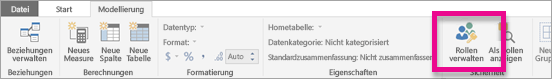
2. Erstellen Sie eine neue Rolle mit dem Namen **Manager**.

    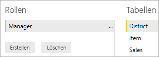
3. Geben Sie in der Tabelle **District** (Gebiet) diesen DAX-Ausdruck ein: **[District Manager] = USERNAME()**.

    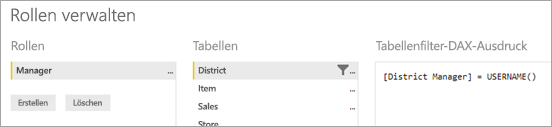
4. Um sicherzustellen, dass die Regeln angewendet werden, wählen Sie auf der Registerkarte **Modellierung** die Option **Als Rollen anzeigen** aus, und wählen Sie dann die von Ihnen erstellte Rolle **Manager** sowie **Anderer Benutzer** aus. Geben Sie als Benutzer **AndrewMa** ein.

    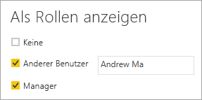

    In den Berichten werden jetzt Daten für den angemeldeten Benutzer **AndrewMa** angezeigt.

Wenn der Filter so wie hier angewendet wird, werden alle Datensätze in den Tabellen **District** (Bezirk), **Store** (Geschäft) und **Sales** (Umsätze) gefiltert. Aufgrund der Filterrichtung in den Beziehungen zwischen den Tabellen **Sales** (Umsätze) und **Time** (Zeit), **Sales** (Umsätze) und **Item** (Artikel) sowie **Item** (Artikel) und **Time** (Zeit) erfolgt keine Filterung in diesen Tabellen. Um weitere Informationen über die bidirektionale Kreuzfilterung zu erhalten, laden Sie das Whitepaper [Bidirectional cross-filtering in SQL Server Analysis Services 2016 and Power BI Desktop](http://download.microsoft.com/download/2/7/8/2782DF95-3E0D-40CD-BFC8-749A2882E109/Bidirectional%20cross-filtering%20in%20Analysis%20Services%202016%20and%20Power%20BI.docx) (Bidirektionale Kreuzfilterung in SQL Server Analysis Services 2016 und Power BI Desktop, in englischer Sprache) herunter.

## <a name="applying-user-and-role-to-an-embed-token"></a>Anwenden eines Benutzers und einer Rolle auf ein Einbettungstoken

Nachdem Sie jetzt die Power BI Desktop-Rollen konfiguriert haben, müssen in Ihrer Anwendung einige Schritte ausgeführt werden, um die Rollen zu nutzen.

Benutzer werden durch die Anwendung authentifiziert und autorisiert, und mithilfe von Einbettungstoken wird einem Benutzer Zugriff auf einen bestimmten Power BI Embedded-Bericht gewährt. Power BI Embedded verfügt über keine Informationen über die Identität des Benutzers. Damit RLS erfolgreich angewendet wird, müssen Sie im Einbettungstoken zusätzlichen Kontext in Form von Identitäten übergeben. Sie können die Identitäten mithilfe der [Embed Token](https://docs.microsoft.com/rest/api/power-bi/embedtoken)-API übergeben.

Die API akzeptiert eine Liste von Identitäten mit Angabe der entsprechenden Datasets. Damit RLS funktioniert, müssen Sie folgende Elemente als Teil der Identität übergeben.

* **username** (obligatorisch): Eine Zeichenfolge, die beim Anwenden von RLS-Regeln zum Identifizieren des Benutzers verwendet werden kann. Es kann nur ein einziger Benutzer aufgelistet werden. Ihr Benutzername kann mit *ASCII*-Zeichen erstellt werden.
* **roles** (obligatorisch): Eine Zeichenfolge, in der die Rollen angegeben werden, die beim Anwenden von Regeln für die Sicherheit auf Zeilenebene ausgewählt werden sollen. Wenn mehrere Rollen übergeben werden, müssen sie als Zeichenfolgenarray übergeben werden.
* **dataset** (obligatorisch): Das entsprechende Dataset für das Artefakt, das Sie einbetten.

Sie können das Einbettungstoken mit der **GenerateTokenInGroup**-Methode für **PowerBIClient.Reports** erstellen.

Sie können z.B. das Beispiel [PowerBIEmbedded_AppOwnsData](https://github.com/Microsoft/PowerBI-Developer-Samples/tree/master/App%20Owns%20Data) ändern. Die Zeilen 76 und 77 in *Home\HomeController.cs* können aktualisiert werden von:

```csharp
// Generate Embed Token.
var generateTokenRequestParameters = new GenerateTokenRequest(accessLevel: "view");

var tokenResponse = await client.Reports.GenerateTokenInGroupAsync(GroupId, report.Id, generateTokenRequestParameters);
```

auf

```csharp
var generateTokenRequestParameters = new GenerateTokenRequest("View", null, identities: new List<EffectiveIdentity> { new EffectiveIdentity(username: "username", roles: new List<string> { "roleA", "roleB" }, datasets: new List<string> { "datasetId" }) });

var tokenResponse = await client.Reports.GenerateTokenInGroupAsync("groupId", "reportId", generateTokenRequestParameters);
```

Wenn Sie die REST-API aufrufen, akzeptiert die aktualisierte API jetzt ein zusätzliches JSON-Array mit dem Namen **identities**, das einen Benutzernamen, eine Liste von Zeichenfolgen für Rollen und eine Liste von Zeichenfolgen für Datasets enthält. 

Verwenden Sie den folgenden Code als Beispiel:

```json
{
    "accessLevel": "View",
    "identities": [
        {
            "username": "EffectiveIdentity",
            "roles": [ "Role1", "Role2" ],
            "datasets": [ "fe0a1aeb-f6a4-4b27-a2d3-b5df3bb28bdc" ]
        }
    ]
}
```

Nachdem jetzt alle Elemente implementiert wurden, werden für einen Benutzer, der bei Ihrer Anwendung anmeldet, um dieses Artefakt zu betrachten, nur die Daten angezeigt, die für ihn gemäß der von uns definierten Sicherheit auf Zeilenebene angezeigt werden dürfen.

## <a name="working-with-analysis-services-live-connections"></a>Arbeiten mit den Liveverbindungen von Analysis Services

Bei Liveverbindungen von Analysis Services kann für lokale Server Sicherheit auf Zeilenebene verwendet werden. Wenn Sie diesen Typ von Verbindung verwenden, sollten Sie einige spezielle Konzepte verstehen.

Die effektive Identität, die für die username-Eigenschaft bereitgestellt wird, muss ein Windows-Benutzer mit Berechtigungen für den Analysis Services-Server sein.

### <a name="on-premises-data-gateway-configuration"></a>Konfiguration des lokalen Datengateways

Beim Arbeiten mit Liveverbindungen von Analysis Services wird ein [lokales Datengateway](../service-gateway-onprem.md) verwendet. Beim Generieren eines Einbettungstokens mit einer angegebenen Identität muss das Hauptkonto als Administrator des Gateways aufgeführt werden. Wenn das Hauptkonto nicht aufgeführt ist, wird die Sicherheit auf Zeilenebene nicht auf die Eigenschaft der Daten angewendet. Ein Benutzer des Gateways ohne Administratorrechte kann Rollen bereitstellen, er muss jedoch den eigenen Benutzernamen als effektive Identität angeben.

### <a name="use-of-roles"></a>Verwenden von Rollen

Rollen können in einem Einbettungstoken mit der Identität angegeben werden. Wenn keine Rolle angegeben wurde, wird zum Auflösen der zugehörigen Rollen der angegebene Benutzername verwendet.

### <a name="using-the-customdata-feature"></a>Verwenden des CustomData-Features

Das CustomData-Feature funktioniert nur für Modelle, die in **Azure Analysis Services** gespeichert sind, und nur im **Live verbinden**-Modus. Im Gegensatz zu Benutzern und Rollen kann das CustomData-Feature nicht innerhalb einer PBIX-Datei festgelegt werden. Wenn ein Token mit dem CustomData-Feature generiert wird, müssen Sie einen Benutzernamen besitzen.

Das CustomData-Feature ermöglicht das Hinzufügen eines Zeilenfilters beim Anzeigen von Power BI-Daten in Ihrer Anwendung, wenn **Azure Analysis Services** als Datenquelle verwendet wird (Anzeigen von Power BI-Daten, die in Ihrer Anwendung mit Azure Analysis Services verbunden sind).

Das CustomData-Feature ermöglicht die Übergabe von Freitext (Zeichenfolge) mithilfe der Verbindungszeichenfolgen-Eigenschaft von CustomData. Analysis Services verwendet diesen Wert über die *CUSTOMDATA()*-Funktion.

Die einzige Möglichkeit, in **Azure Analysis Services** eine dynamische Sicherheit auf Zeilenebene zu erzielen (bei der dynamische Werte für die Filterauswertung verwendet werden), ist die Verwendung der *CUSTOMDATA()*-Funktion.

Sie können das Feature innerhalb der DAX-Rollenabfrage verwenden. Außerdem können Sie es ohne eine Rolle in einer DAX-Measureabfrage verwenden.
Das CustomData-Feature ist Teil der Funktionalität zur Tokengenerierung für folgende Elemente: Dashboards, Berichte und Kacheln. Dashboards können über mehrere CustomData-Identitäten (eine pro Kachel/Modell) verfügen.

#### <a name="customdata-sdk-additions"></a>Erweiterungen des CustomData SDK

Die CustomData-Zeichenfolgeneigenschaft wurde bei der Tokengenerierung zur effektiven Identität hinzugefügt.

```json
[JsonProperty(PropertyName = "customData")]
public string CustomData { get; set; }
```

Die Identität kann mithilfe von benutzerdefinierten Daten erstellt werden, indem Sie folgenden Aufruf verwenden:

```csharp
public EffectiveIdentity(string username, IList<string> datasets, IList<string> roles = null, string customData = null);
```

#### <a name="customdata-sdk-usage"></a>Verwendung des CustomData SDK

Wenn Sie die REST-API aufrufen, können Sie in jeder Identität benutzerdefinierte Daten hinzufügen, z.B.:

```json
{
    "accessLevel": "View",
    "identities": [
        {
            "username": "EffectiveIdentity",
            "roles": [ "Role1", "Role2" ],
            "customData": "MyCustomData",
            "datasets": [ "fe0a1aeb-f6a4-4b27-a2d3-b5df3bb28bdc" ]
        }
    ]
}
```

Im Folgenden finden Sie die Schritte, mit denen Sie mit der Einrichtung der CustomData()-Funktion mit Ihrer Power BI Embedded-Anwendung beginnen.

1. Erstellen Sie Ihre Azure Analysis Services-Datenbank. Melden Sie sich dann über [SQL Server Management Studio](https://docs.microsoft.com/sql/ssms/download-sql-server-management-studio-ssms?view=sql-server-2017) bei Ihrem Azure Analysis Services-Server an.

    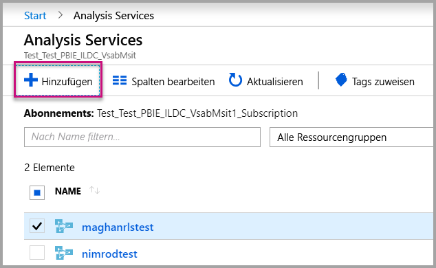

    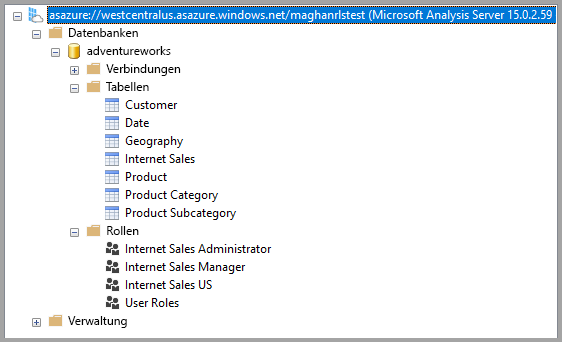

2. Erstellen Sie eine Rolle im Analysis Services-Server.

    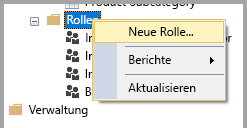

3. Legen Sie **allgemeine** Einstellungen fest.  Hier geben Sie den **Rollennamen** an und legen die Datenbankberechtigungen auf **Schreibgeschützt** fest.

    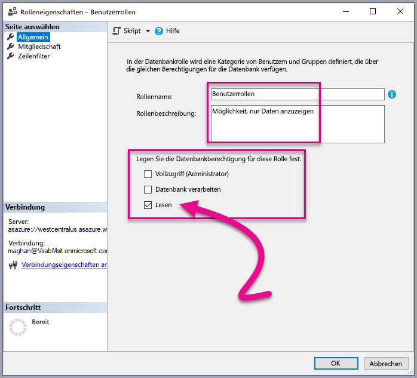

4. Legen Sie die Einstellungen für die **Mitgliedschaft** fest. Hier fügen Sie die Benutzer hinzu, auf die sich die Rolle auswirkt.

    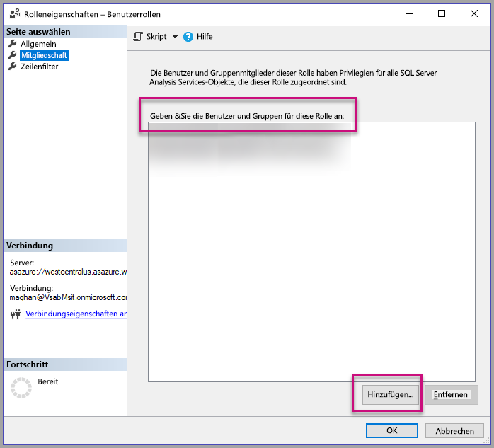

5. Legen Sie die DAX-Abfrage **Zeilenfilter** mithilfe der *CUSTOMDATA()*-Funktion fest.

    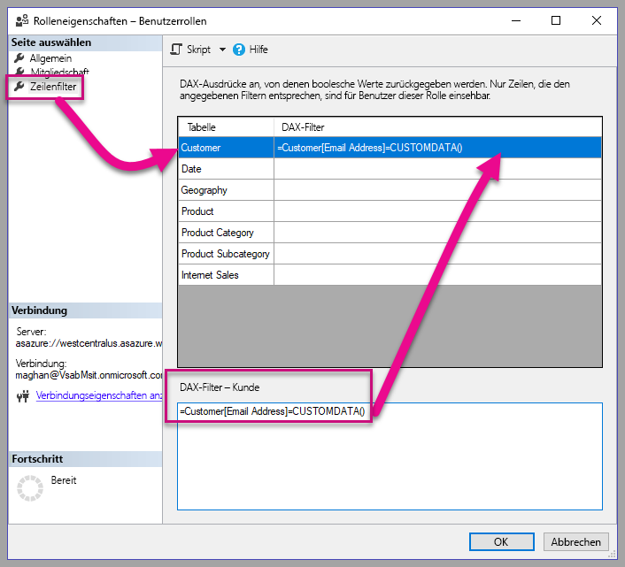

6. Erstellen Sie einen PBI-Bericht, und veröffentlichen Sie ihn in einem Arbeitsbereich mit dedizierter Kapazität.

    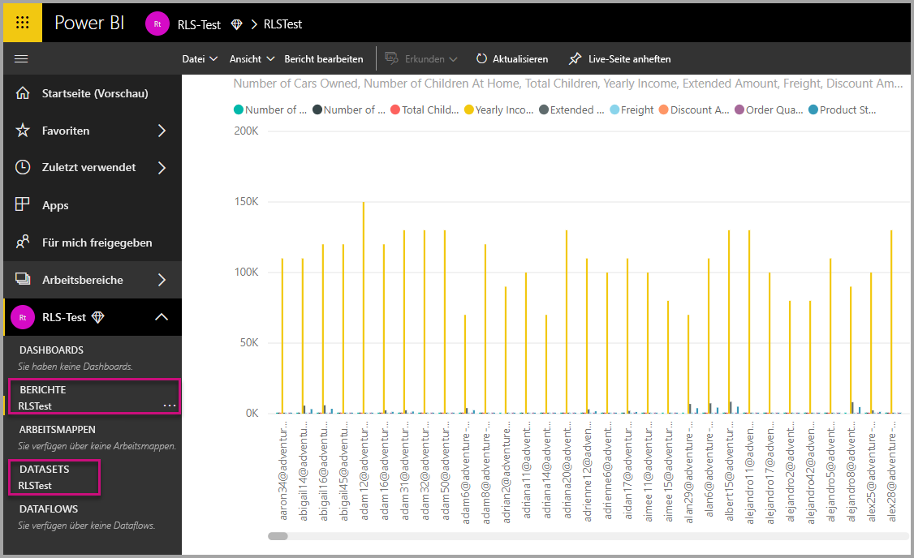

7. Verwenden Sie die Power BI-APIs, um das CustomData-Feature in Ihrer Anwendung zu verwenden.  Wenn ein Token mit dem CustomData-Feature generiert wird, müssen Sie einen Benutzernamen besitzen. Der Benutzername muss dem UPN des Hauptbenutzers entsprechen. Der Hauptbenutzer muss Mitglied der von Ihnen erstellten Rollen sein. Wenn keine Rollen angegeben werden, werden alle Rollen, in denen der Hauptbenutzer Mitglied ist, für die RLS-Auswertung verwendet.

    > [!Note]
    > Wenn Sie zum Bereitstellen Ihrer Anwendung in der Produktion bereit sind, darf das Feld bzw. die Option für das Hauptbenutzerkonto für die Endbenutzer nicht sichtbar sein.

    Zeigen Sie den [Code](#customdata-sdk-additions) an, um das CustomData-Feature hinzuzufügen.

8. Jetzt können Sie den Bericht in Ihrer Anwendung anzeigen, bevor Sie die CustomData-Werte anwenden, um alle im Bericht enthaltenen Daten zu sehen.

    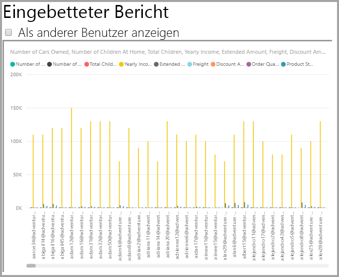

    Wenden Sie dann die CustomData-Werte an, um festzustellen, ob der Bericht einen anderen Satz an Daten anzeigt.
    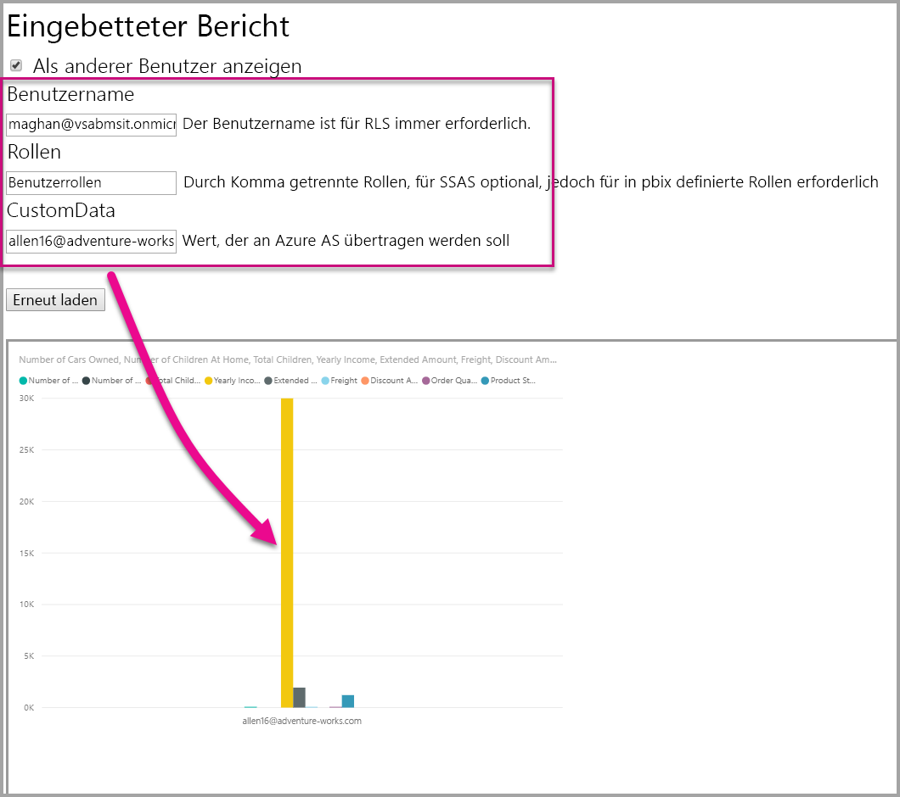

## <a name="using-rls-vs-javascript-filters"></a>Verwenden von RLS im Vergleich zu JavaScript-Filtern

Zur Filterung Ihrer Daten im Bericht können Sie die **Sicherheit auf Zeilenebene** (RLS) oder **JavaScript-Filter** verwenden.

Die [Sicherheit auf Zeilenebene](../service-admin-rls.md) ist ein Feature, das Daten auf Datenmodellebene filtert. Ihre Back-End-Datenquelle steuert die RLS-Einstellungen. Basierend auf dem Datenmodell werden beim Generieren des Einbettungstokens der Benutzername und die Rollen für die Sitzung festgelegt. RLS kann durch clientseitigen Code nicht überschrieben, entfernt oder gesteuert werden – daher wird dieses Feature als sicher eingestuft. RLS wird zur sicheren Filterung von Daten empfohlen. Sie können Daten mit RLS filtern, indem Sie eine der folgenden Optionen verwenden.

* [Konfigurieren von Rollen in einem Power BI-Bericht](../desktop-rls.md).
* Konfigurieren von Rollen auf Datenquellenebene (nur Liveverbindung mit Analysis Services).
* Programmgesteuert mit einem [Einbettungstoken](https://docs.microsoft.com/rest/api/power-bi/embedtoken/datasets_generatetokeningroup) und `EffectiveIdentity`. Beim Verwenden eines Einbettungstokens durchläuft der eigentliche Filter das Einbettungstoken für eine bestimmte Sitzung.

[JavaScript-Filter](https://github.com/Microsoft/PowerBI-JavaScript/wiki/Filters#page-level-and-visual-level-filters) werden verwendet, um den Benutzern zu ermöglichen, eine reduzierte, auf einen Bereich beschränkte oder gefilterte Ansicht der Daten zu nutzen. Der Benutzer hat dennoch weiterhin Zugriff auf die Tabellen, Spalten und Measures des Modellschemas und kann möglicherweise auf darin enthaltene Daten zugreifen. Eingeschränkter Zugriff auf die Daten kann nur mit RLS angewendet werden, nicht über APIs zur clientseitigen Filterung.

## <a name="token-based-identity-with-azure-sql-database-preview"></a>Tokenbasierte Identität mit Azure SQL-Datenbank (Vorschau)

Über die **tokenbasierte Identität** können Sie die effektive Identität für ein Einbettungstoken mit dem Zugriffstoken aus **Azure Active Directory (AAD)** für eine **Azure SQL-Datenbank** angeben.

Kunden, die ihre Daten in **Azure SQL-Datenbank** speichern, können jetzt eine neue Funktion zum Verwalten von Benutzern und deren Zugriff auf Daten in Azure SQL bei der Integration in **Power BI Embedded** nutzen.

Beim Generieren des Einbettungstokens können Sie die effektive Identität eines Benutzers in Azure SQL angeben. Die effektive Identität eines Benutzers wird durch die Übergabe des AAD-Zugriffstokens an den Server angegeben. Anhand des Zugriffstokens werden nur die relevanten Daten für diesen Benutzer für diese bestimmte Sitzung per Pull aus Azure SQL abgerufen.

Es kann verwendet werden, um die Ansichten der einzelnen Benutzer in Azure SQL zu verwalten oder um sich bei Azure SQL als bestimmter Kunde in einer Datenbank mit mehreren Mandanten anzumelden. Außerdem können Sie damit die Sicherheit auf Zeilenebene für die jeweilige Sitzung in Azure SQL anwenden und nur die relevanten Daten für diese Sitzung laden, sodass RLS nicht in Power BI verwaltet werden muss.

Probleme mit der effektiven Identität gelten für RLS-Regeln direkt auf dem Azure SQL Server-Computer. Power BI Embedded verwendet das bereitgestellte Zugriffstoken bei der Abfrage von Daten aus Azure SQL Server. Der UPN des Benutzers (für den das Zugriffstoken angegeben wurde) ist als Ergebnis der USER_NAME()-SQL-Funktion zugänglich.

Die tokenbasierte Identität funktioniert nur für DirectQuery-Modelle für dedizierte Kapazität – verbunden mit einer Azure SQL-Datenbank, die für das Zulassen der AAD-Authentifizierung konfiguriert ist. ([Weitere Informationen zur AAD-Authentifizierung für Azure SQL-Datenbank](https://docs.microsoft.com/azure/sql-database/sql-database-manage-logins).) Die Datenquelle des Datasets muss für die Verwendung der OAuth2-Anmeldeinformationen des Endbenutzers konfiguriert sein, um einer tokenbasierte Identität zu verwenden.

   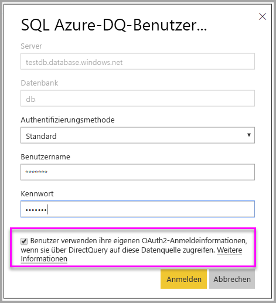

### <a name="token-based-identity-sdk-additions"></a>Tokenbasierte Identität – SDK-Erweiterungen

Die Identitätsblobeigenschaft wurde unserer effektiven Identität im Szenario zur Tokengenerierung hinzugefügt.

```JSON
[JsonProperty(PropertyName = "identityBlob")]
public IdentityBlob IdentityBlob { get; set; }
```

Der IdentityBlob-Typ ist eine einfache JSON-Struktur mit einer Wertzeichenfolgen-Eigenschaft.

```JSON
[JsonProperty(PropertyName = "value")]
public string value { get; set; }
```

Die EffectiveIdentity kann mit dem Identitätsblob über den folgenden Aufruf erstellt werden:

```C#
public EffectiveIdentity(string username, IList<string> datasets, IList<string> roles = null, string customData = null, IdentityBlob identityBlob = null);
```

Das Identitätsblob kann mit dem folgenden Aufruf erstellt werden.

```C#
public IdentityBlob(string value);
```

### <a name="token-based-identity-rest-api-usage"></a>Tokenbasierte Identität – Nutzung der REST-API

Wenn Sie die [REST-API](https://docs.microsoft.com/rest/api/power-bi/embedtoken/reports_generatetoken#definitions) aufrufen, können Sie in jeder Identität ein Identitätsblob hinzufügen.

```JSON
{
    "accessLevel": "View",
    "identities": [
        {
            "datasets": ["fe0a1aeb-f6a4-4b27-a2d3-b5df3bb28bdc"],
        “identityBlob”: {
            “value”: “eyJ0eXAiOiJKV1QiLCJh….”
         }
        }
    ]
}
```

Der im Identitätsblob angegebene Wert muss ein gültiges Zugriffstoken für Azure SQL Server mit der Ressourcen-URL (<https://database.windows.net/>) sein.

   > [!Note]
   > Um ein Zugriffstoken für Azure SQL erstellen zu können, muss die Anwendung die delegierte Berechtigung für den **Zugriff auf Azure SQL-Datenbank und Data Warehouse** für die **Azure SQL-Datenbank**-API in der AAD-App-Registrierungskonfiguration im Azure-Portal besitzen.

   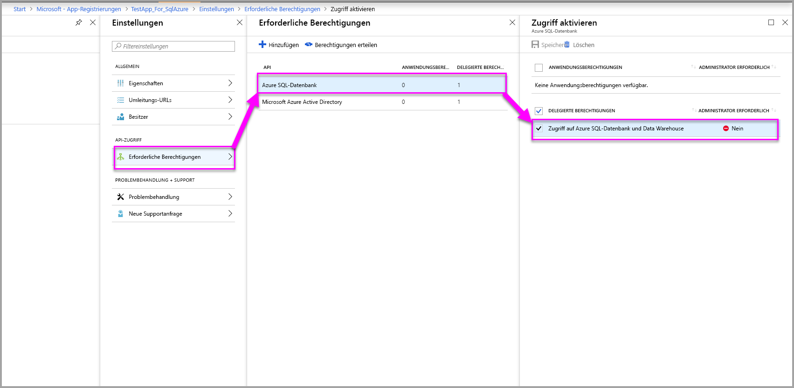

## <a name="on-premises-data-gateway-with-service-principal-preview"></a>Lokales Datengateway mit Dienstprinzipal (Vorschau)

Benutzer, die RLS mithilfe einer lokalen Datenquelle mit Liveverbindung von SQL Server Analysis Services (SSAS) konfigurieren, können Sie die neue [Dienstprinzipalfunktion](embed-service-principal.md) zunutze machen, um Benutzer und deren Zugriff auf Daten in SSAS bei der Integration in **Power BI Embedded** zu verwalten.

Mit [Power BI-REST-APIs](https://docs.microsoft.com/rest/api/power-bi/) können Sie die effektive Identität für lokale SSAS-Liveverbindungen für ein Einbettungstoken mithilfe eines [Dienstprinzipalobjekts](https://docs.microsoft.com/azure/active-directory/develop/app-objects-and-service-principals#service-principal-object) festlegen.

Bisher musste der Masterbenutzer, der das Einbettungstoken generiert, ein Gatewayadministrator sein, um die effektive Identität für lokale SSAS-Liveverbindungen festzulegen. Der Gatewayadministrator kann Benutzern nun dedizierte Berechtigungen für bestimmte Datenquellen zuweisen, wodurch der Benutzer die effektive Identität beim Generieren des Einbettungstoken überschreiben kann. Dieses neue Feature ermöglicht das Einbetten mit einem Dienstprinzipal für SSAS-Liveverbindungen.

Der Gatewayadministrator verwendet die [REST-API „Add Datasource User“](https://docs.microsoft.com/rest/api/power-bi/gateways/adddatasourceuser) (Datenquellenbenutzer hinzufügen), um dem Dienstprinzipal die Berechtigung *ReadOverrideEffectiveIdentity* für Power BI Embedded zu gewähren.

Sie können diese Berechtigung nicht über das Verwaltungsportal festlegen. Diese Berechtigung kann nur mit der API festgelegt werden. Im Verwaltungsportal werden Benutzer und Dienstprinzipalnamen mit diesen Berechtigungen gekennzeichnet.

## <a name="considerations-and-limitations"></a>Überlegungen und Einschränkungen

* Die Zuweisung von Benutzern zu Rollen im Power BI-Dienst wirkt sich bei Verwendung eines Einbettungstokens nicht auf RLS aus.
* Der Power BI-Dienst wendet die RLS-Einstellung nicht auf Administratoren oder Mitglieder mit Bearbeitungsberechtigungen an, wenn Sie eine Identität mit einem Einbettungstoken bereitstellen. Stattdessen wird die Einstellung auf die Daten angewendet.
* Liveverbindungen von Analysis Services werden für lokale Server unterstützt.
* Azure Analysis Services-Liveverbindungen unterstützen Filtern nach Rollen. Die dynamische Filterung kann mit „CustomData“ ausgeführt werden.
* Wenn das zugrunde liegende Dataset kein RLS erfordert, darf die GenerateToken-Anforderung **keine** effektive Identität enthalten.
* Wenn das zugrunde liegende Dataset ein Cloudmodell ist (Cachemodell oder DirectQuery), muss die effektive Identität mindestens eine Rolle enthalten. Andernfalls erfolgt keine Rollenzuweisung.
* Mit einer Identitätenliste werden mehrere Identitätstoken für die Dashboardeinbettung aktiviert. Bei allen anderen Artefakten enthält die Liste eine einzelne Identität.

### <a name="token-based-identity-limitations-preview"></a>Einschränkungen der tokenbasierten Identität (Vorschau)

* Diese Funktion beschränkt die Verwendung nur für Power BI Premium.
* Diese Funktion funktioniert nicht mit einer lokalen SQL Server-Instanz.
* Diese Funktion funktioniert nicht mit Multi-Geo.

Weitere Fragen? [Stellen Sie Ihre Frage in der Power BI-Community.](https://community.powerbi.com/)
