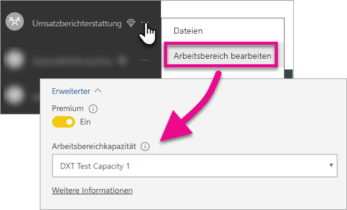

# Einbetten von Power BI-Dashboards, -Berichten und -Kacheln

Erfahren Sie mehr zu den Schritten, die Sie durchführen müssen, um Inhalte von Power BI in Ihre Anwendung einzubetten.

Microsoft hat [Power BI Premium vorgestellt](https://powerbi.microsoft.com/blog/microsoft-accelerates-modern-bi-adoption-with-power-bi-premium/), ein neues kapazitätsbasiertes Lizenzierungsmodell, das die Flexibilität der Benutzer beim Zugriff, der Freigabe und dem Verteilen von Inhalten erhöht. Das Angebot bietet zusätzliche Skalierbarkeit und Leistung für den Power BI-Dienst. Außerdem wurde Power BI Embedded vorgestellt, mit dem Sie Kapazität in Microsoft Azure erstellen können. Power BI Embedded ist auf Ihre Anwendung und Ihre Kunden ausgerichtet. 

In diesem Artikel wird erläutert, wie Sie Ihre Inhalte von Power BI sowohl für Ihre Organisation als auch für Ihre Kunden einbetten. Die Schritte sind für beide Szenarien ähnlich. Es wird darauf hingewiesen, wenn ein Schritt nur für das Einbetten für Ihre Kunden gilt.

Sie müssen in Ihrer Anwendung die folgenden Schritte ausführen, um dies zu ermöglichen. Hier werden die erforderlichen Schritte durchgegangen, damit Sie eingebettete Inhalte mit Ihrer Anwendung verwenden können.

> [!NOTE]
> Die APIs von Power BI verweisen weiterhin in Gruppen auf Arbeitsbereiche. Alle Verweise auf Gruppen bedeuten, dass Sie mit App-Arbeitsbereichen arbeiten.

## Schritt 1: Richten Sie Ihre Entwicklungsumgebung für eingebettete Analysen ein

Bevor Sie mit dem Einbetten von Dashboards und Berichten in Ihre Anwendung beginnen, müssen Sie sicherstellen, dass Ihre Umgebung das Einbetten erlaubt. Im Rahmen des Setups müssen Sie folgende Aktionen ausführen.

* [Stellen Sie sicher, dass Sie über einen Azure Active Directory-Mandanten verfügen](embedding-content.md#azureadtenant)
* [Erstellen Sie Ihr Power BI Pro-Konto](embedding-content.md#proaccount)
* [Registrieren Sie Ihre Azure Active Directory-Anwendung (AAD) und Berechtigungen](embedding-content.md#appreg)

> [!NOTE]
> Für die Entwicklung der Anwendung ist keine Power BI-Kapazität erforderlich. Die Entwickler der Anwendung müssen über eine Power BI Pro-Lizenz verfügen.

### Azure Active Directory-Mandant

Sie benötigen einen Azure Active Directory-Mandanten (Azure AD), um Elemente aus Power BI einzubetten. Dieser Mandant muss mindestens einen Benutzer von Power BI Pro haben. Sie müssen außerdem eine Azure AD-App im Mandanten festlegen. Sie können einen vorhandenen Azure AD-Mandanten verwenden oder einen neuen Mandanten erstellen, den Sie nur zum Einbetten verwenden.

Sie müssen das zu verwendende Mandantensetup bestimmen, wenn Sie für Ihre Kunden einbetten.

* Verwenden Sie Ihren vorhandenen, unternehmensbezogenen Power BI-Mandanten?
* Verwenden Sie einen separaten Mandanten für Ihre Anwendung?
* Verwenden Sie einen separaten Mandanten pro Kunde?

Wenn Sie keinen bereits vorhandenen Mandanten verwenden möchten, können Sie einen neuen Mandanten für Ihre Anwendung oder einen Mandanten pro Kunde erstellen. Weitere Informationen hierzu finden Sie unter [Erstellen eines Azure Active Directory-Mandanten](create-an-azure-active-directory-tenant.md) und [Einrichten eines Azure Active Directory-Mandanten](https://docs.microsoft.com/azure/active-directory/develop/active-directory-howto-tenant).

### Erstellen Sie ein Benutzerkonto für Power BI Pro

Sie benötigen nur ein einzelnes Power BI Pro-Konto zum Einbetten von Inhalt. Vielleicht möchten Sie aber verschiedene Benutzer haben, die bestimmten Zugriff auf Elemente haben. Dies ist ein Überblick über mögliche Benutzer für Ihren Mandanten.

Die folgenden Konten müssen in Ihrem Mandanten vorhanden sein und über eine Lizenz für Power BI Pro verfügen. Zum Arbeiten mit App-Arbeitsbereichen in Power BI ist eine Power BI Pro-Lizenz erforderlich.

#### Ein Administrator für den Mandanten/die Organisation

Es wird empfohlen, als Konto für die Anwendung nicht den globalen Administrator des Mandanten/der Organisation zu verwenden, wenn das Einbetten für Ihre Kunden erfolgt. So wird der Zugriff des Anwendungskontos innerhalb Ihres Mandanten minimiert. Der Administratorbenutzer sollte nach Möglichkeit Administrator aller App-Arbeitsbereiche sein, die zum Zweck des Einbettens erstellt wurden.

#### Konten für Analysten, die Inhalte erstellen

Möglicherweise sind mehrere Benutzer vorhanden, die Inhalte für Power BI erstellen. Sie benötigen ein Power BI Pro-Konto für jeden Analysten, der Inhalt in Power BI erstellt und bereitstellt.

#### Ein *Hauptbenutzerkonto*  der Anwendung zum Einbetten für Ihre Kunden

Das Hauptkonto ist das Konto, das von der Anwendung beim Einbetten von Inhalten für Ihre Kunden verwendet wird. Dies ist in der Regel ein Szenario für ISV-Anwendungen. Das Hauptkonto ist das einzige Konto, das in der Anwendung tatsächlich benötigt wird. Es kann auch als Administrator- und Analytikerkonto verwendet werden, dies wird allerdings nicht empfohlen. Das Back-End Ihrer Anwendung speichert die Anmeldeinformationen für dieses Konto und ruft damit ein Azure AD-Authentifizierungstoken für die Verwendung mit Power BI REST-APIs ab. Dieses Konto dient zum Generieren eines für die Kunden zu verwendenden Einbettungstokens für die Anwendung.

Beim Masterkonto handelt es sich um das Konto eines regulären Benutzers mit einer Power BI Pro-Lizenz, die Sie für die Anwendung verwenden. Das Konto muss ein Administrator des App-Arbeitsbereichs sein, der für das Einbetten verwendet wird.

###  App-Registrierung und Berechtigungen

Sie müssen Ihre Anwendung bei Azure AD registrieren, um REST-API-Aufrufe ausführen zu können. Weitere Informationen finden Sie unter [Registrieren einer Azure AD-App zum Einbetten von Power BI-Inhalten](register-app.md).

### Erstellen von App-Arbeitsbereichen

Wenn Sie Dashboards und Berichte für Ihre Kunden einbetten, müssen sich die Dashboards und Berichte in einem App-Arbeitsbereich befinden. Das oben genannte *Hauptkonto* muss ein Administrator des App-Arbeitsbereichs sein.

[!INCLUDE [powerbi-service-create-app-workspace](../includes/powerbi-service-create-app-workspace.md)]

### Erstellen und Hochladen von Berichten

Sie können Ihre Berichte und Datasets mit Power BI Desktop erstellen und diese Berichte dann in einem App-Arbeitsbereich veröffentlichen. Der Endbenutzer, der die Berichte veröffentlicht, muss über eine Power BI Pro-Lizenz verfügen, damit er einen App-Arbeitsbereich veröffentlichen kann.

## Schritt 2: Einbetten der Inhalte

In Ihrer Anwendung müssen Sie sich bei Power BI authentifizieren. Wenn Sie Inhalte für Ihre Kunden einbetten, speichern Sie die Anmeldeinformationen für das *Hauptkonto* in der Anwendung. Weitere Informationen finden Sie unter [Authentifizieren von Benutzern und Abrufen eines Azure AD-Zugriffstokens für die Power BI-App](get-azuread-access-token.md).

Verwenden Sie in der Anwendung nach der Authentifizierung die Power BI-REST-APIs und JavaScript-APIs, um Dashboards und Berichte in die Anwendung einzubetten. 

Informationen zum **Einbetten für Ihre Organisation** finden Sie in den folgenden exemplarischen Vorgehensweisen:

* [Integrieren eines Dashboards in eine App](integrate-dashboard.md)
* [Integrieren einer Kachel in eine App](integrate-tile.md)
* [Integrieren eines Berichts in eine App](integrate-report.md)

Informationen zum **Einbetten für Ihre Kunden**, das i.d.R. für ISVs erfolgt, finden Sie in dem folgenden Artikel:

* [Integrieren eines Dashboards, einer Kachel oder eines Berichts in die Anwendung](embed-sample-for-customers.md)

Beim Einbetten für Ihre Kunden ist ein Einbettungstoken erforderlich. Weitere Informationen finden Sie unter [GenerateToken](https://msdn.microsoft.com/library/mt784614.aspx).

## Schritt 3: Heraufstufen Ihrer Lösung zur Produktion

Für den Wechsel zur Produktion sind einige zusätzliche Schritte erforderlich.

### Einbetten für Ihre Organisation

Wenn Sie für Ihre Organisation einbetten, müssen Sie den Benutzern lediglich mitteilen, wie sie zu der Anwendung gelangen. 

Benutzer mit Free-Tarif können Inhalte verwenden, die aus einem App-Arbeitsbereich (einer Gruppe) eingebettet wurden, wenn dieser Arbeitsbereich über ausreichende Kapazität verfügt. Der Benutzer mit Free-Tarif muss als Mitglied des App-Arbeitsbereichs (der Gruppe) aufgelistet sein, andernfalls wird der Fehler 401 zur fehlenden Autorisierung ausgegeben. In der folgenden Tabelle sind die in Office 365 verfügbaren Power BI Premium-SKUs aufgeführt.

| Kapazitätsknoten | Gesamtzahl der Kerne *(Back-End + Front-End)* | Back-End-Kerne | Front-End-Kerne | Grenzwerte für DirectQuery/Liveverbindung | Höchstzahl an Seitenladevorgängen zu Spitzenzeiten |
| --- | --- | --- | --- | --- | --- |
| EM3 |4 V-Kerne |2 Kerne, 10 GB RAM |2 Kerne | |601–1.200 |
| P1 |8 V-Kerne |4 Kerne, 25 GB RAM |4 Kerne |30 pro Sekunde |1.201–2.400 |
| P2 |16 V-Kerne |8 Kerne, 50 GB RAM |8 Kerne |60 pro Sekunde |2.401–4.800 |
| P3 |32 V-Kerne |16 Kerne, 100 GB RAM |16 Kerne |120 pro Sekunde |4.801–9600 |

> [!NOTE]
> Sie müssen in ihrem Mandanten ein globaler oder Abrechnungsadministrator sein, um Power BI Premium erwerben zu können. Informationen zum Erwerb von Power BI Premium finden Sie unter [How to purchase Power BI Premium (Erwerben von Power BI Premium)](../service-admin-premium-purchase.md).

### Einbetten für Ihre Kunden

Wenn Sie für Ihre Kunden einbetten, sollten Sie folgende Aktionen ausführen.

* Wenn Sie einen separaten Mandanten für die Entwicklung verwenden, müssen Sie sicherstellen, dass Ihre App-Arbeitsbereiche, zusammen mit Dashboards und Berichten, in der Produktionsumgebung verfügbar sind. Sie müssen die Anwendung in Azure AD für Ihren Produktionsmandanten erstellen und die entsprechenden App-Berechtigungen zuweisen, wie in Schritt 1 angegeben.
* Erwerben Sie eine Kapazität, die Ihren Anforderungen entspricht. Mit folgender Tabelle können Sie bestimmen, welche SKU für Power BI Embedded-Kapazitäten Sie benötigen. Weitere Informationen finden Sie im [Whitepaper zum Planen von eingebetteten Analysekapazitäten](https://aka.ms/pbiewhitepaper). Sie können das Produkt im [Microsoft Azure-Portal](https://portal.azure.com) erwerben. Weitere Informationen zum Erstellen von Power BI Embedded-Kapazität finden Sie unter [Create Power BI Embedded capacity in the Azure portal](https://docs.microsoft.com/azure/power-bi-embedded/create-capacity) (Erstellen von Power BI Embedded-Kapazität im Azure-Portal, in englischer Sprache).

| Kapazitätsknoten | Gesamtzahl der Kerne *(Back-End + Front-End)* | Back-End-Kerne | Front-End-Kerne | Grenzwerte für DirectQuery/Liveverbindung | Höchstzahl an Seitenladevorgängen zu Spitzenzeiten |
| --- | --- | --- | --- | --- | --- |
| A1 |1 V-Kern |1/2 Kern, 3 GB RAM |1/2 Kern | 5 pro Sekunde |1–300 |
| A2 |2 V-Kerne |1 Kern, 5 GB RAM |1 Kern | 10 pro Sekunde |301–600 |
| A3 |4 V-Kerne |2 Kerne, 10 GB RAM |2 Kerne | 15 pro Sekunde |601–1.200 |
| A4 |8 V-Kerne |4 Kerne, 25 GB RAM |4 Kerne |30 pro Sekunde |1.201–2.400 |
| A5 |16 V-Kerne |8 Kerne, 50 GB RAM |8 Kerne |60 pro Sekunde |2.401–4.800 |
| A6 |32 V-Kerne |16 Kerne, 100 GB RAM |16 Kerne |120 pro Sekunde |4.801–9600 |

* Bearbeiten Sie den App-Arbeitsbereich, und weisen Sie diesen unter „Erweitert“ einer Kapazität zu.

    

* Stellen Sie die aktualisierte Anwendung für die Produktion bereit, und beginnen Sie mit dem Einbetten von Power BI-Dashboards und -Berichten.

## Administratoreinstellungen

Globale Administratoren oder Power BI-Dienstadministratoren können die Möglichkeit der Verwendung der REST-APIs für einen Mandanten aktivieren oder deaktivieren. Power BI-Administratoren können diese Einstellung für die gesamte Organisation oder für einzelne Sicherheitsgruppen festlegen. In der Standardeinstellung ist sie für die gesamte Organisation aktiviert. Dieser Vorgang wird über das [Power BI-Verwaltungsportal](../service-admin-portal.md) ausgeführt.

## Nächste Schritte

[Einbetten mit Power BI](embedding.md)  
[Migrieren von Inhalten aus Power BI Embedded-Arbeitsbereichsammlungen zu Power BI](migrate-from-powerbi-embedded.md)  
[Power BI Premium – Beschreibung](../service-premium.md)  
[How to purchase Power BI Premium (Erwerben von Power BI Premium)](../service-admin-premium-purchase.md)  
[JavaScript-API-Git-Repository](https://github.com/Microsoft/PowerBI-JavaScript)  
[Power BI-C#-Git-Repository](https://github.com/Microsoft/PowerBI-CSharp)  
[JavaScript-Einbettungsbeispiel](https://microsoft.github.io/PowerBI-JavaScript/demo/)  
[Whitepaper zur Kapazitätsplanung der eingebetteten Analyse](https://aka.ms/pbiewhitepaper)  
[Power BI Premium-Whitepaper](https://aka.ms/pbipremiumwhitepaper)  

Weitere Fragen? [Stellen Sie Ihre Frage in der Power BI-Community.](http://community.powerbi.com/)

