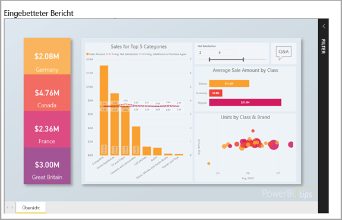

# Einbetten mit Power BI

Der Power BI-Dienst (SaaS) und der Power BI Embedded-Dienst in Azure (PaaS) verfügen über APIs zum Einbetten Ihrer Dashboards und Berichte. Dieses Feature bedeutet, dass Ihnen eine ganze Reihe von Funktionen und Zugriff auf die neuesten Power BI-Features – z.B. Dashboards, Gateways und App-Arbeitsbereiche – zur Verfügung stehen, wenn Sie Inhalte einbetten.

Sie können mit dem [Einbettungssetuptool](https://aka.ms/embedsetup) schnell eine Beispielanwendung herunterladen und mit der Arbeit beginnen.

Wählen Sie die am besten für Sie geeignete Lösung aus:

* Das [Einbetten für Ihre Organisation](embedding.md#embedding-for-your-organization) ermöglicht Ihnen das Erweitern des Power BI-Diensts. Führen Sie die Lösung [Einbetten für Ihre Organisation](https://aka.ms/embedsetup/UserOwnsData) aus.
* Das [Einbetten für Ihre Kunden](embedding.md#embedding-for-your-customers) bietet die Möglichkeit, Dashboards und Berichte für Benutzer einzubetten, die nicht über ein Konto für Power BI verfügen. Führen Sie die Lösung [Einbetten für Ihre Kunden](https://aka.ms/embedsetup/AppOwnsData) aus.

## Verwendung von APIs

Beim Einbetten von Power BI-Inhalten gibt es hauptsächlich zwei Szenarien.  Das Einbetten für Benutzer in Ihrer Organisation (die Lizenzen für Power BI haben) und das Einbetten für Benutzer und Kunden, ohne dass diese über Power BI-Lizenzen verfügen müssen. Die Power BI-REST-API ermöglicht beide Szenarien.

Für Kunden und Benutzer ohne Power BI-Lizenzen können Sie Dashboards und Berichte in Ihre benutzerdefinierte Anwendung einbetten und dabei für Ihre Organisation und Ihre Kunden die gleiche API verwenden. Die Kunden sehen so die Daten, die von der Anwendung verwaltet werden. Für Power BI-Benutzer in Ihrer Organisation besteht außerdem zusätzlich die Möglichkeit, *ihre Daten* direkt in Power BI oder im Kontext der eingebetteten Anwendung anzuzeigen. Sie können alle Funktionen der JavaScript- und REST-APIs für das Einbetten nutzen.

Ein Beispiel für die Funktionsweise der Einbettung finden Sie im [JavaScript-Einbettungsbeispiel](https://microsoft.github.io/PowerBI-JavaScript/demo/).

## Einbetten für Ihre Organisation

Das **Einbetten für Ihre Organisation** ermöglicht Ihnen das Erweitern des Power BI-Diensts. Zum Einbetten für Ihre Organisation ist erforderlich, dass Benutzer Ihrer Anwendung sich beim Power BI-Dienst anmelden, wenn sie ihren Inhalt anzeigen möchten. Nachdem sich ein Benutzer in Ihrer Organisation angemeldet hat, besitzt er nur Zugriff auf Dashboards und Berichte, deren Eigentümer er ist oder die für ihn im Power BI-Dienst freigegeben wurden.

*Beispiele für das Einbetten für Ihre Organisation umfassen interne Anwendungen wie [SharePoint Online](https://powerbi.microsoft.com/blog/integrate-power-bi-reports-in-sharepoint-online/), [Microsoft Teams-Integration (Administratorrechte erforderlich)](https://powerbi.microsoft.com/blog/power-bi-teams-up-with-microsoft-teams/) und [Microsoft Dynamics](https://docs.microsoft.com/dynamics365/customer-engagement/basics/add-edit-power-bi-visualizations-dashboard).*

Informationen zum Einbetten für Ihre Organisation finden Sie in den folgenden Artikeln:

* [Integrieren eines Berichts in eine App](embed-sample-for-your-organization.md)

Self-Service-Funktionen, wie Bearbeiten, Speichern und mehr, stehen bei der Einbettung für Power BI-Benutzer über die [JavaScript-API](https://github.com/Microsoft/PowerBI-JavaScript) zur Verfügung.

Sie können sich mit dem [Einbettungssetuptool](https://aka.ms/embedsetup/UserOwnsData) vertraut machen, um den Einstieg zu beschleunigen und eine Beispielanwendung herunterzuladen, die sie durch die Integration eines Berichts für Ihre Organisation führt.

## Einbetten für Ihre Kunden

Das **Einbetten für Ihre Kunden** bietet die Möglichkeit, Dashboards und Berichte für Benutzer einzubetten, die nicht über ein Konto für Power BI verfügen. Das Einbetten für Ihre Kunden ist auch als **Power BI Embedded** bekannt.

[Power BI Embedded](azure-pbie-what-is-power-bi-embedded.md) ist ein **Microsoft Azure**-Dienst, mit dem unabhängige Softwarehersteller (ISVs) und Entwickler über ein kapazitätsbasiertes stündlich gemessenes Modell Visuals, Berichte und Dashboards schnell einbetten können.

Power BI Embedded bietet Vorteile für unabhängige Softwarehersteller, Entwickler und Kunden. Beispielsweise können unabhängige Softwarehersteller mit Power BI Desktop kostenlos Visuals erstellen. Außerdem können sie eine schnellere Markteinführung erreichen, indem sie den Entwicklungsaufwand für visuelle Analysen minimieren und sich durch differenzierte Datenerfahrung von der Konkurrenz abheben. Darüber hinaus können unabhängige Softwarehersteller eine Gebühr für den mit Embedded Analytics geschaffenen Mehrwert erheben.

Mit Power BI Embedded müssen Ihre Kunden gar nichts über Power BI wissen. Sie benötigen nur ein Power BI Pro-Konto, um eine eingebettete Anwendung zu erstellen. Das Power BI Pro-Konto fungiert als Hauptkonto für Ihre Anwendung (Sie können sich das wie ein Proxykonto vorstellen). Mit dem Power BI Pro-Konto können Sie außerdem Einbettungstoken generieren, die Zugriff auf die Dashboards und Berichte im Power BI-Dienst bieten, die von Ihrer Anwendung verwaltet werden bzw. die diese besitzt.

Entwickler können sich mithilfe von Power BI Embedded auf den Aufbau der Hauptfunktion ihrer Anwendung konzentrieren, anstatt Zeit mit der Entwicklung von Visuals und Analysen zu verbringen. Sie können die Anforderungen von Kundenberichten und Dashboards schnell erfüllen und problemlos mit vollständig dokumentierten APIs und SDKs einbetten. Durch das benutzerfreundliche Durchsuchen von Daten in Apps ermöglichen unabhängige Softwarehersteller ihren Kunden schnelle und datengesteuerte Entscheidungen – von jedem Gerät aus und kontextbezogen.

> [!IMPORTANT]
> Beim Einbetten besteht zwar eine Abhängigkeit vom Power BI-Dienst, für Ihre Kunden besteht aber keine Abhängigkeit von Power BI. Sie müssen sich nicht für Power BI registrieren, um die eingebetteten Inhalte in der Anwendung anzuzeigen.

Wenn Sie bereit sind, in eine Produktionsumgebung zu wechseln, muss der Arbeitsbereich Ihrer App einer dedizierten Kapazität zugeordnet werden. Power BI Embedded in Microsoft Azure bietet [dedizierte Kapazitäten](azure-pbie-create-capacity.md), die von Ihren Anwendungen genutzt werden können.

Details zur Einbettung finden Sie unter [Einbetten von Power BI-Dashboards, -Berichten und -Kacheln](embed-sample-for-customers.md).

## Nächste Schritte

Nun können Sie mit der Einbettung von Power BI-Inhalten in eine Anwendung oder Power BI-Inhalten für Ihre Kunden loslegen.

> [!div class="nextstepaction"]
> [Embed for your organization (Einbetten für Ihre Organisation)](embed-sample-for-your-organization.md)

> [!div class="nextstepaction"]
> [Was ist Power BI Embedded?](azure-pbie-what-is-power-bi-embedded.md)

> [!div class="nextstepaction"]
>[Inhalte für Ihre Kunden einbetten](embed-sample-for-customers.md)

Weitere Fragen? [Stellen Sie Ihre Frage in der Power BI-Community.](http://community.powerbi.com/)