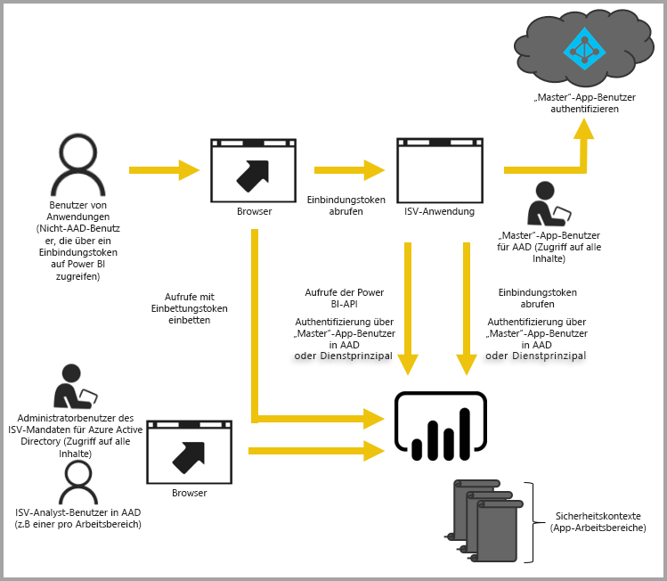

# Einbetten mit Power BI
Power BI bietet APIs zum Einbetten von Dashboards und Berichten in Anwendungen. Die Power BI-APIs bieten einen einheitlichen Satz von Funktionen und Zugriff auf die neuesten Power BI-Funktionen (z.B. Dashboards, Gateways und App-Arbeitsbereiche) beim Einbetten von Inhalten.

## Eine einzige API
Beim Einbetten von Power BI-Inhalten gibt es hauptsächlich zwei Szenarien.  Das Einbetten für Benutzer in Ihrer Organisation (die Lizenzen für Power BI haben) und das Einbetten für Benutzer und Kunden, ohne dass diese über Power BI-Lizenzen verfügen müssen. Die Power BI-REST-API ermöglicht beide Szenarien. 

Für Kunden und Benutzer ohne Power BI-Lizenzen können Sie Dashboards und Berichte in Ihre benutzerdefinierte Anwendung einbetten und dabei für Ihre Organisation und Ihre Kunden die gleiche API verwenden. Die Kunden sehen so die Daten, die von der Anwendung verwaltet werden. Und für Power BI-Benutzer in Ihrer Organisation besteht zusätzlich die Möglichkeit, *eigene Daten* direkt in Power BI oder im Kontext der eingebetteten Anwendung anzuzeigen. Sie können alle Funktionen der JavaScript- und REST-APIs für das Einbetten nutzen.

Ein Beispiel für die Funktionsweise der Einbettung finden Sie im [JavaScript-Einbettungsbeispiel](https://microsoft.github.io/PowerBI-JavaScript/demo/).

## Einbetten für Ihre Organisation
Das Einbetten für Ihre Organisation ermöglicht Ihnen das Erweitern des Power BI-Diensts. Dafür ist erforderlich, dass sich die Benutzer Ihrer Anwendung beim Power BI-Dienst anmelden, wenn sie ihre Inhalte anzeigen möchten. Nachdem sich ein Benutzer in Ihrer Organisation angemeldet hat, besitzt er nur Zugriff auf Dashboards und Berichte, deren Eigentümer er ist oder die für ihn im Power BI-Dienst freigegeben wurden. 

*Beispiele für das Einbetten in Ihre Organisation umfassen interne Webanwendungen, das SharePoint Online-Webpart und die [Microsoft Teams-Integration (Sie müssen über Administratorrechte verfügen)](https://powerbi.microsoft.com/en-us/blog/power-bi-teams-up-with-microsoft-teams/).*

Informationen zum Einbetten für Ihre Organisation finden Sie in den folgenden Artikeln:

* [Integrieren eines Berichts in eine App](integrate-report.md)
* [Integrieren eines Dashboards in eine App](integrate-dashboard.md)
* [Integrieren einer Kachel in eine App](integrate-tile.md)

Self-Service-Funktionen, wie Bearbeiten, Speichern und mehr, stehen bei der Einbettung für Power BI-Benutzer über die [JavaScript-API](https://github.com/Microsoft/PowerBI-JavaScript) zur Verfügung.

Sie können sich mit dem [Tool mit Onboardingfunktionen zur Einbettung für Ihre Organisation](https://aka.ms/embedsetup/UserOwnsData) vertraut machen, um schnell zu beginnen und eine Beispielanwendung herunterzuladen, Sie sie durch die Integration eines Berichts für Ihre Organisation führt.

## Einbetten für Ihre Kunden
Das Einbetten für Ihre Kunden bietet die Möglichkeit, Dashboards und Berichte für Benutzer einzubetten, die nicht über ein Konto für Power BI verfügen. Ihre Kunden brauchen gar nichts über Power BI zu wissen. Es wird mindestens ein Power BI Pro-Konto benötigt, um eine eingebettete Anwendung zu erstellen. Das Power BI Pro-Konto fungiert als Masterkonto für Ihre Anwendung. Stellen Sie es sich als eine Art Proxykonto vor. Mit dem Power BI Pro-Konto können Sie außerdem Einbettungstoken generieren, die Zugriff auf die Dashboards und Berichte im Power BI-Dienst bieten, die von Ihrer Anwendung verwaltet werden bzw. die diese besitzt. 

*Ein Beispiel für das Einbetten für Ihre Kunden ist eine ISV-Anwendung, die an andere Unternehmen verkauft wird.*

Zum Einbetten von Dashboards, Berichten und Kacheln verwenden Sie die gleichen APIs, die Sie zum Einbetten für Ihre Organisation verwenden.

> [!IMPORTANT]
> Beim Einbetten besteht zwar eine Abhängigkeit vom Power BI-Dienst, für Ihre Kunden besteht aber keine Abhängigkeit von Power BI. Sie müssen sich nicht für Power BI registrieren, um die eingebetteten Inhalte in der Anwendung anzuzeigen.
> 

Wenn Sie bereit sind, in eine Produktionsumgebung zu wechseln, muss der Arbeitsbereich Ihrer App einer Kapazität zugeordnet werden. Power BI Embedded in Microsoft Azure bietet Kapazität, die von Ihren Anwendungen genutzt werden kann.

Details zur Einbettung finden Sie unter [Einbetten von Power BI-Dashboards, -Berichten und -Kacheln](embedding-content.md).

Sie können sich mit dem [Tool mit Onboardingfunktionen zur Einbettung für Ihre Kunden](https://aka.ms/embedsetup/AppOwnsData) vertraut machen, um schnell zu beginnen und eine Beispielanwendung herunterzuladen, Sie sie durch die Integration eines Berichts in Ihre Anwendung führt.

Wenn Sie bereits den Dienst Power BI-Arbeitsbereichssammlungen in Azure verwendet haben, finden Sie unter [Migrieren von Inhalten aus Power BI Embedded-Arbeitsbereichssammlungen zu Power BI](migrate-from-powerbi-embedded.md) Informationen zum Migrieren Ihrer Inhalte.

## Nächste Schritte
[Einbetten von Power BI-Dashboards, -Berichten und -Kacheln](embedding-content.md)  
[Migrieren von Inhalten aus Power BI Embedded-Arbeitsbereichsammlungen zu Power BI](migrate-from-powerbi-embedded.md)  
[Power BI Premium – Beschreibung](../service-premium.md)  
[JavaScript-API-Git-Repository](https://github.com/Microsoft/PowerBI-JavaScript)  
[Power BI-C#-Git-Repository](https://github.com/Microsoft/PowerBI-CSharp)  
[JavaScript-Einbettungsbeispiel](https://microsoft.github.io/PowerBI-JavaScript/demo/)  
[Whitepaper zur Kapazitätsplanung der eingebetteten Analyse](https://aka.ms/pbiewhitepaper)  
[Power BI Premium-Whitepaper](https://aka.ms/pbipremiumwhitepaper)  

Weitere Fragen? [Stellen Sie Ihre Frage in der Power BI-Community.](http://community.powerbi.com/)

