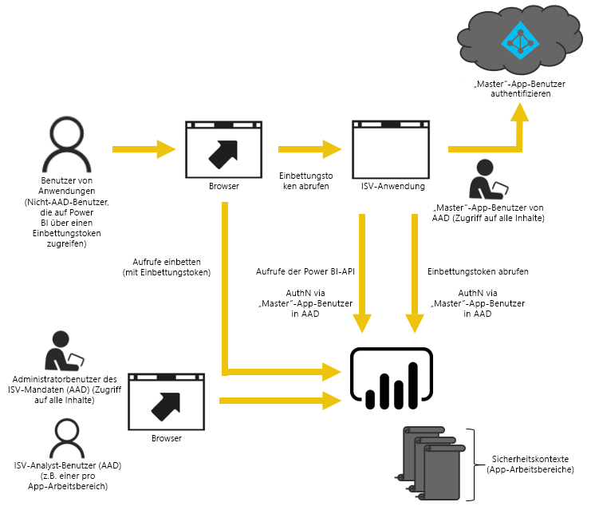
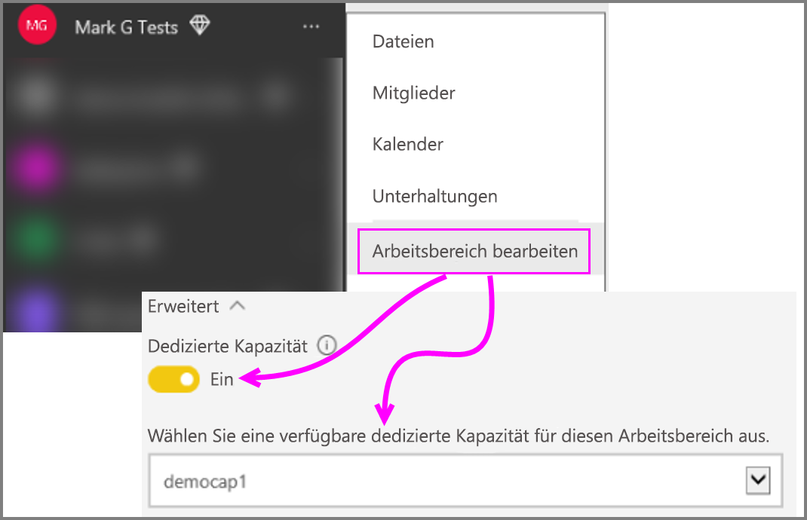

# Migrieren von Inhalten aus der Power BI-Arbeitsbereichssammlung zu Power BI Embedded

Erfahren Sie, wie Sie Inhalte aus der Power BI-Arbeitsbereichssammlung zu Power BI Embedded migrieren und die Vorteile für das Einbetten in Apps nutzen.

Microsoft hat vor Kurzem [Power BI Embedded vorgestellt](https://powerbi.microsoft.com/blog/power-bi-embedded-capacity-based-skus-coming-to-azure/), ein neues kapazitätsbasiertes Lizenzierungsmodell, das die Flexibilität der Benutzer beim Zugriff, der Freigabe und dem Verteilen von Inhalten erhöht. Das Angebot bietet zusätzliche Skalierbarkeit und Leistung.

Mit Power BI Embedded stehen Ihnen eine API-Oberfläche, ein einheitlicher Satz von Funktionen und Zugriff auf die neuesten Power BI-Features (z.B. Dashboards, Gateways und App-Arbeitsbereiche) zur Verfügung, wenn Sie Inhalte einbetten. In Zukunft können Sie mit Power BI Desktop beginnen und zu einer Bereitstellung mit Power BI Embedded wechseln.

Die aktuelle Power BI-Arbeitsbereichssammlung ist für einen begrenzten Zeitraum weiterhin verfügbar. Kunden mit einem Enterprise Agreement haben bis zum Ablauf ihrer vorhandenen Vereinbarungen Zugriff darauf; Kunden, welche die Power BI-Arbeitsbereichssammlung über einen direkten Kanal oder einen CSP-Kanal erworben haben, haben ab dem allgemeinen Verfügbarkeitsrelease von Power BI Embedded ein Jahr lang weiterhin Zugriff darauf.  Dieser Artikel bietet hilfreiche Informationen zur Migration der Power BI-Arbeitsbereichssammlung zum neuen Power BI Embedded sowie Erläuterungen zu den zu erwartenden Änderungen in Ihrer Anwendung.

> [!IMPORTANT]
> Für die Migration ist eine Abhängigkeit von Power BI Embedded vorhanden, die Benutzer Ihrer Anwendung sind aber nicht von Power BI abhängig, wenn sie ein **Einbettungstoken verwenden**. Sie müssen sich nicht für Power BI registrieren, um die eingebetteten Inhalte in der Anwendung anzuzeigen. Sie können diesen Einbettungsansatz in Power BI Embedded verwenden, um Nicht-Power BI-Benutzern zuzuarbeiten.

Bevor Sie mit der Migration zum neuen Dienst Power BI Embedded beginnen, können Sie kurz eine exemplarische Vorgehensweise durcharbeiten, die Ihnen dabei hilft, Ihre neue Power BI Embedded-Umgebung mit dem [Setuptool für die Einbettung](https://aka.ms/embedsetup) einzurichten.

Wählen Sie die am besten für Sie geeignete Lösung aus:
* **Einbetten für Ihre Kunden**: wenn Sie Interesse an einer [App Owns Data](https://aka.ms/embedsetup/AppOwnsData)-Lösung (App besitzt die Daten) haben. Das [Einbetten für Ihre Kunden](embedding.md#embedding-for-your-customers) bietet die Möglichkeit, Dashboards und Berichte für Benutzer einzubetten, die nicht über ein Konto für Power BI verfügen. 

* **Einbetten für Ihre Organisation**: wenn Sie Interesse an einer [User Owns Data](https://aka.ms/embedsetup/UserOwnsData)-Lösung (Benutzer besitzt die Daten) haben. Das [Einbetten für Ihre Organisation](embedding.md#embedding-for-your-organization) ermöglicht Ihnen das Erweitern des Power BI-Diensts.

## Vorbereiten der Migration

Es gibt einige Schritte, die Sie zur Vorbereitung der Migration der Power BI-Arbeitsbereichssammlung zu Power BI Embedded ausführen müssen. Sie benötigen einen verfügbaren Mandanten sowie einen Benutzer mit einer Power BI Pro-Lizenz.

1. Stellen Sie sicher, dass Sie Zugriff auf einen Azure Active Directory-Mandanten (Azure AD) haben.

    Sie müssen bestimmen, welches Mandantensetup verwendet werden soll.

   * Verwenden Sie Ihren vorhandenen, unternehmensbezogenen Power BI-Mandanten?
   * Verwenden Sie einen separaten Mandanten für Ihre Anwendung?
   * Verwenden Sie einen separaten Mandanten pro Kunde?

     Wenn Sie einen neuen Mandanten für Ihre Anwendung oder jeden Kunden erstellen möchten, finden Sie unter [Erstellen eines Azure Active Directory-Mandanten](create-an-azure-active-directory-tenant.md) oder [Vorgehensweise: Abrufen eines Azure Active Directory-Mandanten](https://docs.microsoft.com/azure/active-directory/develop/active-directory-howto-tenant) weitere Informationen dazu.
2. Erstellen Sie einen Benutzer in diesem neuen Mandanten, der als Ihr „Master“-Anwendungskonto fungiert. Das Konto muss für Power BI registriert werden und muss eine Power BI Pro-Lizenz zugewiesen bekommen.

## Konten in Azure AD

Die folgenden Konten müssen in Ihrem Mandanten vorhanden sein.

> [!NOTE]
> Diese Konten benötigen Power BI Pro-Lizenzen, um App-Arbeitsbereiche nutzen zu können.

1. Ein Mandantenadministrator

    Dieser Benutzer sollte Mitglied aller App-Arbeitsbereiche sein, die zum Einbetten erstellt werden.

2. Konten für Analysten, die Inhalte erstellen

    Diese Benutzer sollten nach Bedarf App-Arbeitsbereichen zugewiesen werden.

3. Ein *Master*-Benutzerkonto der Anwendung oder Embedded-Konto.

    Das Back-End der Anwendung speichert die Anmeldeinformationen für dieses Konto und ruft damit ein Azure AD-Token für die Verwendung mit Power BI-APIs ab. Mit diesem Konto wird das Einbettungstoken für die Anwendung generiert. Dieses Konto muss einem Administrator der App-Arbeitsbereiche gehören, die für die Einbettung erstellt werden.

> [!NOTE]
> Dies ist lediglich ein herkömmliches Benutzerkonto in Ihrer Organisation, das für Einbettungszwecke verwendet wird.

## App-Registrierung und Berechtigungen

Sie müssen eine Anwendung in Azure AD registrieren und bestimmte Berechtigungen erteilen.

### Registrieren einer Anwendung

Sie müssen Ihre Anwendung bei Azure AD registrieren, um REST-API-Aufrufe ausführen zu können. Dazu müssen Sie nicht nur die Power BI-Seite für die App-Registrierung besuchen, sondern auch im Azure-Portal weitere Konfigurationsschritte ausführen. Weitere Informationen finden Sie unter [Registrieren einer Azure AD-App zum Einbetten von Power BI-Inhalten](register-app.md).

Sie müssen die Anwendung mithilfe des **Hauptkontos** der Anwendung registrieren.

## Erstellen von App-Arbeitsbereichen (erforderlich)

Sie können App-Arbeitsbereiche nutzen, um eine bessere Isolation bereitzustellen, wenn Ihre Anwendung von mehreren Kunden verwendet wird. Dashboards und Berichte werden dann zwischen Ihren Kunden isoliert. Sie können anschließend ein Power BI-Konto pro App-Arbeitsbereich verwenden, um die Anwendungsnutzung für die Kunden noch weiter zu isolieren.

> [!IMPORTANT]
> Sie können in einem persönlichen Arbeitsbereich nicht das Einbetten in Nicht-Power BI-Benutzer nutzen.

Sie benötigen einen Benutzer, der über eine Pro-Lizenz verfügt, um einen App-Arbeitsbereich in Power BI zu erstellen. Der Power BI-Benutzer, der den App-Arbeitsbereich erstellt, ist standardmäßig der Administrator dieses Arbeitsbereichs.

> [!NOTE]
> Das *Hauptkonto* der Anwendung muss ein Administrator des Arbeitsbereichs sein.

## Migration von Inhalten

Das Migrieren Ihrer Inhalte aus Ihren Arbeitsbereichssammlungen für Power BI Embedded kann parallel zur aktuellen Projektmappe erfolgen und erfordert keine Ausfallzeiten.

Ihnen steht ein **Migrationstool** zur Verfügung, um Sie beim Kopieren von Inhalten aus der Power BI-Arbeitsbereichssammlung in Power BI Embedded zu unterstützen. Insbesondere, wenn Sie viel Inhalt haben. Weitere Informationen finden Sie unter [Power BI Embedded Migrationstool](migrate-tool.md).

Die Migration von Inhalten verwendet hauptsächlich zwei APIs.

1. Download PBIX: Diese API kann PBIX-Dateien herunterladen, die auf Power BI nach Oktober 2016 hochgeladen wurden.
2. Import PBIX: Diese API lädt alle PBIX in Power BI hoch.

Unter [Code snippets for migrating content from Power BI Workspace Collection](migrate-code-snippets.md) (Codeausschnitte zum Migrieren von Inhalten aus dem Power BI-Arbeitsbereich) finden Sie einige zugehörige Codeausschnitte.

### Berichtstypen

Es gibt mehrere Berichtstypen, jeder erfordert einen etwas anderen Migrationsflow.

#### Zwischengespeichertes Dataset & Bericht

Zwischengespeicherte Datasets finden Sie in PBIX-Dateien, die Daten im Gegensatz zu einer Liveverbindung oder DirectQuery-Verbindung importiert hatten.

**Flow**

1. Herunterladen PBIX-API Aufrufen im PaaS-Arbeitsbereich.
2. Speichern Sie die PBIX.
3. Rufen Sie Import PBIX SaaS-Arbeitsbereich auf.

#### DirectQuery-Dataset & Bericht

**Flow**

1. Rufen Sie GET auf (https://api.powerbi.com/v1.0/collections/{collection_id}/workspaces/{wid}/datasets/{dataset_id}/Default.GetBoundGatewayDataSources), und speichern Sie die erhaltene Verbindungszeichenfolge.
2. Herunterladen PBIX-API Aufrufen im PaaS-Arbeitsbereich.
3. Speichern Sie die PBIX.
4. Rufen Sie Import PBIX SaaS-Arbeitsbereich auf.
5. Aktualisieren Sie die Verbindungszeichenfolge, indem Sie POST aufrufen (https://api.powerbi.com/v1.0/myorg/datasets/{dataset_id}/Default.SetAllConnections).
6. Rufen Sie GW und Datasource-Bezeichner, durch den Aufruf - GET https://api.powerbi.com/v1.0/myorg/datasets/{dataset_id}/Default.GetBoundGatewayDataSources
7. Aktualisieren Sie die Benutzeranmeldedaten, indem Sie PATCH (https://api.powerbi.com/v1.0/myorg/gateways/{gateway_id}/datasources/{datasource_id}) aufrufen.

#### Altes Dataset & Bericht

Hierbei handelt es sich um Datasets/Berichte, die vor Oktober 2016 erstellt wurden. Das Herunterladen von PBIX unterstützt keine PBIXs, die vor Oktober 2016 hochgeladen wurden

**Flow**

1. Rufen Sie PBIX aus Ihrer Entwicklungsumgebung (die interne Quellcodeverwaltung) ab.
2. Rufen Sie Import PBIX SaaS-Arbeitsbereich auf.

#### Push-Dataset & Bericht

PBIX herunterladen unterstützt keine *Push-API*-Datasets. Daten von Datasets per Push-API können nicht von PaaS zu SaaS portiert werden.

**Flow**

1. Rufen Sie die „Create Dataset“-API (Dataset erstellen) mit Dataset-Json auf, um Datasets im Arbeitsbereich „SaaS“ zu erstellen.
2. Erstellen Sie für das erstellte Dataset * einen neuen Bericht.

Es ist möglich, einige Problemumgehungen zum Migrieren des Push-Vorgangs mit API-Bericht von PaaS zu SaaS zu verwenden, indem Sie das Folgende versuchen.

1. Hochladen von einigen Dummy-PBIX in den PaaS-Arbeitsbereich.
2. Klonen Sie den Push-API-Bericht, und verbinden Sie diesen mit dem Dummy-PBIX aus Schritt 1.
3. Push-API-Bericht mit dem Dummy-PBIX herunterladen.
4. Laden Sie den Dummy-PBIX in Ihren SaaS-Arbeitsbereich hoch.
5. Erstellen Sie ein Push-Dataset in Ihrem SaaS-Arbeitsbereich.
6. Binden Sie den Bericht erneut an das Push-API-Dataset.

## Erstellen und Hochladen von Berichten

Zusätzlich zu dem Inhalt, den Sie aus dem Power BI-Arbeitsbereich migriert haben, können Sie Ihre Berichte und Datasets mit Power BI Desktop erstellen und diese Berichte anschließend in einem App-Arbeitsbereich veröffentlichen. Der Endbenutzer, der die Berichte veröffentlicht, muss über eine Power BI Pro-Lizenz verfügen, damit er einen App-Arbeitsbereich veröffentlichen kann.

## Erneutes Erstellen der Anwendung

1. Sie müssen Ihre Anwendung ändern, um die Power BI-REST-APIs und den Speicherort des Berichts in „powerbi.com“ zu verwenden.
2. Erstellen Sie die AuthN-/AuthZ-Authentifizierung unter Verwendung des *Masterkontos* für Ihre Anwendung neu. Sie können dabei ein [Einbettungstoken](https://docs.microsoft.com/rest/api/power-bi/embedtoken) verwenden, damit dieser Benutzer im Auftrag anderer Benutzer handeln kann.
3. Betten Sie Ihre Berichte auf „powerbi.com“ in Ihrer Anwendung ein.

## Zuordnen der Benutzer zu einem Power BI-Benutzer

Innerhalb Ihrer Anwendung ordnen Sie Benutzer, die Sie in der Anwendung verwalten, für Ihre Anwendung *Masteranmeldeinformationen* für Power BI zu. Die Anmeldeinformationen für dieses Power BI-*Masterkonto* werden in Ihrer Anwendung gespeichert und zum Erstellen von Einbettungstoken verwendet.

## Wenn Sie bereit für die Produktionsphase sind

Wenn Sie in die Produktionsphase wechseln möchten, müssen Sie die folgenden Schritte ausführen.

* Wenn Sie einen separaten Mandanten für die Entwicklung verwenden, müssen Sie sicherstellen, dass Ihre App-Arbeitsbereiche, zusammen mit Dashboards und Berichten, in der Produktionsumgebung verfügbar sind. Sie müssen zudem sicherstellen, dass Sie die Anwendung in Azure AD für Ihren Produktionsmandanten erstellt haben, und dass Sie die entsprechenden App-Berechtigungen zugewiesen haben, wie in Schritt 1 angegeben.
* Erwerben Sie eine Kapazität, die Ihren Anforderungen entspricht. Lesen Sie das [Whitepaper zur Kapazitätsplanung für die Analyse in Power BI Embedded](https://aka.ms/pbiewhitepaper) (in englischer Sprache), um die Menge und Art der benötigten Kapazität besser zu verstehen. Sie können in Azure [Kapazität erwerben](https://portal.azure.com/#create/Microsoft.PowerBIDedicated).
* Bearbeiten Sie den App-Arbeitsbereich, und weisen Sie diesen einer Premium-Kapazität unter „Erweitert“ zu.

    

* Stellen Sie die aktualisierte Anwendung für die Produktion bereit, und beginnen Sie mit dem Einbetten von Berichten aus Power BI Embedded.

## Nach der Migration

Sie sollten in Azure einige Bereinigungsschritte ausführen.

* Entfernen Sie alle Arbeitsbereiche aus der bereitgestellten Lösung in Azure Embedded der Power BI-Arbeitsbereichssammlung.
* Löschen Sie alle Arbeitsbereichsammlungen, die in Azure vorhanden sind.

## Nächste Schritte

[Einbetten mit Power BI](embedding.md)  
[Migrationstool für die Power BI-Arbeitsbereichssammlung](migrate-tool.md)  
[Codeausschnitte zum Migrieren von Inhalten aus der Power BI-Arbeitsbereichssammlung](migrate-code-snippets.md)  
[Wie soll ich Power BI-Dashboards, -Berichte und -Kacheln einbetten?](embedding-content.md)  
[Power BI Premium – Beschreibung](../service-premium-what-is.md)  
[JavaScript-API-Git-Repository](https://github.com/Microsoft/PowerBI-JavaScript)  
[Power BI-C#-Git-Repository](https://github.com/Microsoft/PowerBI-CSharp)  
[JavaScript-Einbettungsbeispiel](https://microsoft.github.io/PowerBI-JavaScript/demo/)  
[Whitepaper zur Kapazitätsplanung der Analyse von Arbeitsbereichssammlungen](https://aka.ms/pbiewhitepaper)  
[Power BI Premium-Whitepaper](https://aka.ms/pbipremiumwhitepaper)  

Weitere Fragen? [Stellen Sie Ihre Frage in der Power BI-Community.](http://community.powerbi.com/)
