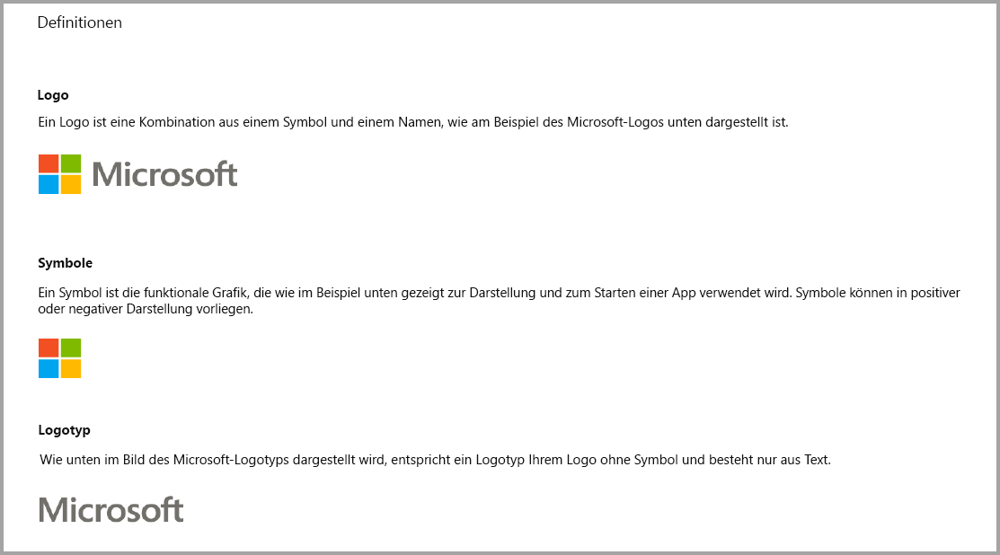
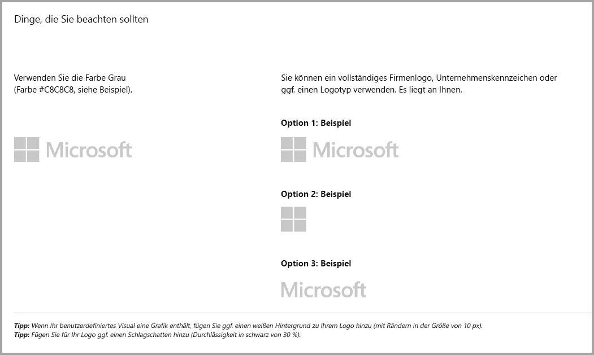
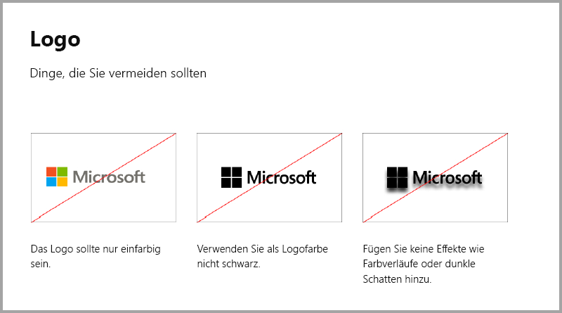
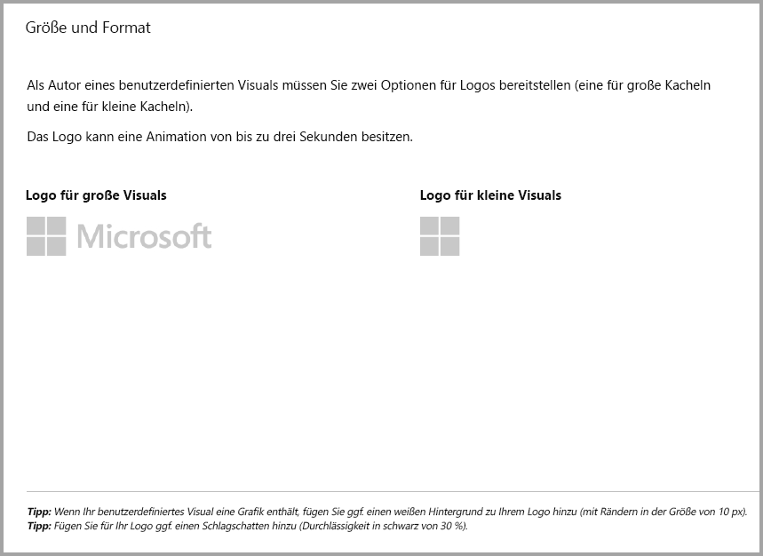
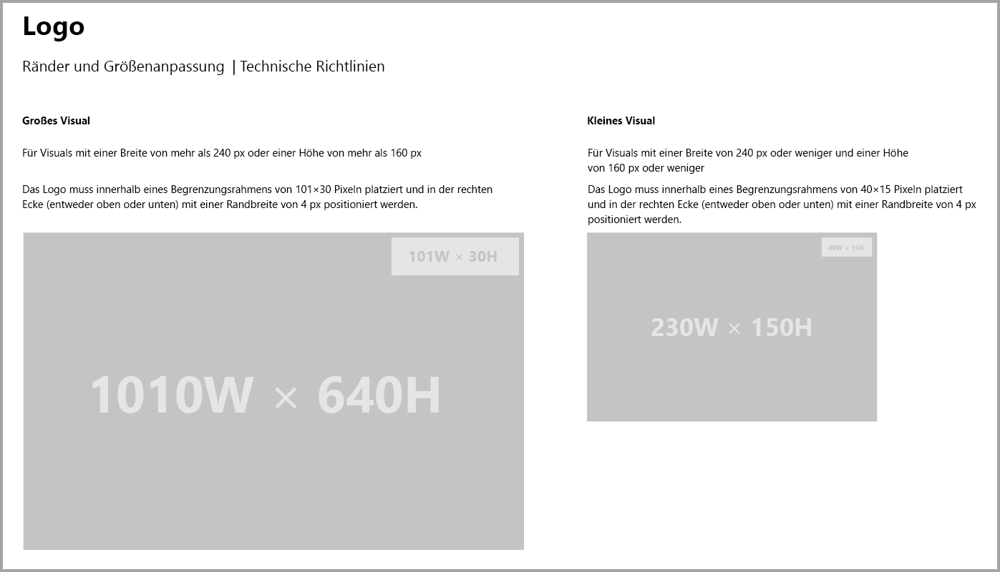
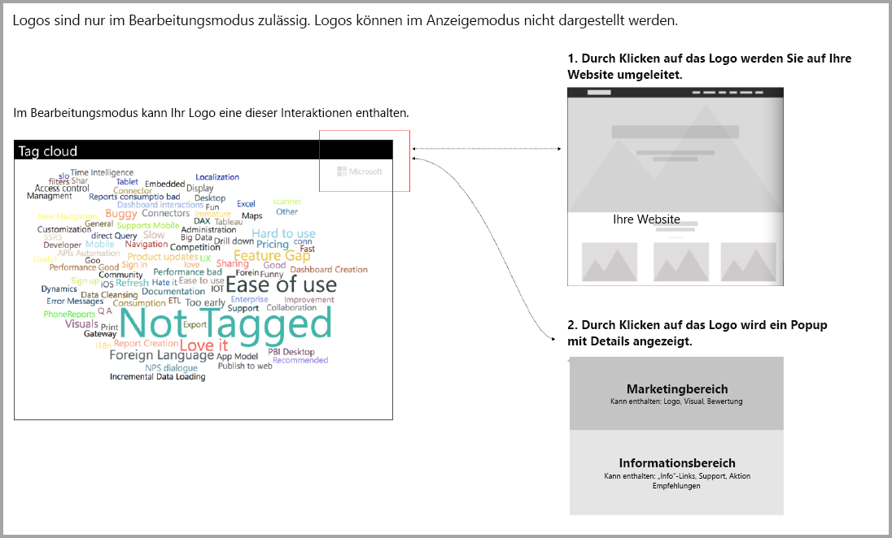

# Richtlinien für Power BI-Visuals mit zusätzlichen Käufen

Bis vor Kurzem wurden im **Marketplace (AppSource)** nur kostenlose Power BI-Visuals akzeptiert. Diese Richtlinie ändert sich, sodass Visuals mit dem Preistag „Möglicherweise sind zusätzliche Käufe erforderlich.“ auch an **AppSource** übermittelt werden können. Visuals, für die möglicherweise zusätzliche Käufe erforderlich sind, ähneln den Add-Ins mit In-App-Käufen, die im Office Store verfügbar sind. Entwickler können diese Visuals zudem zur Zertifizierung übermitteln, nachdem das **AppSource**-Team diese genehmigt hat und nachdem sichergestellt wurde, dass diese den Zertifizierungsanforderungen entsprechen. Dies wird im Artikel [Certified custom visuals (Zertifizierte benutzerdefinierte Visuals)](../power-bi-custom-visuals-certified.md) beschrieben.

> [!Note]
> Damit ein Visual zertifiziert werden kann, darf es nicht auf externe Dienste oder Ressourcen zugreifen.

> [!Note]
> Alle kostenlosen Visuals sollten dieselben kostenlosen Features beibehalten, die zuvor angeboten wurden. Sie können kostenpflichtige, optionale erweiterte Features auf Grundlage der alten Features hinzufügen. Es wird empfohlen, die IAP-Visuals mit den erweiterten Features als neue Visuals zu veröffentlichen, anstatt die alten, kostenlosen Features zu aktualisieren.

## Was ändert sich am Übermittlungsprozess?

Entwickler laden ihre Visuals, die In-App-Käufe enthalten, genau wie kostenlose Visuals über das Seller-Dashboard in AppSource hoch. Damit deutlich ist, dass das übermittelte Visual In-App-Käufe enthält, sollten Entwickler im Seller-Dashboard den Hinweis „Visual with in-app purchase.“ (Visual mit In-App-Käufen) hinzufügen. Entwickler müssen außerdem einen Lizenzschlüssel oder ein Token angeben, damit das entsprechende Team die In-App-Käufe überprüfen kann. Sobald das Visual überprüft und genehmigt wurde, wird in AppSource für das Visual der Hinweis „Möglicherweise sind zusätzliche Käufe erforderlich.“ in den Preisoptionen angezeigt.

## Was ist ein Power BI-Visual mit In-App-Käufen?

Ein IAP-Visual ist ein kostenloses Visual mit kostenlosen Features, das jedoch auch zusätzliche erweiterte Features bietet, für deren Nutzung zusätzliche Kosten anfallen können. Die Benutzer müssen in der Beschreibung des Visuals darüber informiert werden, welche Features kostenpflichtig sind. Derzeit bietet Microsoft keine nativen Anwendungsprogrammierschnittstellen (APIs) an, die Käufe in Apps und Add-Ins unterstützen. Entwickler müssen ein Zahlungssystem von einem Drittanbieter für diese Käufe verwenden. Weitere Informationen finden Sie in unseren [Richtlinien für Stores](https://docs.microsoft.com/office/dev/store/validation-policies#2-apps-or-add-ins-can-display-certain-ads).

> [!NOTE]
> Wasserzeichen sind in kostenlosen Features nicht zulässig. Entwickler können ein Popupfenster oder Wasserzeichen anzeigen, wenn die erweiterten kostenpflichtigen Funktionen ohne gültige Lizenz verwendet werden.  

## Richtlinien für Logos

In diesem Abschnitt werden die Spezifikationen für das Hinzufügen von Logos und Logotypen in Visuals erläutert.

> [!NOTE]
> Logos sind nur im Bearbeitungsmodus zulässig. Logos können im Anzeigemodus nicht dargestellt werden.

## Bewährte Methoden

### Startseite für Visuals

Verwenden Sie die Startseite, um den Benutzern zu verdeutlichen, wie sie Visuals verwenden und wo Lizenzen erworben werden können. Fügen Sie keine Videos ein, die automatisch abgespielt werden. Fügen Sie nur Inhalte hinzu, durch die die Verwendung benutzerfreundlicher wird, z.B. Informationen oder Links zu den Kaufdetails von Lizenzen und zum Einsatz von Features für In-App-Käufe.

### Lizenzschlüssel und Token

Fügen Sie Felder für Lizenzschlüssel oder Token im oberen Teil des Formatierungsbereichs hinzu, sodass diese vom Benutzer leicht gefunden werden.

## HÄUFIG GESTELLTE FRAGEN

Weitere Informationen und Antworten auf Fragen finden Sie in den [häufig gestellten Fragen zu Visuals mit zusätzlichen Käufen](https://docs.microsoft.com/power-bi/power-bi-custom-visuals-faq#visuals-with-additional-purchases).

## Nächste Schritte

Erfahren Sie, wie Sie ein benutzerdefiniertes Visual in [AppSource](office-store.md) veröffentlichen, damit es von anderen gefunden und verwendet werden kann.
