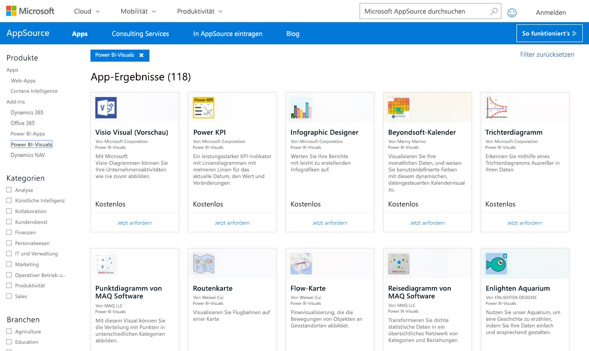
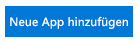
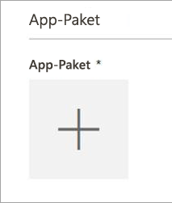
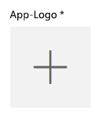
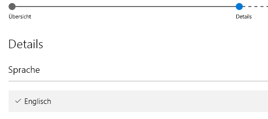

# Veröffentlichen von benutzerdefinierten Visuals in AppSource
Erfahren Sie, wie Sie ein benutzerdefiniertes Visual in AppSource veröffentlichen, damit es von anderen gefunden und verwendet werden kann. Office

Nachdem Sie ein benutzerdefiniertes Visual erstellt haben, empfiehlt es sich, es in AppSource zu veröffentlichen, damit es von anderen Personen gefunden und verwendet werden kann. Zuvor sind jedoch einige vorbereitende Schritte erforderlich. Weitere Informationen zum Erstellen einer benutzerdefinierten Visualisierung finden Sie unter [Erstellen benutzerdefinierter Visualisierungen mithilfe von Entwicklertools](../service-custom-visuals-getting-started-with-developer-tools.md).

Was ist AppSource? Einfach ausgedrückt ist dies der Ort, an dem Sie SaaS-Apps und Add-Ins für Ihre Microsoft-Produkte und -Services finden. In [AppSource](https://appsource.microsoft.com/marketplace/apps?product=power-bi-visuals) finden Millionen von Benutzern von Office 365, Dynamics 365, Cortana Intelligence und anderen Produkten Lösungen, mit denen sie die Effizienz ihrer Arbeit steigern, größere Einblicke gewinnen oder die Darstellung der Ergebnisse verbessern können.

## Vorbereiten der Übermittlung Ihrer benutzerdefinierten Visualisierung
Nachdem Sie die benutzerdefinierte Visualisierung codiert, getestet und als PBIVIZ-Datei gepackt haben, sollten Sie zudem die folgenden Elemente für die Übermittlung vorbereitet haben.

| Item | Erforderlich | Beschreibung |
| --- | --- | --- |
| PBIVIZ-Paket mit allen erforderlichen Metadaten |Ja |Name der Visualisierung Anzeigename GUID Version Beschreibung Name und E-Mail-Adresse des Autors |
| PBIX-Beispielberichtsdatei |Ja |Um Ihre Visualisierung zu präsentieren, sollten Sie Benutzer mit der Visualisierung vertraut machen. Sie sollten den Nutzen der Visualisierung für den Benutzer unterstreichen und Beispiele für die Verwendung, die Formatierungsoptionen und weitere Funktionen bieten. Sie können auch am Ende eine Seite für *Hinweise* hinzufügen, die Tipps und Tricks, häufige Fehler und ähnliche Hinweise enthält. Der PBIX-Beispielbericht muss offline ohne externe Verbindung funktionieren. |
| Symbol |Ja |Sie sollten das Logo der benutzerdefinierten Visualisierung einschließen, das in der digitalen Ladenzeile angezeigt wird. Dabei kann es sich um eine PNG-, JPG-, JPEG- oder GIF-Datei handeln. Die Bildgröße muss genau 300 px (Breite) x 300 px (Höhe) betragen. **Wichtig:** Lesen Sie die [Kurzanleitung](https://docs.microsoft.com/en-us/office/dev/store/craft-effective-appsource-store-images) sorgfältig durch, bevor Sie das Symbol senden. |
| Screenshots |Ja |Sie müssen mindestens einen Screenshot bereitstellen. Dabei kann es sich um eine PNG-, JPG-, JPEG- oder GIF-Datei handeln. Die Größe muss exakt 1366 px (Breite) x 768 px (Höhe) betragen. Die Dateigröße darf 1024 KB nicht überschreiten. *Um den Nutzen der Screenshots zu erhöhen, fügen Sie Textblasen hinzu, die den Wertbeitrag wichtiger Features, die in den einzelnen Screenshots gezeigt werden, erläutern.* |
| Support-Downloadlink |Ja |Geben Sie eine URL an, um Kunden zu unterstützen, bei denen Probleme mit Ihrer Visualisierung auftreten. Die URL sollte „https://“ oder „http://“ enthalten. |
| Link zum Datenschutzdokument |Ja |Geben Sie einen Link zur Datenschutzrichtlinie für Kunden an, die Ihre Visualisierung verwenden. Der Link sollte „https://“ oder „http://“ enthalten. |
| Lizenzbedingungen |Ja |Sie müssen eine Datei mit den Lizenzbedingungen hochladen. Dabei kann es sich um eigene Lizenzbedingungen oder die Standardlizenzbedingungen im Office Store für benutzerdefinierte Power BI-Visualisierungen handeln. Wenn Sie die Standardlizenzbedingungen verwenden möchten, fügen Sie im Verkäuferdashboard im Dialogfeld zum Hochladen der Datei mit den Lizenzbedingungen die folgende URL ein: [https://visuals.azureedge.net/app-store/Power BI – Default Custom Visual EULA.pdf](https://visuals.azureedge.net/app-store/Power BI - Default Custom Visual EULA.pdf). |
| Videolink |Nein |Um das Interesse der Benutzer an Ihrer benutzerdefinierten Visualisierung zu steigern, sollten sie einen Link zu einem Video über Ihre Visualisierung bereitstellen. Die URL sollte „https://“ oder „http://“ enthalten. |
| GitHub-Repository |Nein |Es wird empfohlen, einen gültigen öffentlichen Link zu einem [GitHub](https://www.github.com)-Repository bereitzustellen, das Quellen Ihrer Visualisierung und Beispieldaten enthält, damit andere Entwickler Feedback geben und Verbesserungen des Codes vorschlagen können. |

## Übermitteln an Power BI
Vor Beginn der Übermittlung müssen Sie eine E-Mail an das Power BI-Team für benutzerdefinierte Visualisierungen senden. Sie können die E-Mail an [pbivizsubmit@microsoft.com](mailto:pbivizsubmit@microsoft.com) senden.

> [!IMPORTANT]
> Sie müssen die folgenden Felder in der Datei „pbiviz.json“ ausfüllen: „description“, „supportUrl“, „author“, „name“ und „email“, bevor Sie das .pbiviz-Paket erstellen.
> 

Fügen Sie die PBIVIZ-Datei und die PBIX-Beispielberichtsdatei als Anlage an die E-Mail an. Das Power BI-Team sendet eine Antwort mit Anweisungen und einer XML-Datei mit App-Paket zum Hochladen. Dieses XML-App-Paket ist erforderlich, um Ihr Visual über das Office Developer Center zu übermitteln.

> [!NOTE]
> Um die Qualität zu verbessern und zu verhindern, dass vorhandene Berichte beschädigt werden, dauert es nach der Genehmigung im Store weitere zwei Wochen, bis Aktualisierungen vorhandener Visuals die Produktionsumgebung erreichen.
> 
> 

## Senden von Inhalten an AppSource
Nachdem Sie das XML-App-Paket vom Power BI-Team erhalten haben, navigieren Sie zum [Developer Center](https://sellerdashboard.microsoft.com/Application/Summary), um Ihr Visual an AppSource zu übermitteln.

> [!NOTE]
> Sie benötigen ein gültiges Office-Entwicklerkonto, um sich beim [Office Developer Center](https://dev.office.com/) anzumelden. Das Office-Entwicklerkonto muss ein Microsoft-Konto (Live ID, z. B. hotmail.com oder outlook.com) sein.
> 
> [!IMPORTANT]
> Vor der Übermittlung an AppSource müssen Sie eine E-Mail mit der PBIVIZ-Datei und der PBIX-Datei an das Power BI-Team senden. Dies ist erforderlich, damit das Power BI-Team die Dateien auf den Server für die öffentliche Freigabe hochladen kann. Andernfalls kann der Store die Dateien nicht abrufen. Sie müssen bei jeder Übermittlung eines neuen Visuals, bei der Aktualisierung eines vorhandenen Visuals und bei Korrekturen von abgelehnten Visuals die Dateien übermitteln.
> 
> 

### Prozess zum Übermitteln der Visualisierung
Führen Sie die folgenden Schritte aus, um die Übermittlung durchzuführen.

1. Wählen Sie **Neue App hinzufügen** aus.
   
    
2. Wählen Sie **Benutzerdefiniertes visuelles Power BI-Element** und dann **Weiter** aus.
3. Wählen Sie das Symbol **+** unter **App-Paket**, und wählen Sie im Dialogfeld „Datei öffnen“ die XML-Datei mit dem App-Paket aus, die Sie vom Power BI-Team erhalten haben.
   
    
4. Sie erhalten die Bestätigung, dass es sich um ein gültiges Power BI-App-Paket handelt.
   
    
5. Machen Sie die Angaben für **Allgemeine Informationen**.
   
   * *Titel der Übermittlung:* Der Name Ihrer Übermittlung im Developer Center.
   * *Version:* Die Versionsnummer wird automatisch aus dem Add-In-App-Paket übernommen.
   * *Veröffentlichungsdatum (UTC):* Wählen Sie das Datum aus, an dem die App im Store veröffentlicht werden soll. Bei Auswahl eines in der Zukunft liegenden Datums ist die App erst ab diesem Datum im Store verfügbar.
   * *Kategorie:* Als erste Kategorie wird automatisch „Datenvisualisierung und BI“ eingetragen. Auf diese Weise werden alle benutzerdefinierten Power BI-Visuals gekennzeichnet. Sie können bis zu zwei zusätzliche Kategorien angeben, um Benutzern die Suche nach Ihren Visuals zu erleichtern.
   * *Testhinweise:* Optionale Angabe, wenn Sie Anweisungen für Tester bei Microsoft bereitstellen möchten.
   * *In meiner App ist Kryptografie oder Verschlüsselung enthalten bzw. wird von dieser aufgerufen, unterstützt oder verwendet:* Lassen Sie diese Option deaktiviert.
   * *Dieses Add-In im Office-Add-In-Katalog auf iPad verfügbar machen:* Lassen Sie diese Option deaktiviert.
6. Laden Sie das Logo für Ihre Visualisierung hoch, indem Sie das Symbol **+** unter **App-Logo** auswählen. Wählen Sie dann im Dialogfeld „Datei öffnen“ die Symboldatei aus. Dies muss eine PNG-, JPG-, JPEG- oder GIF-Datei sein. Die Bildgröße muss genau 300 px (Breite) x 300 px (Höhe) betragen, und die Dateigröße darf 512 KB nicht überschreiten.
   
    
7. Geben Sie die Details für **Supportdokumente** ein.
   
   * Link zum Supportdokument
   * Link zum Datenschutzdokument
   * Videolink
   * Lizenzbedingungen
     
       Sie müssen eine Datei mit den Lizenzbedingungen hochladen. Dabei kann es sich um eigene Lizenzbedingungen oder die Standardlizenzbedingungen im Office Store für benutzerdefinierte Power BI-Visualisierungen handeln. Wenn Sie die Standardlizenzbedingungen verwenden möchten, fügen Sie im Verkäuferdashboard im Dialogfeld zum Hochladen der Datei mit den Lizenzbedingungen die folgende URL ein: [https://visuals.azureedge.net/app-store/Power BI – Default Custom Visual EULA.pdf](https://visuals.azureedge.net/app-store/Power BI - Default Custom Visual EULA.pdf).
8. Wählen Sie **Weiter** aus, um zur Seite **Details** zu gelangen.
9. Wählen Sie **Sprache** aus, und wählen Sie eine Sprache aus der Liste.
   
    
10. Geben Sie die Details in „Beschreibung“ ein.
    
    * *App-Name (in dieser Sprache):* Geben Sie den Titel der App ein, der in der digitalen Ladenzeile angezeigt werden soll.
    * *Kurzbeschreibung:* Geben Sie die Kurzbeschreibung der App mit bis zu 100 Zeichen ein, die in der digitalen Ladenzeile angezeigt werden soll. Diese Beschreibung wird zusammen mit dem Logo auf den Seiten der obersten Ebene angezeigt. Sie können die Beschreibung aus dem PBIVIZ-Paket verwenden.
    * *Ausführliche Beschreibung:* Geben Sie eine ausführlichere Beschreibung der App ein. Diese wird für Kunden auf der Seite „App-Details“ angezeigt. Wenn Sie Ihr visuelles Element als Open Source-Element bereitstellen und so der Community die Möglichkeit geben möchten, Ihr Element zu verbessern, geben Sie hier den Link zu dem öffentlichen Repository (beispielsweise GitHub) an.
11. Laden Sie mindestens einen Screenshot hoch. Dabei kann es sich um eine PNG-, JPG-, JPEG- oder GIF-Datei handeln. Die Größe muss exakt 1366 px (Breite) x 768 px (Höhe) betragen. Die Dateigröße darf 1024 KB nicht überschreiten. *Um den Nutzen der Screenshots zu erhöhen, fügen Sie Textblasen hinzu, die den Wertbeitrag wichtiger Features, die in den einzelnen Screenshots gezeigt werden, erläutern.*
12. Wenn Sie weitere Sprachen hinzufügen möchten, wählen Sie **Sprache hinzufügen** aus, und wiederholen Sie die Schritte 10 und 11. Durch das Hinzufügen weiterer Sprachen erhöhen Sie die Wahrscheinlichkeit, dass Benutzer die Details der benutzerdefinierten Visualisierung in der eigenen Sprache anzeigen können. Für Sprachen, die nicht aufgeführt werden, wird standardmäßig die erste ausgewählte Sprache verwendet.
13. Nachdem Sie das Hinzufügen von Sprachen abgeschlossen haben, wählen Sie **Weiter** aus, um zur Seite **Zugriff blockieren** zu gelangen.
14. Wenn Sie die Verwendung oder den Kauf Ihrer App durch Kunden in bestimmten Ländern oder Regionen verhindern möchten, aktivieren Sie das Kontrollkästchen, und treffen Sie eine Auswahl aus der Liste.
15. Wählen Sie **Weiter** aus, um zur Seite **Preise** zu gelangen.
16. Derzeit werden nur *kostenlose* Visuals unterstützt, und zusätzliche Käufe im Visual (In-App-Käufe) sind unzulässig. Wählen Sie **Diese App ist kostenlos** aus. 
    
    > [!NOTE]
    > Wenn Sie eine andere als die kostenlose Option auswählen oder per In-App-Kauf zu erwerbende Inhalte im übermittelten Visual enthalten sind, wird die Übermittlung zurückgewiesen.
    > 
    > 
17. Sie können auf **Als Entwurf speichern** klicken und das benutzerdefinierte Visual später übermitteln oder es an den Office Store übermitteln, indem Sie auf **Zur Genehmigung übermitteln** klicken.

## Nachverfolgen des Übermittlungsstatus und der Verwendung
Sie können sich mit den [Überprüfungsrichtlinien](https://dev.office.com/officestore/docs/validation-policies#13-power-bi-custom-visuals) vertraut machen.

Nach der Übermittlung können Sie im [App-Dashboard](https://sellerdashboard.microsoft.com/Application/Summary/) den Übermittlungsstatus anzeigen.

## Zertifizieren Ihrer Visualisierung
Sobald Ihre Visualisierung erstellt wurde, können Sie veranlassen, dass die Visualisierung zertifiziert wird. Dies bedeutet, sie kann im Power BI-Dienst ausgeführt und mit anderen Funktionen des Diensts, z. B. Exportieren nach PowerPoint, verwendet werden. Weitere Informationen finden Sie unter [Wie wird ein benutzerdefiniertes visuelles Element *zertifiziert*?](../power-bi-custom-visuals-certified.md)

## Nächste Schritte
[Erstellen benutzerdefinierter Visualisierungen mithilfe von Entwicklertools](../service-custom-visuals-getting-started-with-developer-tools.md)  
[Visualisierungen in Power BI](../power-bi-report-visualizations.md)  
[Benutzerdefinierte Visualisierungen in Power BI](../power-bi-custom-visuals.md)  
[Wie wird ein benutzerdefiniertes visuelles Element *zertifiziert*?](../power-bi-custom-visuals-certified.md)

Weitere Fragen? [Stellen Sie Ihre Frage in der Power BI-Community.](http://community.powerbi.com/)

