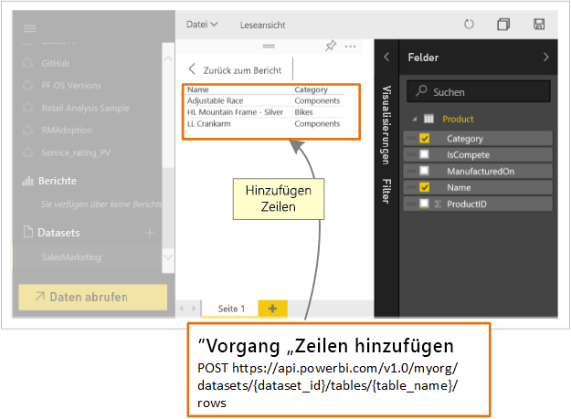

# Welche Möglichkeiten bietet die Power BI-API für Entwickler?

Power BI zeigt interaktive Dashboards an und kann aus vielen unterschiedlichen Datenquellen in Echtzeit erstellt und aktualisiert werden. Sie können mit jeder Programmiersprache, die REST-Aufrufe unterstützt, Apps erstellen, die sich in Echtzeit in ein Power BI-Dashboard integrieren lassen. Sie können auch Power BI-Kacheln und -Berichte in Apps integrieren.

Entwickler können auch eigene Datenvisualisierungen erstellen, die in interaktiven Berichten und mit Dashboards verwendet werden können.

Einige der Möglichkeiten, die die Power BI-APIs bieten:

| **Gehen Sie wie folgt vor:** | **Dazugehörige Dokumentation** |
| --- | --- |
| Einbetten von Dashboards, Berichten und Kacheln für Power BI-Benutzer und Nicht-Power BI-Benutzer (Daten sind Eigentum der App) |[Einbetten von Power BI-Dashboards, -Berichten und -Kacheln](embedding-content.md) |
| Erweitern eines vorhandenen Geschäftsworkflows, um wichtige Daten per Push in ein Power BI-Dashboard zu übertragen. |[Übertragen von Daten in ein Dashboard per Push](walkthrough-push-data.md) |
| Authentifizieren bei Power BI. |[Authentifizieren bei Power BI](get-azuread-access-token.md) |
| Erstellen einer benutzerdefinierten Visualisierung. |[Entwickeln eines benutzerdefinierten Visuals für Power BI](custom-visual-develop-tutorial.md) |

> [!NOTE]
> Die APIs von Power BI verweisen weiterhin in Gruppen auf Arbeitsbereiche. Alle Verweise auf Gruppen bedeuten, dass Sie mit App-Arbeitsbereichen arbeiten.

## Power BI-Beispiele für Entwickler

Die Power BI-Beispiele für Entwickler umfassen Elemente zum Einbetten von Dashboards, Berichten und Kacheln.

[Power BI-Beispiele für Entwickler](https://github.com/Microsoft/PowerBI-Developer-Samples)

* Beispiele in **App Owns Data** sind für Einbetten für Nicht-Power-BI-Benutzer vorgesehen.
* Beispiele in **User Owns Data** sind für Einbetten für Power-BI-Benutzer vorgesehen.

## GitHub-Repositorys

* [.NET SDK](https://github.com/Microsoft/PowerBI-CSharp)
* [JavaScript API](https://github.com/Microsoft/PowerBI-JavaScript)
* [Benutzerdefinierte Visualisierungen](https://github.com/Microsoft/PowerBI-visuals)

## Entwicklertools

Die folgenden Tools sind Tools, die Sie zum Entwickeln von Power BI-Elementen verwenden können.

Sie können mit dem [Embedding setup tool](https://aka.ms/embedsetup) (Einbettungssetuptool) schnell eine Beispielanwendung zum Einbetten von Power BI-Inhalten herunterladen und mit der Arbeit beginnen.

Wählen Sie die am besten für Sie geeignete Lösung aus:

* Das [Einbetten für Ihre Kunden](embedding.md#embedding-for-your-customers) bietet die Möglichkeit, Dashboards und Berichte für Benutzer einzubetten, die nicht über ein Konto für Power BI verfügen. Führen Sie die Lösung [Einbetten für Ihre Kunden](https://aka.ms/embedsetup/AppOwnsData) aus.

* Das [Einbetten für Ihre Organisation](embedding.md#embedding-for-your-organization) ermöglicht Ihnen das Erweitern des Power BI-Diensts. Führen Sie die Lösung [Einbetten für Ihre Organisation](https://aka.ms/embedsetup/UserOwnsData) aus.

Ein komplettes Beispiel für die Verwendung der JavaScript-API ist im [Playground-Tool](https://microsoft.github.io/PowerBI-JavaScript/demo) verfügbar. Dieses Tool ist eine Möglichkeit, schnell verschiedene Arten von Power BI Embedded-Beispielen auszuprobieren. Weitere Informationen zur JavaScript-API finden Sie auch auf der [Power BI-JavaScript-Wikiseite](https://github.com/Microsoft/powerbi-javascript/wiki).

## Übertragen von Daten in Power BI per Push

Sie können die Power BI-API zum Übertragen von Daten per Push zu einem Dataset verwenden. Mithilfe dieser Funktion können Sie eine Zeile zu einer Tabelle in einem Dataset hinzufügen. Die neuen Daten können dann in Kacheln in einem Dashboard und in Visuals in einem Bericht angezeigt werden.

## Nächste Schritte

[Übertragen von Daten in ein Dataset per Push](walkthrough-push-data.md)  
[Entwickeln eines benutzerdefinierten Visuals für Power BI](custom-visual-develop-tutorial.md)  
[Referenz zur Power BI-REST-API](https://docs.microsoft.com/rest/api/power-bi/)  

Weitere Fragen? [Stellen Sie Ihre Frage in der Power BI-Community.](http://community.powerbi.com/)
