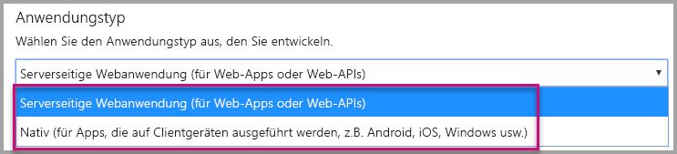
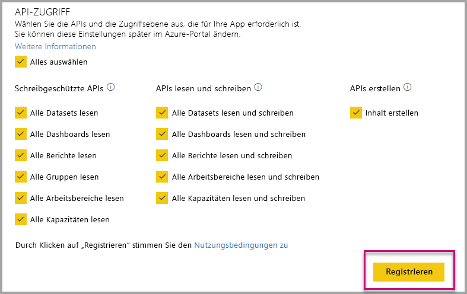
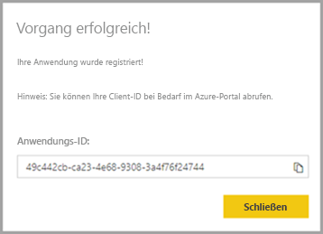
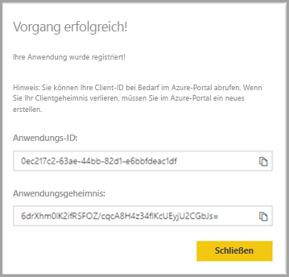

# <a name="register-an-azure-ad-application-to-use-with-power-bi"></a>Registrieren einer Azure AD-Anwendung zur Verwendung mit Power BI-Inhalten

Erfahren Sie, wie Sie eine Anwendung zum Einbetten von Power BI-Inhalten in Azure Active Directory (Azure AD) registrieren können.

Sie registrieren Ihre Anwendung bei Azure AD, um der Anwendung den Zugriff auf die [Power BI-REST-APIs](https://docs.microsoft.com/rest/api/power-bi/) zu ermöglichen. Nach dem Registrieren Ihrer Anwendung können Sie eine Identität für Ihre Anwendung erstellen und Berechtigungen für Power BI-REST-Ressourcen angeben.

> [!IMPORTANT]
> Um eine Power BI-App zu registrieren, benötigen Sie einen [Azure Active Directory-Mandanten und einen Organisationsbenutzer](create-an-azure-active-directory-tenant.md). Wenn Sie sich mit einem Benutzer in Ihrem Mandanten noch nicht für Power BI registriert haben, wird die Registrierung der App nicht ordnungsgemäß abgeschlossen.

Die Registrierung Ihrer Anwendung kann auf zweierlei Weise erfolgen. Erstens mithilfe des [Power BI-App-Registrierungstools](https://dev.powerbi.com/apps/), zweitens direkt im Azure-Portal. Das Power BI-App-Registrierungstool ist die einfachere Option, da nur wenige Felder ausgefüllt werden müssen. Wenn Sie Änderungen an der App vornehmen möchten, verwenden Sie das Azure-Portal.

## <a name="register-with-the-power-bi-application-registration-tool"></a>Registrieren mithilfe des Power BI-App-Registrierungs-Tools

Registrieren Sie Ihre Anwendung in **Azure Active Directory**, um eine Identität für Ihre Anwendung einzurichten und Berechtigungen für Power BI-REST-Ressourcen anzugeben. Wenn Sie eine Anwendung registrieren, etwa eine Konsolenanwendung oder eine Website, erhalten Sie einen Bezeichner, mit dem sich die Anwendung gegenüber den Benutzern identifiziert, bei denen diese Berechtigungen anfordert.

So registrieren Sie Ihre Anwendung mit dem Power BI-App-Registrierungs-Tool:

1. Öffnen Sie die Seite [dev.powerbi.com/apps](https://dev.powerbi.com/apps).

2. Wählen Sie **Mit vorhandenem Konto anmelden** aus, und klicken Sie dann auf **Weiter**.

3. Geben Sie einen **Anwendungsnamen** an.

4. Geben Sie einen **Anwendungstyp** an.

    Im Folgenden werden unterschiedliche Gründe für die Auswahl zwischen den Anwendungstypen **Nativ** und **Serverseitige Webanwendung** aufgeführt.

    Nativ:
    * Sie möchten eine Anwendung erstellen, die [für Ihre Benutzer entworfen ist](embed-sample-for-customers.md), für die ein Masterbenutzerkonto (eine Power BI Pro-Lizenz zur Anmeldung bei Power BI) zur Authentifizierung erforderlich ist.

    Serverseitige Webanwendung:
    * Sie möchten eine Anwendung erstellen, die [für Ihre Organisation entworfen ist](embed-sample-for-your-organization.md).
    * Sie möchten eine Anwendung erstellen, die [für Ihre Benutzer entworfen ist](embed-sample-for-customers.md), für die einen Dienstprinzipal zur Authentifizierung erforderlich ist.
    * Sie möchten Web-Apps oder Web-APIs erstellen.

    

5. Wenn Sie den Anwendungstyp **Serverseitige Web-Anwendung** ausgewählt haben, geben Sie einen Wert für die Felder **Homepage-URL** und **Umleitungs-URL** ein. Die **Umleitungs-URL** funktioniert mit jedem gültigen URL und sollte mit der erstellten Anwendung entsprechen. Wenn Sie den Anwendungstyp **Nativ** ausgewählt haben, fahren Sie mit Schritt 6 fort.

6. Wählen Sie die für Ihre Anwendung erforderlichen Power BI-APIs aus. Weitere Informationen zu Power BI-Zugriffsberechtigungen finden Sie unter [Power BI-Berechtigungen](power-bi-permissions.md). Klicken Sie dann auf **Registrieren**.

    

    > [!Important]
    > Sobald Sie die Verwendung von Dienstprinzipalen für Power BI aktivieren, sind die Azure Active Directory-Berechtigungen nicht länger wirksam. Die Berechtigungen werden dann über das Power BI-Verwaltungsportal verwaltet.

7. Auf Wunsch **Native** für den Anwendungstyp, dann sind dann eingegebene ein **Anwendungs-ID**. Wenn Sie den Anwendungstyp **Serverseitige Web-App** auswählen, wird Ihnen eine **Anwendungs-ID** sowie ein **Anwendungsgeheimnis** bereitgestellt.

    > [!Note]
    > Die **Anwendungs-ID** kann bei Bedarf später aus dem Azure-Portal abgerufen werden. Wenn Sie das **Anwendungsgeheimnis** verlieren, müssen Sie im Azure-Portal ein neues erstellen.

| Nativ | Serverseitige Webanwendung |
|--------|-----------------------------|
|  |  |

Jetzt können Sie die registrierte Anwendung als Teil Ihrer benutzerdefinierten Anwendung verwenden, um die Interaktion mit dem Power BI-Dienst und Ihrer Power BI Embedded-Anwendung zu implementieren.

## <a name="register-with-the-azure-portal"></a>Registrieren beim Azure-Portal

Die andere Möglichkeit zum Registrieren Ihrer Anwendung besteht direkt im Azure-Portal. Führen Sie die folgenden Schritte aus, um Ihre Anwendung zu registrieren.

1. Akzeptieren Sie die [Nutzungsbedingungen für die Microsoft Power BI-API](https://powerbi.microsoft.com/api-terms).

2. Melden Sie sich beim [Azure-Portal](https://portal.azure.com) an.

3. Wählen Sie Ihren Azure AD-Mandanten aus, indem Sie Ihr Konto in der oberen rechten Ecke der Seite auswählen.

4. Navigieren Sie im linken Navigationsbereich zu **alle Dienste**Option **App-Registrierungen** und wählen Sie dann **Registrierung einer neuen**.

5. Folgen Sie den Anweisungen, und erstellen Sie eine neue Anwendung .

   Weitere Informationen zum Registrieren von Anwendungen in Azure Active Directory, finden Sie unter [Registrieren einer app in Azure Active Directory](https://docs.microsoft.com/azure/active-directory/develop/quickstart-v2-register-an-app)

## <a name="how-to-get-the-application-id"></a>Abrufen der Anwendungs-ID

Beim Registrieren einer Anwendung erhalten Sie eine [Anwendungs-ID](embed-sample-for-customers.md#application-id).  Diese **Anwendungs-ID** fordert die Benutzer auf, der Anwendung zu gestatten, sich bei ihnen zu identifizieren.

## <a name="how-to-get-the-service-principal-object-id"></a>Abrufen der Dienstprinzipalobjekt-ID

Stellen Sie sicher, dass Sie bei der Verwendung der [Power BI-APIs](https://docs.microsoft.com/rest/api/power-bi/) Vorgänge mit der [Dienstprinzipalobjekt-ID](embed-service-principal.md#how-to-get-the-service-principal-object-id) zum Referenzieren des Dienstprinzipals definieren, z.B. einen Dienstprinzipal als Administrator für einen Arbeitsbereich festlegen.

## <a name="apply-permissions-to-your-application-within-azure-ad"></a>Anwenden von Berechtigungen für die Anwendung in Azure AD

Aktivieren Sie neben den Einstellungen auf der App-Registrierungsseite zusätzliche Berechtigungen für die Anwendung. Dies ist über das Azure AD-Portal oder programmgesteuert möglich.

Sie können sich entweder mit dem *Masterkonto* (zur Einbettung von Inhalten) oder einem globalen Administratorkonto anmelden.

### <a name="using-the-azure-ad-portal"></a>Über das Azure AD-Portal

1. Navigieren Sie im Azure-Portal zu [App-Registrierungen](https://portal.azure.com/#blade/Microsoft_AAD_IAM/ApplicationsListBlade), und wählen Sie die App aus, die Sie für die Einbettung verwenden.

2. Wählen Sie **API-Berechtigungen** unter **verwalten**.

3. In **API-Berechtigungen**Option **Hinzufügen einer Berechtigung**, und wählen Sie dann **Power BI-Dienst**.

    

4. Wählen Sie die spezifischen Berechtigungen, die Sie unter benötigen **delegierte Berechtigungen**. Wählen sie die Berechtigungen einzeln aus, um die Auswahl zu speichern. Wählen Sie **Speichern** aus, wenn Sie fertig sind.

5. Wählen Sie **Grant Zustimmung**.

    Die **Grant Zustimmung** Aktion muss für die *Hauptkonto* um zu vermeiden, wird zur Zustimmung von Azure AD aufgefordert. Wenn es sich beim Konto, das diese Aktion ausführt, um das Konto eines globalen Administrators handelt, gewähren Sie allen Benutzern in der Organisation Berechtigungen für diese Anwendung. Wenn das Konto, das diese Aktion ausführt, das *Masterkonto* und nicht das Konto des globalen Administrators ist, gewähren Sie für diese Anwendung lediglich dem *Masterkonto* Berechtigungen.

### <a name="applying-permissions-programmatically"></a>Programmgesteuertes Anwenden von Berechtigungen

1. Sie müssen die vorhandenen Dienstprinzipale (Benutzer) in Ihrem Mandanten abrufen. Informationen hierzu finden Sie unter [ServicePrincipal](https://docs.microsoft.com/graph/api/resources/serviceprincipal?view=graph-rest-beta).

    Sie können die API *Get servicePrincipal* ohne {ID} aufrufen. So werden alle Dienstprinzipale innerhalb des Mandanten abgerufen.

2. Suchen Sie nach einem Dienstprinzipal mit der Anwendungs-ID Ihrer App als **appId**-Eigenschaft.

3. Erstellen Sie einen neuen Serviceplan, wenn für Ihre App keiner vorhanden ist.

    ```json
    Post https://graph.microsoft.com/beta/servicePrincipals
    Authorization: Bearer ey..qw
    Content-Type: application/json
    {
    "accountEnabled" : true,
    "appId" : "{App_Client_ID}",
    "displayName" : "{App_DisplayName}"
    }
    ```

4. Weisen Sie der Power BI-API App-Berechtigungen zu.

   Wenn Sie einen vorhandenen Mandanten verwenden und nicht allen Mandantenbenutzern Berechtigungen erteilen möchten, können Sie einem bestimmten Benutzer Berechtigungen gewähren, indem Sie den Wert von **consentType** durch **Principal** ersetzen.

   Der Wert für **consentType** kann entweder auf **AllPrincipals** oder **Principal** festgelegt werden.

   * Nur Mandantenadministratoren können mit **AllPrincipals** im Namen aller Benutzer im Mandanten Berechtigungen erteilen.
   * Mit **Principal** werden Berechtigungen im Namen eines bestimmten Benutzers gewährt. In diesem Fall sollte dem Anforderungstext eine zusätzliche Eigenschaft hinzugefügt werden: *principalId={User_ObjectId}* .

     Die Konfiguration über *Berechtigungen erteilen* ist für das Masterkonto erforderlich, damit von Azure AD keine Zustimmung abgefragt wird. Dies ist bei einer nicht interaktiven Anmeldung nicht möglich.

     ```json
     Post https://graph.microsoft.com/beta/OAuth2PermissionGrants
     Authorization: Bearer ey..qw
     Content-Type: application/json
     {
     "clientId":"{Service_Plan_ID}",
     "consentType":"AllPrincipals",
     "resourceId":"c78a3685-1ce7-52cd-95f7-dc5aea8ec98e",
     "scope":"Dataset.ReadWrite.All Dashboard.Read.All Report.Read.All Group.Read Group.Read.All Content.Create Metadata.View_Any Dataset.Read.All Data.Alter_Any",
     "expiryTime":"2018-03-29T14:35:32.4943409+03:00",
     "startTime":"2017-03-29T14:35:32.4933413+03:00"
     }
     ```

    Der **resourceId**-Wert *c78a3685-1ce7-52cd-95f7-dc5aea8ec98e* ist nicht allgemeingültig, sondern abhängig vom Mandanten. Dieser Wert entspricht dem objectId-Wert der Anwendung „Power BI-Dienst“ im AAD-Mandanten (Azure Active Directory).

    Der Benutzer kann diesen Wert ganz einfach im Azure-Portal abrufen:
    1. https://portal.azure.com/#blade/Microsoft_AAD_IAM/StartboardApplicationsMenuBlade/AllApps

    2. Suchen Sie über das Suchfeld nach „Power BI-Dienst“.

5. Erteilen Sie Azure Active Directory (AAD) App-Berechtigungen.

   Der Wert für **consentType** kann entweder auf **AllPrincipals** oder **Principal** festgelegt werden.

   * **AllPrincipals** kann nur vom mandantenadministrator zum Gewähren von Berechtigungen für alle Benutzer im Mandanten verwendet werden.
   * **Dienstprinzipal** wird verwendet, um Berechtigungen für einen bestimmten Benutzer zu gewähren. In diesem Fall sollte dem Anforderungstext eine zusätzliche Eigenschaft hinzugefügt werden: *principalId={User_ObjectId}* .

   Die Konfiguration über *Berechtigungen erteilen* ist für das Masterkonto erforderlich, damit von Azure AD keine Zustimmung abgefragt wird. Dies ist bei einer nicht interaktiven Anmeldung nicht möglich.

   ```json
   Post https://graph.microsoft.com/beta/OAuth2PermissionGrants
   Authorization: Bearer ey..qw
   Content-Type: application/json
   { 
   "clientId":"{Service_Plan_ID}",
   "consentType":"AllPrincipals",
   "resourceId":"61e57743-d5cf-41ba-bd1a-2b381390a3f1",
   "scope":"User.Read Directory.AccessAsUser.All",
   "expiryTime":"2018-03-29T14:35:32.4943409+03:00",
   "startTime":"2017-03-29T14:35:32.4933413+03:00"
   }
   ```

## <a name="next-steps"></a>Nächste Schritte

Sie haben Ihre Anwendung in Azure AD registriert und müssen jetzt Benutzer in der Anwendung authentifizieren. Weitere Informationen hierzu finden Sie unter [Authentifizieren von Benutzern und Abrufen eines Azure AD-Zugriffstokens für Ihre Power BI-App](get-azuread-access-token.md).

Weitere Fragen? [Stellen Sie Ihre Frage in der Power BI-Community.](http://community.powerbi.com/)