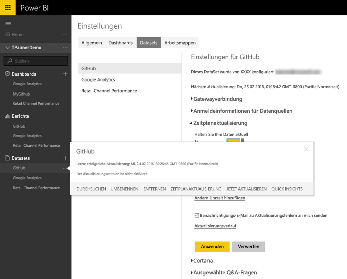
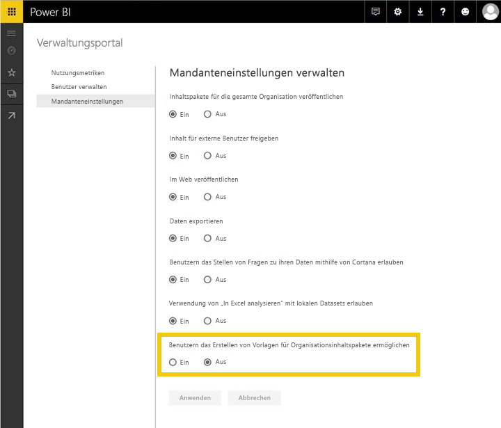
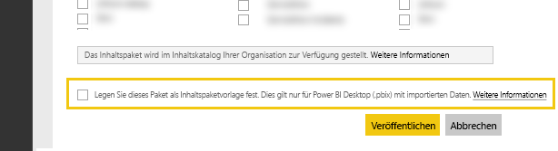
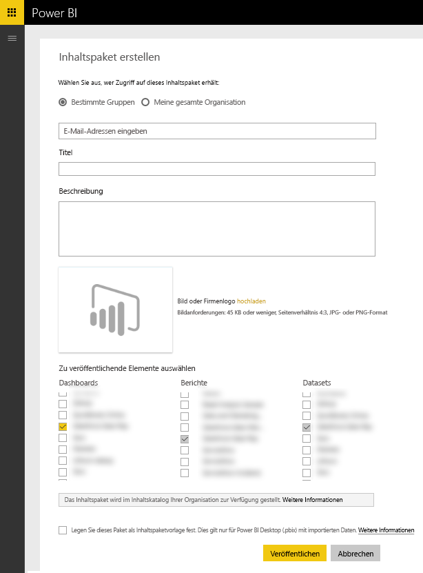

# Testen von Vorlageninhaltspaketen für Power BI
Es gibt mehrere Methoden zum Testen Ihres Inhaltspakets, bevor Sie es zur Veröffentlichung übermitteln.  

> [!NOTE]
> Wenn Ihr Inhaltspaket einen benutzerdefinierten [Datenconnector](https://aka.ms/DataConnectors) verwendet, den Sie entwickelt haben, können Sie die Datenaktualisierung oder das Vorlageninhaltspaket nicht wie unten beschrieben testen. Wenn dies der Fall ist, fahren Sie mit dem [Übermitteln](#submission) Ihres Inhaltspakets fort. Das Power BI-Team arbeitet mit Ihnen beim Testen des Inhaltspakets zusammen.
> 
> 

## Testen der geplanten Datenaktualisierung
Vorlageninhaltspakete nutzen die Aktualisierung in „PowerBI.com“, um ein Inhaltspaket mit den Daten der Kunden zu instanziieren, wenn diese eine Verbindung herstellen. Sie können diesen Flow mit der erstellten Desktop-Datei testen, bevor das Inhaltspaket öffentlich verfügbar gemacht wird.

Wählen Sie nach dem Hochladen der Datei die Auslassungspunkte („…“) neben dem Dataset und dann „Zeitplanaktualisierung“ aus. Konfigurieren Sie die Anmeldeinformationen für die Quelle. Überprüfen Sie, ob das Dataset erfolgreich aktualisiert wird. Testen Sie „Jetzt aktualisieren“ und „Zeitplanaktualisierung“. Wenn bei der Aktualisierung Fehler auftreten, überprüfen Sie die Fehlermeldung, Ihre Abfragen und das Endsystem.

### Weitere Tipps zur Aktualisierung
* Bei der Zeitplanaktualisierung sollte nur eine Datenquelle erkannt werden.  
* Bei der Testverbindung sollte angegeben werden, dass der Benutzer das Inhaltspaket laden kann. Wenn dies nicht der Fall ist, stellen Sie sicher, dass die zusätzlichen Fehler in den Abfragen behandelt werden.  
* Die Aktualisierung sollte nach einer angemessenen Zeit abgeschlossen sein, empfohlen sind ca. 5 Minuten.  

## Testen von Vorlagen
Ein Vorlageninhaltspaket ähnelt vorhandenen Lösungen, mit der Ausnahme, dass es im Dataset nicht die eigentlichen Daten enthält. Stattdessen werden Benutzer, die eine Vorlage nutzen oder instanziieren, aufgefordert, Parameter und ihre Anmeldeinformationen einzugeben, um eine Verbindung herzustellen. Nach dem Herstellen der Verbindung werden ihre eigenen Daten im Dashboard, Bericht und Dataset angezeigt. 

Nachdem ein Benutzer das Inhaltspaket instantiiert hat, verfügt er über den Zugriff auf die Dataseteinstellungen, einschließlich der geplanten Aktualisierung. Die RLS-Einstellungen für das Dataset werden **nicht** mit dem Inhaltspaket veröffentlicht.  

> [!NOTE]
> Vorlageninhaltspakete können nur ein Dashboard, einen Bericht und ein Dataset enthalten. Informationen dazu finden Sie in der Liste der Einschränkungen auf der Seite zur [Erstellung](template-content-pack-authoring.md#restrictions). 
> 
> 

Um die Vorlagenerstellung für Ihren Mandanten zu aktivieren, aktivieren Sie den unten aufgeführten Funktionsschalter gemeinsam mit Ihrem Power BI-Administrator. 

Nach der Aktivierung wird am unteren Rand von [Inhaltspaket erstellen](https://app.powerbi.com/groups/me/publish-content/) ein Kontrollkästchen angezeigt, über das Sie ein Vorlageninhaltspaket für Ihr Unternehmen veröffentlichen können. 

### Benennung
Es wird empfohlen, dass Sie das Dashboard, den Bericht und das Dataset in einem Inhaltspaket einheitlich benennen. Diese Namen sind hartcodiert und für alle Benutzer identisch. Wenn Sie also den Produkt- oder Szenarionamen verwenden, erleichtert dies die Verwendung für Ihre Kunden.

### Weitere Tipps zu Vorlagen
* Stellen Sie sicher, dass die Parameter, die Sie in den Abfragen angegeben haben, aussagekräftig für Ihre Endbenutzer sind.
* Berücksichtigen Sie, wie lange Ihre Benutzer auf den Abschluss der geplanten Aktualisierung warten müssen.

## Einreichung
Beim Einreichen über [Microsoft AppSource](https://appsource.microsoft.com/en-us/partners/list-an-app) können Sie das Vorlageninhaltspaket im Katalog für Dienstinhaltspakete auf PowerBI.com veröffentlichen und das Inhaltspaket in [Microsoft AppSource](http://appsource.microsoft.com) auflisten.

### Vor der Einreichung
* Lesen Sie die Tipps zur Erstellung für die einzelnen Artefakte im Inhaltspaket sorgfältig durch.
* Stellen Sie zum Testen eine Verbindung mit verschiedenen Konten und Datenbedingungen her. (Überspringen Sie diesen Schritt, wenn Sie einen benutzerdefinierten [Datenconnector](https://aka.ms/DataConnectors) entwickelt haben)
* Überprüfen Sie alle visuellen Elemente sorgfältig auf falsche Schreibweise.
* Stellen Sie sicher, dass das Inhaltspaket optimal auf Q&A antwortet. Es wird empfohlen, mindestens 30 verschiedene Fragen für das Datenmodell zu testen. (Überspringen Sie diesen Schritt, wenn Sie einen benutzerdefinierten [Datenconnector](https://aka.ms/DataConnectors) entwickelt haben)

### Einreichung
Wenn Sie das Inhaltspaket einreichen möchten, öffnen Sie die [Seite zum Einreichen von Apps](https://appsource.microsoft.com/en-us/partners/list-an-app) in AppSource, und übermitteln Sie Ihre Informationen. Achten Sie darauf, Power BI in der Liste der verfügbaren Produkte auszuwählen.

Das Power BI-Team überprüft Ihren Antrag und kontaktiert Sie, um sicherzustellen, dass alle Artefakte die Anforderungen für das Einreichen erfüllen. Dabei wird nicht nur die Vollständigkeit, sondern auch die Qualität des Dashboards und der Berichte überprüft, um sicherzustellen, dass sie dem in der Anwendung beschriebenen Geschäftsszenario entsprechen.

### Aktualisierungen
Bei der Aktualisierung Ihres Inhaltspakets gilt ein ähnlicher Ablauf wie bei der Übermittlung des ursprünglichen Inhaltspakets. 

