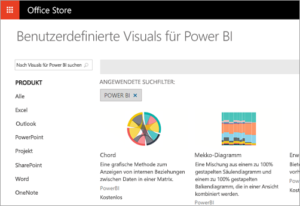

# Welche Möglichkeiten bietet Power BI Entwicklern?
Power BI bietet eine Vielzahl von Möglichkeiten für Entwickler. Dies reicht vom Einbetten bis hin zu benutzerdefinierten Visuals und dem Streamen von Datasets.

## Einbetten
Der Power BI-Dienst und Power BI Embedded in Azure werden zusammengefasst, um eine einzelne API zum Einbetten von Dashboards und Berichten bereitzustellen. Dies bedeutet, dass Ihnen eine API-Oberfläche, ein einheitlicher Satz von Funktionen und Zugriff auf die neuesten Power BI-Funktionen (z.B. Dashboards, Gateways und App-Arbeitsbereiche) zur Verfügung stehen, wenn Sie Inhalte einbetten. Weitere Informationen finden Sie unter [Einbetten mit Power BI](embedding.md).

## Benutzerdefinierte Visualisierungen
Mit benutzerdefinierten Visuals können Sie Ihre eigenen Visuals für die Verwendung in Power BI-Berichten erstellen. Benutzerdefinierte Visuals werden in TypeScript geschrieben. Dies ist eine Obermenge von JavaScript, das erweiterte Funktionen und Vorabzugriff auf ES6/ES7-Funktionen unterstützt. Stile für Visuals werden mit Cascading Stylesheets (CSS) angewendet. Zur Vereinfachung wird der Less-Precompiler verwendet, der einige erweiterte Funktionen unterstützt, u.a. Schachtelung, Variablen, Mixins, Bedingungen und Schleifen. Wenn Sie diese Funktionen nicht verwenden möchten, können Sie einfachen CSS-Code in der Less-Datei schreiben.

Weitere Informationen zum Entwickeln und Veröffentlichen von benutzerdefinierten Visuals finden Sie unter [Veröffentlichen von benutzerdefinierten Visuals im Office Store](office-store.md).

## Übertragen von Daten in Power BI per Push
Sie können die Power BI-API zum Übertragen von Daten per Push zu einem Dataset verwenden. So können Sie eine Zeile in einer Tabelle in einem Dataset hinzufügen Die neuen Daten können dann in Kacheln in einem Dashboard und in Visuals in einem Bericht angezeigt werden.

Weitere Informationen finden Sie unter [Übertragen von Daten in ein Dashboard per Push](walkthrough-push-data.md).

## Nächste Schritte
[Einbetten mit Power BI](embedding.md)  
[Migrieren von Inhalten aus Power BI Embedded-Arbeitsbereichsammlungen zu Power BI](migrate-from-powerbi-embedded.md)  
[JavaScript-API-Git-Repository](https://github.com/Microsoft/PowerBI-JavaScript)  
[Power BI-C#-Git-Repository](https://github.com/Microsoft/PowerBI-CSharp)  
[Veröffentlichen benutzerdefinierter Visualisierungen im Office Store](office-store.md)  
[Power BI-Visuals-Git-Repository](https://github.com/Microsoft/PowerBI-visuals)  
[JavaScript-Einbettungsbeispiel](https://microsoft.github.io/PowerBI-JavaScript/demo/)  
[Power BI Premium-Whitepaper](https://aka.ms/pbipremiumwhitepaper)  
Weitere Fragen? [Wenden Sie sich an die Power BI-Community](http://community.powerbi.com/)

