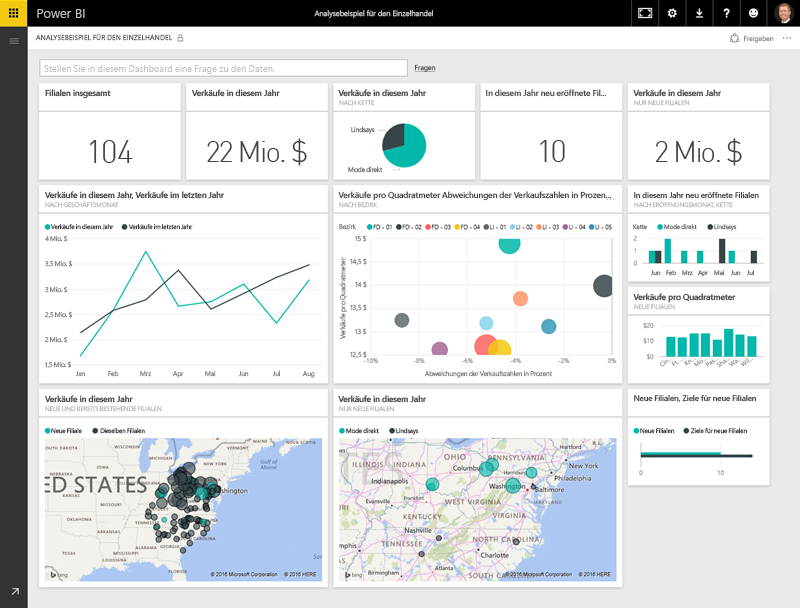
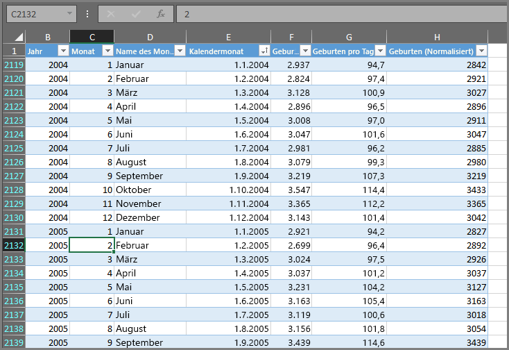
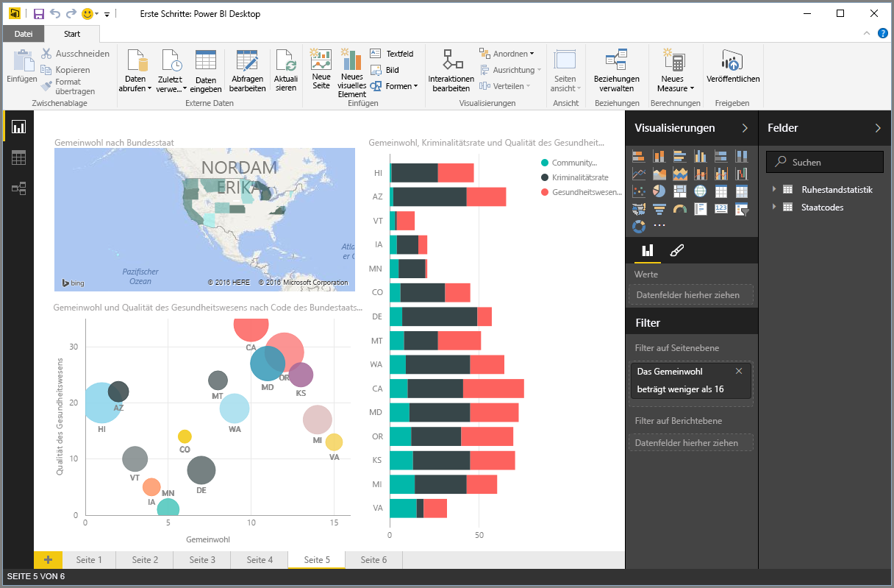
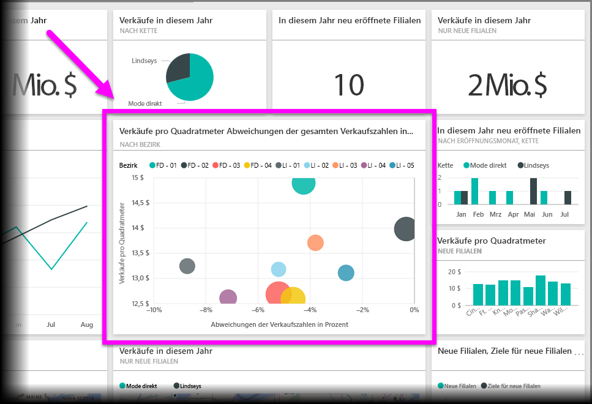

Alle Aufgaben in Power BI können in wenige **Grundkomponenten** unterteilt werden. Wenn Sie diese Grundkomponenten verstehen, können Sie sich gezielt intensiver mit ihnen befassen und ausführliche und komplexe Berichte erstellen. Schließlich bestehen auch scheinbar komplexe Dinge aus Grundbausteinen – Gebäude werden aus Holz, Stahl, Beton und Glas gebaut. Autos bestehen aus Metall, Stoff und Kunststoff. Natürlich können Gebäude und Autos einfach oder aufwendig sein – abhängig davon, wie die Grundbausteine kombiniert werden.

Wir betrachten diese grundlegenden Komponenten, erläutern einige einfache Aufgaben, die damit durchgeführt werden können, und geben Ihnen einen Einblick, wie damit auch komplexe Dinge erstellt werden können.

In Power BI gibt es folgende Grundkomponenten:

* Visualisierungen
* Datasets
* Berichte
* Dashboards
* Kacheln

## Visualisierungen
Eine **Visualisierung** (manchmal auch als **visuelles Element** bezeichnet) ist eine visuelle Darstellung von Daten, z.B. ein Diagramm, eine Grafik, eine farbcodierte Karte oder andere interessante Dinge, mit denen Sie Ihre Daten visuell darstellen können. Power BI verfügt über unterschiedliche Visualisierungstypen, die ständig ergänzt werden. Die folgende Abbildung zeigt verschiedene Visualisierungen, die im Power BI-Dienst erstellt wurden.

Visualisierungen können ganz einfach sein, z.B. eine Zahl, die etwas Wichtiges darstellt, oder visuell sehr komplex – wie bei einer Karte mit einem Farbverlauf, der die Wählerstimmung im Bezug auf ein bestimmtes soziales Problem oder Anliegen zeigt. Mit einer Visualisierung sollen Daten auf eine Weise dargestellt werden, die Zusammenhänge und Einblicke zeigt, die aus einer Tabelle mit Zahlen oder Text nur schwer zu ersehen wären.

## Datasets
Ein **Dataset** ist eine Sammlung von Daten, mit denen Power BI die Visualisierungen erstellt.

Sie können mit einem einfachen Dataset auf Grundlage einer einzelnen Tabelle in einer Excel-Arbeitsmappe arbeiten, ähnlich wie in der folgenden Abbildung.

**Datasets** können auch eine Kombination aus vielen verschiedenen Quellen sein, die Sie filtern und kombinieren können, um individuelle Sammlungsdaten (einen Datensatz) für die Verwendung in Power BI bereitzustellen.

Sie können z.B. ein Dataset aus drei verschiedenen Datenbankfeldern erstellen: eine Website-Tabelle, eine Excel-Tabelle und Onlineergebnisse einer E-Mail-Marketingkampagne. Diese spezielle Kombination wird trotzdem als einzelnes **Dataset** betrachtet, auch wenn die Daten aus vielen verschiedenen Quellen zusammengetragen wurden.

Indem Sie die Daten vor dem Bearbeiten in Power BI filtern, können Sie sich nur auf die für Sie wichtigen Daten konzentrieren. Sie können z.B. Ihre Kontaktdatenbank so filtern, dass nur Kunden, die E-Mails im Rahmen der Marketingkampagne erhalten haben, in das Dataset eingeschlossen werden. Sie erstellen dann Visualisierungen basierend auf dieser Teilmenge (d.h. der gefilterten Sammlung) von Kunden, die bei der Kampagne angeschrieben wurden. Durch das Filtern können Sie einen Schwerpunkt auf Ihre Daten legen und so Ihre Arbeit fokussieren.

Ein wichtiger und unabdingbarer Bestandteil von Power BI ist die Vielzahl von enthaltenen **Datenconnectors**. Ob die gewünschten Daten in Excel oder einer SQL-Datenbank, in Azure oder Oracle oder in einem Dienst wie Facebook, Salesforce oder MailChimp vorliegen – Power BI bietet integrierte Datenconnectors, mit denen Sie problemlos Verbindungen mit den Daten herstellen, diese bei Bedarf filtern und dann in das Dataset aufnehmen können.

Sobald Sie über ein Dataset verfügen, können Sie mit dem Erstellen von Visualisierungen beginnen, mit denen verschiedene Aspekte dieses Datasets auf unterschiedliche Weise dargestellt werden, und so Einblicke gewinnen. Jetzt kommen die Berichte ins Spiel.

## Berichte
In Power BI ist ein **Bericht** eine Sammlung von Visualisierungen, die zusammen auf einer oder mehreren Seiten angezeigt werden. Genau wie jeder andere Bericht, den Sie für eine Verkaufspräsentation erstellen, oder ein Bericht für ein Schulprojekt ist ein **Bericht** in Power BI eine Sammlung von Elementen, die miteinander verknüpft sind. Die folgende Abbildung zeigt einen **Bericht** in Power BI Desktop – in diesem Fall die fünfte Seite eines Berichts mit sechs Seiten. Sie können Berichte auch im Power BI-Dienst erstellen.

Mit Berichten können Sie viele Visualisierungen, bei Bedarf auf mehreren Seiten, erstellen und wie gewünscht und für Ihre Zwecke benötigt anordnen.

Möglicherweise haben Sie einen Bericht über Quartalsumsätze, einen Bericht über Produktwachstum in einem bestimmten Segment, oder Sie erstellen einen Bericht über die Migrationsmuster von Eisbären. Egal, welches Thema Sie bearbeiten, mit Berichten können Sie Ihre Visualisierungen auf einer oder mehreren Seiten sammeln und organisieren.

## Dashboards
Wenn Sie eine Seite aus einem Bericht freigeben oder eine Reihe von Visualisierungen teilen möchten, erstellen Sie ein **Dashboard**. Ähnlich wie das Armaturenbrett im Auto umfasst ein **Dashboard** in Power BI eine Reihe von Visuals auf einer einzelnen Seite, die Sie für andere Benutzer freigeben können. Häufig handelt es sich um eine ausgewählte Gruppe von Visualisierungen, die einen schnellen Einblick in die Daten oder Informationen ermöglichen, die Sie präsentieren möchten.

Ein Dashboard muss auf eine einzelne Seite passen, die häufig als Zeichenbereich bezeichnet wird (der Zeichenbereich ist der leere Hintergrund in Power BI Desktop oder im Dienst, auf dem Sie Visualisierungen platzieren). Betrachten Sie dies wie die Leinwand eines Künstlers – ein Arbeitsbereich, in dem Sie interessante und überzeugende Visualisierungen erstellen, kombinieren und überarbeiten können.
Sie können Dashboards für andere Benutzer oder Gruppen freigeben, die dann mit Ihrem Dashboard interagieren, wenn sie im Power BI-Dienst oder auf einem mobilen Gerät arbeiten.

## Kacheln
In Power BI ist eine **Kachel** eine einzelne Visualisierung in einem Bericht oder Dashboard. Dies ist das rechteckige Feld, das eine Visualisierung enthält. In der folgenden Abbildung sehen Sie eine Kachel (hervorgehoben), die von weiteren Kacheln umgeben ist.

Wenn Sie einen Bericht oder ein Dashboard in Power BI *erstellen*, können Sie Kacheln beliebig verschieben oder anordnen, um Ihre Informationen zu präsentieren. Sie können sie wie gewünscht vergrößern, Höhe oder Breite ändern und an anderen Kacheln ausrichten.

Wenn Sie ein Dashboard oder einen Bericht *anzeigen* oder *nutzen*, Sie also nicht der Ersteller oder Besitzer sind, die Daten jedoch für Sie freigegeben wurden, können Sie damit interagieren, aber nicht die Größe der Kacheln oder ihre Anordnung ändern.

## Und jetzt alle zusammen
Dies sind die Grundlagen von Power BI und seiner Komponenten. Gehen wir sie noch einmal durch.

Power BI ist eine Sammlung von Diensten, Apps und Connectors, mit dem Sie eine Verbindung mit Ihren Daten herstellen (unabhängig von deren Speicherort), diese bei Bedarf filtern und dann in Power BI verwenden können, um beeindruckende Visualisierungen zu erstellen, die Sie für andere Benutzer freigeben können.  

Nachdem Sie nun die Grundkomponenten von Power BI kennen, sehen Sie, dass Sie Datasets erstellen, die sinnvoll für *Sie* sind, und visuell beeindruckende Berichte erstellen können, die Ihre Geschichte erzählen. Mit Power BI präsentierte Geschichten müssen nicht komplex oder schwierig sein, um überzeugend zu sein.

Für einige Benutzer ist ein Dataset aus einer einzelnen Excel-Tabelle, das dann über ein Dashboard für das Team freigegeben wird, eine unglaublich hilfreiche Einsatzmöglichkeit von Power BI.

Andere nutzen Power BI optimal, indem sie Azure SQL Data Warehouse-Echtzeittabellen verwenden, die mit anderen Datenbanken und Echtzeitquelle kombiniert und in Echtzeit gefiltert werden, um ein Dataset zu erstellen, mit dem ein Herstellungsprozess ständig überwacht wird.

Der Prozess ist für beide identisch: Datasets erstellen, beeindruckende Visualisierungen erstellen und diese für andere Benutzer freigeben. Und ebenso ist das Ergebnis jeweils identisch: Sie nutzen die ständig größer werdende Welt der Daten aus und leiten daraus umsetzbare Erkenntnisse ab.

Egal, ob für Ihre Daten einfache oder komplexe Datasets benötigt werden, Power BI lässt Sie schnell anfangen und kann an Ihre Anforderungen angepasst und so komplex sein, wie Sie es benötigen. Und da Power BI ein Microsoft-Produkt ist, können Sie sich sicher sein, dass es robust, erweiterbar und Office-fähig ist und sofort im Unternehmen eingesetzt werden kann.

Betrachten wir nun genauer, wie dies funktioniert. Wir beginnen mit einem Blick auf den Power BI-Dienst.

