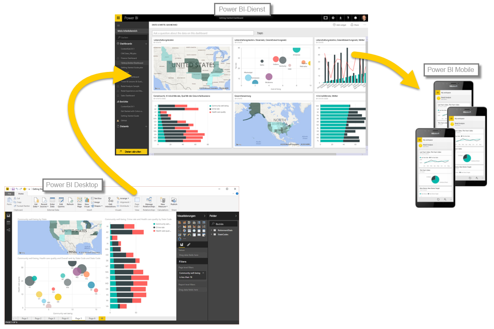

Nachdem Sie nun die Grundlagen von Power BI kennen, können wir mit praktischen Beispielen und einer geführten Tour weitermachen. Durch das Video führt Sie **Will Thompson**, Program Manager im Power BI-Team bei Microsoft. Später im Kurs kommen noch einige Gäste hinzu.

Wenn Will die vielen Möglichkeiten mit Power BI erklärt, denken Sie daran, dass alle diese Aufgaben und die Analysen mit Power BI im Allgemeinen immer dem gleichen Arbeitsablauf folgen. Der **allgemeine Ablauf** von Aktivitäten in Power BI lautet wie folgt:

* Abrufen von Daten in Power BI Desktop und Erstellen eines Berichts
* Veröffentlichen im Power BI-Dienst, in dem neue Visualisierungen oder Dashboards erstellt werden
* Freigeben von Dashboards für andere Benutzer, insbesondere für mobile Benutzer
* Anzeigen und Verwenden von freigegebenen Dashboards und Berichten in Power BI Mobile-Apps

Wie bereits erwähnt, können Sie ausschließlich mit dem **Power BI-Dienst** arbeiten, Daten abrufen und Dashboards erstellen – das ist kein Problem. Jemand im Team arbeiten möglicherweise nur Zeit **Power BI Desktop**, die ebenfalls kein Problem ist. Damit Sie Power BI insgesamt und seine Möglichkeiten besser verstehen können, zeigen wir Ihnen alles... Sie können dann entscheiden, wie Sie am besten davon profitieren.

Legen wir also los und übergeben Will das Wort. Zunächst müssen wir die grundlegenden Komponenten von Power BI verstehen. Dies bildet eine solide Grundlage dafür, zu lernen, wie Daten von Power BI in interessante Berichte und Visualisierungen umgewandelt werden.

