In diesem Thema sehen wir uns genauer an, wie sich die ersten beiden Bestandteile von Power BI zusammenfügen:

* Erstellen eines Berichts in **Power BI Desktop**
* Veröffentlichen des Berichts im **Power BI-Dienst**

Wir beginnen in Power BI Desktop und wählen **Daten abrufen** aus. Die Sammlung der Datenquellen wird angezeigt, in der Sie eine Datenquelle auswählen können. In der folgenden Abbildung wird eine Webseite als Quelle ausgewählt, im Video oben hat Will eine **Excel**-Arbeitsmappe ausgewählt.

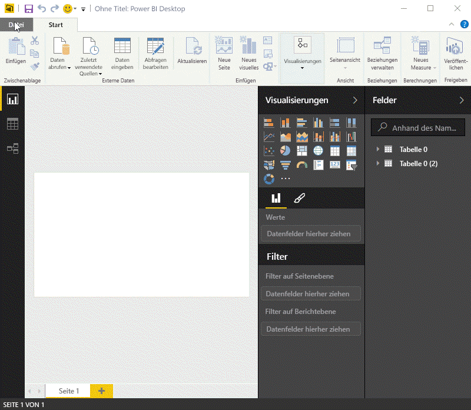

Unabhängig davon, welche Datenquelle Sie auswählen, wird in Power BI eine Verbindung mit der Datenquelle hergestellt, und die über diese Quelle verfügbaren Daten werden angezeigt. In der folgenden Abbildung sehen Sie ein weiteres Beispiel. Es stammt von einer Webseite mit Analysen verschiedener US-Bundesstaaten und einigen interessanten Statistiken zum Ruhestand.

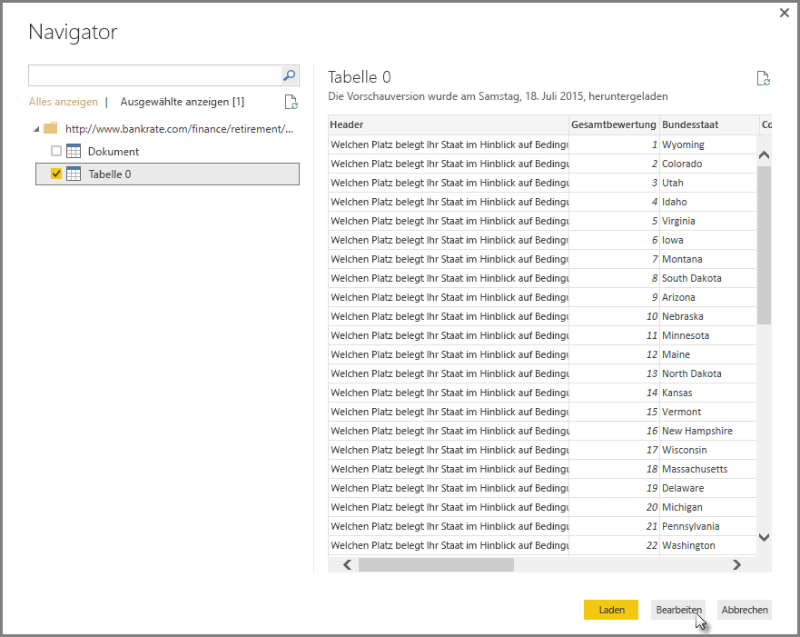

In der Ansicht **Bericht** von Power BI Desktop können Sie mit dem Erstellen von Berichten beginnen.

Die Ansicht **Bericht** besteht aus fünf Hauptbereichen:

1. Das Menüband, in dem häufige Aufgaben in Verbindung mit Berichten und Visualisierungen angezeigt werden
2. Die Ansicht **Bericht** , oder die Zeichenfläche, in der Visualisierungen erstellt und angeordnet werden
3. Der Registerkartenbereich **Seiten** , der sich quer über den unteren Rand erstreckt, in dem Sie eine Berichtsseite auswählen oder hinzufügen können
4. Der Bereich **Visualisierungen** , in dem Sie Visualisierungen ändern, Farben oder Achsen anpassen, Filter anwenden, Felder ziehen und weitere Aktionen ausführen können
5. Der Bereich **Felder** , in dem Sie Abfrageelemente und Filter auf die Ansicht **Bericht** oder auf den Bereich **Filter** des Bereichs **Visualisierungen** ziehen können

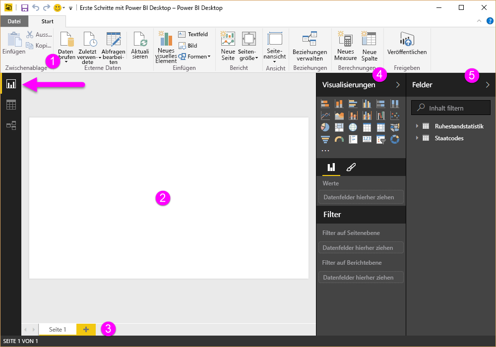

Die Bereiche **Visualisierungen** sowie **Felder** können durch Auswahl des kleinen Pfeils entlang der Kante reduziert werden, damit in der Ansicht **Bericht** mehr Platz zum Erstellen interessanter Visualisierungen zur Verfügung steht. Beim Ändern von Visualisierungen werden Pfeile nach oben und unten angezeigt, die bedeuten, dass Sie den betreffenden Abschnitt entsprechend erweitern oder reduzieren können.

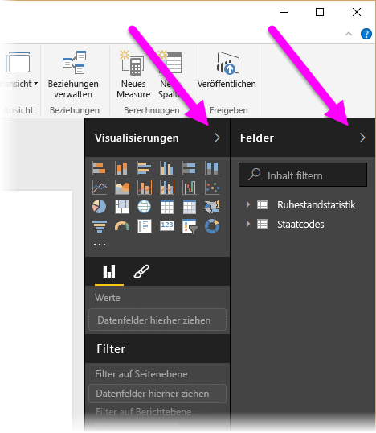

Zum Erstellen einer Visualisierung ziehen Sie einfach ein Feld aus der Liste **Felder** auf die Ansicht **Bericht** . Ziehen Sie in diesem Fall das Feld „State“ aus *RetirementStats*, und schauen Sie, was passiert.

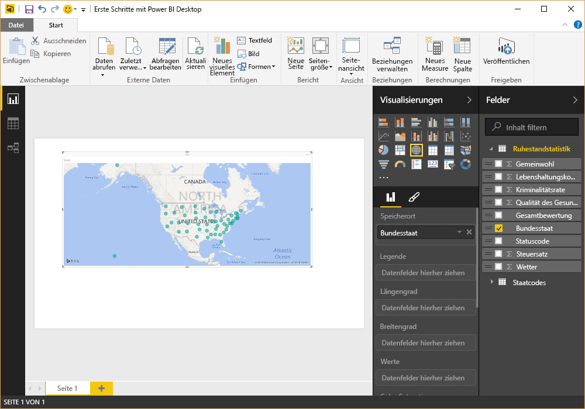

Jetzt sehen wir es uns mal an... Power BI Desktop hat automatisch eine kartenbasierte Visualisierung erstellt, da die Software erkannt hat, dass das Feld „State“ Daten zu geografischen Standorten enthält.

Wir machen einen Schnellvorlauf, und nach dem Erstellen eines Berichts mit einigen Visualisierungen können wir den Bericht im Power BI-Dienst veröffentlichen. Wählen Sie in Power BI Desktop im Menüband **Start** die Option **Veröffentlichen** aus.

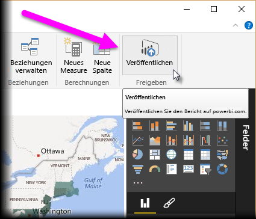

Sie werden aufgefordert, sich bei Power BI anzumelden.

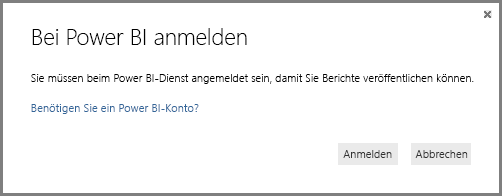

Wenn Sie angemeldet waren, und der Veröffentlichungsprozess abgeschlossen ist, wird das folgende Dialogfeld angezeigt. Sie können den Link auswählen (unter **Erfolg!**), um zum Power BI-Dienst zu gelangen, in dem der soeben veröffentlichte Bericht angezeigt wird.

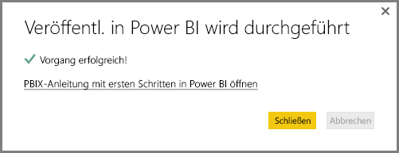

Wenn Sie sich bei Power BI anmelden, wird die soeben veröffentlichte Power BI Desktop-Datei im Dienst angezeigt. In der folgenden Abbildung wird der in Power BI Desktop erstellte Bericht im Abschnitt **Berichte** angezeigt.

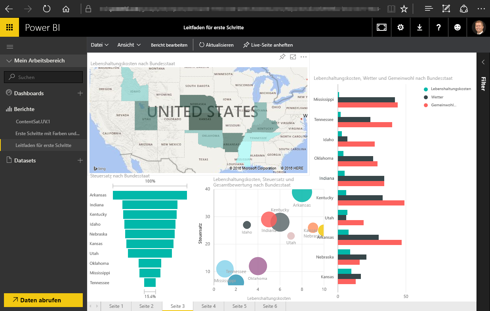

In diesem Bericht kann ich das **Anheftsymbol** auswählen, um das visuelle Element an ein Dashboard anzuheften. In der folgenden Abbildung ist das Anheftsymbol durch einen Rahmen und einen Pfeil hervorgehoben.

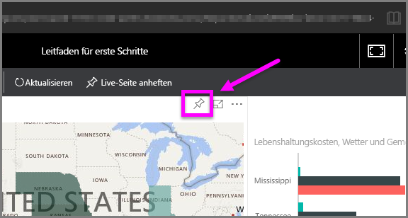

Wenn ich dieses Symbol auswähle, wird das folgende Dialogfeld angezeigt, in dem ich das visuelle Element an ein vorhandenes Dashboard anheften oder ein neues Dashboard erstellen kann.

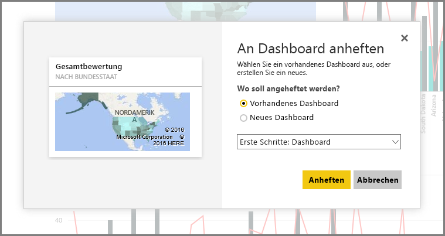

Wenn wir mehrere visuelle Elemente aus dem Bericht anheften, werden sie im Dashboard angezeigt.

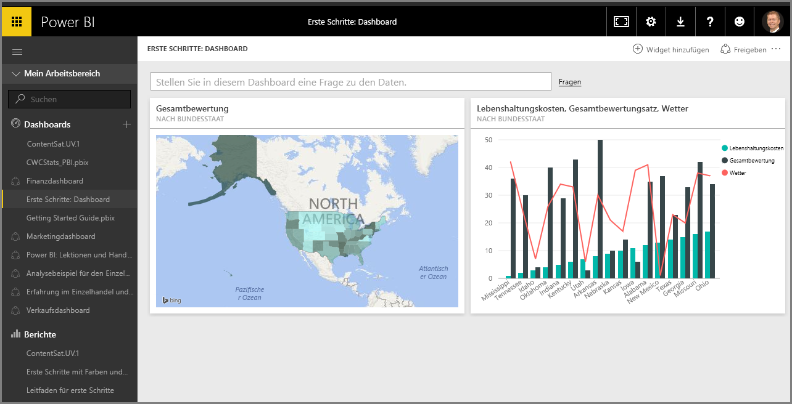

Mit Power BI können Sie natürlich zahlreiche andere Aktionen ausführen, z. B. können Sie die erstellten Dashboards freigeben. Dies erörtern wir in diesem Kurs zu einem späteren Zeitpunkt.

Als Nächstes sehen wir uns ein Feature an, über die Dashboards automatisch erstellt werden können, und das einfach durch Herstellen einer Verbindung mit einem Clouddienst wie Facebook, Salesforce u. v. a.

