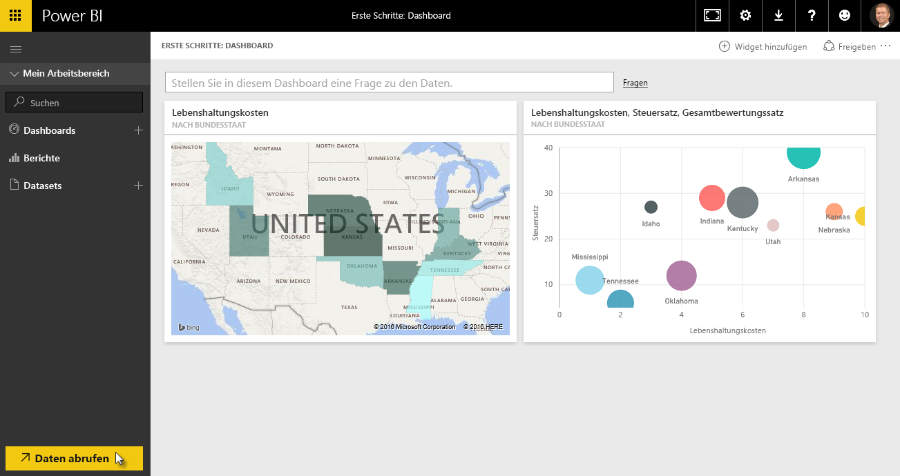
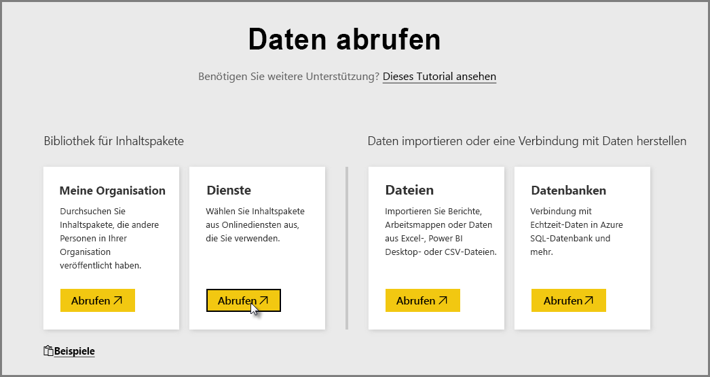
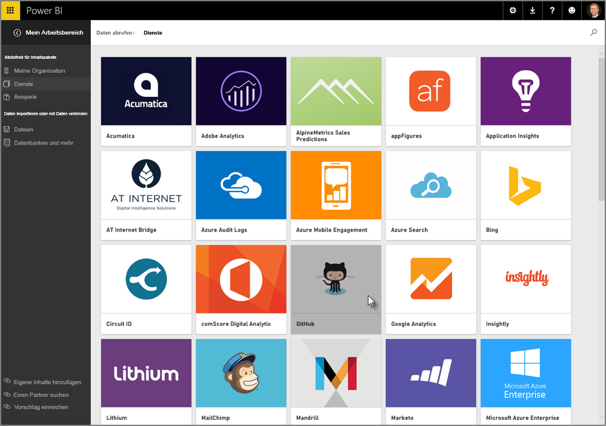
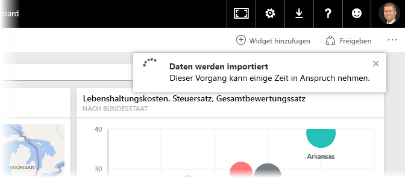
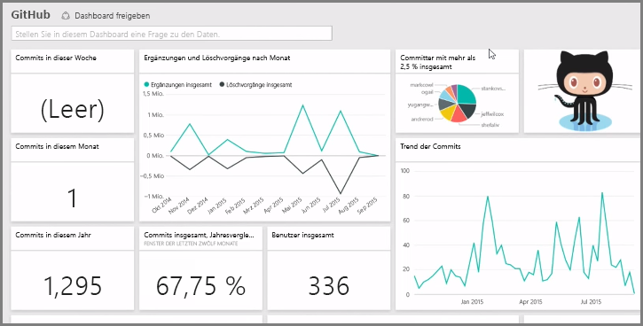
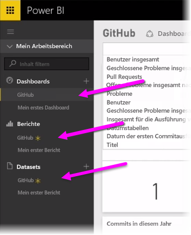
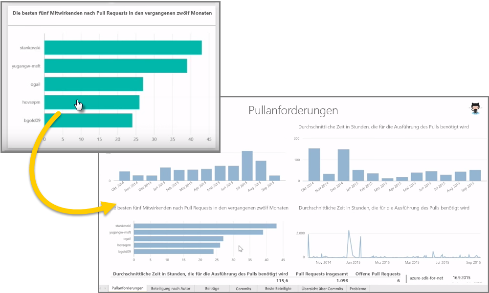
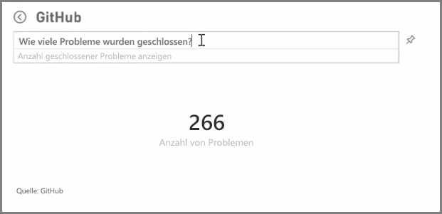
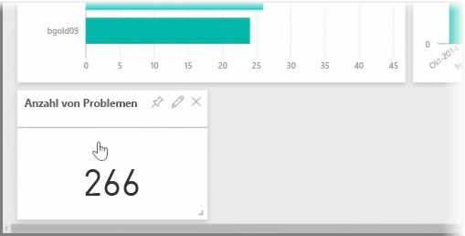

Wie wir gesehen haben, wird in Power BI normalerweise zuerst ein Bericht in Power BI Desktop erstellt, dann im Power BI-Dienst veröffentlicht und schließlich für andere Benutzer freigegeben, damit diese ihn im Dienst oder in einer mobilen App anzeigen können.

Einige Benutzer beginnen allerdings auch im Power BI-Dienst, betrachten wir also kurz diesen Dienst und eine einfache und häufig genutzte Möglichkeit, um schnell Visualisierungen in Power BI zu erstellen: *Inhaltspakete*.

Ein **Inhaltspaket** ist eine Sammlung von vorkonfigurierten, vorgefertigten Visualisierungen und Berichten auf Grundlage von bestimmten Datenquellen, z.B. Salesforce. Die Verwendung eines Inhaltspakets ist vergleichbar mit einem Fertigessen aus der Mikrowelle oder einem Fast Food-Sparmenü: Mit wenigen Klicks und Kommentaren erhalten Sie schnell eine Reihe von aufeinander abgestimmten Produkten, die in einem praktischen, sofort nutzbaren Paket zusammengefasst sind.

Betrachten wir also Inhaltspakete, den Dienst und ihre Funktionsweise. Inhaltspakete (und der Dienst) werden in den nächsten Abschnitten genauer beschrieben, jetzt erhalten Sie gewissermaßen einen Vorgeschmack, um ihren Appetit anzuregen.

## Erstellen von Out-of-the-Box-Dashboards mit Clouddiensten
Mit Power BI können Sie ganz einfach eine Verbindung mit Daten herstellen. Wählen Sie im Power BI-Dienst einfach die Schaltfläche **Daten abrufen** in der unteren linken Ecke des Startbildschirms aus.

Der *Zeichenbereich* (der Bereich in der Mitte des Power BI-Diensts) zeigt die verfügbaren Datenquellen im Power BI-Dienst. Zusätzlich zu häufig verwendeten Datenquellen wie Excel-Dateien, Datenbanken oder Azure-Daten kann Power BI genauso einfach auch eine Verbindung mit **Softwarediensten** (auch als SaaS-Anbieter oder Clouddienste bezeichnet) herstellen, z.B. Salesforce, Facebook, Google Analytics und eine Vielzahl von anderen SaaS-Diensten.

Für diese Softwaredienste stellt der **Power BI-Dienst** eine Reihe von vorgefertigten Visuals bereit, die bereits in Dashboards und Berichten angeordnet sind. Diese werden als **Inhaltspakete** bezeichnet. Mit Inhaltspaketen können Sie in Power BI schnell mit Daten aus dem ausgewählten Dienst arbeiten. Wenn Sie z.B. das Salesforce-Inhaltspaket verwenden, stellt Power BI eine Verbindung mit Ihrem Salesforce-Konto her (sobald Sie Ihre Anmeldeinformationen angegeben haben) und füllt dann eine vordefinierte Sammlung von Visuals und Dashboards in Power BI mit den Daten.

Power BI bietet Inhaltspakete für alle möglichen Arten von Diensten. Die folgende Abbildung zeigt den ersten Bildschirm mit Diensten in alphabetischer Reihenfolge, die angezeigt werden, wenn Sie **Abrufen** im Feld **Dienste** auswählen (in der vorherigen Abbildung dargestellt). Wie Sie in der folgenden Abbildung sehen können, gibt es eine große Auswahl.

Wir wählen für unsere Zwecke **GitHub** aus. GitHub ist eine Anwendung für die Onlinequellenverwaltung. Nachdem ich die Informationen und Anmeldeinformationen für das GitHub-Inhaltspaket eingegeben habe, werden meine Daten importiert.

Wenn die Daten geladen wurden, wird das vordefinierte Dashboard des GitHub-Inhaltspakets angezeigt.

Zusätzlich zum **Dashboard** ist auch der **Bericht** verfügbar, der (als Teil des GitHub-Inhaltspakets) generiert wurde, um das Dashboard zu erstellen. Dies gilt auch für das **Dataset** (die Sammlung von Daten, die aus GitHub abgerufen wurden), das während des Datenimports erstellt und zum Erstellen des GitHub-Berichts verwendet wurde.

Im Dashboard können Sie auf die einzelnen Visualisierungen klicken und werden automatisch auf die **Berichtsseite** weitergeleitet, auf deren Grundlage die Visualisierung erstellt wurde. Durch Klicken auf die Visualisierung **Top 5 users by pull requests** öffnet Power BI daher die Seite **Pull Requests** im Bericht (Berichtsseite, auf deren Grundlage diese Visualisierung erstellt wurde).

## Fragen an Ihre Daten stellen
Sie können auch Fragen an Ihre Daten stellen, und der Power BI-Dienst erstellt in Echtzeit Visualisierungen auf Grundlage Ihrer Frage. In der folgenden Abbildung können Sie sehen, wie Power BI auf Grundlage der Eingabe in der Leiste **Abfragen in natürlicher Sprache** eine Zahlenvisualisierung erstellt, die die Anzahl der abgeschlossenen Fälle zeigt.

Wenn Ihnen eine Visualisierung gefällt, können Sie das **Symbol zum Anheften** rechts neben der Leiste für Abfragen in natürlicher Sprache auswählen, um die Visualisierung an das Dashboard anzuheften. In diesem Fall wird die Visualisierung an das GitHub-Dashboard angeheftet, da dieses Dashboard gerade ausgewählt ist.

## Aktualisieren von Daten im Power BI-Dienst
Sie können das Dataset für ein Inhaltspaket oder andere Daten, die Sie in Power BI verwenden, auch **aktualisieren**. Wählen Sie zum Festlegen von Aktualisierungseinstellungen das Auslassungszeichen (drei Punkte) neben einem Dataset aus. Ein Menü wird angezeigt.

Wählen Sie die Option **Aktualisierung planen** unten im Menü aus. Im Zeichenbereich wird ein Einstellungsdialogfeld angezeigt, in dem Sie die gewünschten Einstellungen für die Aktualisierung festlegen können.

Das reicht als schnelle Einführung in den Power BI-Dienst Es gibt viele weitere Möglichkeiten mit dem Dienst, die später in diesem Kurs behandelt werden. Denken Sie auch daran, dass es viele verschiedene Arten von Daten gibt, mit denen Sie eine Verbindung herstellen können, sowie eine Vielzahl von Inhaltspaketen, die ständig erweitert werden.

Machen wir jetzt mit dem nächsten Thema weiter, in dem dieser Abschnitt **Erste Schritte** noch einmal zusammengefasst wird und die nächsten Themen vorbereitet werden.

