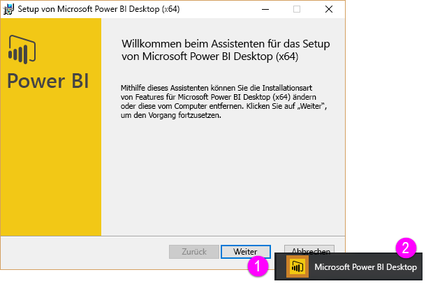

Willkommen im zweiten Abschnitt **Abrufen von Daten** im Kurs **Geführtes Lernen** für Power BI. In diesem Abschnitt werden die zahlreichen datenorientierten Features und Tools von Power BI erörtert. Der Schwerpunkt liegt dabei auf Power BI Desktop. Viele dieser Tools gelten auch für den Power BI-Dienst, sodass sich die Informationen in diesem Abschnitt für Sie doppelt auszahlen.

Wenn Sie Daten abrufen, sind diese nicht immer so wohlgeformt bzw. *bereinigt*, wie Sie sich dies wünschen. In diesem Abschnitt erfahren Sie, wie Sie Daten abrufen und diese bereinigen (dieser Vorgang wird manchmal als *Bereinigen* oder *Transformieren* von Daten bezeichnet). Zudem erhalten Sie einige Tipps und Tricks für das optimierte Abrufen von Daten.

Wie immer in diesem Kurs folgen die Erläuterungen dem Arbeitsablauf in Power BI. Daher beschäftigen wir uns zunächst mit **Power BI Desktop** als häufigem Ausgangspunkt.

## Übersicht über Power BI Desktop
Power BI Desktop ist ein Tool zum Herstellen einer Verbindung mit Ihren Daten sowie zum Bereinigen und Visualisieren der Daten. Mit Power BI Desktop können Sie eine Verbindung mit Daten herstellen und diese dann auf unterschiedliche Weise modellieren und darstellen. Die meisten Benutzer, die an Business Intelligence-Projekten arbeiten, nutzen dazu den Großteil der Zeit Power BI Desktop.

Sie können Power BI Desktop [aus dem Web](http://go.microsoft.com/fwlink/?LinkID=521662) herunterladen, **Power BI Desktop** als App über den [**Windows Store**](http://aka.ms/pbidesktopstore) installieren oder aus dem Power BI-Dienst herunterladen. Klicken Sie zum Herunterladen von **Power BI Desktop** im Dienst oben rechts einfach auf die Schaltfläche mit dem Pfeil nach unten, und wählen Sie dann „Power BI Desktop“ aus.

Power BI Desktop wird als Anwendung auf Ihrem Windows-Computer installiert.

Das heißt, nach dem Herunterladen installieren Sie Power BI Desktop und führen das Tool wie alle anderen Anwendungen unter Windows aus. In der folgenden Abbildung ist der Startbildschirm von Power BI Desktop dargestellt, der beim Starten der Anwendung angezeigt wird.

Power BI Desktop lässt sich mit einer Vielzahl von Datenquellen verbinden, angefangen bei lokalen Datenbanken, über Excel-Arbeitsblätter bis hin zu Clouddiensten. Mit Power BI Desktop können Sie Ihre Daten bereinigen und im Hinblick auf eine bessere Nutzbarkeit formatieren, dazu gehören z. B. das Aufteilen und Umbenennen von Spalten, das Ändern von Datentypen oder das Verwenden von Datumsangaben. Sie können zudem Beziehungen zwischen Spalten erstellen, sodass die Daten einfacher modelliert und analysiert werden können.

