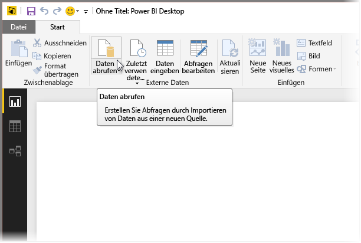
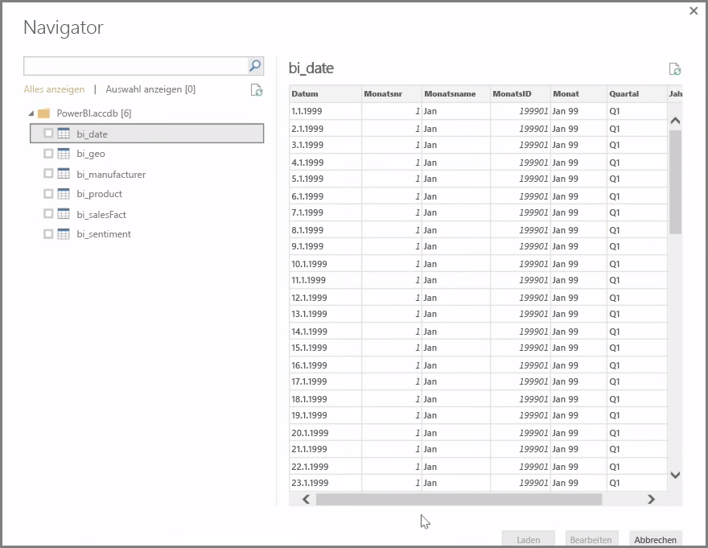
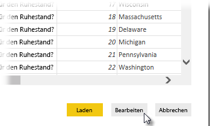

**Power BI Desktop** lässt sich mit einer Vielzahl von Datenquellen verbinden, z. B. mit lokalen Datenbanken, Excel-Arbeitsblättern und Clouddiensten. Derzeit verfügen mehr als 59 unterschiedliche Clouddienste (z. B. GitHub und Marketo) über spezifische Connectors. Mit generischen Datenquellen können Sie über XML, CSV, Text und ODBC eine Verbindung herstellen. Power BI kann sogar Tabellendaten direkt über eine Website-URL extrahieren! Aber eins nach dem anderen: Zunächst öffnen wir Power BI Desktop und stellen eine Verbindung mit den Daten her.

Wenn Sie **Power BI Desktop** starten und abwarten, bis der Startbildschirm ausgeblendet wird, können Sie im Menüband auf der Registerkarte **Start** die Option „Daten abrufen“ auswählen.

Power BI Desktop wird monatlich aktualisiert, und mit jedem Update wird die Seite **Neuigkeiten in Power BI Desktop** mit Informationen zu den Updates, Links zum Blog und einem Downloadlink aktualisiert.

In Power BI Desktop stehen vielerlei unterschiedliche Datenquellen zur Verfügung. Wählen Sie eine Datenquelle zum Herstellen einer Verbindung aus. Je nach Ihrer Auswahl werden Sie entweder aufgefordert, die Datenquelle auf dem Computer oder im Netzwerk zu suchen oder sich zur Authentifizierung Ihrer Anforderung bei einem anderen Dienst anzumelden.

Nach dem Herstellen der Verbindung wird als erstes Fenster der **Navigator** angezeigt. Im Navigator werden die Tabellen oder Entitäten der Datenquelle angezeigt. Wenn Sie auf eine Tabelle oder Entität klicken, werden die entsprechenden Inhalte in der Vorschau angezeigt. Sie können die ausgewählten Tabellen oder Entitäten dann direkt importieren oder **Bearbeiten** auswählen, um die Daten vor dem Importieren zu transformieren und zu bereinigen.

Nachdem Sie die Tabellen ausgewählt haben, die Sie in Power BI Desktop übernehmen möchten, können Sie sie in Power BI Desktop laden, indem Sie die Schaltfläche **Laden** rechts unten im **Navigator** auswählen. Möglicherweise möchten Sie jedoch Änderungen an diesen Tabellen vornehmen, bevor Sie sie in Power BI Desktop laden. Eventuell möchten Sie z. B. nur eine Teilmenge der Kunden übernehmen oder die Daten nach Verkäufen filtern, die nur in einem bestimmten Land erfolgt sind. In diesen Fällen können Sie die Schaltfläche „Bearbeiten“ auswählen und die Daten filtern oder transformieren, bevor Sie sie in Power BI Desktop importieren.

Im nächsten Abschnitt machen wir genau hier weiter und bearbeiten die Daten.

