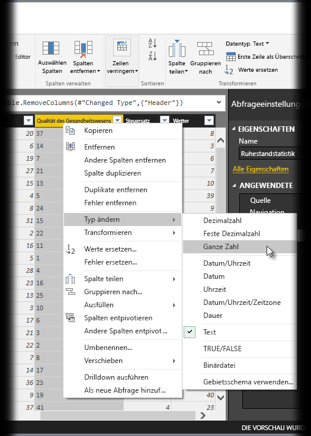
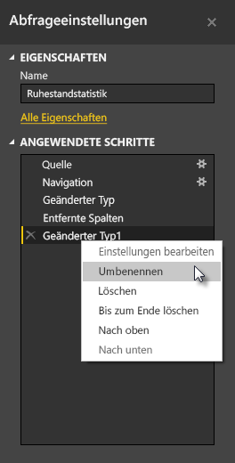
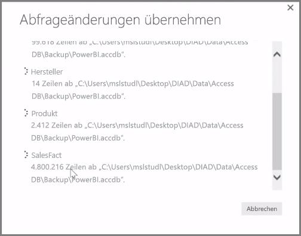

**Power BI Desktop** umfasst auch den **Abfrage-Editor**, ein leistungsstarkes Tool zum Strukturieren und Transformieren von Daten, sodass Sie sie in Ihren Modellen und Visualisierungen verwenden können. Wenn Sie die Schaltfläche „Bearbeiten“ im Navigator auswählen, wird der Abfrage-Editor gestartet und mit den Tabellen oder anderen Entitäten aufgefüllt, die Sie in der Datenquelle ausgewählt haben.

Sie können den **Abfrage-Editor** auch direkt über **Power BI Desktop** starten. Verwenden Sie dazu die Schaltfläche **Abfragen bearbeiten** im Menüband **Start**.

Nachdem der Abfrage-Editor mit Daten geladen wurde, die Sie strukturieren können, werden verschiedene Abschnitte angezeigt:

1. Im Menüband sind jetzt viele Schaltflächen aktiv, über die Sie die Daten in der Abfrage interaktiv bearbeiten können.
2. Im linken Bereich sind die Abfragen (jeweils eine Abfrage für jede Tabelle oder Entität) aufgelistet, die zur Auswahl, Ansicht und Strukturierung bereitstehen.
3. Im mittleren Bereich werden die Daten der ausgewählten Abfrage angezeigt und können strukturiert werden.
4. Das Fenster "Abfrageeinstellungen" wird angezeigt, in dem die Eigenschaften der Abfrage und die angewendeten Schritte aufgelistet sind.

Im mittleren Bereich werden durch Klicken mit der rechten Maustaste auf eine Spalte verschiedene verfügbare Transformationen angezeigt, z. B. zum Entfernen der Spalte aus der Tabelle, zum Duplizieren der Spalte unter einem neuen Namen und zum Ersetzen von Werten. Über dieses Menü können Sie auch Textspalten durch allgemeine Trennzeichen in mehrere Spalten aufteilen.

Das Menüband im **Abfrage-Editor** enthält zusätzliche Tools, beispielsweise zum Ändern des Datentyps von Spalten, zum Hinzufügen der wissenschaftlichen Schreibweise oder zum Extrahieren von Elementen aus Datumsangaben, z. B. den Wochentag.

Wenn Sie Transformationen anwenden, wird jeder Schritt in der Liste **Angewendete Schritte** im Bereich **Abfrageeinstellungen** auf der rechten Seite des **Abfrage-Editors** angezeigt. Sie können diese Liste verwenden, um bestimmte Änderungen rückgängig zu machen oder zu überprüfen oder sogar um den Namen eines Schritts zu ändern. Um die Transformationen zu speichern, wählen Sie **Schließen und übernehmen** auf der Registerkarte **Start** aus.

Nachdem Sie **Schließen und übernehmen** ausgewählt haben, werden die vorgenommenen Änderungen an den Abfragen im Abfrage-Editor gespeichert und in Power BI Desktop angewendet.

Beim Transformieren von Daten im **Abfrage-Editor** können vielerlei Vorgänge durchgeführt werden, darunter auch erweiterte Transformationen. Im nächsten Abschnitt sehen wir uns einige dieser erweiterten Transformationen an, um Ihnen ein gewisses Gefühl für die nahezu unermesslichen Möglichkeiten zu geben, mit denen Sie Daten im **Abfrage-Editor** transformieren können.

