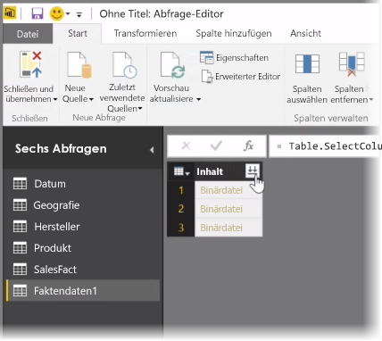
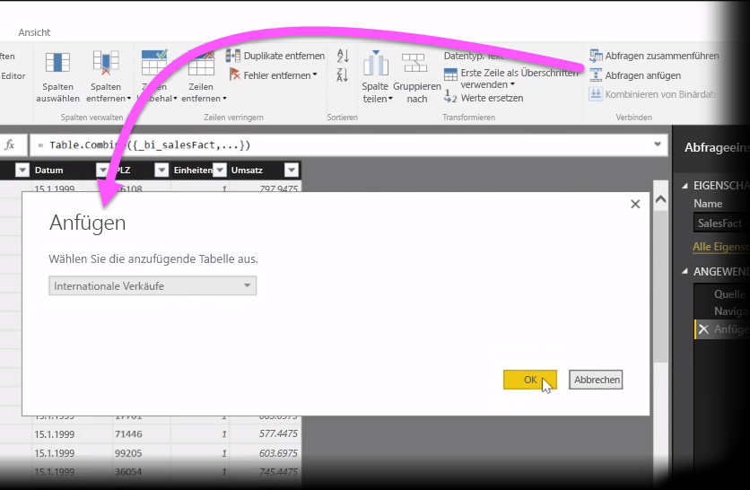
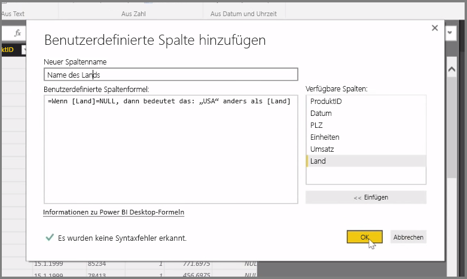

In diesem Artikel werden einige komplexere Methoden zum Importieren und Bereinigen von Daten in **Power BI Desktop** erläutert. Nachdem Sie die Daten im **Abfrage-Editor** strukturiert und in **Power BI Desktop** importiert haben, können Sie sie in unterschiedlichen Ansichten anzeigen. Power BI Desktop weist drei Ansichten auf: Die Ansicht **Bericht** , die Ansicht **Daten** und die Ansicht **Beziehungen** . Die jeweilige Ansicht können Sie anzeigen, indem Sie oben links im Zeichenbereich das entsprechende Symbol auswählen. In der folgenden Abbildung ist die Ansicht **Bericht** ausgewählt. Der gelbe Balken neben dem Symbol gibt die jeweils aktive Ansicht an.

Um die Ansicht zu ändern, wählen Sie einfach eines der beiden anderen Symbole aus. Der gelbe Balken neben dem Symbol gibt die jeweils aktive Ansicht an.

In Power BI Desktop können zu jedem Zeitpunkt während des Modellierungsvorgangs Daten aus mehreren Quellen in einem einzelnen Bericht kombiniert werden. Um einem vorhandenen Bericht zusätzliche Quellen hinzuzufügen, wählen Sie im Menüband **Start** die Option **Abfragen bearbeiten** und dann im **Abfrage-Editor** die Option **Neue Quelle** aus.

In **Power BI Desktop** können Sie viele verschiedene Datenquellen verwenden, darunter auch Ordner. Durch das Verbinden mit einem Ordner können Sie Daten aus mehreren Dateien gleichzeitig importieren, z. B. aus mehreren Excel-Dateien oder CSV-Dateien. Die in dem ausgewählten Ordner enthaltenen Dateien werden im **Abfrage-Editor** als Binärinhalt angezeigt. Durch Klicken auf das Doppelpfeilsymbol oben in der Spalte **Inhalt** werden die entsprechenden Werte geladen.

Eines der nützlichsten Power BI-Tools ist der *Filter*. Durch Auswählen des Dropdownpfeils neben einer Spalte wird beispielsweise eine Prüfliste der Textfilter geöffnet, mit denen Sie Werte aus dem Modell entfernen können.

Sie können außerdem Abfragen zusammenführen und anfügen sowie mehrere Tabellen (oder Daten aus verschiedenen Dateien in Ordnern) in eine einzelne Tabelle umwandeln, die nur die gewünschten Daten enthält. Über das Tool **Abfragen anfügen** können Sie die Daten aus einer neuen Tabelle in einer vorhandenen Abfrage hinzufügen. Power BI Desktop versucht, die Daten den Spalten in den Abfragen zuzuordnen. Dies können Sie dann bei Bedarf im **Abfrage-Editor** anpassen.

Schließlich haben erfahrene Benutzer mit dem Tool **Benutzerdefinierte Spalte hinzufügen** die Möglichkeit, Abfrageausdrücke mit der leistungsstarken Sprache M neu zu schreiben. Sie können eine benutzerdefinierte Spalte basierend auf Anweisungen der Abfragesprache M hinzufügen und so Ihre Daten auf die gewünschte Weise gestalten.

