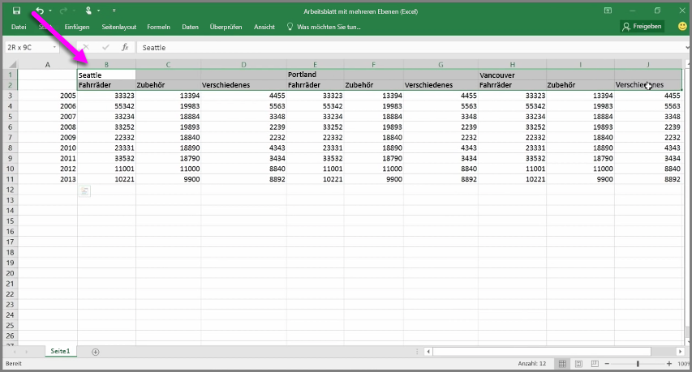
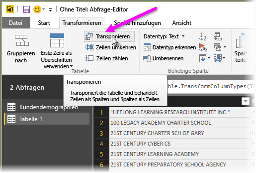
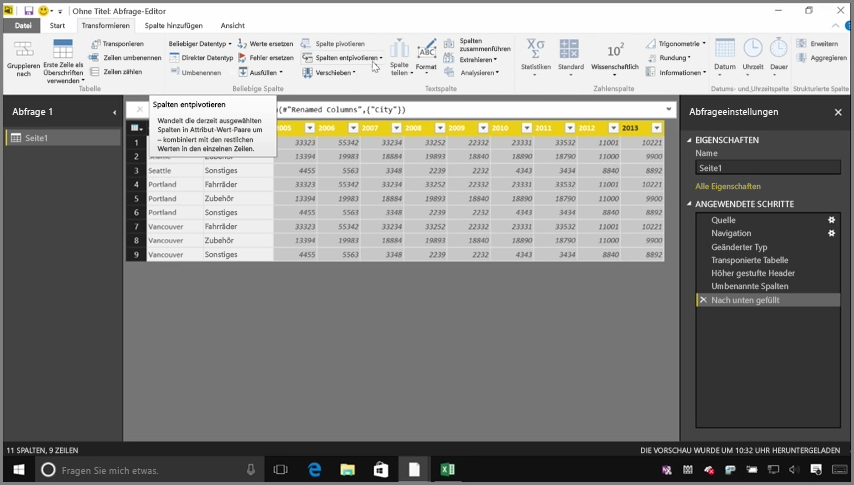
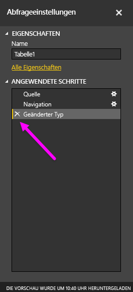
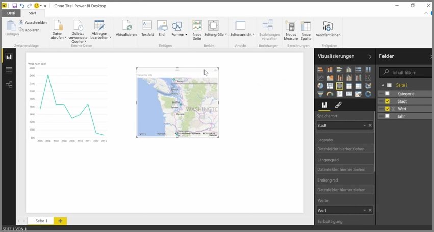

Obwohl Daten aus nahezu jeder Datenquelle in Power BI importiert werden können, lassen sich die Visualisierungs- und Modellierungstools am besten auf Daten in Spalten anwenden. Ihre Daten sind jedoch nicht immer in einfachen Spalten formatiert. Dies ist häufig der Fall bei Excel-Arbeitsblättern, deren Tabellenlayout nicht unbedingt optimal für automatisierte Abfragen geeignet ist. Das nachfolgende Arbeitsblatt enthält beispielsweise Überschriften, die sich über mehrere Spalten erstrecken.

Glücklicherweise verfügt Power BI über Tools, mit denen sich Tabellen mit mehreren Spalten schnell in geeignete Datasets umwandeln lassen.

## Transponieren von Daten
Über die Option **Vertauschen** im **Abfrage-Editor** können Sie beispielsweise Daten tauschen (Spalten in Zeilen und Zeilen in Spalten umwandeln), um Daten in Formate aufzuschlüsseln, die Sie bearbeiten können.

Wenn Sie diesen Vorgang entsprechend der Erläuterung im Video mehrmals durchführen, wird die Tabelle so strukturiert, dass sie in Power BI einfacher verwendet werden kann.

## Formatieren von Daten
Möglicherweise müssen Sie die Daten auch formatieren, damit sie nach dem Importieren in Power BI richtig kategorisiert und identifiziert werden können.

Durch eine Reihe von Transformationen, z. B. *Höherstufen von Zeilen zu Überschriften* zum Gliedern von Überschriften, Verwenden von **Füllen** zum Verwandeln von *Nullwerten* in vorhandene Werte oberhalb oder unterhalb einer bestimmten Spalte sowie Verwenden von **Spalten entpivotieren**, können Sie die Daten in einem Dataset bereinigen, das Sie in Power BI verwenden können.

Sie können diese Transformationen mit Power BI bei Ihren Daten testen und so herausfinden, mit welchen Transformationen Sie die Daten in ein Spaltenformat ändern können, das Sie in Power BI bearbeiten können. Denken Sie daran, dass alle ausgeführten Aktionen im Abschnitt „Angewendete Schritte“ des Abfrage-Editors aufgezeichnet werden. Wenn eine Transformation also nicht zum gewünschten Ergebnis führt, können Sie einfach auf das **x** neben dem entsprechenden Schritt klicken und diesen rückgängig machen.

## Erstellen von visuellen Elementen
Wenn die Daten nach dem Transformieren und Bereinigen ein Format aufweisen, das in Power BI verwendet werden kann, können Sie visuelle Elemente erstellen.

## Nächste Schritte
**Herzlichen Glückwunsch!** Sie haben diesen Abschnitt im Kurs **Geführtes Lernen** für Power BI abgeschlossen. Sie haben sich mit dem **Abrufen von Daten** in Power BI Desktop sowie dem *Strukturieren* und *Transformieren* dieser Daten vertraut gemacht, sodass Sie nun visuelle Elemente erstellen können.

Im nächsten Schritt zur Funktionsweise von Power BI, in dem Sie lernen, wie Sie den Dienst zu *Ihren Gunsten* nutzen können, erfahren auch, was es mit der **Modellierung** auf sich hat. Sie wissen bereits, dass es sich bei einem **Dataset** um eine Grundkomponente von Power BI handelt, einige Datasets können aber komplex sein und auf vielen verschiedenen Datenquellen basieren. Und in einigen Fällen müssen Sie dem Dataset, das Sie erstellen, eine ganz persönliche Note verleihen (d. h. ein spezifisches *Feld* hinzufügen).

Informationen zur **Modellierung** und vieles mehr erhalten Sie im nächsten Abschnitt. Wir sehen uns dort wieder!

