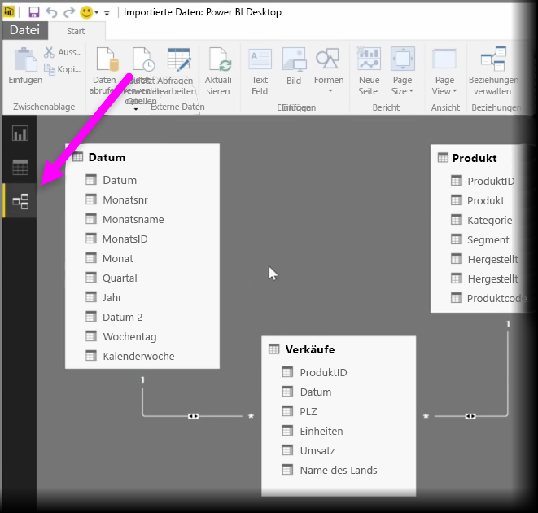
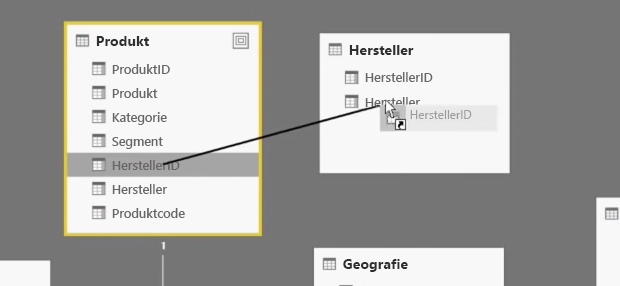
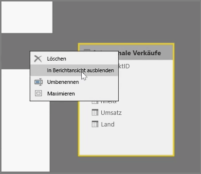
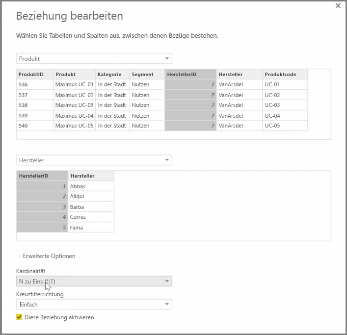

Mit Power BI können Sie die Beziehung zwischen Tabellen oder Elemente visuell festlegen. Um eine Diagrammansicht Ihrer Daten anzuzeigen, verwenden Sie die **Beziehungsansicht** ganz links auf dem Bildschirm neben dem Berichtszeichenbereich.

In der Ansicht **Beziehungen** können Sie einen Block sehen, der die einzelnen Tabellen und deren Spalten darstellt, sowie Linien dazwischen, die die Beziehungen darstellen.

Das Hinzufügen und Entfernen von Beziehungen ist ganz einfach. Wenn Sie eine Beziehung entfernen möchten, klicken Sie mit der rechten Maustaste darauf und wählen **Löschen** aus. Um eine Beziehung zu erstellen, ziehen Sie die Felder, die Sie verknüpfen möchten, aus den Tabellen und legen sie ab.

Um eine Tabelle oder eine einzelne Spalte aus dem Bericht auszublenden, klicken Sie mit der rechten Maustaste in der Beziehungsansicht darauf und wählen **In Berichtansicht ausblenden** aus.

Wählen Sie für eine ausführlichere Ansicht der Datenbeziehungen **Beziehungen verwalten** auf der Registerkarte **Start** aus. Hiermit wird das Dialogfeld **Beziehungen verwalten** geöffnet, das die Beziehungen in Form einer Liste anstatt einer visuellen Darstellung enthält. Hier können Sie **AutoErmittlung** auswählen, um Beziehungen in neuen oder aktualisierten Daten zu ermitteln. Wählen Sie **Bearbeiten** im Dialogfeld **Beziehungen verwalten** aus, um die Beziehungen manuell zu bearbeiten. Hier finden Sie auch erweiterte Optionen zum Festlegen der *Kardinalität* und *Kreuzfilter* der Beziehung.

Die Optionen für die Kardinalität lauten *Viele-zu-Eins* und *Eins-zu-Eins*. *Viele-zu-Eins* ist die Beziehung vom Typ „Fakten zu Dimensionen“, z.B. eine Umsatztabelle mit mehreren Zeilen pro Produkt, die mit einer Tabelle verknüpft wird, in der Produkte in einer eigenen Zeile aufgeführt werden. *Eins zu Eins* wird häufig zum Verknüpfen von einzelnen Einträgen in Verweistabellen verwendet.

Standardmäßig wird für Beziehungen die Kreuzfilterung in beide Richtungen festgelegt. Die Kreuzfilterung in nur eine Richtung schränkt einige der Modellierungsfunktionen in einer Beziehung ein.

Wenn Sie die Beziehungen zwischen den Daten genau festlegen, können Sie komplexe Berechnungen mit mehreren Datenelementen erstellen.

