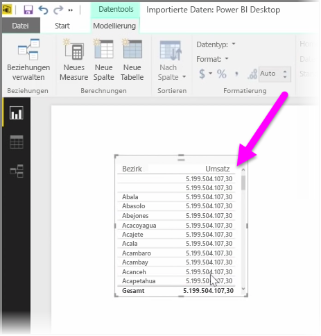
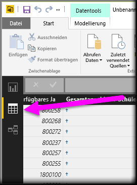
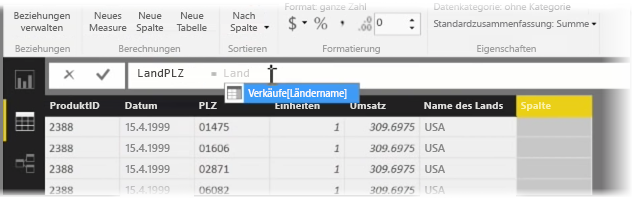
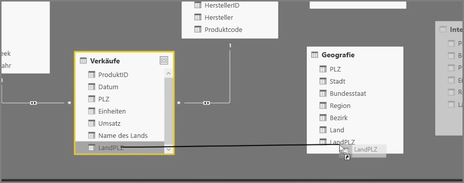
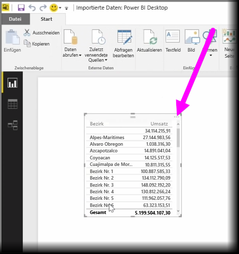

Das Erstellen von berechneten Spalten ist eine einfache Möglichkeit zum Erweitern und Optimieren von Daten. Eine **berechnete Spalte** ist eine neue Spalte, die Sie erstellen, indem Sie eine Berechnung definieren, die zwei oder mehr Elemente vorhandener Daten transformiert oder kombiniert. Beispielsweise können Sie eine neue Spalte erstellen, indem Sie zwei Spalten zu einer Spalte kombinieren.

Nützlich ist das Erstellen einer berechneten Spalte beispielsweise, um eine Beziehung zwischen Tabellen herzustellen, wenn keine eindeutigen Felder vorhanden sind, die zum Herstellen einer Beziehung verwendet werden können. Eine fehlende Beziehung wird offensichtlich, wenn Sie eine einfache Tabellenvisualisierung in Power BI Desktop erstellen und für alle Einträge denselben Wert erhalten, obwohl die zugrunde liegenden Daten nachweislich unterschiedlich sind.

Um eine Beziehung mit eindeutigen Feldern in den Daten zu erstellen, können Sie zum Beispiel eine neue berechnete Spalte für „Vollständige Telefonnummer“ erstellen, indem Sie die Werte aus den Spalten „Vorwahl“ und „Anschlussnummer“ kombinieren, wenn diese Werte in den Daten vorhanden sind. Berechnete Spalten sind ein nützliches Tool für das schnelle Erstellen von Modellen und Visualisierungen.

Wählen Sie zum Erstellen einer berechneten Spalte auf der linken Seite des Power BI Desktop-Berichtszeichenbereichs die **Datenansicht** aus.

Wählen Sie auf der Registerkarte „Modellierung“ die Option **Neue Spalte** aus. Damit aktivieren Sie die Bearbeitungsleiste, in der Sie Berechnungen mithilfe der DAX-Sprache (Data Analysis Expressions) eingeben können. DAX ist eine leistungsstarke Formelsprache (auch in Excel vorhanden), mit der Sie robuste Berechnungen erstellen können. Wenn Sie eine Formel eingeben, zeigt Power BI Desktop zur Unterstützung übereinstimmende Formeln oder Datenelemente an, um das Erstellen der Formel zu beschleunigen.

Auf der Power BI-Bearbeitungsleiste werden spezifische DAX-Funktionen und verwandte Datenspalten vorgeschlagen, während Sie einen Ausdruck eingeben.

Sobald die berechneten Spalten in jeder Tabelle erstellt wurden, können diese als eindeutiger Schlüssel verwendet werden, um eine Beziehung zwischen ihnen herzustellen. In der **Beziehungsansicht** können Sie dann das Feld aus einer Tabelle in die andere ziehen, um die Beziehung zu erstellen.

Wenn Sie zur **Berichtsansicht** zurückkehren, werden nun für jede Region unterschiedliche Werte angezeigt.

Das Erstellen von berechneten Spalten bietet Ihnen noch zahlreiche weitere Möglichkeiten.

