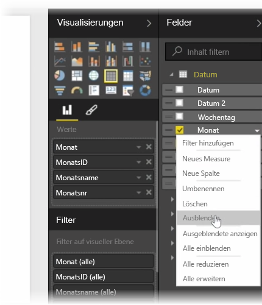
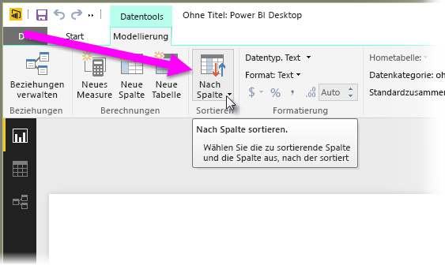
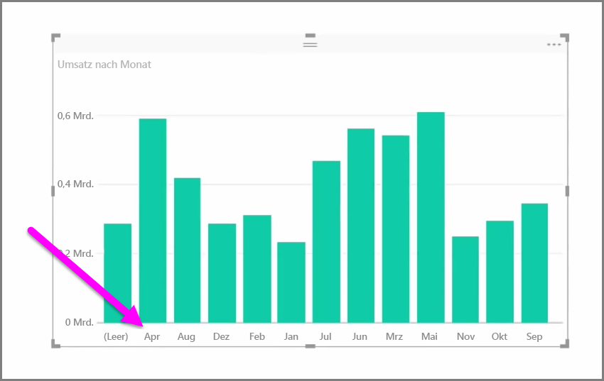

Importierte Daten enthalten oft Felder, die Sie für Ihre Berichte und Visualisierungen nicht benötigen, da es sich entweder um zusätzliche Informationen handelt oder da die betreffenden Daten bereits in einer anderen Spalte verfügbar sind. Mit den Tools von Power BI Desktop können Sie Ihre Daten optimieren, die Daten sinnvoller für das Erstellen von Berichten und Visualisierungen verwenden und freigegebene Berichte anzeigen.

## Ausblenden von Feldern
Wenn Sie eine Spalte im Bereich **Felder** von Power BI Desktop ausblenden möchten, klicken Sie mit der rechten Maustaste darauf, und wählen Sie **Ausblenden** aus. Beachten Sie, dass die ausgeblendeten Spalten nicht gelöscht werden. Wenn Sie das betreffende Feld in vorhandenen Visualisierungen verwendet haben, sind die Daten in diesen Visualisierungen weiterhin vorhanden und können auch in anderen Visualisierungen verwendet werden. Das ausgeblendete Feld wird lediglich nicht mehr im Bereich **Felder** angezeigt.

Bei der Anzeige von Tabellen in der **Beziehungsansicht** werden ausgeblendete Felder abgeblendet dargestellt. Auch in diesem Fall sind die Daten weiterhin verfügbar und Bestandteil des Modells. Sie werden nur in der Ansicht nicht angezeigt. Sie können jedes ausgeblendete Feld wieder einblenden, indem Sie mit der rechten Maustaste darauf klicken und **Einblenden** auswählen.

## Sortieren von Visualisierungsdaten nach einem anderen Feld
Das Tool **Nach Spalte sortieren** auf der Registerkarte **Modellierung** ist nützlich, um sicherzustellen, dass die Daten in der gewünschten Reihenfolge angezeigt werden.

Ein gängiges Beispiel sind Daten, die Monatsnamen enthalten und standardmäßig alphabetisch sortiert werden, sodass z.B. „August“ vor „Februar“ angezeigt wird.

Dieses Problem kann behoben werden, indem Sie das Feld in der Liste der Felder auswählen und dann **Nach Spalte sortieren** auf der Registerkarte **Modellierung** auswählen. Anschließend können Sie das Feld auswählen, nach dem sortiert werden soll. In diesem Fall werden die Monate mit der Sortierreihenfolge „MonthNo“ wie gewünscht sortiert.

Das Festlegen des Datentyps ist eine andere Möglichkeit, um die Daten zu optimieren, damit sie richtig behandelt werden. Um einen Datentyp im Berichtszeichenbereich zu ändern, wählen Sie die Spalte im Bereich **Felder** aus, und verwenden Sie dann das Dropdownmenü **Format**, um eine Formatierungsoption auszuwählen. Alle Visualisierungen, die Sie erstellt haben und in denen das betreffende Feld angezeigt wird, werden automatisch aktualisiert.

