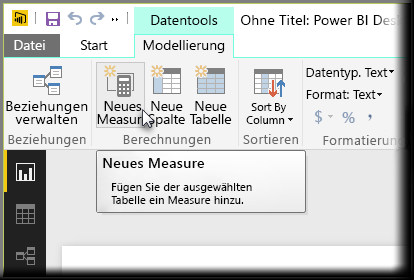
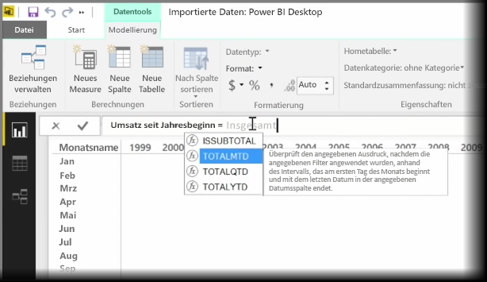
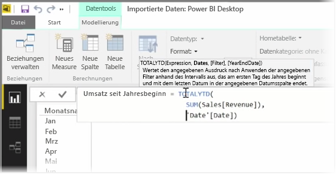
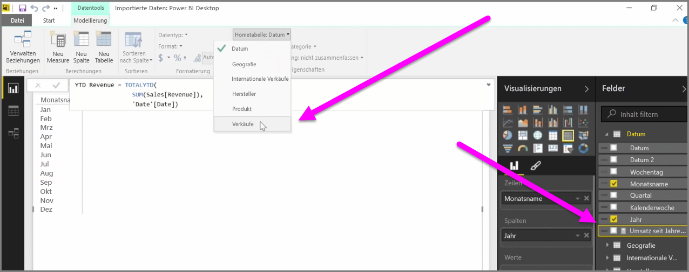

Bei einem *Measure* handelt es sich um eine vorhandene Berechnung in Ihrem Power BI-Datenmodell. Wählen Sie zum Erstellen eines Measures in der Ansicht **Bericht** auf der Registerkarte **Modellierung** die Option **Neues Measure** aus.

Einer der großen Vorteile von DAX, der Data Analysis Expression-Sprache in Power BI, ist ihre Fülle an nützlichen Funktionen, insbesondere im Hinblick auf zeitbasierte Berechnungen, z. B. *Jahr-bis-heute* oder *Year Over Year* (Jahresvergleich). Mit DAX können Sie einmal ein Zeitmeasure definieren und dann in beliebig viele verschiedene Felder aus dem Datenmodell segmentieren.

In Power BI wird eine definierte Berechnung als *Measure* bezeichnet. Um ein *Measure* zu erstellen, wählen Sie **Neues Measure** auf der Registerkarte **Start** aus. Damit wird die Bearbeitungsleiste geöffnet, in der Sie den DAX-Ausdruck eingeben können, mit dem das Measure definiert wird. Während der Eingabe der Berechnung werden in Power BI relevante DAX-Funktionen und Datenfelder vorgeschlagen. Zudem wird eine QuickInfo mit Erläuterungen einiger der Syntax- und Funktionsparameter angezeigt.

Wenn die Berechnung sehr lang ist, können Sie im Ausdrucks-Editor zusätzliche Zeilenumbrüche hinzufügen, indem Sie **ALT+EINGABE** drücken.

Nachdem Sie ein neues Measure erstellt haben, wird es in einer der Tabellen im Bereich **Felder** auf der rechten Seite des Bildschirms angezeigt. Das neue Measure wird in Power BI jeweils in die aktuell ausgewählte Tabelle eingefügt, und obwohl es keine Rolle spielt, wo genau sich das Measure in Ihren Daten befindet, können Sie es problemlos verschieben, indem Sie es auswählen und im Dropdownmenü **Hometabelle** die gewünschte Tabelle auswählen.

Sie können ein Measure wie jede andere Tabellenspalte verwenden: Ziehen Sie es einfach in den Berichtszeichenbereich oder auf Visualisierungsfelder. Measures lassen sich auch problemlos in Datenschnitte integrieren, sodass die Daten direkt segmentiert werden, d. h., Sie können ein Measure einmal definieren und in vielen verschiedenen Visualisierungen verwenden.

Die DAX-Funktion **Berechnen** ist eine leistungsstarke Funktion, die alle möglichen nützlichen Berechnungen ermöglicht, was sich als besonders hilfreich für Finanzberichte und visuelle Elemente erweist.

