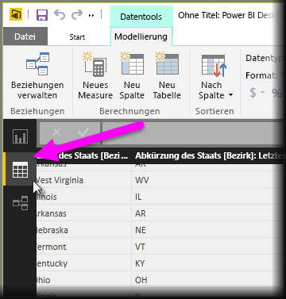
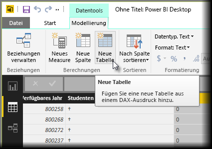
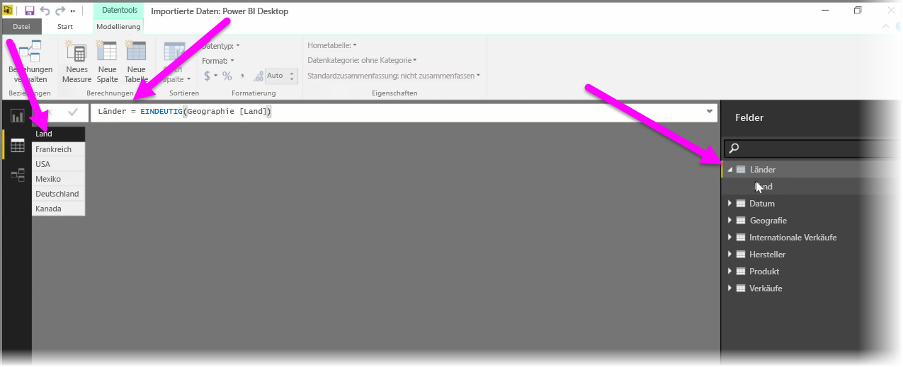

Berechnete Tabellen stellen eine Funktion innerhalb von DAX dar, die es Ihnen ermöglicht, eine Vielzahl neuer Modellierungsfunktionen auszudrücken. Wenn Sie zum Beispiel verschiedene Typen von Zusammenführungsjoins durchführen oder auf Basis der Ergebnisse einer funktionalen Formel ad hoc neue Tabellen erstellen möchten, bieten Ihnen berechnete Tabellen diese Möglichkeiten.

Öffnen Sie zum Erstellen einer berechneten Tabelle die **Datenansicht** in Power BI Desktop. Diese können Sie auf der linken Seite des Berichtszeichenbereichs aktivieren.

Wählen Sie auf der Registerkarte „Modellierung“ die Option **Neue Tabelle** aus, um die Bearbeitungsleiste zu öffnen.

Geben Sie auf der linken Seite des Gleichheitszeichens den Namen der neuen Tabelle ein und auf der rechten Seite die Berechnung, die Sie zum Erstellen der Tabelle verwenden möchten. Wenn Sie die Berechnung abgeschlossen haben, wird die neue Tabelle im Bereich „Felder“ im Modell angezeigt.

Nach der Erstellung können Sie die berechnete Tabelle ebenso wie alle anderen Tabellen in Beziehungen, Formeln und Berichten verwenden.

