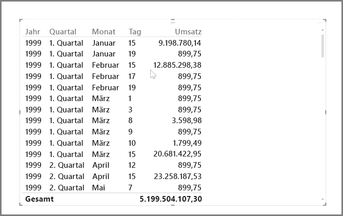
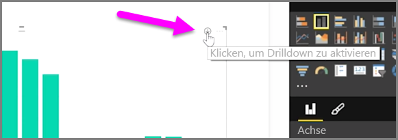
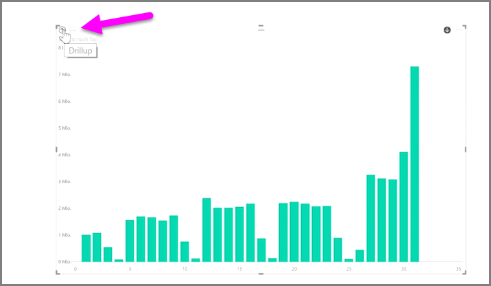
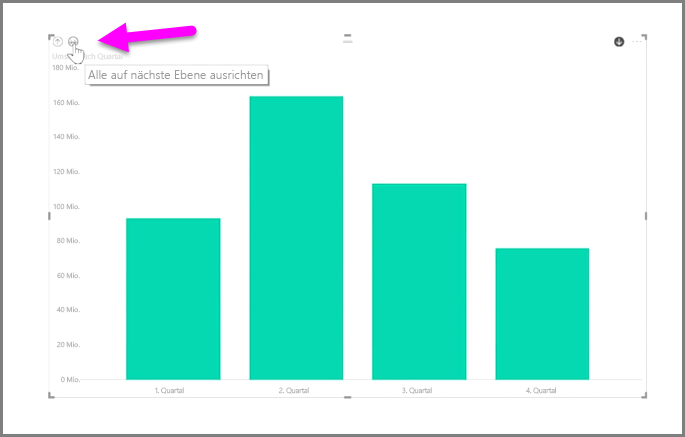
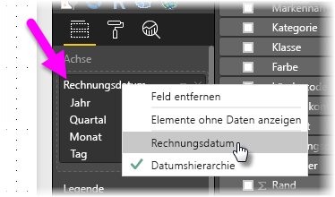

Das Analysieren von zeitbasierten Daten mit Power BI ist denkbar einfach. Die Modellierungstools in Power BI Desktop enthalten automatisch generierte Felder, mit denen Sie mit einem einzigen Mausklick einen Drilldown durch Jahre, Quartale, Monate und Tage ausführen können.  

Beim Erstellen einer Tabellenvisualisierung in einem Bericht mithilfe eines Datumsfelds enthält Power BI Desktop automatisch eine Aufgliederung nach Zeiträumen. Wie in der folgenden Abbildung dargestellt, wird das Datumsfeld in der Tabelle **Datum** beispielsweise in Power BI automatisch nach Jahr, Quartal, Monat und Tag untergliedert.

Daten werden in Visualisierungen standardmäßig auf der Ebene *Jahr* angezeigt. Dies können Sie jedoch ändern, indem Sie rechts oben im visuellen Element die Funktion **Drilldown** aktivieren.

Wenn Sie nun auf die Balken oder Linien im Diagramm klicken, wird ein Drilldown zur nächsten Ebene der Zeithierarchie ausgeführt, z. B. von *Jahren* zu *Quartalen*. Sie können den Drilldown fortsetzen, bis die unterste Ebene der Hierarchie erreicht ist, in diesem Fall *Tage*. Wenn Sie wieder jeweils eine Hierarchieebene nach oben wechseln möchten, klicken Sie oben links im visuellen Element auf **Drillup**.

Anstatt für einen ausgewählten Zeitraum können Sie auch einen Drilldown durch alle im visuellen Element angezeigten Daten ausführen. Verwenden Sie dazu das Doppelpfeilsymbol **Drilldown zur nächsten Ebene**, das sich auch rechts oben im visuellen Element befindet.

Wenn Ihr Modell ein Datumsfeld aufweist, werden in Power BI in jedem Fall automatisch verschiedene Ansichten für die unterschiedlichen Zeithierarchien generiert.

Wenn Sie anstelle der Datumshierarchie wieder einzelne Datumsangaben verwenden möchten, klicken Sie einfach mit der rechten Maustaste im Bereich **Felder** auf den Spaltennamen (in der folgenden Abbildung lautet der Name der Spalte *InvoiceDate*), und wählen Sie anschließend im geöffneten Menü anstelle von **Datumshierarchie** den gewünschten Spaltennamen aus. In Ihrer Visualisierung werden dann die Daten basierend auf diesen Spaltendaten angezeigt, ohne dass dabei die Datumshierarchie verwendet wird. Sie möchten zurück zur Datumshierarchie wechseln? Kein Problem – klicken Sie einfach erneut mit der rechten Maustaste, und wählen Sie im Menü die Option **Datumshierarchie** aus.

## Nächste Schritte
**Herzlichen Glückwunsch!** Sie haben diesen Abschnitt im Kurs **Geführtes Lernen** für Power BI abgeschlossen. Nachdem Sie sich mit der *Modellierung* von Daten vertraut gemacht haben, können Sie sich jetzt auf den nächsten Abschnitt freuen, der sich mit **Visualisierungen** beschäftigt.

Wie bereits zuvor erwähnt, eignen Sie sich in diesem Kurs Ihr Wissen anhand des allgemeinen Arbeitsablaufs in Power BI an:

* Abrufen von Daten in **Power BI Desktop** und Erstellen eines Berichts
* Veröffentlichen im Power BI-Dienst, in dem neue **Visualisierungen** und Dashboards erstellt werden
* **Freigeben** von Dashboards für andere Benutzer, insbesondere für mobile Benutzer
* Anzeigen und Verwenden von freigegebenen Dashboards und Berichten in **mobilen Power BI-Apps**

Auch wenn Sie dies nicht alles selbst durchführen, *wissen* Sie, wie die Dashboards erstellt und mit den Daten verbunden wurden ... Außerdem sind Sie nach Abschluss des Kurses in der Lage, eigene Dashboards zu erstellen.

Wir sehen uns im nächsten Abschnitt!

