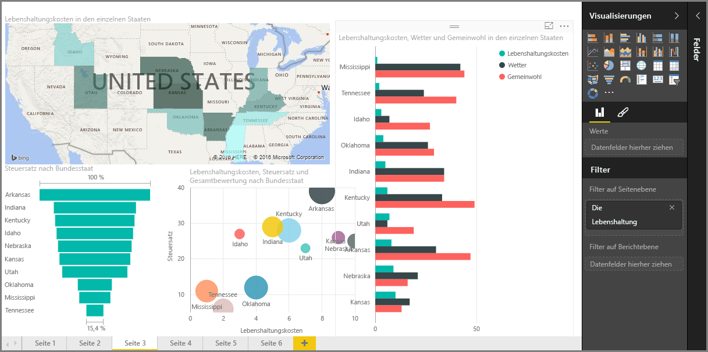

Willkommen im Abschnitt **Visualisierungen** im Kurs **Geführtes Lernen** für Power BI. Sie erwartet ein unterhaltsamer, interessanter und aufschlussreicher Überblick über die zahlreichen Visualisierungen, die Power BI Ihnen bietet. Und damit nicht genug – es werden immer wieder neue Visualisierungen zur Verfügung stehen.

Visualisierungen sind das Endergebnis in jedem Bereich der Business Intelligence: Die Daten sollen ansprechend und sinnvoll präsentiert und besondere Merkmale *gezeigt* werden. Power BI bietet eine breite Palette an beeindruckenden Visualisierungen und nahezu unbegrenzte Anpassungsmöglichkeiten – dementsprechend wichtig ist dieser Abschnitt.

Auf den ersten Blick enthält dieser Abschnitt eine große Fülle von Themen, doch jedes Thema ist kurz und leicht verständlich und stellt Visualisierungen vor. Beim Durchgehen des Abschnitts werden Sie sich sicherlich bereits vorstellen, wie Sie Ihre eigenen Daten mit diesen Visualisierungen präsentieren können.

Den Anfang machen die grundlegenden, einfachen Visualisierungen, mit denen wir alle bereits vertraut sind, und das Basiswissen wird erläutert. Dann geht es etwas fortgeschrittener – oder zumindest weniger allgemein – weiter, und Sie lernen Tools zur Berichterstellung kennen.

Viel Spaß – es gibt viel Neues zu entdecken!

## Einführung in Visuals in Power BI
Das Visualisieren von Daten ist einer der wichtigsten Bestandteile von Power BI – ein Grundbaustein, wie an früherer Stelle in diesem Kurs bereits definiert. Das Erstellen von Visualisierungen ist die einfachste Möglichkeit zum Suchen und Teilen von Informationen.

In Power BI ist standardmäßig eine Vielzahl von Visualisierungen verfügbar, von einfachen Balkendiagrammen über Kreisdiagramme bis hin zu Karten und komplexeren Optionen wie Wasserfälle, Trichter, Maßstäbe und mehr. Power BI Desktop bietet außerdem umfassende Tools zur Seitenformatierung, z.B. Formen und Bilder, die einen Bericht anschaulicher wirken lassen.

