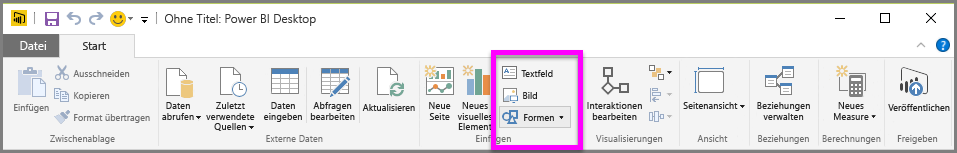
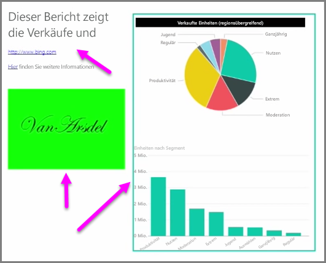

Zusammen mit datengebundenen Visualisierungen können Sie auch statische Elemente hinzufügen, z.B. Textfelder, Bilder und Formen, um das visuelle Design Ihrer Berichte zu verbessern. Wählen Sie zum Hinzufügen eines visuellen Elements **Textfeld**, **Bild** oder **Formen** auf der Registerkarte **Start** aus.

**Textfelder** sind eine ideale Möglichkeit, um große Titel, Beschriftungen oder kurze Absätze mit Informationen zusammen mit den Visualisierungen anzuzeigen. Textfelder können Links enthalten, die Sie einfügen können, indem Sie entweder eine URL eingeben oder indem Sie einen Ankerausdruck markieren und das Linksymbol auf der Optionsleiste des Textfelds auswählen. Sie können URLs in Textfelder einschließen. Power BI erkennt den Link automatisch und aktiviert ihn.

Wenn Sie **Bild** auswählen, wird ein Dateibrowser geöffnet, in dem Sie das Bild auf dem Computer oder aus einer anderen Netzwerkquelle auswählen können. Beim Ändern der Bildgröße im Bericht wird das Seitenverhältnis standardmäßig beibehalten. Dieses Verhalten kann jedoch in den Formatierungsoptionen für Visualisierungen deaktiviert werden.

Die **Formen** bieten fünf verschiedene Optionen, darunter Rechtecke und Pfeile. Die Formen können undurchsichtig oder transparent sein und einen farbigen Rahmen aufweisen. (Letzteres ist nützlich zum Erstellen von Rahmen um Gruppen von Visualisierungen.)

