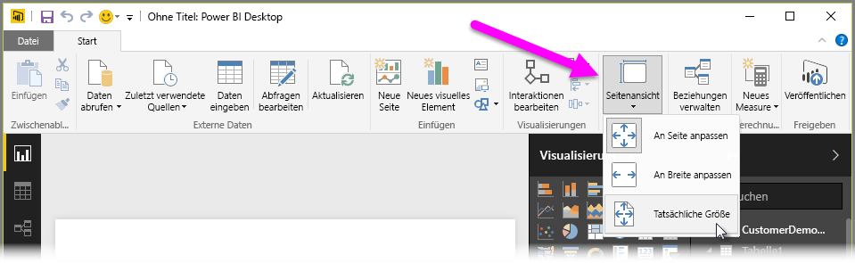
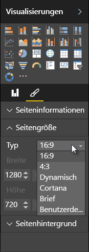

In Power BI Desktop haben Sie die Möglichkeit, das Layout und die Formatierung von Berichtseiten, z. B. die Größe oder Ausrichtung, festzulegen.

Die Skalierung von Berichtseiten können Sie auf der Registerkarte „Start“ im Menü **Seitenansicht** anpassen. Verfügbare Optionen sind **An Seite anpassen** (Standardoption), **An Breite anpassen** und **Tatsächliche Größe**.

Sie können zudem die Größe der Seiten ändern. Standardmäßig werden Berichtseiten im Seitenverhältnis 16:9 angezeigt. Um die Seitengröße zu ändern, müssen Sie zunächst sicherstellen, dass keine visuellen Elemente ausgewählt sind. Wählen Sie dann das Pinselsymbol im Bereich „Visualisierungen“ und anschließend die Option **Seitengröße** aus, um den Bereich zu erweitern.

Verfügbare Optionen für „Seitengröße“ sind „4x3“ (quadratischeres Seitenverhältnis) und „Dynamisch“ (die Seite wird gestreckt und füllt den verfügbaren Platz aus). Zudem gibt es eine Standardgröße im Letter-Format für Berichte. Bedenken Sie, dass Sie nach dem Ändern der Seitengröße möglicherweise die Größe der visuellen Elemente ändern müssen, damit diese vollständig im Zeichenbereich angezeigt werden.

Sie können außerdem auch eine benutzerdefinierte Seitengröße angeben (dazu legen Sie die Größe in Zoll oder Pixel fest) oder die Hintergrundfarbe des gesamten Berichts ändern.

Als weitere Option können Sie „Cortana“ auswählen, mit der die Größe eines Berichts so angepasst wird, dass er als Ergebnis bei Suchvorgängen mit Cortana verwendet werden kann.

