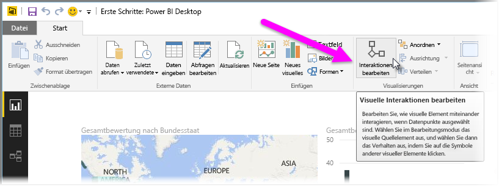
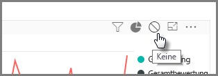
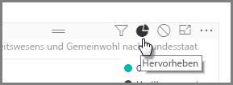
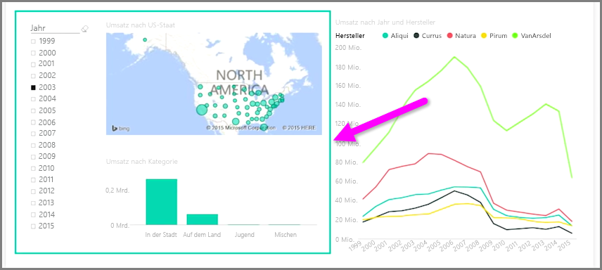

Wenn eine Berichtseite mehrere Visualisierungen umfasst, wirkt sich die Auswahl eines bestimmten Segments durch Klicken oder Verwenden eines Datenschnitts auf alle visuellen Elemente auf der Seite aus. In einigen Fällen möchten Sie jedoch möglicherweise einen Datenschnitt nur für bestimmte visuelle Elemente durchführen. Dies gilt besonders bei Verwendung von Elementen wie Punktdiagrammen, bei denen durch die Beschränkung der Daten auf ein bestimmtes Segment die Aussagekraft verloren geht. Glücklicherweise können Sie in Power BI Desktop die Interaktionen zwischen Visuals festlegen.

Wenn Sie die Interaktion zwischen den Visualisierungen ändern möchten, wählen Sie **Bearbeiten** im Abschnitt „Visuelle Elemente“ des Menübands **Start** aus, um den **Bearbeitungsmodus** zu aktivieren.

>[!NOTE]
>Das Symbol **Interaktionen bearbeiten** in Power BI Desktop hat sich seit der Aufzeichnung des Videos geändert.
> 
> 

Wenn Sie nun ein visuelles Element im Berichtszeichenbereich auswählen, wird ein kleines undurchsichtiges *Filtersymbol* in der rechten oberen Ecke aller anderen betroffenen visuellen Elemente angezeigt. Um ein visuelles Element aus der Interaktion auszuschließen, klicken Sie auf das Symbol *Keine* in der rechten oberen Ecke neben dem *Filtersymbol*.

In einigen Fällen können Sie die Art der Interaktion zwischen den visuellen Elementen anpassen. Wählen Sie bei aktiviertem **Bearbeitungsmodus** das visuelle Element aus, das zum Filtern verwendet wird. Wenn Sie die Art der Interaktion bei einem anderen visuellen Element ändern können, wird in der rechten oberen Ecke ein *Kreisdiagrammsymbol* neben dem Filtersymbol angezeigt.

Klicken Sie auf das *Kreisdiagrammsymbol*, um die segmentierten Daten hervorzuheben. Andernfalls werden die Daten gefiltert. Wie zuvor können Sie auf das Symbol *Keine* klicken, um alle Interaktionen zu entfernen.

Beim Entwurf empfiehlt es sich, die miteinander interagierenden visuellen Elemente mit einem transparenten Umriss zu versehen, damit die interaktive Beziehung für den Benutzer ersichtlich ist.

