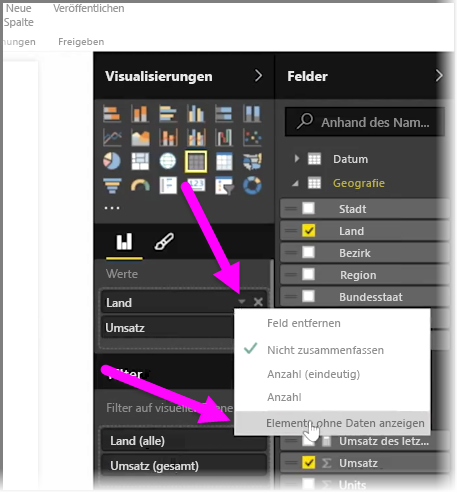
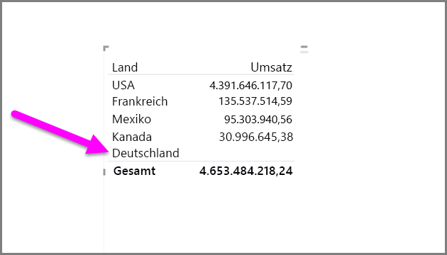
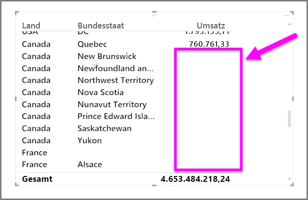

Standardmäßig werden Spaltenüberschriften in Berichten nur angezeigt, wenn die Spalten Daten enthalten. Wenn Sie z. B. den Umsatzerlös nach Ländern anzeigen möchten und in Norwegen kein Umsatzerlös zu verzeichnen ist, wird Norwegen in der Visualisierung nicht angezeigt.

Um leere Kategorien anzuzeigen, klicken Sie auf den Pfeil nach unten in dem zu ändernden Feld im Bereich **Visualisierungen**, und wählen Sie **Elemente ohne Daten anzeigen** aus.

Nun werden alle leeren Spalten im visuellen Element mit leeren Werten angezeigt.

Wenn Sie **Elemente ohne Daten anzeigen** für ein Feld im Bereich **Visualisierungen** ausgewählt haben, gilt diese Option für alle im Bereich „Visualisierungen“ angezeigten Felder. Auch wenn Sie ein weiteres Feld hinzufügen, werden alle Elemente ohne Daten ebenfalls angezeigt, ohne dass Sie erneut das Dropdownmenü aufrufen müssen.

