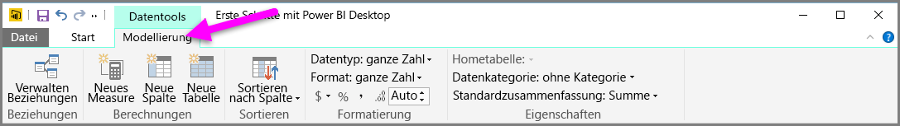
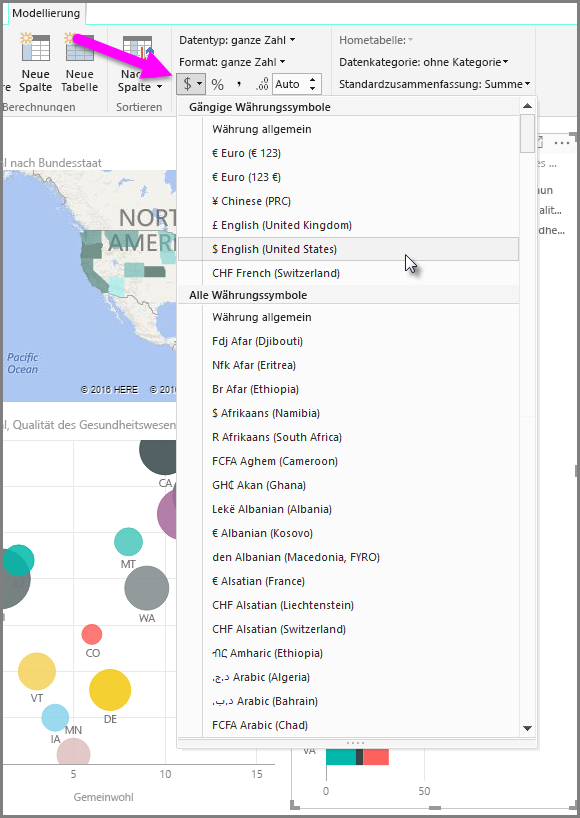
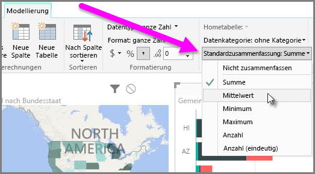
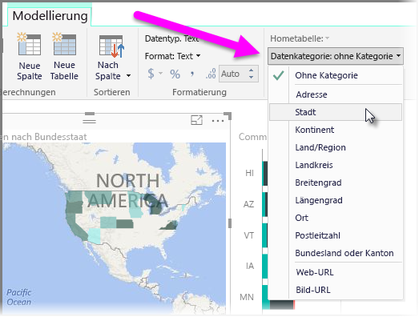

Power BI umfasst Eigenschaften, die Sie Feldern in Ihrem Modell zuweisen können, sodass die Daten übersichtlicher erfasst, visualisiert und präsentiert werden können. In manchen Fällen möchten Sie beispielsweise den Mittelwert mehrerer Zahlen anzeigen, die Zahlen werden in Power BI jedoch automatisch summiert. In Power BI können Sie anpassen, wie Aufstellungen von Zahlen zusammengefasst werden.

## Steuern der Zusammenfassung von numerischen Daten
Sehen wir uns an einem Beispiel an, wie Sie die Art und Weise steuern können, auf die numerische Datenfelder in Power BI zusammengefasst werden.

Wählen Sie ein visuelles Element im Berichtszeichenbereich und dann ein Feld im Bereich **Felder** aus. Im Menüband wird die Registerkarte **Modellierung** mit verschiedenen Optionen zum Formatieren von Daten und mit Dateneigenschaften angezeigt.

Das verwendete Währungssymbol können Sie durch Klicken auf die Dropdownliste für Währungssymbole (siehe folgende Abbildung) auswählen.

Zum Formatieren der Felder stehen verschiedenste Optionen zur Verfügung. Beispielsweise können Sie das Format von „Währung“ in „Prozentsatz“ ändern.

Sie können auch die Art und Weise ändern, auf die die Daten in Power BI zusammengefasst werden. Wählen Sie das Symbol **Standardzusammenfassung** aus, um die Art und Weise zu ändern, auf die ein Feld zusammengefasst wird, z. B. Anzeigen der Summe, der Anzahl oder des Mittelwerts.

## Verwalten und Verdeutlichen von Standortdaten
Beim Zeichnen von Standorten auf einer Karte können Sie ähnliche Änderungen vornehmen. Wählen Sie die Karte und dann das Feld im Bereich **Felder** aus, das für den Wert *Standort* verwendet wird. Wählen Sie auf der Registerkarte **Modellierung** die Option **Datenkategorie** und dann im Dropdownmenü die Kategorie aus, die die Standortdaten darstellt. Sie können z. B. „Bundesland/Kanton“, „Landkreis“ oder „Ort“ auswählen.

