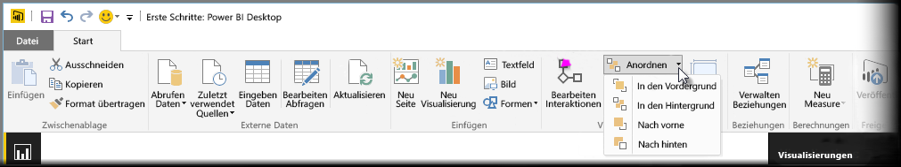
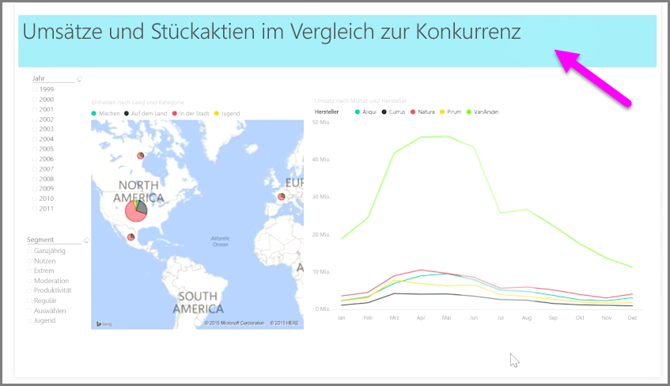

Wenn ein Bericht zahlreiche Elemente umfasst, können Sie in Power BI festlegen, wie diese Elemente einander überlappen. Die Art und Weise, wie Elemente einander überlappen oder übereinander angeordnet sind, wird häufig als „Z-Reihenfolge“ bezeichnet.

Um die Z-Reihenfolge der Elemente in einem Bericht zu verwalten, wählen Sie ein Element aus und verwenden die Schaltfläche **Anordnen** auf der Registerkarte **Start** des Menübands, um seine Z-Reihenfolge zu ändern.

Mithilfe der Optionen im Menü der Schaltfläche **Anordnen** können Sie die gewünschte Reihenfolge der Elemente im Bericht festlegen. Sie können ein visuelles Element eine Ebene vor- oder zurückverschieben oder ganz oben oder ganz unten in der Reihenfolge positionieren.

Die Verwendung der Schaltfläche „Anordnen“ ist besonders nützlich beim Verwenden von Formen als dekorativen Hintergrund oder Rand oder zum Hervorheben bestimmter Bereiche eines Diagramms oder Graphen. Mithilfe der Formen können Sie außerdem einen Hintergrund erstellen, z. B. das hellblaue Rechteck in der folgenden Abbildung, das als Hintergrund für den Berichtstitel verwendet wird.

